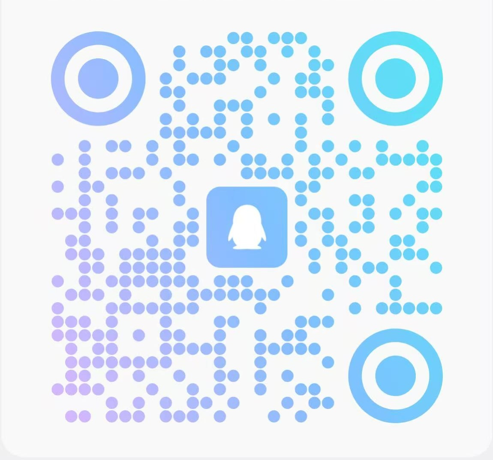

# 🏆 2026 HCCL通信库创新大赛 西部赛区 

> **大赛简介**
> HCCL通信库创新大赛是针对计算机网络领域的专项科技竞赛，由西安电子科技大学主办，华为技术有限公司提供赞助支持。大赛旨在构建高校CANN集合通信人才生态，以赛促学，培养计算网络领域优秀人才，锻炼创新思维，提升解决难题的能力。

---

*说明：比赛时间周期可能存在延期及变化，请您及时留意刷新页面信息。*

## 📅 大赛日程

| 赛事环节             | 时间安排                                             |
| :------------------- | :------------------------------------------------- |
| **比赛报名**         | 06/24 起，07/12报名截止                              |
| **赛题发布**         | 06/23 发布赛题预告，07/12发布赛题并发布线上赛题解读     |
| **初赛**             | 07/13 09:00起，07/17 23:59截止                       |
| **决赛**             | 07/20 09:00起，07/24 23:59截止                       |
| **答辩及颁奖**        | 07/26 进行答辩角逐一、二等奖；邀请获奖队伍参加颁奖典礼  | 

---

## ⚖️ 赛事规则

* 🎯 **参赛对象要求**：面向西安地域学校内同学（通信类、计算机类、电子信息类、数学类等专业）。
* 📝 **参赛答题要求**：参赛选手需要根据赛题赛规要求，在指定时间内完成报名、组队、作品提交，方为有效参赛。(每天最大提交次数为10次，取最优成绩为最后成绩记录)
* 🤝 **组队要求**：先报名后组队，每支队伍 1-3 人。
* 🛡️ **公平参赛**：每个阶段比赛结束后，大赛组委会将进行代码查验。如发现代码重复或违规等情况，将直接取消该队伍参赛资格和现有成绩。
* ⚔️ **比赛机制**：
  1.  本届大赛设置一等奖2名、二等奖5名、三等奖10名，特别贡献奖10名。
  2.  比赛分为初赛、决赛、决赛答辩三个阶段。
  3.  初赛前20强队伍进入决赛。
  4.  决赛排名前7的队伍参加现场答辩，确定一、二等奖。根据0.8*跑分结果 + 0.2*答辩分数总和评定名词（跑分、答辩总分均为100分）。
  5.  三等奖根据跑分结果评定名次。
  6.  发现代码仓问题，提交issue&pr，根据issue&PR提交的内容质量和数量进行积分，评选特别贡献奖。
  7.  特别贡献奖评选独立于一、二、三等奖，即获得一、二、三等奖的队伍也有资格参与特别贡献奖的评选。

---

## 🎁 奖项设置

总奖金：150000元（税前）

| 奖项类型   | 奖金   | 数量  |
| ------ | --------- | ----- |
| 一等奖 | 20000元/队（税前） |   2   |
| 二等奖 | 10000元/队（税前） |   5   |
| 三等奖 | 5000元/队（税前）  |   10  |
| 特别贡献奖 | 1000元/队（税前） |  10 |

---

## 📖 特别贡献奖说明
本届赛事过程中，鼓励大家积极参与社区贡献，根据参赛队伍在 https://gitcode.com/cann/hccl 和 https://gitcode.com/cann/hcomm 两个代码仓提交的issue和PR的内容质量和数量进行积分，特设HCCL社区  特别贡献奖！

### 1. 🎯 社区贡献指南
请参考：https://gitcode.com/cann/hccl/blob/master/CONTRIBUTING.md

### 2. 📐 评分规则
- 对于对代码仓提出的Issue，被采纳、合入的可为队伍积分，社区会予以回复确认。包含问题修复和文档优化两类。

- 其中问题修复类1~3分，按难度设置以下3档分值：

    | 类别 | 分值 | 说明/示例 |
    | --- | --- | --- |
    | 非功能问题 | 1分 | 魔鬼数字、日志不规范等 |
    | 功能问题 | 2分 | 边界条件未处理、结果不正确等 |
    | 严重功能问题 | 3分 | 核心逻辑错误、严重安全漏洞编译运行报错等 |

- 文档类：1分，仅限提出Issue后选手能自行提出PR进行修改的问题。例如但不限于：发现资料正确性、资料内容与软件实现不一致；拼写错误、链接错误、优化描述等问题。

- 质量附加分：对于代码优雅、文档详尽的PR，评审团可酌情给予额外 1~5 分 的"卓越贡献加分"。

### 3. ⚙️ 评奖规则与积分周期
#### 3.1 评奖规则
积分总分前10名队伍获得特别贡献奖。该奖项独立于竞赛设立的一、二、三等奖，所有参赛队伍均可参与评奖。仅认可报名时绑定的Gitcode账号贡献的Issue/PR积分。

#### 3.2 积分统计周期
赛事报名启动至7月24日23点59分截止。

### 4. 📝 Issue与PR提交
#### 4.1 Issue
根据问题情况选择合适的类别提交issue，标题前缀需要加上【2026 HCCL通信库创新大赛-西部赛区】【团队名称】; 

#### 4.2 PR模板
在pr标题前缀需要加上【2026 HCCL通信库创新大赛-西部赛区】【团队名称】; 提交pr后需关联对应issue; 

其余详细说明可参见[2026 HCCL通信库创新大赛Issue与PR提交细则](https://gitcode.com/cann/hccl/wiki/2026%20HCCL%E9%80%9A%E4%BF%A1%E5%BA%93%E5%88%9B%E6%96%B0%E5%A4%A7%E8%B5%9B.md)

---

## 💬 交流渠道

* **QQ交流群，扫码进群**：

*最终解释权归主办方所有*