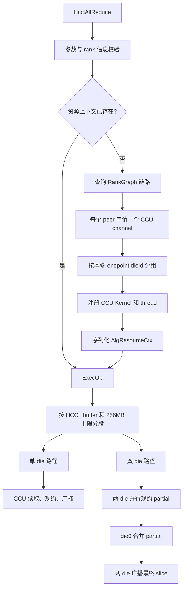
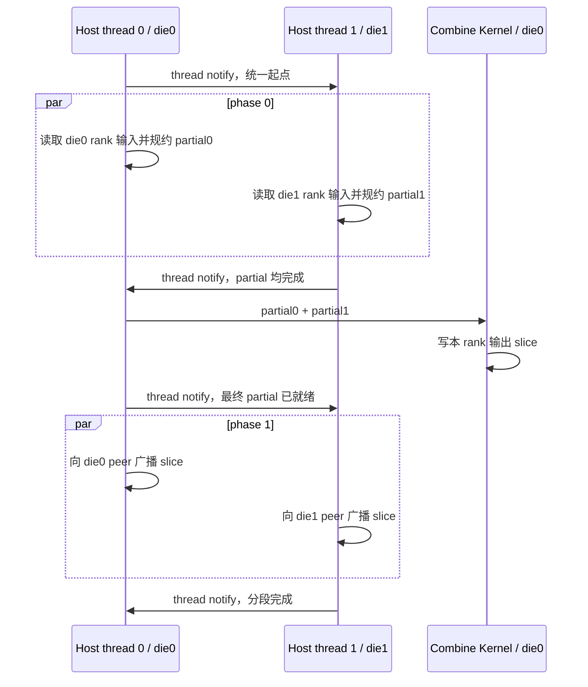

# AllReduce CCU 算法设计

## 1. 目标与约束

本实现面向 2026 HCCL 通信库创新大赛西部赛区决赛的 AllReduce 赛题，使用 CCU 通信引擎完成通信和规约。当前实现针对赛题范围进行设计：

- 数据类型：`HCCL_DATA_TYPE_FP32`
- 规约操作：`HCCL_REDUCE_SUM`
- 最大 rank 数：16
- 每个本端 rank 到每个对端 rank 只申请一个 channel
- 支持 `2x8`、`4x1`、`8+4` 三种比赛拓扑
- 单次处理上限为 256MB，较大消息自动分段
- 对同一输入使用固定的规约顺序，保证重复执行结果确定

实现只依赖 Host 侧和 CCU 侧接口，不使用 AI CPU 数据面。

## 2. 分层架构



各文件职责如下：

| 文件 | 职责 |
|---|---|
| `include/custom.h` | CCU Kernel 静态参数、Kernel 注册信息和可序列化资源上下文 |
| `op_host/allreduce.cc` | 参数校验、拓扑查询、channel 申请、die 分组和 Kernel 注册 |
| `op_host/exec_op.cc` | 消息分段、CCU Kernel 下发以及双 thread 阶段同步 |
| `op_kernel_ccu/ccu_kernel.cc` | 地址交换、数据读取、确定性规约、partial 合并和广播 |

## 3. Host 侧资源初始化

### 3.1 Channel 选择

`AcquireChannelGroups` 遍历所有远端 rank，通过 RankGraph 查询可用链路，只选择协议为 `COMM_PROTOCOL_UBC_CTP` 的 CCU 链路。每个 peer 只构造一个 `HcclChannelDesc`，符合赛题“一条物理链路只申请一个 channel”的约束。

channel 申请完成后，根据本端 endpoint 的 `ENDPOINT_ATTR_DIE_ID` 将 channel 放入 die0 或 die1 分组。由于本 rank 不需要到自己的 channel，两组 channel 数量中较少的一组对应本 rank 所在 die：

```text
groups[0].size > groups[1].size  => localDie = 1
其他情况                         => localDie = 0
```

### 3.2 资源形态

当所有 channel 都属于同一个 die 时，使用单组模式：

- 1 个 CCU thread
- 1 个 CCU Kernel handle
- Kernel 内直接完成读取、规约和广播

当 channel 分布在两个 die 时，使用双组模式：

- 2 个 CCU thread，每个 die 对应一个 thread
- 2 个 die Kernel handle
- 1 个 combine Kernel handle

CCU 实例在当前环境中只能稳定注册三个 Kernel，因此 die Kernel 通过运行时参数 `phase` 复用：

- `phase = 0`：读取输入并生成 die partial
- `phase = 1`：广播已经合并的最终 partial

combine Kernel 使用静态参数 `combineOnly=true`，只在 die0 thread 上执行。

### 3.3 资源缓存

首次调用时，Host 侧将以下信息序列化到 HCCL engine context：

- 本端 HCCL 通信 buffer
- CCU thread handles
- CCU Kernel handles

后续相同 communicator 上的调用通过 `HcclEngineCtxGet` 直接复用资源，避免重复申请 channel 和注册 Kernel。

## 4. 分段和 Slice 划分

### 4.1 分段大小

每段最大字节数为：

```text
min(256MB, HCCL local buffer size)
```

最大段长度向下对齐到：

```text
rankSize * sizeof(float)
```

这样完整分段可以被所有 rank 均匀划分，同时保证 scratch 所需空间不超过 HCCL buffer。

### 4.2 Rank Slice

对当前分段，设 FP32 元素数为 `N`，rank 数为 `P`：

```text
normalSliceElements = ceil(N / P)
sliceBegin          = min(normalSliceElements * rankId, N)
sliceEnd            = min(sliceBegin + normalSliceElements, N)
sliceOffset         = sliceBegin * sizeof(float)
sliceBytes          = (sliceEnd - sliceBegin) * sizeof(float)
```

每个 rank 负责规约一个不同 slice。最后一个分段不要求按 rank 数整除；不足部分通过 `sliceEnd` 截断，极小消息产生的零长度 slice 在 CCU Kernel 中跳过数据操作，但仍参与同步。

scratch 的总空间为：

```text
ceil(N / P) * sizeof(float) * P
```

执行前会检查该值不超过 HCCL local buffer。

## 5. CCU Kernel 参数

### 5.1 注册期静态参数

`AllReduceKernelArg` 在 Kernel 注册时固定，主要包括：

- rank 数和 rank id
- FP32/SUM 类型信息
- die id
- 本 die 的 channel handles 和 peer ranks
- scratch slot 起点
- 是否包含本 rank 输入
- 是否为 combine-only Kernel
- 是否在规约后直接广播
- 是否需要交换输出地址

### 5.2 每次 Launch 的动态参数

每个分段下发七个 `uint64_t` 参数：

| 索引 | 参数 |
|---|---|
| 0 | 当前分段输入地址 |
| 1 | 当前分段输出地址 |
| 2 | CCU memory token |
| 3 | scratch/HCCL buffer 地址 |
| 4 | 本 rank slice 在分段内的偏移 |
| 5 | 本 rank slice 字节数 |
| 6 | phase，0 为规约，1 为广播 |

## 6. 单 Die 算法

单组模式下，每个 rank 对自己负责的 slice 执行以下步骤：

1. 通过 `WriteVariableWithNotify` 向所有 peer 发布输入地址、输出地址和 token。
2. 等待所有 peer 的地址变量就绪。
3. 使用 `ccu::Read` 将每个 peer 的对应输入 slice 拉取到本端 scratch。
4. 使用 `ccu::LocalCopy` 将本 rank 的输入 slice 放入 scratch。
5. 在 scratch 中按固定树形顺序执行 `ccu::LocalReduce`。
6. 使用 `ccu::Write` 将最终 slice 写入所有 peer 的输出 buffer。
7. 使用 `ccu::LocalCopy` 写入本 rank 输出 buffer。
8. 通过 `PostSync` 确认本轮 channel 操作全部结束。

整体形态等价于“按 rank 划分的 reduce-scatter + all-gather”，但每个负责 rank 直接读取全体输入并广播最终 slice。

## 7. 双 Die 算法

双 die 模式避免让单个 die 串行读取所有 rank。两个 die 同时对同一个目标 slice 处理各自 channel 分组：



### 7.1 Scratch 布局

scratch 按 rank slice 大小划分为 `rankSize` 个连续 slot：

```text
| die0 group slots | die1 group slots |
^ slot 0                              ^ slot rankSize-1
```

- die0 规约结果保留在 slot 0
- die1 规约完成后，将结果发布到最后一个 slot
- combine Kernel 对 slot 0 和最后一个 slot 执行一次 `LocalReduce`
- 合并结果仍保留在 slot 0，供两个 die 的广播阶段读取

die1 发布 partial 时覆盖的是已经完成规约的 scratch slot，不会与仍在执行的数据操作冲突。

### 7.2 Host 阶段同步

两个 CCU thread 之间使用 `HcommThreadNotifyRecordOnThread` 和 `HcommThreadNotifyWaitOnThread` 建立顺序：

```text
输入 stream 就绪
  -> 两 die phase 0
  -> combine
  -> 两 die phase 1
  -> 主 thread 完成
```

combine 不会早于 die1 partial，广播也不会早于 combine。

## 8. 确定性规约

所有输入先放入顺序固定的连续 scratch slot。`ReduceGroup` 使用固定的分层合并方式：

```text
reducePieces = remain / 2
sourceIndex  = remain - reducePieces
dst[0:reducePieces] += src[sourceIndex:remain]
remain -= reducePieces
```

循环直到只剩 slot 0。channel 顺序、scratch 布局和每层合并顺序在 communicator 生命周期内不变，因此相同输入的多次执行使用相同的 FP32 加法顺序，不依赖网络到达先后。

## 9. 同步机制

### 9.1 地址交换

每个 channel 使用三类远端变量：

| 变量 ID | 含义 |
|---|---|
| 0 | 输入地址 |
| 1 | memory token |
| 2 | 输出地址 |

变量写入和 notify 绑定，所有地址就绪后才开始数据传输。

### 9.2 数据完成事件

同一 Kernel 内的并行 Read、Write、LocalCopy 和 LocalReduce 使用 `ccu::Event` 的不同 bit，随后通过 `EventWait(mask)` 等待整组完成。

### 9.3 Channel 尾同步

每次非 combine Kernel 结束前，在所有 channel 上执行 `NotifyRecord` 和 `NotifyWait`，使用同步 ID 3，防止下一 phase 或下一分段复用 channel 时跨轮次串扰。

## 10. 已验证结果

### 10.1 功能正确性与任务图

在 `HCCL_OP_EXPANSION_MODE=CCU_MS`、64GB `/dev/shm` 的 HCCL-VM normal 模式中，以下九个正式组合均通过数值校验：

| 拓扑 | 512KB | 512MB | 400MB+4B |
|---|---|---|---|
| `2x8` | success | success | success |
| `4x1` | success | success | success |
| `8+4` | success | success | success |

CheckerV3 已覆盖：

- `2x8 / 512KB`
- `8+4 / 400MB+4B` 多分段任务图

两次检查的 SingleTask、MemConflict、SemanticCheck 均为 success，最终结果为 `op[1] Checker Success`。

Checker 完整日志会提示部分 CCU local-post 未消费。对应指令是每个 mission 自动生成的启动序言 `startInstrId + 9`，位于用户算法指令之前，不是本实现的 channel notify 或 phase 同步缺陷，且不影响 Checker 最终结论。

### 10.2 本次性能测试结果

本次九个性能用例的测试结果如下。用例顺序与赛题一致：先按 `2x8`、`4x1`、`8+4` 排列，每种拓扑内依次为 512KB、512MB、400MB+4B。

| 拓扑 | 512KB | 512MB | 400MB+4B |
|---|---:|---:|---:|
| `2x8` | 32.00μs | 1.91ms | 1.48ms |
| `4x1` | 21.00μs | 2.50ms | 1.98ms |
| `8+4` | 32.00μs | 2.30ms | 1.81ms |

以上是本次性能测试得到的九个结果，不是 HCCL-VM 输出的模拟耗时。HCCL-VM 仅用于数值正确性和任务图验证，其 `aveg_time` 与 `alg_bandwidth` 不用于评价真实性能。

## 11. 当前实现边界

- 仅支持赛题要求的 FP32 + SUM。
- `MAX_RANK_SIZE` 为 16。
- rank 数必须大于 1。
- 256MB 以上消息会产生多个分段和多轮 CCU launch。
- HCCL-VM 的事件计时为模拟值，输出带宽不能用于真实性能比较；真实性能应以正式评测环境为准。
