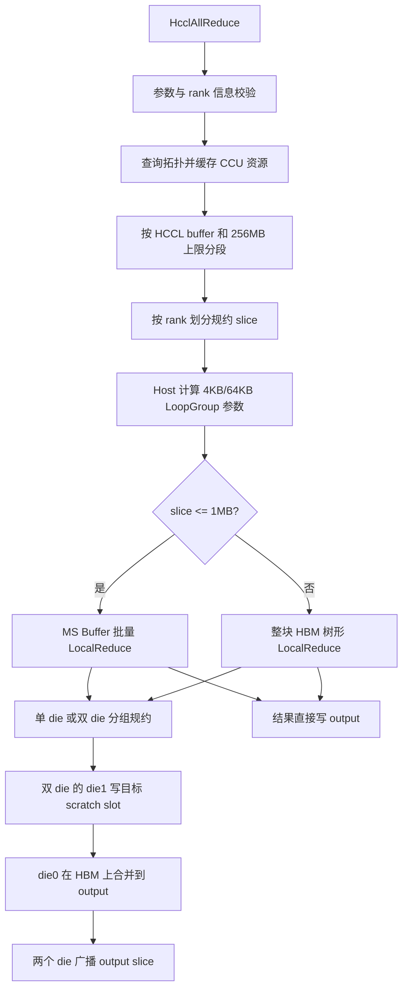
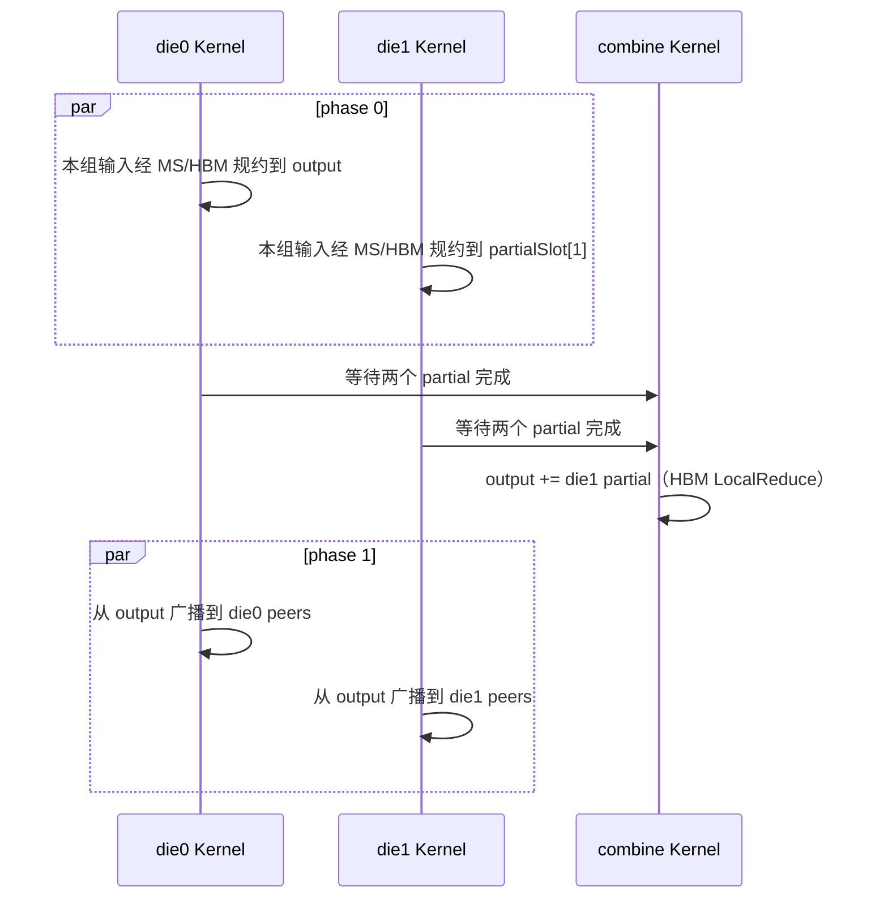

# AllReduce CCU 混合规约优化设计（722v1）

## 1. 目标与结论

本版本面向 2026 HCCL 通信库创新大赛西部赛区决赛 AllReduce 赛题，在原有 CCU 分片 AllReduce 架构上优化本地规约路径。实现仍满足以下约束：

- 数据类型为 `HCCL_DATA_TYPE_FP32`
- 规约操作为 `HCCL_REDUCE_SUM`
- 最大 rank 数为 16
- 每个本端 rank 到每个对端 rank 只申请一个 channel
- 支持 `2x8`、`4x1`、`8+4` 三种比赛拓扑
- 单段最大 256MB，大消息自动分段
- 规约输入和分批顺序固定，重复执行结果确定
- 数据面只使用 CCU，不使用 AI CPU

本次首先解决两类瓶颈：旧实现使用 HBM scratch 做多轮两两 `LocalReduce`，每轮都要重新读写大块 HBM；第一版 MS 优化又让两个 die Kernel 和 combine Kernel 各固定申请 128 个 MS block，在 `CCU_SCHED` 的每 die 资源上限下，die0 注册第三个 Kernel 时返回 `CCU_E_UNAVAIL(7)`。当前实现对不超过 1MB 的 rank slice 使用 4KB MS Buffer，一次聚合最多 8 个输入；更大的 slice 使用整块 HBM 树形规约，避免仿真器逐个执行海量 4KB 块。同时按实际首批输入数申请 MS，combine 完全不申请 MS。

主要收益来自减少本地 HBM 规约流量，而不是减少网络流量。对 `n <= 8` 个输入、每个输入大小为 `S` 的一次组内规约：

```text
旧 HBM 树形规约流量：3 * (n - 1) * S
新 MS Buffer 规约流量：(n + 1) * S
```

因此 MS 路径理论上更优，主要覆盖正式 512KB 用例；大消息路径优先控制任务数量和仿真时间。实际端到端收益还受网络传输、Kernel launch、同步以及不同本地规约指令效率影响。

## 2. 分层架构



文件职责如下：

| 文件 | 职责 |
|---|---|
| `include/custom.h` | Kernel 注册期静态参数和资源上下文 |
| `op_host/allreduce.cc` | 参数校验、拓扑查询、channel 分组、partial slot 和 Kernel 注册 |
| `op_host/exec_op.cc` | 分段、slice 计算、LoopGroup 动态参数编码和 Kernel 下发 |
| `op_kernel_ccu/ccu_kernel.cc` | 地址交换、数据读取、MS 规约、partial 合并和广播 |

## 3. Host 侧资源和拓扑

`AcquireChannelGroups` 查询 RankGraph，只选择 `COMM_PROTOCOL_UBC_CTP` 链路，并按本端 endpoint 的 die id 将 channel 分到 die0 和 die1。每个 peer 只构造并申请一个 channel。

当 channel 只落在一个 die 时，资源形态为：

- 1 个 CCU thread
- 1 个 CCU Kernel
- Kernel 内完成读取、规约和广播

当 channel 分布在两个 die 时，资源形态为：

- 2 个 CCU thread，两个 die 各一个
- 2 个 die Kernel，`phase=0` 生成 partial，`phase=1` 广播最终结果
- 1 个运行在 die0 thread 上的 combine Kernel

双 die 注册时显式记录 `partialSlot[0]` 和 `partialSlot[1]`。combine Kernel 使用这两个真实 slot 位置，避免假定第二个 partial 总在 scratch 最末尾。

MS block 在 Kernel 注册时属于静态资源。每个执行组内规约的 die Kernel 申请：

```text
16 * min(该 Kernel 首批实际输入数, 8)
```

因此资源量随拓扑实际输入数变化，最坏仍为 `16 * 8 = 128` 个 block。combine Kernel 直接用 HBM `LocalReduce(output, die1Partial)` 完成最后一次二元合并，不构造 Loop/LoopGroup，也不申请 MS block。双 die 在 die0 上的资源从“规约 Kernel 128 + combine Kernel 128”降为“规约 Kernel 最多 128 + combine Kernel 0”，符合 `CCU_SCHED` 的资源限制。

## 4. 分段和 Rank Slice

每段最大字节数为：

```text
min(256MB, HCCL local buffer size)
```

完整大段向下对齐到 `rankSize * sizeof(float)`。设本段 FP32 元素数为 `N`、rank 数为 `P`：

```text
normalSliceElements = ceil(N / P)
sliceBegin          = min(normalSliceElements * rankId, N)
sliceEnd            = min(sliceBegin + normalSliceElements, N)
sliceOffset         = sliceBegin * sizeof(float)
sliceBytes          = (sliceEnd - sliceBegin) * sizeof(float)
```

每个 rank 负责不同的 slice，最终形成 reduce-scatter 加直接广播。最后一段无需被 rank 数整除；零长度 slice 跳过数据操作，但仍遵守同步协议。

scratch 上限检查仍为：

```text
ceil(N / P) * sizeof(float) * P <= HCCL local buffer size
```

## 5. 十二个动态 Kernel 参数

原实现每次 Launch 传入 7 个 `uint64_t`。为了让 CCU 直接构造 Loop/LoopGroup，并为大消息选择低任务数路径，本版本增加 5 个 Host 预计算参数，共 12 个：

| 索引 | 参数 | 含义 |
|---:|---|---|
| 0 | `inputAddr` | 当前分段输入地址 |
| 1 | `outputAddr` | 当前分段输出地址 |
| 2 | `token` | CCU memory token |
| 3 | `scratch` | 本端 HCCL buffer 地址 |
| 4 | `sliceOffset` | 本 rank slice 在分段内的字节偏移 |
| 5 | `sliceBytes` | 本 rank slice 字节数 |
| 6 | `phase` | 0 为规约，1 为广播 |
| 7 | `addrOffset` | 完整 64KB LoopGroup 后的尾部起点 |
| 8 | `loopParam` | 完整 64KB 组的循环次数编码 |
| 9 | `parallelParam` | 剩余 4KB 块及非 4KB 尾块的并行编码 |
| 10 | `residual` | 尾部 Loop 实际处理字节数 |
| 11 | `useMs` | rank slice 不超过 1MB 时为 1，否则为 0 |

`AppendReduceLoopArgs` 在 Host 上把 `sliceBytes` 拆成三层：

```text
MS 基本块               = 4KB
一个完整 LoopGroup      = 16 * 4KB = 64KB
剩余部分                = 若干 4KB 块 + 一个不足 4KB 的尾块
```

这样 CCU Kernel 无需为 slice 中每个 4KB 块生成独立指令，也避免在动态控制流中重复计算分块参数。索引 6 被固定为 `PHASE_ARG_INDEX`，广播阶段只修改 phase，不会因参数扩展误改最后一个规约参数。

## 6. MS Buffer 规约

核心入口为 `ReduceSources`，实际的一个批次由 `ReduceWithMs` 完成。每个 4KB 工作块执行：

1. 将最多 8 个源块并行 `LocalCopy` 到独立 MS Buffer。
2. 等待这些 copy 完成。
3. 对 MS Buffer 数组执行一次多输入 `ccu::LocalReduce`。
4. 将规约结果从 MS Buffer 写到目标地址。

主要参数为：

```text
CCU_MS_SIZE       = 4096 bytes
CCU_MS_INTERLEAVE = 8 inputs
REDUCE_LOOP_COUNT = 16 blocks
```

完整区间由 16 路 LoopGroup 展开，每次推进 4KB；尾部根据剩余的完整 4KB 块和不足 4KB 的 residual 选择一个或两个 Loop。稳定尺寸约束使循环中的事件、Buffer、地址步长都可预先确定。

MS 数组的 LoopGroup 步长也使用首批实际输入数，而不是固定 8。后续批次的输入数不会超过首批，因此复用同一组 MS block，不会再次增加注册期资源。

### 6.1 大消息 HBM 路径

512MB 和 400MB+4B 用例的 rank slice 大于 1MB，使用 `ReduceSourcesWithHbm`。本地输入先放入连续 scratch slot，然后按固定树形顺序对整块连续区间执行少量 `LocalReduce`。die1 的首个 scratch slot 原地保存 partial；其他情况只在树形规约结束后将结果复制到 output。

该路径不新增 MS、Event 或 Loop 资源。它减少的是仿真器和 Checker 的指令展开量，不宣称降低大消息的 HBM 字节数。

## 7. 超过 8 个输入的确定性分批

单次 MS `LocalReduce` 最多接收 8 个输入。`ReduceSources` 按固定顺序处理更多输入：

```text
第一批：source[0..7] -> result
后续批：result + 最多 7 个尚未处理的 source -> result
```

例如 `2x8` 拓扑中实际可能出现 11 输入组：

```text
批次 1：8 个输入 -> result
批次 2：result + 剩余 3 个输入 -> result
```

每批和批内的源顺序由 channel 分组及本地输入位置固定，不依赖数据到达先后。该顺序与旧树形规约的浮点加法括号关系可能不同，但同一版本对同一输入的多次执行顺序一致。

## 8. 单 Die 数据流

单 die 模式对本 rank 负责的 slice 执行：

1. 与所有 peer 交换输入地址、输出地址和 token。
2. 将 peer 输入 slice 并行读取到 scratch。
3. MS 路径直接使用本地输入；HBM 路径将本地输入放入连续 scratch slot。
4. 根据 `useMs` 选择 MS 分块规约或整块 HBM 树形规约，目标为本 rank output slice。
5. 从 output slice 向所有 peer 广播最终结果。
6. 执行 channel 尾同步，隔离下一分段或下一轮。

MS 路径移除了本地输入到 scratch、树形中间结果和最终输出的额外搬运；HBM 路径保留必要搬运，以换取显著更少的仿真任务。

## 9. 双 Die 数据流

双 die 保留并行读取和规约结构，但消除了 partial 的二次搬运：



die0 的组内规约结果直接写本 rank output，die1 的结果写入注册期计算出的 `partialSlot[1]`。combine 以 output 中的 die0 partial 为第一个输入、以 scratch 中的 die1 partial 为第二个输入，执行一次 HBM `LocalReduce` 并原地写回 output。广播阶段也直接以 output 为源。`partialSlot[0]` 保留为显式布局信息，但不再为 die0 partial 占用 scratch 搬运路径。

Host thread notify 保证执行顺序为：

```text
输入 stream 就绪
  -> 两 die phase 0
  -> combine
  -> 两 die phase 1
  -> 主 thread 完成
```

## 10. 同步和 Checker 终止边界

地址交换仍使用三个远端变量：

| 变量 ID | 含义 |
|---:|---|
| 0 | 输入地址 |
| 1 | memory token |
| 2 | 输出地址 |

Read、Write、MS copy 和 `LocalReduce` 均通过 Event bit 建立完成依赖；非 combine Kernel 退出前继续使用同步 ID 3 做成对 `NotifyRecord/NotifyWait`，防止跨 phase 或跨分段串扰。

combine 的 HBM `LocalReduce` 完成后增加同队列的：

```text
EventRecord(event, 1)
EventWait(event, 1)
```

它为 CheckerV3 建立可识别的 Kernel 退出边界，确保终止点位于 combine 规约之后。combine 不包含 MS Buffer 或 LoopGroup；该事件边界不改变数值结果和跨 rank 协议。

## 11. 仿真器验证

最终安装并用于验证的动态库 SHA256 为：

```text
5b2cc985957571e3b0dd54b51b47891453750bbd0a7d740f2ef82695bcf1ed28
```

HCCL-VM 使用更严格的 `HCCL_OP_EXPANSION_MODE=CCU_SCHED` 通过以下代表性用例：

| 拓扑 | 数据量 | 结果 | 覆盖重点 |
|---|---:|---|---|
| `2x8` | 512KB | success | 双 die 基本路径、超过 8 输入分批 |
| `2x8` | 512MB | success | 测试点 2、大消息 HBM 路径、256MB 分段 |
| `4x1` | 512KB | success | 单 die 路径 |
| `4x1` | 512MB | success | 单 die 大消息 HBM 路径 |
| `8+4` | 400MB+4B | success | 非均匀拓扑、多分段、4B 尾部 |
| `8+4` | 512KB | success | 双 die 调度资源和基本任务图 |

修复前 `2x8 / 512MB` 的全 MS 路径在 runner 运行 602 秒后超时；混合路径同一环境用时 54 秒并返回 success。`4x1 / 512MB` 用时 17 秒，`8+4 / 400MB+4B` 用时 43 秒。

CheckerV3 在 `CCU_SCHED` 下通过：

- `2x8 / 512KB`
- `2x8 / 512MB`
- `8+4 / 512KB`
- `8+4 / 400MB+4B`

上述用例均得到：

```text
SingleTaskCheck success
MemConflict success
SemanticCheck success
op[0] Checker Success
```

最终 Release 构建通过 `-Wall -Werror`。当前环境的 Host 和容器中均没有 `clang-format`，因此未执行该工具。

## 12. 理论性能分析

### 12.1 本地 HBM 流量

设一次组内规约有 `n` 个大小为 `S` 的输入。旧树形实现每次二元 `LocalReduce` 需要读两个源并写一个结果，共约 `3S`，完成 `n-1` 次：

```text
T_old = 3 * (n - 1) * S
```

MS 路径对不超过 8 个输入一次装入 MS，再写回一个结果：

```text
T_new = (n + 1) * S
```

典型输入数的理论流量如下：

| 输入数 | 旧实现 | 新实现 | 本地规约流量降低 |
|---:|---:|---:|---:|
| 4 | `9S` | `5S` | 44% |
| 5 | `12S` | `6S` | 50% |
| 8 | `21S` | `9S` | 57% |
| 11（8+3 分批） | `30S` | `14S` | 53% |

11 输入时，新实现第一批流量为 `9S`，第二批读取已有 result 和剩余 3 个输入再写 result，为 `5S`，合计 `14S`。

这些数字只适用于 `useMs=1` 的小 slice，不代表端到端耗时同等比例下降。peer 输入的网络读取和最终广播流量没有改变。

### 12.2 端到端收益预期

基于流量变化和固定开销占比，合理的理论预期为：

| 消息规模 | 预期端到端改善 | 原因 |
|---|---:|---|
| 512KB | 约 0% 到 15% | launch、同步和网络固定开销占比较高 |
| 400MB/512MB | 不作加速承诺 | 使用 HBM 树形路径保证仿真和 Checker 在时限内完成 |

旧实现的硬件性能基线为：

| 拓扑 | 512KB | 512MB | 400MB+4B |
|---|---:|---:|---:|
| `2x8` | 32.00us | 1.91ms | 1.48ms |
| `4x1` | 21.00us | 2.50ms | 1.98ms |
| `8+4` | 32.00us | 2.30ms | 1.81ms |

722v1 在相同九个用例上的硬件性能结果为：

| 拓扑 | 512KB | 512MB | 400MB+4B |
|---|---:|---:|---:|
| `2x8` | 28.00us | 1.92ms | 1.51ms |
| `4x1` | 20.00us | 2.52ms | 1.98ms |
| `8+4` | 29.00us | 2.41ms | 1.75ms |

与旧实现相比，九个用例中 4 个更快、1 个持平、4 个更慢：

| 拓扑 | 数据量 | 变化 | 结论 |
|---|---:|---:|---|
| `2x8` | 512KB | -12.5% | 更快 |
| `2x8` | 512MB | +0.5% | 更慢 |
| `2x8` | 400MB+4B | +2.0% | 更慢 |
| `4x1` | 512KB | -4.8% | 更快 |
| `4x1` | 512MB | +0.8% | 更慢 |
| `4x1` | 400MB+4B | 0.0% | 持平 |
| `8+4` | 512KB | -9.4% | 更快 |
| `8+4` | 512MB | +4.8% | 更慢 |
| `8+4` | 400MB+4B | -3.3% | 更快 |

小消息 MS 专用路径在三个 512KB 用例中均有提升。后续优化保留该路径，重点处理大消息 HBM 路径，其中 `8+4 / 512MB` 的退化最大。HCCL-VM 返回固定模拟计时 `1000us`，其 `aveg_time` 和 `alg_bandwidth` 仅反映仿真占位值，不能用于真实性能结论；真实收益仍以正式评测硬件上的重复 A/B 测试为准。

## 13. 当前边界

- 仅支持赛题要求的 FP32 + SUM。
- `MAX_RANK_SIZE` 为 16，rank 数大于 1 时进入 CCU AllReduce。
- 单次 MS 规约最多 8 个输入，更多输入按固定顺序串联分批。
- rank slice 超过 1MB 时使用整块 HBM 树形规约，避免 4KB MS 循环导致评测超时。
- die Kernel 按实际首批输入数申请 `16 * inputCount` 个 MS block，最多 128；combine 为 0。
- 256MB 以上消息会产生多轮 Kernel launch，分段边界仍有固定开销。
- 优化集中在本地规约和中间搬运，未降低跨 rank 网络字节数。
- 仿真器已验证数值和任务图正确性，真实硬件性能仍需正式 A/B 测量。
