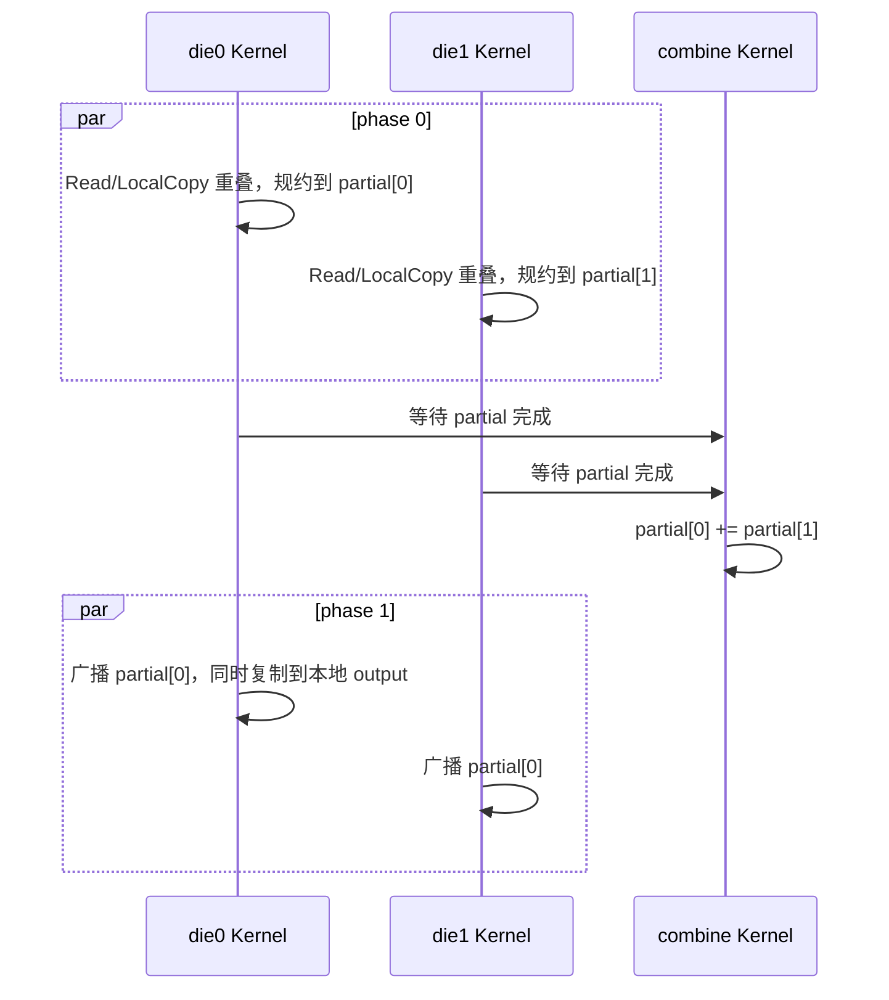

# AllReduce CCU 大消息 HBM 并行优化设计（723v2）

## 1. 版本定位

723v2 基于 722v1，只优化 rank slice 大于 1MB 时使用的 HBM 路径。722v1 已在三个 512KB 硬件用例上取得提升，因此本版本保持小消息 MS Buffer 专用算法、动态参数编码和 1MB 分流阈值不变，重点处理四个大消息退化用例：

| 拓扑 | 数据量 | 旧实现 | 722v1 | 722v1 相对旧实现 |
|---|---:|---:|---:|---:|
| `2x8` | 512MB | 1.91ms | 1.92ms | +0.5% |
| `2x8` | 400MB+4B | 1.48ms | 1.51ms | +2.0% |
| `4x1` | 512MB | 2.50ms | 2.52ms | +0.8% |
| `8+4` | 512MB | 2.30ms | 2.41ms | +4.8% |

当前已有一轮 723v2 硬件实测结果。相对 722v1，五项更快、四项持平；相对当前第一名的九项成绩，仍有六项需要继续优化。HCCL-VM 只用于数值、任务依赖和内存访问关系验证，不用于替代硬件性能测试。

## 2. 改动边界

本版本只修改 `op_kernel_ccu/ccu_kernel.cc` 中的大消息 HBM 数据流，主要涉及：

- `ReduceSourcesWithHbm`
- `ReduceGroup`
- `BroadcastResult` / `BroadcastGroupResult`
- `CombinePublishedPartials`
- `BroadcastCombinedPartial`

以下小消息实现保持不变：

- `ReduceWithMs`
- `ReduceSources`
- `MS_REDUCE_SLICE_LIMIT = 1MB`
- Host 侧 4KB/64KB LoopGroup 参数编码
- MS block 申请规则和超过 8 输入时的固定顺序分批

运行时仍由 `useMs` 选择路径：

```text
rank slice <= 1MB  -> 722v1 MS Buffer 路径
rank slice >  1MB  -> 723v2 HBM 并行路径
```

因此 723v2 不改变已经在 512KB 用例上验证过的专用算法，只调整大消息的操作发射顺序和 HBM 中间结果位置。

## 3. 722v1 大消息关键路径

722v1 的 HBM 路径按以下顺序执行：

```text
并行读取所有 peer slice
  -> 等待全部 Read
  -> 本地 input 复制到 scratch
  -> 等待 LocalCopy
  -> scratch 上进行树形 LocalReduce
  -> 等待每轮 LocalReduce
  -> 将树根复制到 output（die1 partial 除外）
  -> 等待 LocalCopy
  -> 从 output 向所有 peer 广播
  -> 等待全部 Write
```

网络 Read、本地输入复制、结果写回 output 和网络 Write 之间存在不必要的串行等待。723v2 不改变树形规约次数和网络字节数，而是把相互独立的传输放入同一 Event 窗口，并让树形结果继续保留在 scratch 中。

## 4. HBM 路径实现

### 4.1 本地输入复制与 peer Read 重叠

`ReduceGroup` 先对所有 peer 发射 `ccu::Read`。当当前 die 还包含本 rank 输入时，HBM 路径立即把本地 slice 发射到连续 scratch slot，不先等待 peer Read：

```text
event bit [0, channelCount) = peer Read
event bit [channelCount]    = local input LocalCopy
```

随后一次 `EventWait` 等待整个 group mask。这样本地 HBM 复制可以与链路数据读取并行。MS 路径仍只等待 peer mask，并继续直接从本地 input 读取，没有新增本地 scratch 搬运。

### 4.2 树形结果原地保留在 scratch

`ReduceSourcesWithHbm` 只负责在 `sources[]` 上执行原地树形规约：

```text
第 1 轮：source[0] += source[k], ...
第 2 轮：剩余 source 继续两两合并
...
最终结果：source[0]
```

函数不再负责以下操作：

- 单独把本地输入复制到 scratch；该操作已移到 `ReduceGroup` 并与 Read 重叠。
- 把 `source[0]` 串行复制到 output 或 partial；后续阶段直接使用 scratch 树根。

树形规约的输入顺序、每轮配对方式和 `LocalReduce` 数量不变，因此本次调整不引入新的浮点加法顺序变化。

### 4.3 广播与本地 output 写回重叠

新增公共入口 `BroadcastResult(ctx, source, copyToLocalOutput)`。它从指定的 scratch 或 output 源同时发射：

- 到各 peer output 的 `ccu::Write`；
- 可选的本地 `source -> output` `ccu::LocalCopy`。

所有操作使用互不重复的 Event bit，最后一次等待完整 mask。单 die HBM 路径因此直接以 `groupData[0]` 为广播源，并把本地 output 写回与 peer Write 重叠。

MS 路径的结果本来就在 output 中，仍以 output 为源广播，并设置 `copyToLocalOutput=false`。

## 5. 单 Die 数据流

单 die 的 723v2 HBM 数据流为：


与 722v1 相比，本地输入复制不再位于 Read 之后，结果复制也不再位于广播之前。传输字节数基本不变，优化目标是缩短关键路径中的串行阶段。

## 6. 双 Die 数据流

722v1 中 die0 的 HBM partial 会先复制到 output，combine 再执行 `output += die1Partial`。723v2 让两个 die 的 partial 都保留在各自 scratch slot：



combine 的 HBM 分支在 `partial[0]` 上原地合并，不预先写 output。广播阶段两个 die 都从合并后的 `partial[0]` 向各自 peer 写结果，但只有 die0 执行本地 output copy。

MS 路径保持 722v1 行为：die0 partial 位于 output，combine 执行 `output += die1Partial`，两个 die 从 output 广播。

## 7. Event 和内存冲突处理

本版本用 Event bit 区分同一阶段的并行任务：

| Event bit | 操作 |
|---:|---|
| `[0, channelCount)` | peer Read 或 peer Write |
| `channelCount` | HBM 路径的本地 input/output LocalCopy |

`channelCount` 最大不超过 15，因此完整 mask 可由 `uint16_t` 表示。树形 `LocalReduce` 仍逐轮等待，下一轮不会在上一轮写回完成前访问同一 scratch slot。

第一版双 die 广播曾让两个 die 同时把同一个 `partial[0]` 复制到本地 output。数值 runner 能完成，但 CheckerV3 报告 output 写冲突：

```text
MemConflict failed
Memory conflict detected ... OUTPUT
```

最终实现限定：

```cpp
BroadcastResult(ctx, ctx.partial[0], ctx.arg->dieId == 0)
```

只有 die0 写本地 output，两个 die 仍分别广播到自己管理的 peer。修复后 `MemConflict`、数值结果和语义检查均通过。

## 8. 仿真验证

最终安装并用于本轮验证的动态库 SHA256 为：

```text
a146885d6b19787f09c7d141058eb0806b58977bd7dd24d1d127cb6616efc647
```

Release 构建通过 `-Wall -Werror`。HCCL-VM 数值运行覆盖：

| 拓扑 | 数据量 | 结果 | 主要覆盖 |
|---|---:|---|---|
| `2x8` | 512MB | success | 双 die、256MB 分段、HBM combine |
| `2x8` | 400MB+4B | success | 双 die、非整齐尾部 |
| `4x1` | 512MB | success | 单 die HBM 并行路径 |
| `8+4` | 512MB | success | 非均匀双 die 大消息路径 |
| `2x8` | 512KB | success | MS 小消息回归 |

CheckerV3 对最终版本执行了以下代表性检查：

| 拓扑 | 数据量 | SingleTaskCheck | MemConflict | SemanticCheck |
|---|---:|---|---|---|
| `2x8` | 400MB+4B | success | success | success |
| `2x8` | 512KB | success | success | success |

其中 512KB 用例用于确认 HBM 分支修改没有破坏 MS 专用路径。Checker 最终输出均为 `op[1] Checker Success`。

本轮观察到的 VM 墙钟时间约为：

| 拓扑 | 数据量 | VM 工作流耗时 |
|---|---:|---:|
| `4x1` | 512MB | 14s |
| `8+4` | 512MB | 38s |
| `2x8` | 400MB+4B | 40s |
| `2x8` | 512KB | 15s |

这些时间只用于判断仿真任务是否能正常完成，不是硬件通信性能。HCCL-VM 输出的 `1000us`、`aveg_time` 和 `alg_bandwidth` 也是仿真占位值，不能与 722v1 的硬件数据比较。

## 9. 硬件实测结果

### 9.1 723v2 当前实测

本轮九个用例按赛题顺序测试：每种拓扑依次为 `512KB`、`512MB`、`400MB+4B`。

| 拓扑 | 512KB | 512MB | 400MB+4B |
|---|---:|---:|---:|
| `2x8` | **27.00us** | **1.87ms** | **1.50ms** |
| `4x1` | **20.00us** | **2.52ms** | **1.98ms** |
| `8+4` | **29.00us** | **2.33ms** | **1.74ms** |

### 9.2 相对 722v1

722v1 的硬件成绩为 `28.00us / 1.92ms / 1.51ms`、`20.00us / 2.52ms / 1.98ms`、`29.00us / 2.41ms / 1.75ms`。逐项比较如下，负值表示 723v2 更快：

| 拓扑 | 数据量 | 722v1 | 723v2 | 差值 | 结果 |
|---|---:|---:|---:|---:|---|
| `2x8` | 512KB | 28us | 27us | -1us | 更快 |
| `2x8` | 512MB | 1.92ms | 1.87ms | -0.05ms | 更快 |
| `2x8` | 400MB+4B | 1.51ms | 1.50ms | -0.01ms | 更快 |
| `4x1` | 512KB | 20us | 20us | 0 | 持平 |
| `4x1` | 512MB | 2.52ms | 2.52ms | 0 | 持平 |
| `4x1` | 400MB+4B | 1.98ms | 1.98ms | 0 | 持平 |
| `8+4` | 512KB | 29us | 29us | 0 | 持平 |
| `8+4` | 512MB | 2.41ms | 2.33ms | -0.08ms | 更快 |
| `8+4` | 400MB+4B | 1.75ms | 1.74ms | -0.01ms | 更快 |

因此相对 722v1 为 **5 项更快、4 项持平、0 项变慢**。九项时间简单换算并求和为：722v1 `12.167ms`，723v2 `12.016ms`，总和降低 `0.151ms`，约 **1.2%**。该总和只用于观察整体趋势，不代表比赛正式加权得分。

### 9.3 相对当前第一名

当前第一名成绩（用户提供）为：

| 拓扑 | 512KB | 512MB | 400MB+4B |
|---|---:|---:|---:|
| `2x8` | 27us | 1.95ms | 1.44ms |
| `4x1` | 21us | 2.36ms | 1.86ms |
| `8+4` | 28us | 2.20ms | 1.71ms |

以较小耗时为优，逐项比较为：

| 拓扑 | 数据量 | 723v2 | 当前第一名 | 结果 |
|---|---:|---:|---:|---|
| `2x8` | 512KB | 27us | 27us | 持平 |
| `2x8` | 512MB | 1.87ms | 1.95ms | 快 0.08ms（4.1%） |
| `2x8` | 400MB+4B | 1.50ms | 1.44ms | 慢 0.06ms（4.2%） |
| `4x1` | 512KB | 20us | 21us | 快 1us（4.8%） |
| `4x1` | 512MB | 2.52ms | 2.36ms | 慢 0.16ms（6.8%） |
| `4x1` | 400MB+4B | 1.98ms | 1.86ms | 慢 0.12ms（6.5%） |
| `8+4` | 512KB | 29us | 28us | 慢 1us（3.6%） |
| `8+4` | 512MB | 2.33ms | 2.20ms | 慢 0.13ms（5.9%） |
| `8+4` | 400MB+4B | 1.74ms | 1.71ms | 慢 0.03ms（1.8%） |

相对当前第一名，723v2 为 **2 项更快、1 项持平、6 项更慢**。九项简单总和为第一名 `11.596ms`、723v2 `12.016ms`，当前总和多 `0.420ms`，约慢 **3.6%**。正式排名仍应以比赛的实际计分方式为准。

## 10. 实测结论与待测项

723v2 没有减少网络 Read/Write 字节数，也没有减少 HBM 树形规约的 `LocalReduce` 次数。设计收益来自三个关键路径变化：

1. 本地 input copy 与 peer Read 重叠。
2. 树形结果不再先串行复制到 output 才开始广播。
3. 本地 output copy 与 peer Write 重叠。

收益大小取决于 CCU 队列能否让 LocalCopy 与网络任务真实并行、HBM 和链路带宽竞争，以及不同拓扑下本地输入所属 die。当前实测显示 `2x8 / 512MB` 和 `8+4 / 512MB` 获得改善，而 `4x1` 两个大消息点没有变化，说明不同拓扑的实际重叠效果差异明显。

后续硬件测试仍应覆盖九个正式用例，并重点处理：

| 优先级 | 拓扑 / 数据量 | 目的 |
|---:|---|---|
| 1 | `4x1 / 512MB` | 当前落后第一名 6.8%，分析单 die 重叠未生效的原因 |
| 2 | `4x1 / 400MB+4B` | 当前落后第一名 6.5%，确认与 512MB 是否为同一瓶颈 |
| 3 | `8+4 / 512MB` | 已比 722v1 改善 0.08ms，但仍落后第一名 5.9% |
| 4 | `2x8 / 400MB+4B` | 512MB 已领先第一名，但此点仍落后 4.2%，需定位分段或尾部差异 |
| 5 | 三个 512KB 用例 | 重复测量，确认 1us 级差异不是波动 |

建议每个用例进行多轮预热和重复测量，同时记录中位数及波动范围。本轮结果证明 HBM 并行化方向对部分双 die 场景有效，但还不能解释单 die 无收益和不同消息尾部表现不一致的问题。

## 11. 当前边界

- 仅支持赛题要求的 FP32 + SUM 和最多 16 rank。
- 只优化 `useMs=0` 的 HBM 路径，小消息算法不变。
- HBM 树形规约顺序不变，仍以控制任务数量和仿真时间为前提。
- 传输和规约总字节数基本不变，优化依赖硬件并发执行效果。
- 仿真已验证代表性单 die、双 die、大消息、尾部和小消息回归。
- 当前已有一轮 723v2 硬件性能数据，但 `2x8 / 400MB+4B`、`4x1` 大消息和 `8+4` 大消息仍落后当前第一名，需要进一步优化和重复测量。
