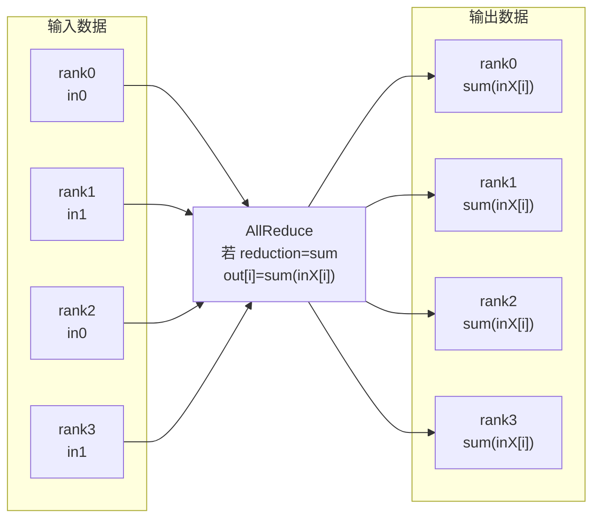
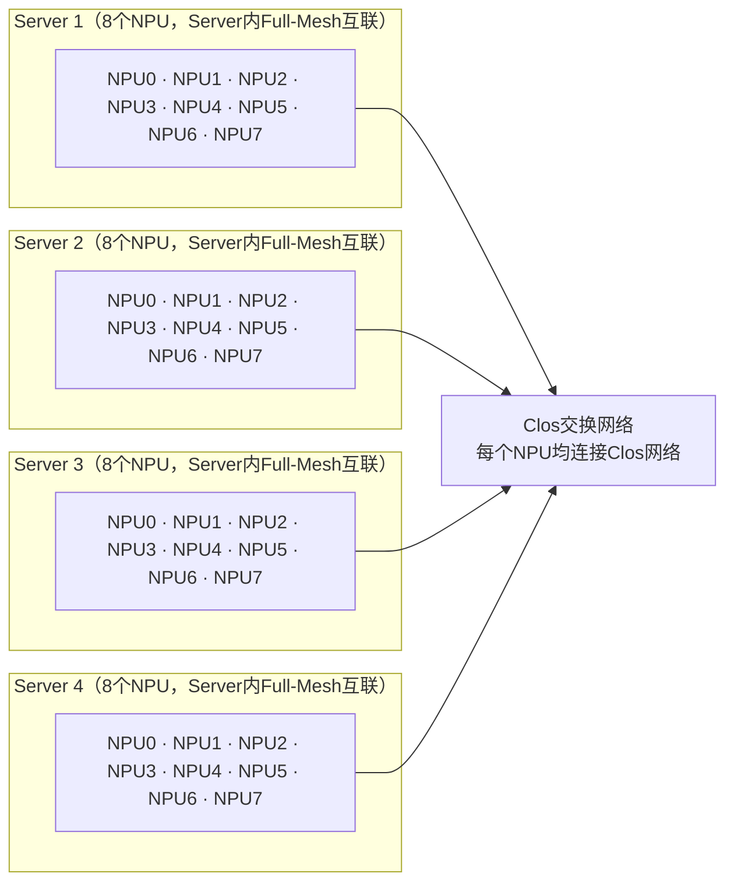
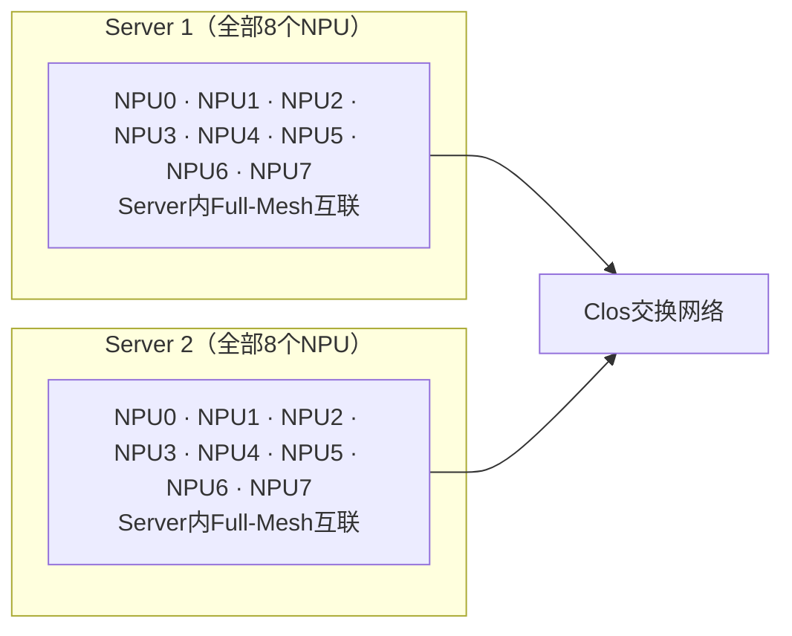
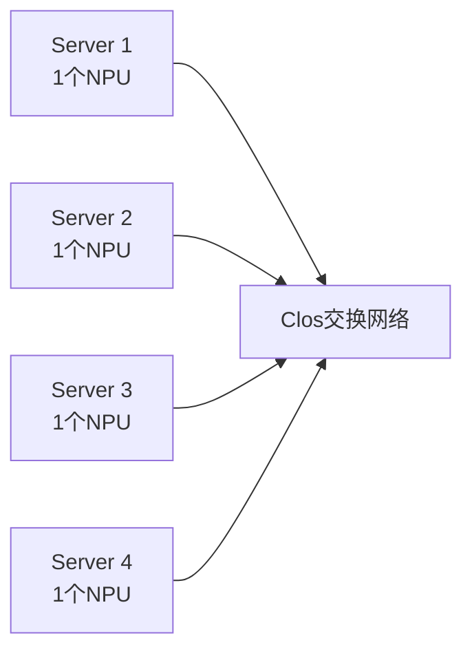
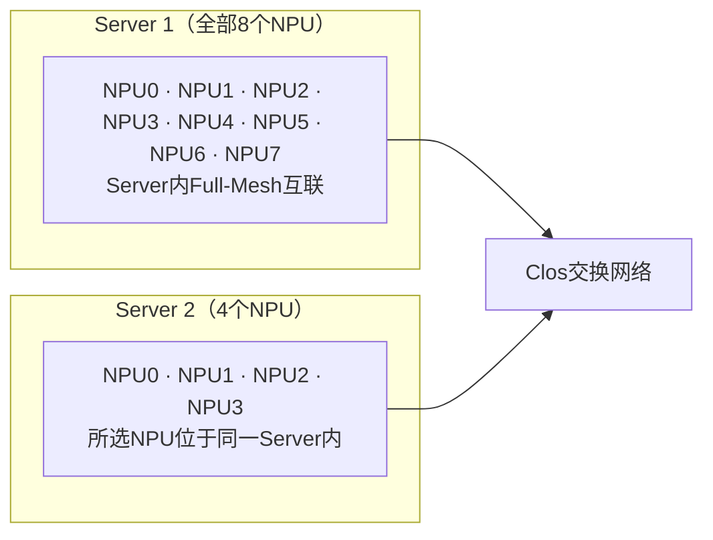

# 2026HCCL通信库创新大赛_西部赛区

## 西部赛区（AllReduce）- 决赛

> 主办方：CANN开源社区  
> 决赛时间：2026/07/20-2026/07/25  
> 状态：进行中

HCCL通信库创新大赛是针对计算机网络领域的专项科技竞赛，由西安电子科技大学主办，华为技术有限公司提供赞助支持。大赛旨在构建高校CANN集合通信人才生态，以赛促学，培养计算网络领域优秀人才，锻炼创新思维，提升解决难题的能力。

---

## 一、赛题描述

实现集合通信算子AllReduce的操作接口，将通信域内所有节点的输入数据进行相加（或其他归约操作）后，再把结果发送到所有节点的输出buffer，其中归约操作类型由op参数指定。其计算原理如下图所示。

### AllReduce计算原理示意



评测环境为4*8卡昇腾Ascend 950的仿真环境，拓扑如下所示，横向为Mesh互联，纵向为Clos组网。

- 拓扑由4个Server组成，每个Server内包含8个NPU。
- Server内8个NPU之间为Full-Mesh互联，Server间通过Clos网络互通。
- 每个NPU连接Clos网络的带宽大致是Server内单条直连链路带宽的8倍。
- 基于完整32卡集群构建3种子拓扑：`2*8`、`4*1`、`8+4`。具体拓扑如下图所示。

### 完整32卡集群拓扑示意



### 拓扑类型：`2*8`



### 拓扑类型：`4*1`



### 拓扑类型：`8+4`



---

## 二、核心定义与约束

### 2.1 函数原型与参数说明

```cpp
HcclResult HcclAllReduce(
    void *sendBuf,
    void *recvBuf,
    uint64_t count,
    HcclDataType dataType,
    HcclReduceOp op,
    HcclComm comm,
    aclrtStream stream
)
```

| 参数名 | 输入/输出 | 描述 |
|---|---|---|
| `sendBuf` | 输入 | 源数据buffer地址。 |
| `recvBuf` | 输出 | 目的数据buffer地址，集合通信结果输出至此buffer中。 |
| `count` | 输入 | 参与allreduce操作的数据个数，比如只有一个float32数据参与，则count=1。 |
| `dataType` | 输入 | allreduce操作的数据类型，HcclDataType类型。 |
| `op` | 输入 | reduce的操作类型，如sum、prod、max、min。 |
| `comm` | 输入 | 集合通信操作所在的通信域。 |
| `stream` | 输入 | 本rank所使用的stream。 |

接口成功返回`HCCL_SUCCESS`，其他失败。

### 2.2 算子约束

- 所有rank的count、dataType、op均相同。
- 每个rank只有一个输入。
- 针对一个对端仅能申请1个channel进行通信。基于赛题提供的拓扑，每两个npu之间仅有一条物理链路，因此与同一个对端只使用一条channel完成通信的收/发、同步等操作即可，使用多个channel不会带来额外的性能收益。

### 2.3 规则要求

- 限定使用CCU通信引擎。
- 算子实现需满足确定性要求，即在相同输入下（特别是浮点数输入），多次通信计算得到的输出结果相同。

---

## 三、评分指标

赛题将从以下两个维度进行评分：

- 功能分：通过功能测试用例验证，通过得分，不通过得0分。
- 性能分：通过性能测试用例验证，不通过得0分，通过则按照带宽用量计分，带宽最高得满分，按照排名依次递减。

如不满足2.3中的规则要求，则不得分。

通信域覆盖3种不同拓扑类型，数据类型覆盖float32，（输入）数据size覆盖512KB、512MB、400MB+4B，Reduce类型为sum。

### 3.1 用例说明

#### 功能用例

- 共9个功能用例（数据量分别为512KB、512MB、400M+4B），覆盖三种拓扑类型，每个用例6分。
- 功能用例应该是按照2*8（512KB、512MB、400MB+4B）、4*1（3个数据量）、8+4（3个数据量）顺序排布。
- 代码提交后，等待实时判分。

#### 性能用例

- 共9个性能用例（数据量分别为512KB、512MB、400M+4B），覆盖三种拓扑类型，每个用例4分。
- 每天统一出1次性能分，取第二天凌晨3点前最后1次提交的代码进行性能评分。
- 需保证功能用例全部通过才能参与性能评分。


---

## 四、参考资料

### 1. 📚 前置基础学习链接

| 资料名称 | 链接 |
|---|---|
| 全量学习资料（持续更新中） | [HCCL学习资料](https://gitcode.com/cann/hccl/blob/master/docs/README.md) |
| HCCL—昇腾高性能集合通信库简介 | [昇腾高性能集合通信库简介](https://www.hiascend.com/zh/developer/techArticles/20240809-1) |
| 深度学习的分布式训练与集合通信（一） | [深度学习的分布式训练与集合通信（一）](https://www.hiascend.com/zh/developer/techArticles/20241111-1) |
| 深度学习的分布式训练与集合通信（二） | [深度学习的分布式训练与集合通信（二）](https://www.hiascend.com/zh/developer/techArticles/20241122-1) |

### 2. 📚 代码仓资料

| 资料名称 | 链接 |
|---|---|
| HCCL代码仓库 | [CANN/hccl仓](https://gitcode.com/cann/hccl)、[CANN/hcomm仓](https://gitcode.com/cann/hcomm) |
| 通信算子开发文档 | [HCCL算子开发文档](https://gitcode.com/cann/hcomm/blob/master/docs/zh/comm_op_dev_guide/README.md) |

### 3. 🚀 赋能视频链接

| 主题 | 直播回放 | 材料归档 |
|---|---|---|
| HCCL软件架构介绍 | [HCCL软件架构赋能视频](https://www.bilibili.com/video/BV12HJV6PEek) | [HCCL软件架构赋能材料](https://gitcode.com/cann/community/tree/master/events/meetup/slides/sig-hccl/20260615) |
| HCCL算子开发介绍 | [HCCL算子开发赋能视频](https://www.bilibili.com/video/BV1x9j369EYH) | [HCCL算子开发赋能材料](https://gitcode.com/cann/community/tree/master/events/meetup/slides/sig-hccl/20260616) |
| HCCL北极星验证工具介绍 | [HCCL北极星验证工具赋能视频](https://www.bilibili.com/video/BV1zhLX6dESL) | [HCCL北极星验证工具赋能材料](https://gitcode.com/cann/community/tree/master/events/meetup/slides/sig-hccl/20260617) |

---

## 五、决赛答题要求

### 名称

AllReduce算子--决赛

### 赛题介绍

基于给定拓扑，实现集合通信AllReduce算子功能，主要包括控制面的资源申请和数据面的算法逻辑实现。

### 要求

1. 仅可修改指定文件：`custom.h`、`allreduce.cc`、`exec_op.cc/.h`、`ccu_kernel.cc/.h`。
2. 限定使用CCU模式。
3. 算子实现需满足确定性要求，即在相同输入下（特别是浮点数输入），多次通信计算得到的输出结果相同。

### 答题与结果

- [开始答题](https://cannjudge.cn/public/western_final/hccl_allreduce_ccu)
- [查看结果](https://cannjudge.cn/public/western_final/hccl_allreduce_ccu/ranking)
