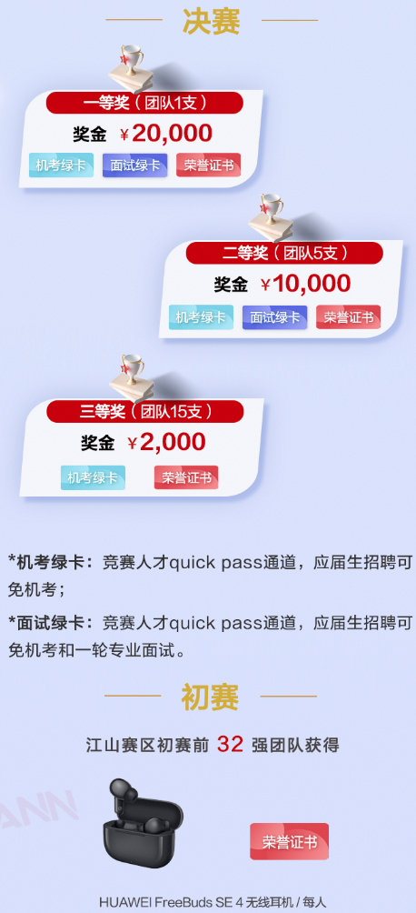

# 🏆 CANN 算子挑战赛 (江山赛区)
> **大赛简介** 

> CANN 算子挑战赛是华为算法挑战赛的子赛道，江山赛区面向江苏、山东地域，是 CANN 算子挑战赛的全国首场比赛。大赛基于 CANN 开源开放场景，赋能算子开发基础知识课程。欢迎江苏、山东地域的高校精英加入，探索算子核心开发的奥秘，享受算法性能提升的乐趣！

---

*说明：比赛时间周期可能存在延期及变化，请您及时留意刷新页面信息。*

**比赛链接**：https://competition.gitcode.com/competition/2041798845710389249/intro  

## 📅 大赛日程

### 🚩 初赛（前 32 强队伍晋级决赛）

| 赛事环节         | 时间安排                     |
| :--------------- | :--------------------------- |
| **大赛报名**     | 04/21 —— 05/23               |
| **赛题发布**     | 04/29                        |
| **在线练习**     | 04/29 —— 05/23               |
| **参赛作品提交** | 05/24                        |
| **晋级名单**     | 05/25（公示）、05/26（公布） |

### 👑 决赛（现场决出一、二、三等奖）

| 赛事环节       | 时间安排       |
| :------------- | :------------- |
| **赛题发布**   | 05/27          |
| **在线练习**   | 05/27 —— 06/05 |
| **现场总决赛** | 06/06          |

---

## ⚖️ 赛事规则

- 🎯 **参赛对象要求**：主要面向江苏、山东地域高校在校学生。（其他选手可参与报名和提交作品，但不参与排名）。
- 📝 **参赛答题要求**：参赛选手需要根据赛题赛规要求，在指定时间内完成报名、赛区选择、组队、作品提交，方为有效参赛。(每天最大提交次数为50次，取比赛期间最后一次提交的成绩作为最终成绩)
- 📌 **CANNLab算力申请要求**：江苏山东地域参赛队伍，仅允许队长申请算力资源，申请算力资源后不能更换团队名称、队伍成员。请参赛者务必在申请算力资源前完成队伍组建（请填写申请理由并附上一条答题记录）。
- 🤝 **组队要求**：先报名后组队，每支队伍 1-3 人。要求队伍成员均为江苏、山东地域高校在校学生，支持跨学校组队。（算力资源由队长统一申请提交）
- 🛡️ **公平参赛**：每个阶段比赛结束后，大赛组委会将进行代码查验。如发现代码重复或违规等情况，将直接取消该队伍参赛资格和现有成绩。
- ⚔️ **比赛机制**：
  1. 比赛分初赛和决赛两个赛段，每个赛段包含"在线训练"和"正式比赛"两个阶段。在线训练阶段提交的作品仅用于代码调试参考，不计入评奖参考。
  2. 正式比赛中，各参赛队伍把最优成绩作为本团队最终成绩进行排名，**请各位选手做好版本管理**。

---

## 

  
## 🏅 奖项设置

## 💬 交流渠道
**比赛交流贴**：https://gitcode.com/cann/cann-ops-competitions/discussions/1

**QQ 交流群**：1094426651

**扫码进群**：

