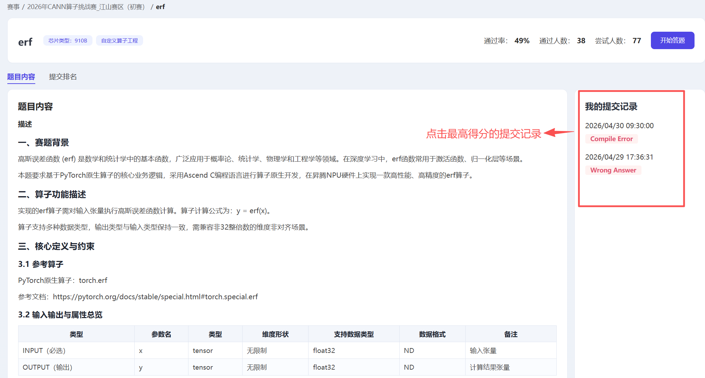
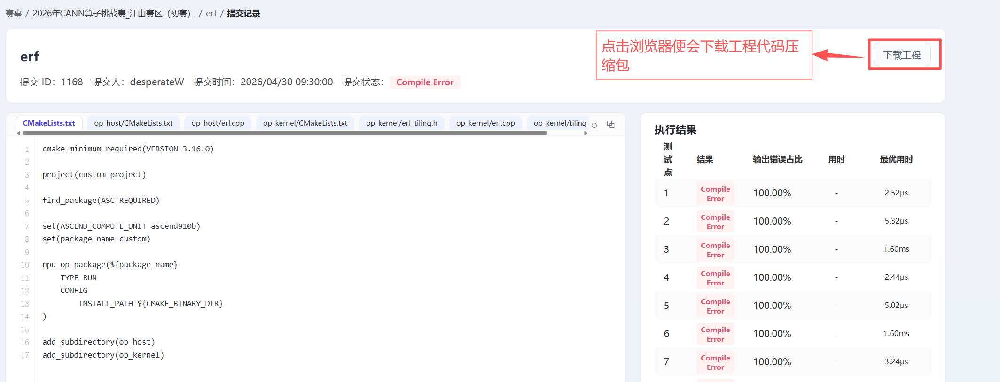

# 作品提交规范

本规范适用于 `preliminary/submissions/` 与 `final/submissions/` 目录下的所有团队提交。请各参赛队伍严格按照本规范组织提交内容，不符合规范的提交可能导致 PR 无法合并，进而影响后续奖金与证书的发放。

## 一、目录命名规范

在对应赛事阶段的 `submissions/` 目录下创建团队目录：

```
{submissions}/{school}_{team-name}/
```

**命名规则：**

- `school`：学校代码缩写（如 `nju`、`seu`、`hitsz`、`tju`）
- `team-name`：团队自定名称，使用短横线分隔（如 `op-pioneers`），若是中文则可以使用拼音代替

**示例：**

```
preliminary/submissions/nju_op-pioneers/
preliminary/submissions/hitsz_test-masters/
final/submissions/nju_op-pioneers/
```

> 注意：文件与文件夹命名请使用英文，可以使用拼音来进行代替

预选赛与决赛的提交目录相互独立，晋级决赛的队伍需在 `final/submissions/` 下另建目录。

## 二、目录结构要求

每个团队的提交目录**仅需包含以下三部分**：

```
team01_nju_op-pioneers/
├── README.md       # 必选：团队信息
├── code/           # 必选：算子代码
```

### 1. code/（算子代码）

算子代码直接下载[CANNJudge]((https://cannjudge.cn/))平台得分的工程代码即可，步骤如下：

（1）打开算子题目页面，以预选赛Erf算子为例，打开[Erf算子题目页面](https://cannjudge.cn/public/op_challenge_jiangshan_prelim/erf)

（2）点击 **我的提交记录** 中得分最高的提交记录打开提交页面



（3）点击下载工程得到代码压缩包，解压便能得到完整算子代码



（4）将代码修改成如下目录结构（添加一层算子名称文件夹即可）：

**预选赛提交代码：**

```
code/
├── Erf/
│   ├──op_kernel/
|		├──erf.cpp
|		├──erf_tiling.h
|		├──tiling_key_erf.h
|		└──CMakeLists.txt
│   ├──op_host/
|		├──erf.cpp
|		└──CMakeLists.txt
|	└──CMakeLists.txt
```


### 2. README.md（团队说明）

包含团队信息即可：

```markdown
## 团队信息

- 团队名称：[团队名称]
- 所属单位：[学校全称]
- 团队成员：
  - [姓名]，[在团队中的分工]
  - [姓名]，[在团队中的分工]
- 联系人：[姓名]
- 联系邮箱：[邮箱地址]
```


## 三、注意事项

1. **代码原创性**：提交内容须为团队原创，禁止抄袭其他团队作品或网络代码片段
2. **不提交编译产物**：`build/`、`*.o`、`*.gcda`、`*.gcno` 等由评测系统重新生成，无需提交
3. **不提交敏感信息**：包括但不限于密钥、密码、个人证件、内部资料等
4. **文件大小限制**：单个文件不超过 50MB，单个团队目录总大小不超过 200MB
5. **避免覆盖他人文件**：仅修改自己团队目录下的内容，不得改动其他团队、赛题文档或仓库配置文件

## 四、提交流程

以下过程中可能需要输入用户名和个人访问令牌进行验证，个人访问令牌可以访问 [访问令牌](https://gitcode.com/setting/token-classic) 页面进行创建。

1. Git全局配置，填写自己的GitCode用户名和GitCode配置邮箱

   ```
   git config --global user.name ***
   
   git config --global user.email ***
   ```

   

2. 设置环境变量

   ```bash
   export GITCODE_TOKEN="你的GitCode个人访问令牌"
   export GITCODE_USER="你的GitCode用户名"
   
   export UPSTREAM_OWNER="cann"
   export REPO="cann-competitions"
   export BASE_BRANCH="master"
   ```

   - GitCode个人令牌可以访问 [访问令牌](https://gitcode.com/setting/token-classic) 页面进行创建

3. Fork原仓库到个人仓库，此步骤需要注意如果此前Fork过cann-competition仓库需要删除仓库。

   ```bash
   curl -L "https://api.gitcode.com/api/v5/repos/${UPSTREAM_OWNER}/${REPO}/forks?access_token=${GITCODE_TOKEN}" \
     -H "Content-Type: application/json" \
     -H 'Accept: application/json' \
     -d "{ 
     \"organization\": \"${GITCODE_USER}\", 
     \"name\": \"cann-competitions\", 
     \"path\": \"cann-competitions\" 
   }"
   ```

4. 克隆个人仓库到终端环境

   ```bash
   git clone "https://gitcode.com/${GITCODE_USER}/${REPO}.git"
   cd "${REPO}"
   ```

5. 添加原仓库为`upstream`

   ```bash
   git remote add upstream "https://gitcode.com/${UPSTREAM_OWNER}/${REPO}.git"
   ```

6. 将第二节中下载并修改了目录结构的算子代码放到第一节中的指定提交目录下

7. 提交到本地master分支, 如果小队多个成员请追加联合作者信息(以下为除自己外添加2个联合作者的示例)，队伍所有队员必须[签署CLA](https://clasign.osinfra.cn/sign-cla/68cbd4a3dbabc050b436cdd4/employee)：

   ```bash
   git add .
   git commit -m "update competition files" -m "Co-authored-by: zhangsan <zhangsan@example.com>" -m "Co-authored-by: lisi <lisi@example.com>"
   ```
   
   说明：联合开发者通过-m参数指定，参数具体含义  `Co-authored-by: {gitcode用户名} <{gitcode邮箱}>`
   
   gitcode用户名：个人设置-用户资料-用户昵称
   
   gitcode邮箱：个人设置-电子邮件

8. 推送到fork的个人仓库

   ```bash
   git push origin "${BASE_BRANCH}"
   ```

9. 提交Pull Request

	在AtomGit 上打开你的 Fork 仓库页面，点击 【新建 Pull Request】，填写PR标题和描述。
    
   **标题格式：** 
   ```
   [团队提交] 算子挑战赛江山赛区预赛 Erf 算子提交： ** 补充团队名称 **
   ```
   **PR描述模板：**
   ```markdown
   ## 团队信息
   - 团队名称：[团队名称]
   - 所属单位：[学校全称]
   - 团队成员：
  		- [姓名]，[在团队中的分工]
  		- [姓名]，[在团队中的分工]
   
   ## 算子实现介绍
   内容可考虑介绍以下内容：
   1.算子整体实现思路
   2.精度优化策略
   3.性能优化策略
   ```

10. 检查CLA，在PR的评论里输入：`/check-cla`，未通过会弹出提示要求签署CLA，点击完成签署即可

10. 运行流水线，在PR的评论里输入：`/compile`,当运行成功所有环节显示success即为成功
   

## 六、问题反馈

提交过程中如遇问题，请通过以下渠道联系组委会：

- GitCode Issue：在大赛仓库下提交 Issue