# 预选赛：算子测试用例设计

## 赛题概述

本次预选赛要求参赛者在CANNJudge平台完成赛事题目提交，分数和排名以[赛事实时榜单](https://competition.gitcode.com/competition/2041798845710389249/live-ranking)页面 **参赛区域实时总榜** 为准，赛事平台为算子设置了多个测试用例，需全部测试用例通过方可得分，测试点性能高低决定分数高低。

预选赛共设 1 道题目：

| 题目 | 算子 | 说明 | 题目链接 |
|:----:|:----:|:----:|------|
| 题目 1 | Erf（高斯误差函数） |$\operatorname{erf}(x)=\frac{2}{\sqrt{\pi}}\int_{0}^{x} e^{-t^2}\,dt$ | https://cannjudge.cn/public/op_challenge_jiangshan_prelim/erf |

## 实验环境

### CANNJudge平台

（1）在题目页面点击 **开始答题** 便可进入算子代码编辑页面
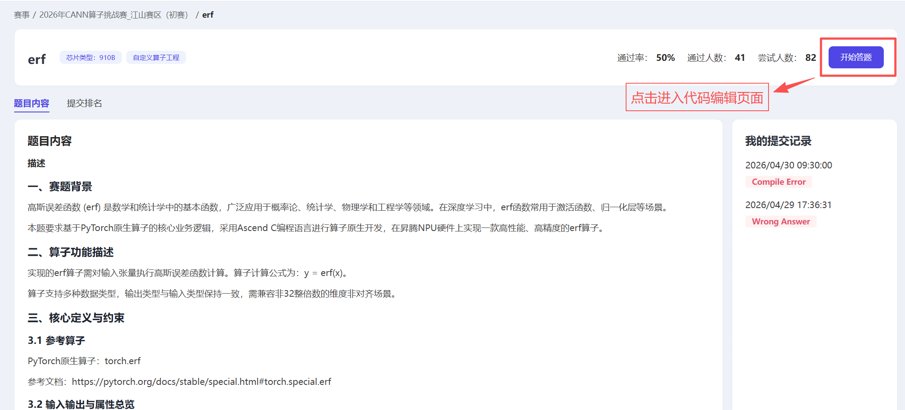
（2）开发完点击 **提交代码** 完成提交
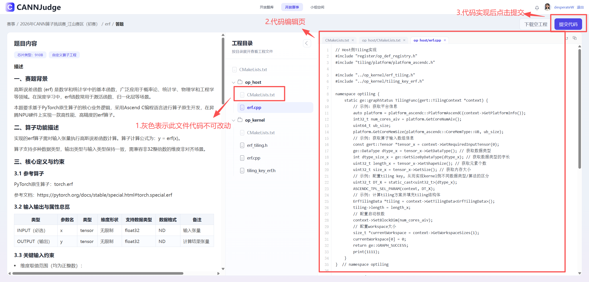
（3）在算子页面点击 **提交排名** 可以查看所有排名和分数信息
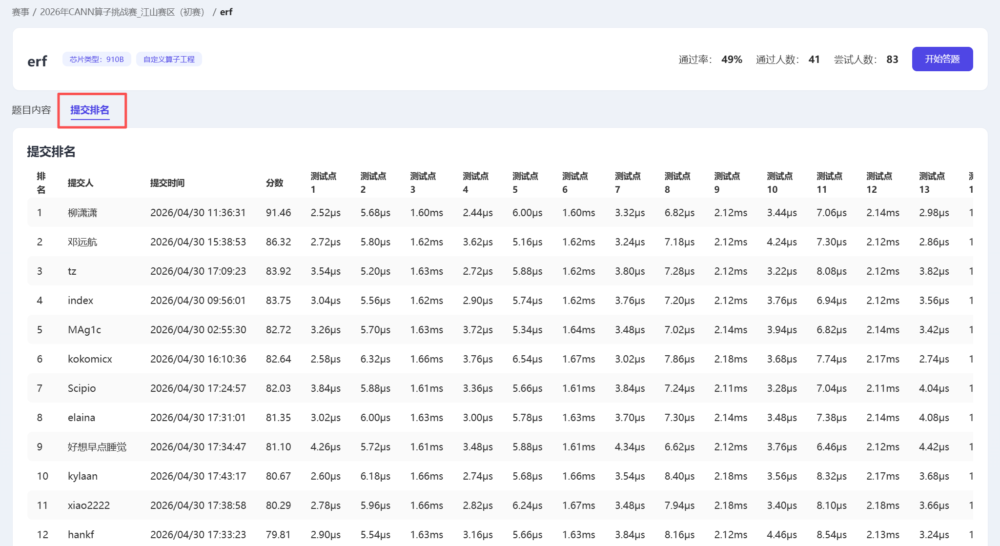

### 云开发环境（可选调试环境）
#### 资源申请
（1）报名赛事后进入 **团队管理** 页签，点击 **申请专属资源** 。
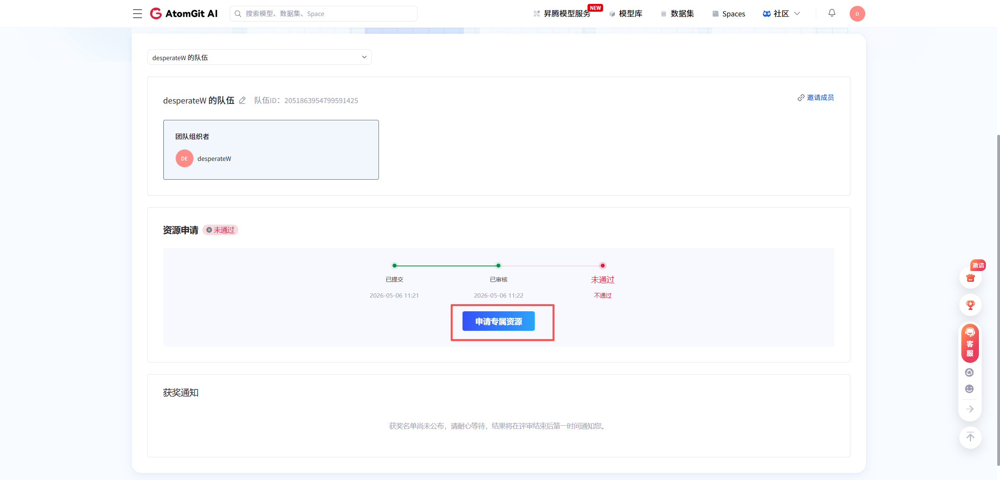

（2）填写申请表并点击 **确定申请** , 审批通过后即可获得100卡时的资源使用。华为云账号ID通过点击图中链接跳转获得。
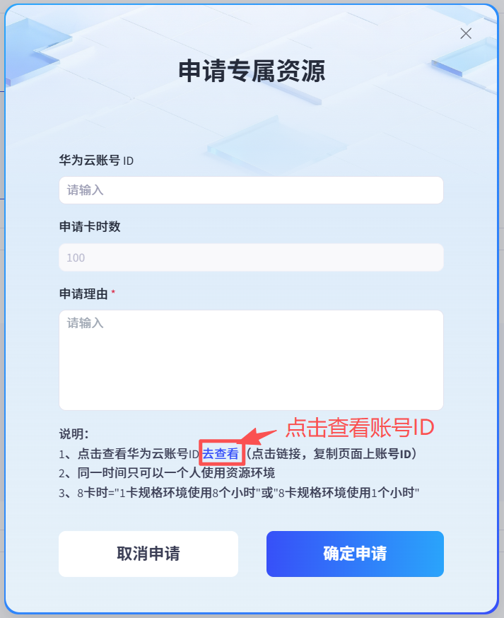
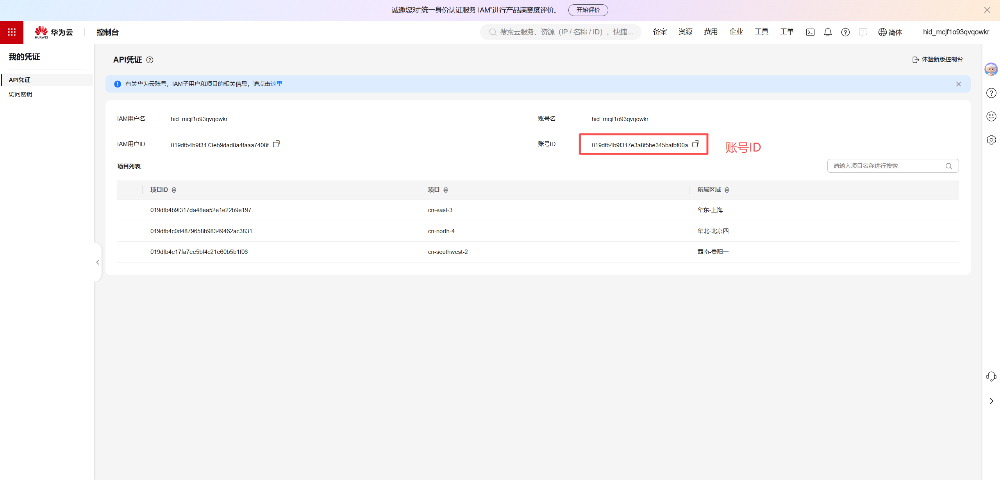

#### 资源使用
（1）资源申请完成后，**团队管理**页签显示如下图，点击**登录一站式开发平台**进入资源管理页面。
 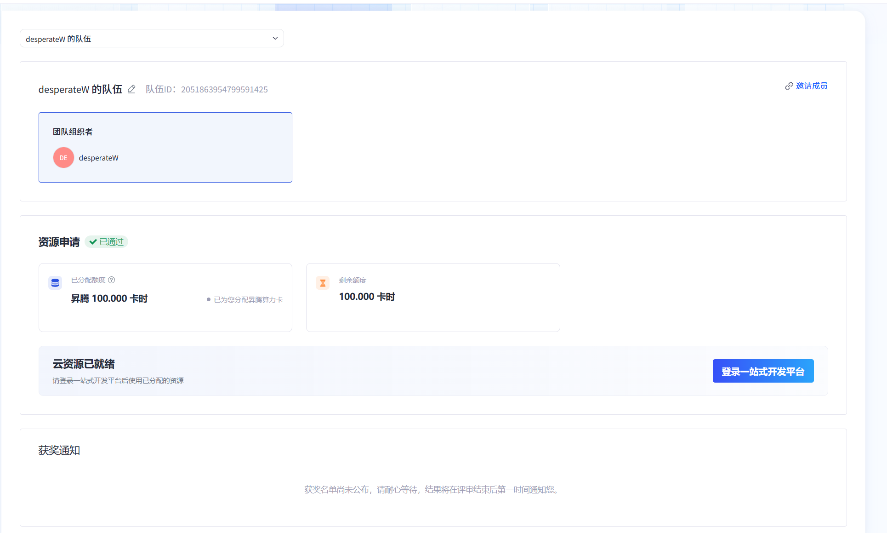
 
（2）点击 **创建** 创建赛事资源环境。
 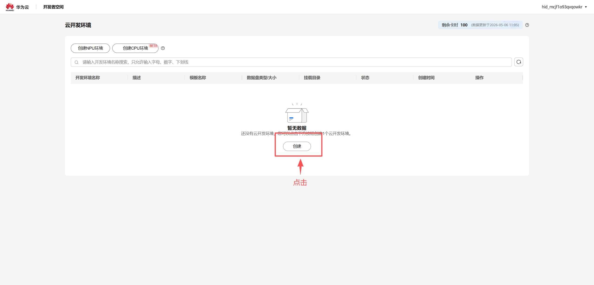
 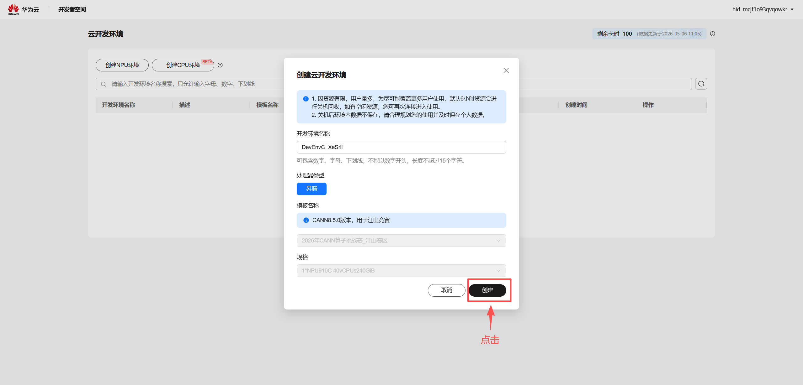
 
 （3）点击 **开机**启动机器，等待机器完成启动，点击**连接**，选择web IDE或者VS Code（需要提前安装）访问资源环境。
  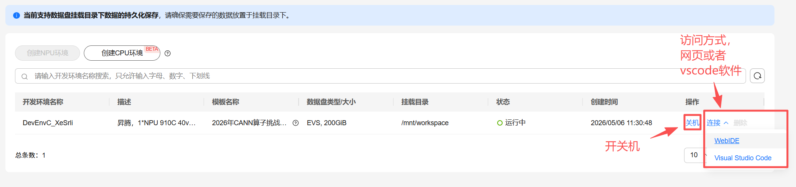
  
  （4）使用Web IDE访问时，可以通过左侧资源管理器将下载的算子工程代码拖拽至框中完成上传，在终端中输入命令进行算子编译部署。
   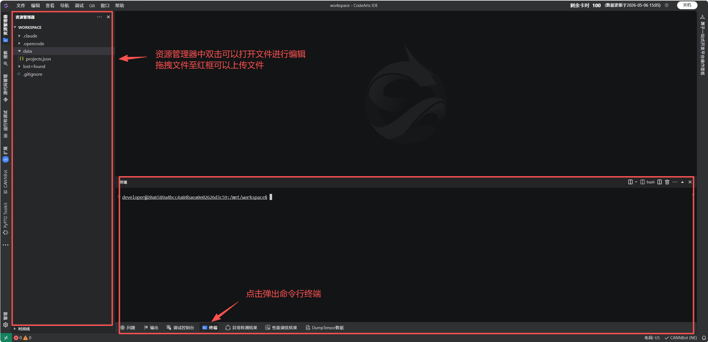
## 赛事规则
- 比赛算子题目设置了多个测试用例，所有测试用例全部通过才会计分
- 每个测试用例单独计分，逻辑如下（T为最优性能，t为当前提交性能）：
  $\frac{100}{1+\log_{1.5}\left(\frac{t}{T}\right)}$
- 最终得分为所有测试用例均分。若不同团队得分一致，以提交时间先后决定排名高低
- 得分为0的团队无法获得奖品