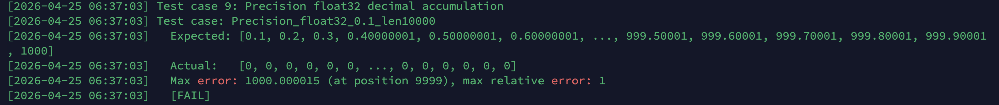
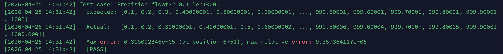

------

# ===== 元信息（请如实填写，此区块将由组委会脚本自动解析，请保持字段名不变）=====

team_name: "WISE小队"

team_members:

- "成员1：黄丽丽-天津大学"
- "成员2：肖子博-天津大学"
- "成员3：韩坤书-天津大学"

operator_name: "Cumsum"

operator_library: "cann-ops-math"

report_date: "2026-04-25"

------

# Cumsum 算子测试报告

## 一、算子理解

Cumsum 算子的数学定义为沿指定维度做前缀累加。对某个轴上的输入序列 `x[0], x[1], ..., x[n-1]`，标准模式输出为：

`y[i] = x[0] + x[1] + ... + x[i]`

`aclnnCumsumV2` 在标准语义上增加了两个控制参数：

- `exclusive=true`：当前位置不包含当前元素，等价于输出前缀和右移一位，首元素为 0。
- `reverse=true`：从后向前累加，输出变为后缀和。

Cumsum 与 Add 的根本差异在于：Add 是逐元素独立计算，误差不会跨元素传播；而 Cumsum 的第 `i` 个输出依赖前 `i+1` 个输入，因此每一次浮点舍入误差都会继续进入后续计算。也正因为这个性质，Cumsum 特别适合考察以下问题：

- 长序列误差累积
- 大小数混合时的小量吞没
- 正负抵消后的残差丢失
- 累加顺序改变带来的方向敏感误差
- 不同 dtype 的 ULP 台阶效应

从实现结构看，Cumsum 采用 `op_api -> op_host -> op_kernel` 三层架构：

- `op_api`：参数校验、dtype 检查、axis 归一化、V1/V2 路由、Cast 与连续化处理
- `op_host`：shape 与 tiling 逻辑，决定分核、分块与调度策略
- `op_kernel`：在设备侧执行真正的前缀累加

因此测试设计不能只停留在“功能正确”，还要同时覆盖 API 入口校验、Host tiling 分支和数值稳定性。

## 二、测试策略与用例设计

本次测试代码将用例分成四大类：基础功能、精度测试、覆盖率导向的 API/tiling 探针、异常与边界输入。代码的组织方式不是简单堆用例，而是先抽象出统一的执行框架，再围绕不同目标设计不同测试输入。

### 2.1 期望值计算

基础功能与语义验证使用模板参考实现 `CumsumRef<T>` 计算期望结果；精度测试则统一将输入先量化到目标 dtype，再解码为 `double`，最后调用 `CumsumRef<double>` 计算 CPU 参考结果。

这样做有两个关键原因：

- **保证基准一致**：NPU 真正接收到的不是数学字面量，而是已经量化后的 `float/float16/bfloat16/int32/...`。如果 CPU 参考直接对 double 字面量做运算，会把“输入量化误差”和“设备计算误差”混在一起。
- **提升参考精度**：Cumsum 的误差是逐步累积的，CPU 参考必须比被测 dtype 更高精度，才能作为可信的 Oracle。

代码中这一流程主要由以下部分完成：

- `EncodeVector<T>` / `EncodeBf16Vector`：把 double 测试输入量化为目标 dtype 的位模式
- `DecodeVector<T>` / `DecodeBf16Vector`：把量化后的输入解码回 double
- `CumsumRef<double>`：在 double 精度下计算期望输出

对于 FP16/BF16，测试代码还显式实现了 `FloatToFp16`、`Fp16ToFloat`、`FloatToBf16`、`Bf16ToFloat`，避免把 `uint16_t` 位模式误当整数参与比较。这部分处理的核心思想就是：**Oracle 本身必须正确处理低精度 dtype 的底层表示**。

### 2.2 Oracle

基础功能测试使用 `RunCumsumCase` / `RunCumsumV2Case`，通过 `CheckVectorClose` 做逐元素比较，主要用于确认功能路径和语义路径是否正确。

精度测试使用 `RunPrecisionCumsumCase` 统一驱动，比较逻辑分三步：

1. `CalcError(actual, expected)` 计算：
   - 最大绝对误差 `maxAbsError`
   - 最大相对误差 `maxRelError`
   - 最大误差所在位置 `maxErrorIndex`
2. `CompareWithTolerance(...)` 按组合容差判定 PASS/FAIL：
   - 浮点：`|actual - expected| <= atol + rtol * |expected|`
   - 整数：要求精确相等
3. `PrintCaseResult(...)` 打印完整信息

这种设计比只打印结果更有价值，因为它能同时回答三个问题：

- 误差有没有超过阈值
- 最大误差有多大
- 最大误差出现在序列的哪个位置

### 2.3 输出结果打印

精度用例的输出格式是本次测试设计的一个重点。`PrintCaseResult` 会统一打印：

- `Test case: <name>`
- `Expected: [...]`
- `Actual: [...]`
- `Max error: <值> (at position <idx>), max relative error: <值>`
- 可选 `Note`
- `[PASS] / [FAIL]`

其中，`PreviewVector` 会对长向量做首尾截断显示，避免输出过长，同时保留头部和尾部的关键趋势信息。这使得测试结果既适合人工阅读，也适合在报告中引用。

### 2.4 覆盖率提升设计维度

当前测试代码不是单一维度加样例，而是围绕覆盖率有意识地做了分层设计。根据 `main()` 中的用例组织，主要覆盖了以下维度：

**1. 数据类型维度**

- 基础与精度实测覆盖：`FLOAT32`、`FLOAT16`、`BF16`、`INT32`、`INT64`
- workspace/参数探针覆盖：`INT8`、`INT16`、`UINT8`、`UINT16`、`UINT32`、`UINT64`、`DOUBLE`、`COMPLEX64`、`COMPLEX128`、`BOOL`

**2. 维度参数维度**

- 标准轴：`dim=0`、`dim=1`
- 负轴：`dim=-1`、`dim=-2`
- 0 维 tensor 特殊情形：`shape={}`
- 越界 axis：`dim=2` on rank-2

**3. API 变体维度**

- `aclnnCumsum`
- `aclnnCumsumV2`
- V2 四种属性组合：
  - `(exclusive=false, reverse=false)`
  - `(true, false)`
  - `(false, true)`
  - `(true, true)`

**4. shape / 序列规模维度**

- 小 shape：`{2,2}`、`{2,3}`
- 中长序列：`{1,2048}`、`{4096}`、`{8192}`、`{10000}`
- 大 shape / tiling 探针：如 `{12800,512}`、`{64,32,4096}`、`{1,300000,16}`
- 空 tensor：`{2,0}`
- 超过 8 维非法 shape：10D

**5. 数值分布维度**

- 全 1 / 规律整数
- 非精确十进制小数：`0.1`、`0.2`、`0.01`
- 大小数混合：`1e8 + 1e-6`
- 正负抵消：`1e4` 与 `-1e4 + 1e-3`
- 近 1 微差：`1 +/- 1e-6`、`1 +/- 1e-3`
- 次正规数：`1e-40`
- 上溢输入：`1e38`、`4000` repeated
- ULP 平台化场景：`2^24`、`2048`、`256`

**6. 参数校验与异常输入维度**

- `self == nullptr`
- `out == nullptr`
- `shape mismatch`
- `dtype mismatch`
- `BOOL` 不支持
- `rank > 8`
- V2 输入输出 dtype 不一致

**7. Host tiling / op_api 分支维度**

- float tiling
- int tiling
- negative axis 归一化路径
- cube path probe
- internal pipeline / memory pressure probe
- `IsAiCoreSupport` 分支探针
- V2 out dtype 支持表探针

### 2.5 精度测试维度

与提升覆盖率不同，精度测试更关注数值机制。当前代码中的精度用例覆盖了以下维度：

**1. dtype 维度**

- FP32：主力精度分析对象
- FP16：观察更快的误差积累和更粗的 ULP 网格
- BF16：观察动态范围大但尾数精度差的特点
- INT32 / INT64：精确比较与溢出回绕

**2. 序列长度维度**

- 短序列：`4`、`17`
- 中序列：`96`、`192`、`256`、`512`
- 长序列：`2048`、`4096`、`8192`、`10000`

**3. 数值机制维度**

- 十进制不可精确表示：`0.1`、`0.2`、`0.01`
- 小量吞没：`[1e8, 1e-6]`
- 抵消效应：`[1e4, -1e4 + 1e-3]`
- 次正规区累加：`1e-40`
- 上溢为 `inf`
- ULP 平台效应：`2^24`、`2048`、`256`
- 顺序敏感性：相同多重集合、不同顺序
- V2 属性对误差分布的影响：`exclusive`、`reverse`

**4. 语义模式维度**

- 标准前缀和
- `reverse` 后缀和
- `exclusive` 前缀右移
- `exclusive + reverse` 组合

**精度测试用例分布如下（Case 9~41）**

- 十进制累积：Case 9/19/20/11/25/36
- 量级悬殊与吞没：Case 10/22/31/38/40
- 微小差异（接近 1.0）：Case 21/24
- ULP 台阶/顺序敏感：Case 32/33/34/37/41
- 次正规/溢出：Case 29/30/35
- V2 属性影响：Case 16/17/18/26/27/28/40/41
- 整数精度与溢出语义：Case 13/14/39

## 三、覆盖率分析

### 3.1 综合覆盖率

| 指标 | Hit | Total | Coverage |
| --- | ---: | ---: | ---: |
| Lines | 1031 | 1128 | 91.4% |
| Functions | 85 | 92 | 92.4% |
| Branches | 687 | 1591 | 43.2% |

行覆盖率和函数覆盖率都在 90% 以上，说明主流程、辅助函数和大部分逻辑块都已经被实际执行；但分支覆盖率只有 43.2%，说明虽然代码“跑到了”，很多条件分支的真假两侧仍未被完全展开，这也是 CANN 算子测试里非常常见的现象。

### 3.2 分目录覆盖率

| 目录 | 行覆盖率 | 函数覆盖率 | 分支覆盖率 |
| --- | ---: | ---: | ---: |
| `op_api` | 90.3% (149/165) | 100.0% (20/20) | 37.0% (279/754) |
| `op_host/arch35` | 91.6% (882/963) | 90.3% (65/72) | 48.7% (408/837) |

可以看出：

- `op_api` 的函数覆盖率已经做到 100%，说明 API 层主要入口函数都至少被触发过一次。
- `op_api` 的分支覆盖率只有 37.0%，说明参数校验、平台判断、dtype 支持表、内部资源失败路径等“真假分叉”仍然很多没完全展开。
- `op_host/arch35` 的行覆盖率和函数覆盖率都很高，说明这次测试在 Host tiling 层投入了大量定向用例；分支覆盖率 48.7% 虽然仍低，但明显优于 `op_api`，说明很多 tiling 决策路径已经被专门探测。

### 3.3 分文件覆盖率

| 文件 | 行覆盖率 | 函数覆盖率 | 分支覆盖率 | 说明 |
| --- | ---: | ---: | ---: | --- |
| `op_api/aclnn_cumsum.cpp` | 92.3% (120/130) | 100.0% (14/14) | 36.5% (244/668) | API 层参数校验、V1/V2 路由、Cast/Contiguous、Cube 分支 |
| `op_api/cumsum.cpp` | 82.9% (29/35) | 100.0% (6/6) | 40.7% (35/86) | AiCore/AiCpu 路由、AllocTensor 及 kernel 调度 |
| `op_host/arch35/cumsum_tiling.cpp` | 100.0% (30/30) | 100.0% (4/4) | 40.8% (31/76) | tiling 公共逻辑 |
| `op_host/arch35/cumsum_tiling_ascendc_arch35.cpp` | 91.8% (628/684) | 90.2% (46/51) | 52.9% (212/401) | 浮点 dtype tiling 逻辑 |
| `op_host/arch35/cumsum_tiling_ascendc_int_arch35.cpp` | 90.0% (224/249) | 88.2% (15/17) | 45.8% (165/360) | 整数 dtype tiling 逻辑 |

## 四、精度分析

### 4.1 误差度量方式

本次精度测试不是只看 `[PASS]` 或 `[FAIL]`，而是统一打印并分析以下信息：

- `Expected`
- `Actual`
- `Max error`
- `at position`
- `max relative error`

误差判定采用组合容差：

`|actual - expected| <= atol + rtol * |expected|`

这套判定与 `Mul` 报告中的思路一致，但在 Cumsum 上更重要，因为 Cumsum 的误差会沿前缀不断传播。单看最终一个点往往不够，需要同时知道误差在什么位置开始放大、在哪个位置达到最大。

当前代码中，期望值的计算流程是：

1. 先把输入量化到目标 dtype；
2. 再将量化后的值解码为 `double`；
3. 最后用 `CumsumRef<double>` 计算 CPU 参考结果。

这样做的目的，是让 CPU 参考和 NPU 实际输入使用同一组“已经量化过的值”。否则如果直接拿十进制字面量做 double 参考，会把“输入量化误差”和“设备执行误差”混在一起，比较基准就不干净。

实际结果与期望结果的对比则由统一框架完成：逐元素比较、记录最大绝对误差、最大相对误差，以及最大误差的位置。输出时同时打印 `Expected` 和 `Actual` 的预览片段，因此日志本身就可以直接写进报告。

### 4.2 代表性精度 case 分析

下面对测试用例中最有代表性的 case 展开分析。

**1. 长序列十进制小数累加：`Precision_float32_0.1_len10000`**

这是 Cumsum 最基础也最典型的精度场景。测试输入为长度 10000 的 `0.1f`，日志中可见：

- `Expected: [0.1, 0.2, 0.3, 0.40000001, ..., 1000]`
- `Actual:   [0.1, 0.2, 0.30000001, 0.40000001, ..., 1000.0001]`
- `Max error: 6.318092346e-05 (at position 6751)`
- `max relative error: 9.357364117e-08`

这个 case 说明两件事。第一，`0.1` 本身在二进制浮点里不能精确表示，因此从第一个元素开始就已经带有量化误差；第二，Cumsum 不是单次计算，这个微小误差会持续进入后续前缀和。结果上看，绝对误差随着长度增长逐步累积，到中后段达到 `6.3e-05`，但相对误差仍然维持在 `1e-7` 量级，说明 FP32 在这一场景下整体仍是稳定的，只是误差确实在按前缀传播。

同类现象在 `Precision_float32_0.2_len4096` 和 `Precision_float32_0.01_len8192` 中也出现了：

- `0.2 x 4096` 的最大误差为 `4.068017006e-05`
- `0.01 x 8192` 的最大误差为 `5.109235644e-06`

这三组 case 共同证明了一点：对于不能精确表示的十进制小数，Cumsum 的误差不是“随机跳一下”，而是会随着前缀长度稳定积累。

**2. 大小数混合：`Precision_float32_mixed_magnitude`**

这组 case 的目标是观察小量吞没。实测结果显示：

- `Max error: 5376.000244 (at position 1384)`
- `max relative error: 7.75757611e-08`

这里最大的特点是绝对误差很大，但相对误差较小。原因在于部分和已经增长到很大的量级，此时 FP32 的 ULP 也变大了，小量项无法再改变部分和，最终表现为小量贡献被系统性吞没。对 Cumsum 来说，这比 Mul 更值得关注，因为一旦某次前缀中把小量吞掉，后面的所有前缀都会继承这个损失。

**3. 近 1 小偏差：`Precision_float32_near_one_tiny_diff` 与 `Precision_float16_near_one_tiny_diff`**

这两组 case 用来观察“局部分辨率不够”时的表现。

- `Precision_float32_near_one_tiny_diff`  
  `Max error: 0.0001220703125 (at position 4095)`
- `Precision_float16_near_one_tiny_diff`  
  `Max error: 0.0009765625 (at position 2)`

FP32 在这个场景中误差很小，而且主要出现在长序列后段；FP16 则在序列很早的位置就出现明显误差。这和两者的尾数位数完全一致。FP16 的有效精度更低，因此一旦前缀和增长，细小差异会更早被量化到同一个可表示值上。

**4. FP16 长序列累加：`Precision_float16_0.1_len2048` 与 `Precision_float16_0.2_len2048`**

这两组是 FP16 精度分析里最有代表性的 case：

- `Precision_float16_0.1_len2048`  
  `Max error: 0.0625 (at position 1535)`  
  `max relative error: 0.000407000407`
- `Precision_float16_0.2_len2048`  
  `Max error: 0.125 (at position 1535)`  
  `max relative error: 0.000407000407`

它们反映出一个典型现象：随着部分和变大，FP16 的 ULP 网格也迅速变粗，前缀和开始出现明显的“台阶感”。从结果看，`0.2` 的误差比 `0.1` 更大，和输入尺度、累积长度都一致。这个测试用例直观体现“float16 的误差累积速度明显快于 float32”。

**5. BF16 十进制累加：`Precision_bf16_decimal_0.1`**

BF16 的动态范围与 FP32 接近，但尾数只有 7 位，这会导致十进制小数累加时误差更明显。实测结果为：

- `Max error: 0.1186523438 (at position 320)`
- `max relative error: 0.003692728516`

与前面的 FP32 和 FP16 对比可以看到，BF16 并不是“介于两者之间”的简单折中。它的优势在于范围大，不容易像 FP16 那样早早上溢；但在需要保留小数细节的前缀累加里，BF16 的尾数精度明显不够，因此误差出现得更早，增长也更快。

**6. ULP 平台效应：`Precision_float32_ulp_plateau_2pow24`、`Precision_float16_ulp_plateau_2048`、`Precision_bf16_ulp_plateau_256`**

这三组 case 是 Cumsum 区别于 Mul 的代表性场景。它们分别观察在不同 dtype 下，“加 1 是否还会改变前缀和”：

- `Precision_float32_ulp_plateau_2pow24`  
  `Max error: 2 (at position 2)`
- `Precision_float16_ulp_plateau_2048`  
  `Max error: 1 (at position 1)`
- `Precision_bf16_ulp_plateau_256`  
  `Max error: 1 (at position 1)`

这正对应了三种 dtype 的精度阈值差异。FP32 到 `2^24` 后，单位增量无法再逐点表示；FP16 和 BF16 的平台效应则更早出现。这类 case 非常适合说明 Cumsum 的一个核心特点：误差不仅和输入有关，还和“当前部分和走到了哪里”有关。

**7. 吞没后无法恢复：`Precision_float32_swallow_recovery`、`Precision_bf16_swallow_recovery`、`Precision_v2_reverse_swallow_recovery`**

这类 case 的思路是，先让一个小量在大部分和前被吞没，再观察后面大数抵消后，这个小量是否能“回来”。实测结果如下：

- `Precision_float32_swallow_recovery`  
  `Max error: 64 (at position 190)`
- `Precision_bf16_swallow_recovery`  
  `Max error: 1 (at position 1)`
- `Precision_v2_reverse_swallow_recovery`  
  `Max error: 64 (at position 0)`

这里最值得强调的是：一旦某一步前缀已经把小量丢掉，后面即使出现大数抵消，这个信息通常也恢复不回来。`reverse=true` 之后，误差出现的位置还会发生变化，这进一步说明 Cumsum 的精度不仅受数据分布影响，也受累加方向影响。

**8. 上溢与次正规数：`Precision_float32_subnormal_1e40`、`Precision_float32_overflow_1e38`、`Precision_float16_overflow_4000`**

- `Precision_float32_subnormal_1e40`  
  `Max error: 2.802596929e-45 (at position 470)`
- `Precision_float32_overflow_1e38`  
  `Max error: inf (at position 3)`
- `Precision_float16_overflow_4000`  
  `Max error: inf (at position 16)`

`subnormal` case 说明结果已经进入极小的次正规数区间，此时仍然能观察到非零误差，但量级极小；`overflow` case 则更直接，当前缀和超过 dtype 的可表示上界后，结果立即变为 `inf`。FP16 因为动态范围更小，会比 FP32 更早上溢。

**9. V2 模式下的精度差异：`exclusive` 与 `reverse`**

V2 不是单纯的功能扩展，它还会改变误差分布：

- `Precision_v2_exclusive_decimal_0.1`  
  `Max error: 2.059340477e-05 (at position 2564)`
- `Precision_v2_reverse_decimal_0.1`  
  `Max error: 2.034008503e-05 (at position 1362)`
- `Precision_v2_exclusive_reverse_scale_disparity`  
  `Max error: 0.0001000016928 (at position 1)`
- `Precision_v2_exclusive_plateau_2pow24`  
  `Max error: 1 (at position 2)`

这些结果说明，`exclusive` 会把误差整体向后平移，`reverse` 会把误差分布改写到序列另一端。也就是说，V2 的精度测试不能只靠 V1 的 case 平移一下就结束，必须单独验证。

### 4.3 存在精读误差用例汇总

下表汇总了本次实测中所有最大误差不为 0 的 case。

| 用例名 | 场景类别 | Max error | 位置 | Max relative error | 现象说明 |
| --- | --- | ---: | ---: | ---: | --- |
| `Precision_float32_0.1_len10000` | FP32 十进制长累加 | `6.318092346e-05` | 6751 | `9.357364117e-08` | 误差随前缀长度逐步积累 |
| `Precision_float32_0.2_len4096` | FP32 十进制长累加 | `4.068017006e-05` | 2733 | `7.439679856e-08` | 与 `0.1` 类似，属于稳定累积误差 |
| `Precision_float32_0.01_len8192` | FP32 十进制长累加 | `5.109235644e-06` | 7178 | `7.116918455e-08` | 小数本身不可精确表示，误差沿前缀传播 |
| `Precision_float16_0.1_len2048` | FP16 十进制长累加 | `0.0625` | 1535 | `0.000407000407` | 前缀和进入更粗的 ULP 网格 |
| `Precision_float16_0.2_len2048` | FP16 十进制长累加 | `0.125` | 1535 | `0.000407000407` | 同样是台阶化，只是幅度更大 |
| `Precision_bf16_decimal_0.1` | BF16 十进制长累加 | `0.1186523438` | 320 | `0.003692728516` | BF16 尾数较短，误差更早放大 |
| `Precision_float32_mixed_magnitude` | 大小数混合 | `5376.000244` | 1384 | `7.75757611e-08` | 小量贡献被大部分和吞没 |
| `Precision_float32_scale_disparity` | 量级悬殊 | `2048` | 4095 | `1` | 小量在极大部分和前几乎完全失效 |
| `Precision_v2_exclusive_reverse_scale_disparity` | V2 量级悬殊 | `0.0001000016928` | 1 | `1.000016928e-12` | V2 改变误差落点，但本质仍是小量吞没 |
| `Precision_float32_swallow_recovery` | 吞没后无法恢复 | `64` | 190 | `6.399995904e-07` | 小量一旦丢失，后续抵消无法补回 |
| `Precision_bf16_swallow_recovery` | BF16 吞没后无法恢复 | `1` | 1 | `0.003891050584` | BF16 更早出现该问题 |
| `Precision_v2_reverse_swallow_recovery` | V2 reverse 吞没恢复 | `64` | 0 | `1` | `reverse` 改变了误差聚集的位置 |
| `Precision_float32_near_one_tiny_diff` | 近 1 微差累加 | `0.0001220703125` | 4095 | `2.980232328e-08` | 长序列后段微差逐渐被量化抹平 |
| `Precision_float16_near_one_tiny_diff` | FP16 近 1 微差 | `0.0009765625` | 2 | `0.000325414904` | FP16 很早就失去微小分辨率 |
| `Precision_float32_ulp_plateau_2pow24` | FP32 ULP 平台 | `2` | 2 | `1.192092753e-07` | 到 `2^24` 后，加 1 不再逐点生效 |
| `Precision_float16_ulp_plateau_2048` | FP16 ULP 平台 | `1` | 1 | `0.0004880429478` | FP16 更早进入平台期 |
| `Precision_bf16_ulp_plateau_256` | BF16 ULP 平台 | `1` | 1 | `0.003891050584` | BF16 在更小量级上就出现平台 |
| `Precision_v2_exclusive_plateau_2pow24` | V2 exclusive 平台 | `1` | 2 | `5.960464122e-08` | `exclusive` 只改变误差落点，不改变本质 |
| `Precision_v2_exclusive_decimal_0.1` | V2 exclusive 十进制累加 | `2.059340477e-05` | 2564 | `8.031749011e-08` | 误差沿右移后的前缀结构传播 |
| `Precision_v2_reverse_decimal_0.1` | V2 reverse 十进制累加 | `2.034008503e-05` | 1362 | `7.439679856e-08` | 误差分布因反向累加而改变 |
| `Precision_float32_subnormal_1e40` | 次正规数累加 | `2.802596929e-45` | 470 | `2.802596929e-45` | 进入 subnormal 区间，误差极小但可观测 |
| `Precision_float32_overflow_1e38` | FP32 上溢 | `inf` | 3 | `inf` | 前缀和在第 4 个位置上溢 |
| `Precision_float16_overflow_4000` | FP16 上溢 | `inf` | 16 | `inf` | FP16 动态范围更小，更早上溢 |

从这些结果可以看出，本次测试中的非零误差主要集中在六类机制上：

- 十进制小数的输入量化误差
- 长序列前缀误差累积
- 大小数混合导致的小量吞没
- 吞没后信息无法恢复
- ULP 平台效应
- 次正规数和上溢边界

### 4.4 真实环境与docker环境计算结果不一致问题

在实际测试中，发现真实环境中计算结果会出现都是0的情况，但是在docker环境中计算结果正常。

- 下图为在真实环境中的计算结果，预期的计算结果应为[0.1, 0.2, 0.3, 0.4, ..., 1000]，但是实际返回结果全为0

- 下图为在预选赛的docker中的计算结果，预期的计算结果应为[0.1, 0.2, 0.3, 0.4, ..., 1000]，实际计算结果虽有一定精度误差，但是在合理范围内，是可预计的精度问题

