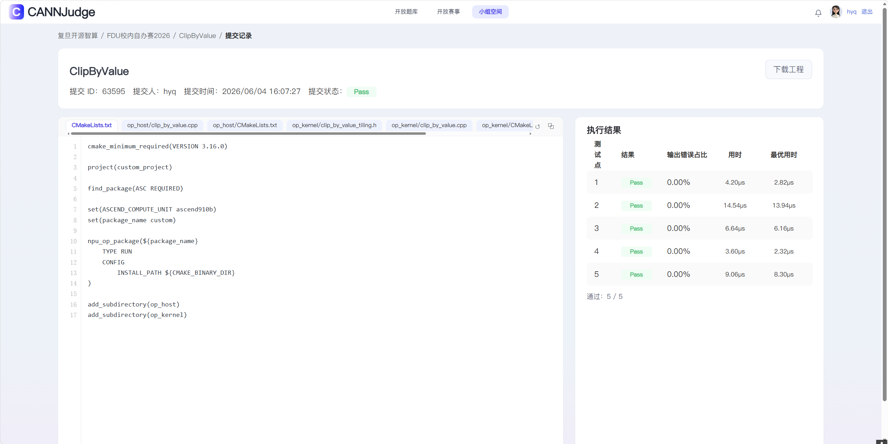
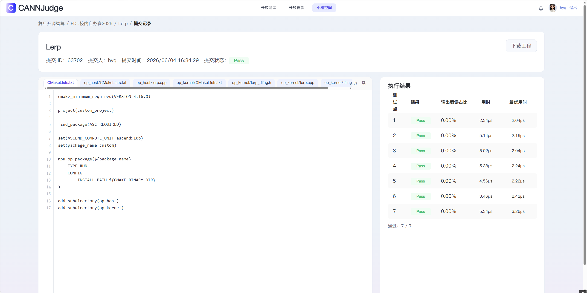

## 个人信息

- 姓名：[黄彧谦]
- 学号：[22300180166]
- 联系邮箱：[2636555321@qq.com]
- CANNJudge 账号：[hyq]

## CANNJudge 提交说明

比赛链接：https://cannjudge.cn/fdu-aiops/fdu-competition-2026
最终提交时间：2026-06-05 
三道题完成情况（附提交成功截图）：
- Addcmul: 未完成
- ClipByValue: 已完成（）
- Lerp: 已完成（请替换为截图，例如：）

## 算子实现简介

本次比赛在 Ascend CANN 8.5.0 环境下，基于 Ascend C 完成了 ClipByValue 和 Lerp 的开发与性能优化。

### 1. 实现思路
- **多类型支持与 Tiling 策略**：充分利用了 Ascend C 的 Tiling Key 模板机制，针对不同数据类型和数据量级设计了灵活的 Tiling 策略，确保算子在不同 shape 下均能高效切分数据。
- **核心计算逻辑**：
  - **ClipByValue**：利用比较和选择指令实现数值截断，避免了复杂的标量分支跳转。
  - **Lerp**：实现线性插值逻辑，通过矢量化的基础算术指令拼接完成高精度计算。

### 2. 性能优化方法
- **双缓冲机制 (Double-buffering)**：使用双缓冲技术，掩盖 Global Memory 到 Local Memory 的数据搬运延迟。
- **Tiling模板化**：使用该方法对不同数据类型进行处理。

### 3. 遇到的问题与解决
- **编译与环境调试**：在初期遇到了 CANN 编译环境配置和复杂的编译报错问题，通过仔细梳理 Host 侧与 Device 侧代码的协同与链接关系，最终顺利打通了编译、运行与精度比对的完整链路。
