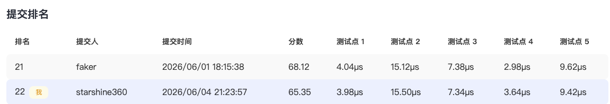
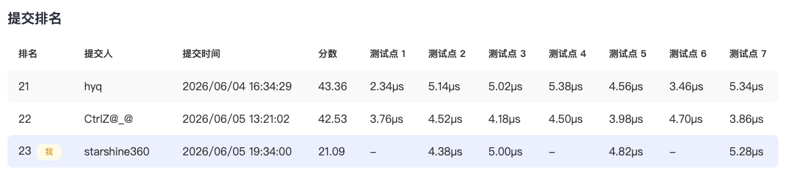

# CANN 算子开发校内赛（提交说明）

本文档用于简要描述此次 AscendC 算子开发赛的提交情况。

## 个人信息

- 姓名：车洋
- 学号：25213050108
- 邮箱：cy360124@163.com
- CANNJudge 账号：starshine360

## CANNJudge 提交说明

比赛链接：https://cannjudge.cn/fdu-aiops/fdu-competition-2026

最终提交时间：2026.06.05

本次比赛，共计三道题：`Addcmul`、`ClipByValue`、`Lerp`。因个人时间紧张，`Addcmul`最终未提交，后两题的提交情况如下所示。

第2题：ClipByValue

    

第3题：Lerp

    

## 算子实现简介

### 第2题 ClipByValue

简言之，首先参考 [Ascend C 算子开发教程](https://gitcode.com/cann/cann-learning-hub/tree/master/tutorials/ascendc_operator_development) 的“泛化 Tiling 设计”章节中内容，设计相应的 Tiling 策略，以适合任何合法的数据类型、数据形状。

其次，ClipByValue 要求支持 float, float16, int32 类型的数据。由于`AscendC::Maxs`和`AscendC::Maxs`要求输入的数值类型须相同。因此，我们需要进行数值类型转换。例如，对于 int32 数值类型，将其转换为 float，再进行数值裁剪。

### 第3题 Lerp

同样地，参考 [Ascend C 算子开发教程](https://gitcode.com/cann/cann-learning-hub/tree/master/tutorials/ascendc_operator_development) 的“泛化 Tiling 设计”章节中内容，设计相应的 Tiling 策略，以适合任何合法的数据类型、数据形状。

对于 Lerp 插值公式，我在实现时对计算公式做了如下转换。CANNJudge 的结果显示，存在部分 Wrong Answer。个人推测，是精度问题。因已过赛事截止时间，未验证原生公式是否存在精度问题。

$$
y = start + weight \times (end - start) = start \times (1 - weight) + end \times weight
$$

在实现上，先计算两个乘法操作的结果 $start \times (1 - weight)$ 和 $end \times weight$，并创建两个`TBuf`来暂存这两个乘积。最后，再执行加法得到最终结果。

