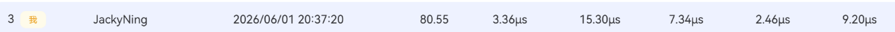
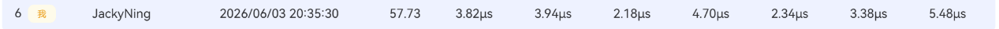

## 个人信息

- 姓名：高宁

- 学号：25303050027

- 联系邮箱：418348136@qq.com

- CANNJudge账号：JackyNing

## CANNJudge提交说明

比赛链接：https//cannjudge.cn/fdu-aiops/fdu-competition-2026

最终提交时间：2026年6月5日

三道题完成情况：

Addcmul:


ClipByValue:




Lerp:




## 算子实现简介：

### Addcmul Ascend C 算子实现简要说明

#### 1. 实现思路

本题实现 Addcmul 自定义算子，计算公式为：

```
y = input_data + x1 * x2 * value
```

算子支持 float16、float32、int8、int32 四种数据类型，输出类型与输入类型保持一致，并支持多维张量、非 32 对齐场景和 NumPy/PyTorch 风格广播语义。题目明确要求支持广播、非 32 对齐和四种 dtype，因此实现时不能只按同形状连续数组处理。

整体实现分为 host 侧 tiling 和 kernel 侧计算两部分。

Host 侧主要负责读取输入 shape、dtype 和平台信息，按照广播规则推导输出 shape，并计算每个输入相对于输出的广播 stride。随后根据输入访问方式划分为 LINEAR、SCALAR、SEGMENT、GENERIC 等模式，并将 length、tileLength、每核处理量、广播 stride 等信息写入 tiling 结构。

Kernel 侧根据 tiling 信息进行计算。对于同形状连续访问场景，使用 UB 分块搬运和向量计算；对于标量广播或部分安全广播场景，尽量在 UB 中构造连续局部块后计算；对于复杂广播、非 32 对齐尾部等情况，则走标量兜底路径，优先保证结果正确。

#### 2. 性能优化方法

本题最终已提交版本的核心优化思路是：常见场景走快路径，复杂场景走安全兜底路径。

首先，对同形状连续访问场景使用 UB 分块和向量算子计算，减少逐元素 GM 读写开销。计算流程为：从 GM 搬入 input_data、x1、x2，在 UB 中完成 Mul、Muls、Add，再写回输出。

其次，对广播场景不再盲目向量化。早期尝试过把更多广播模式直接当作连续内存处理，但部分广播输入在输出连续区间内并不对应连续物理内存，容易读错位置。因此提交版本只对确定安全的广播场景做优化，复杂广播仍然走通用正确路径。

第三，减少 kernel 初始化和尾部处理开销。代码中只有真正进入复杂 GENERIC 广播时才复制完整 shape/stride 数组；对于同形状连续的小尾块，直接使用线性下标计算，减少 offset 推导和分支判断。

第四，保守处理非 32 对齐场景。题目要求支持非 32 整倍数维度和非对齐内存场景，因此尾部数据不能强行使用普通连续向量搬运，而是使用安全路径处理，避免越界或错误读取。

#### 3. 遇到的问题

第一个问题是广播优化容易导致 Wrong Answer。部分广播场景看起来可以连续读取，但实际输入 offset 会周期性重复或跳变，不能简单 DataCopy 一整段。解决方式是严格区分快路径和兜底路径，只对确定连续、安全的场景做向量化。

第二个问题是部分理论优化实际收益不明显。例如双缓冲、减少开核、小 tensor 特化等方向在测试中没有稳定提升，甚至出现性能反退。后续根据测试点耗时反馈，回退低收益或反向优化，保留最终代码更稳定的策略。

第三个问题是公式级简化存在正确性风险。曾尝试在 value == 0 时直接退化为 y = input_data，但这类优化可能在浮点特殊值、整数边界或平台评测语义中产生差异，因此最终版本不做该类简化，始终按原公式计算。

第四个问题是 kernel 代码复杂度和性能之间需要平衡。过多特化分支虽然可能优化某些测试点，但也会增加编译风险、维护难度和分支开销。最终 v14 保留必要快路径，同时使用统一兜底路径覆盖复杂场景。

#### 4. 总结

最终提交版本采用“连续场景向量化 + 广播场景安全优化 + 复杂场景兜底”的整体方案，在保证 float16、float32、int8、int32 四种类型、广播语义和非 32 对齐场景正确性的基础上，对常见高频场景进行了性能优化。相比过度特化版本，提交版本的正确性和性能表现更稳定，因此作为最终提交版本。

### ClipByValue算子实现简要说明：

#### 1. 实现思路

本题要求基于 Ascend C 实现 ClipByValue 自定义算子，其功能与 torch.clamp 的核心语义一致：将输入张量 x 中的每个元素限制在 [min, max] 区间内。

可以等价写成：y = min(max(x, min), max)

本题支持的数据类型包括：

float16 / float32 / int32

输出张量 y 的形状和数据类型均与输入张量 x 保持一致。

##### Host 侧实现

Host 侧主要完成算子注册、shape 推导、dtype 推导和 tiling 参数计算。

实现内容包括：

1. 注册输入 x、输出 y 和属性 min/max。
2. 设置输入输出支持 float16、float32、int32。
3. 在 InferShape 中将输出 shape 设置为输入 shape。
4. 在 InferDataType 中将输出 dtype 设置为输入 dtype。
5. 在 TilingFunc 中获取输入元素总数、数据类型、AIV 核数、UB 大小和属性 min/max。
6. 计算每个 core 处理的元素数 perCoreElements 和每次分块处理的 tileLength。
7. 将 length、perCoreElements、tileLength、minValue、maxValue 写入 tiling 数据结构。
8. 设置 workspace 为 0。
##### Kernel 侧实现

Kernel 侧采用模板方式支持三种 dtype。

每个 core 根据 GetBlockIdx() 计算自己的处理区间：

```
start = blockIdx * perCoreElements
end = min(start + perCoreElements, length)
```

然后按 tileLength 分块处理数据。

主体计算流程为：

```
GM -> UB -> Maxs -> Mins -> GM
```

即：

1. 从 Global Memory 中读取一块输入数据到 UB；
2. 使用 Maxs 实现 max(x, min)；
3. 使用 Mins 实现 min(result, max)；
4. 将结果写回 Global Memory。
#### 2. 性能优化方法

本题是典型的逐元素 elementwise 算子，计算量较小，性能瓶颈主要在数据搬运。因此优化重点放在多核并行、UB 分块和向量化计算上。

##### 多核并行

输入张量中各元素之间没有依赖关系，因此可以将输入数据按连续区间切分给多个 AIV core 并行处理。

这种方式可以提高大规模输入场景下的吞吐能力。

##### UB 分块处理

由于 UB 容量有限，kernel 不一次性处理全部数据，而是按 tileLength 分块执行：

```
CopyIn -> Compute -> CopyOut
```

这样可以充分利用 UB 的高速访问能力，减少直接访问 GM 带来的开销。

##### 使用向量指令

朴素实现可以使用 if/else 逐元素判断，但这种方式不利于 NPU 向量化。

本实现将裁剪逻辑转换为：

```
y = min(max(x, min), max)
```

并使用 Maxs + Mins 两个向量指令完成主体计算，减少分支判断，提高向量计算效率。

##### 32B 对齐主体处理和尾块处理

主体数据按 32B 对齐长度走高效的 DataCopy + Maxs + Mins + DataCopy 路径。

对于最后不足 32B 的尾部数据，使用 GetValue/SetValue 标量方式单独处理，避免非对齐 DataCopy 可能导致的越界或结果错误。

##### workspace 为 0

本算子不需要额外全局临时空间，中间数据只在 UB 中暂存，因此 workspace 设置为 0，减少额外内存开销。

#### 3. 遇到的问题及解决方法

##### 输出 shape 和 dtype 推导问题

最初工程中的 shape 和 dtype 推导逻辑不完整。

解决方法是在 Host 侧补全：

```
yShape = xShape
yDtype = xDtype
```

保证输出张量与输入张量形状和类型一致。

##### min/max 是属性而不是输入 Tensor

min 和 max 是算子属性，kernel 侧不能直接读取 Host 侧变量。

解决方法是在 Host 侧读取属性值，并通过 tiling 数据结构传递到 kernel 侧。

##### 多数据类型支持问题

本题要求同时支持 float16、float32 和 int32。

解决方法是使用模板 kernel，并通过 tiling key 根据输入 dtype 选择对应实例，避免重复编写三套代码。

##### 尾块非对齐问题

输入元素数量不一定刚好满足 32B 对齐。

如果尾块直接使用普通 DataCopy，可能存在非对齐或越界风险。

解决方法是主体对齐部分使用向量化路径，尾部不足 32B 的数据使用标量路径单独处理。

##### float16 边界一致性问题

min/max 属性是 float 类型，但输入可能是 float16。

如果主体路径和尾块路径使用不同精度的边界值，可能导致边界结果不一致。

解决方法是在 kernel 初始化时将 min/max 统一转换为当前模板类型 DT_X，主体路径和尾块路径都使用相同类型的边界值。

#### 4. 总结

本实现围绕 torch.clamp 的核心语义，将 ClipByValue 转换为：

```
y = min(max(x, min), max)
```

Host 侧完成算子注册、shape/dtype 推导和 tiling 参数计算；Kernel 侧采用多核切分、UB 分块和 Maxs + Mins 向量指令完成计算，并通过标量尾块处理保证非对齐场景下的正确性。

最终版本已通过平台测试，满足题目对功能正确性、数据类型支持和输出一致性的要求。

### Lerp 自定义算子实现说明：

#### 1. 题目理解

本题要求基于 Ascend C 实现 Lerp 线性插值算子，计算公式为：

```
y = start + weight * (end - start)
```

其中：

- start：起始张量，支持 float16 和 float32
- end：结束张量，支持 float16 和 float32
- weight：float 类型标量属性
- y：输出张量，形状和数据类型与输入保持一致
题目要求 start 和 end 的形状完全相同，不涉及广播。

#### 2. 实现思路

#### 2.1 Host 侧实现

Host 侧主要负责算子注册、shape 推导、dtype 推导和 tiling 参数计算。

具体包括：

1. 检查输入数据类型，仅支持 float16 和 float32。
2. 检查 start 和 end 的数据类型一致。
3. 检查 start 和 end 的 shape 完全一致。
4. 设置输出 y 的 shape 和 dtype 与输入一致。
5. 读取属性 weight。
6. 根据输入元素数量、UB 大小、数据类型大小和 AI Core 数量计算 tiling 参数。
7. 将 length、perCoreElements、tileLength、mode 和 weight 传递给 kernel。
#### 2.2 Kernel 侧实现

Kernel 侧负责真正的数据计算。

整体流程为：

```
GM(start/end)
↓ DataCopy
UB(startLocal/endLocal)
↓ Vector 计算
UB(outLocal)
↓ DataCopy
GM(y)
```

普通情况下，kernel 按照公式执行：

```
out = end - start;
out = out * weight;
out = start + out;
```

对于尾部不足 32B 对齐的数据，使用标量方式处理，避免 DataCopy 越界或对齐问题。

#### 3. 性能优化方法

本版本在保证正确运行的基础上，主要做了以下优化。

#### 3.1 多核并行

Lerp 是逐元素计算算子，每个元素之间没有依赖关系，因此适合多核并行。

Host 侧根据输入总长度和 AI Core 数量计算每个 core 负责的元素范围：

```
begin = GetBlockIdx() * perCoreElements;
end = min(begin + perCoreElements, length);
```

不同 core 处理不同的数据区间，从而提高整体吞吐。

#### 3.2 UB 分块计算

由于 UB 空间有限，不能一次性处理全部输入数据，因此将每个 core 负责的数据继续切分成多个 tile。

每个 tile 执行：

```
GM -> UB
向量计算
UB -> GM
```

这样可以充分利用 UB 的高速访问能力，减少低效的逐元素 GM 访问。

#### 3.3 向量化计算

主干数据使用 Ascend C 向量接口完成计算，相比普通标量循环，向量化计算可以一次处理多个元素，提高执行效率。

#### 3.4 32B 对齐处理

Ascend C 的 DataCopy 对 32B 对齐比较敏感，因此本实现将数据分为：

主干部分：满足 32B 对齐，走 DataCopy + 向量计算

尾部部分：不足 32B 对齐，走标量兜底处理

这样既保证了主干数据的性能，又保证了任意长度输入的正确性。

#### 3.5 特殊权重快速路径

根据公式：

```
weight == 0 -> y = start
weight == 1 -> y = end
```

因此在 host 侧提前判断 weight，并通过 mode 传给 kernel。

kernel 侧对于这两种情况直接执行复制路径，避免不必要的减法、乘法和加法计算。

#### 3.6 稳定性优化

优先保证平台兼容性和稳定运行：

1. 不使用兼容风险较高的 Axpy 接口。
2. 保留稳定的 Sub + Muls + Add 计算路径。
3. 保留 VECOUT -> GM 的安全写回方式。
4. 适当增大 tileLength，减少大 shape 下的循环次数。
5. 对小 shape 做分核控制，避免启动过多 core 带来额外调度开销。
6. 代码按功能拆分，提升可读性和可维护性。
#### 4. 遇到的问题及解决方法

#### 4.1 尾部非对齐问题

当输入元素数量不是 32B 对齐时，如果直接使用 DataCopy 处理尾部数据，可能导致越界或错误。

解决方法是：

对齐主干部分使用 DataCopy 和向量计算；

非对齐尾部使用 GetValue / SetValue 标量处理。

这样既保证性能，也保证正确性。

#### 4.2 小数据量分核开销问题

如果输入数据量较小，但仍然启动过多 AI Core，可能会导致调度开销大于并行收益。

因此该代码在 host 侧增加了小 shape 分核控制，使小数据量使用较少 core，大数据量再使用更多 core。

#### 4.4 性能与稳定性的取舍

部分激进优化虽然理论性能更高，但会增加编译失败或运行失败风险。

最终提交版本选择了稳定性更高的方案，在保证正确通过的基础上进行低风险优化，包括多核并行、UB 分块、向量化计算、特殊权重快速路径和合理分核策略。

#### 5. 总结

本实现严格按照题目要求完成 Lerp 算子：

```
y = start + weight * (end - start)
```

在功能上，支持 float16 和 float32，保证输出 shape 和 dtype 与输入一致，并正确处理 weight=0、weight=1 和普通权重情况。

在性能上，采用多核并行、UB 分块、向量化计算、32B 对齐主干处理、尾部标量兜底和特殊权重快速路径等优化方法。

提交版本在保证正确运行的前提下，进一步提升了代码结构清晰度、运行稳定性和基础性能表现，适合作为最终提交版本。
