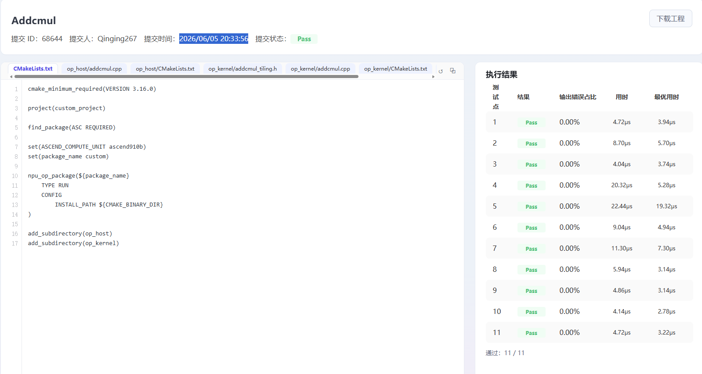
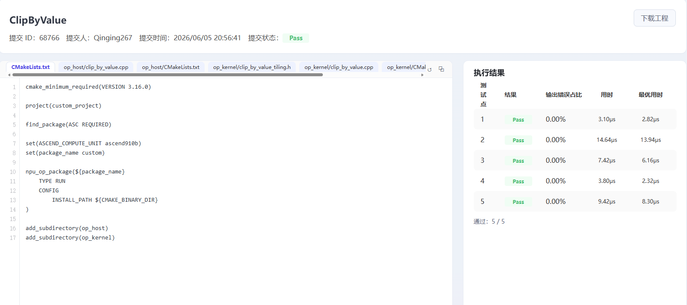
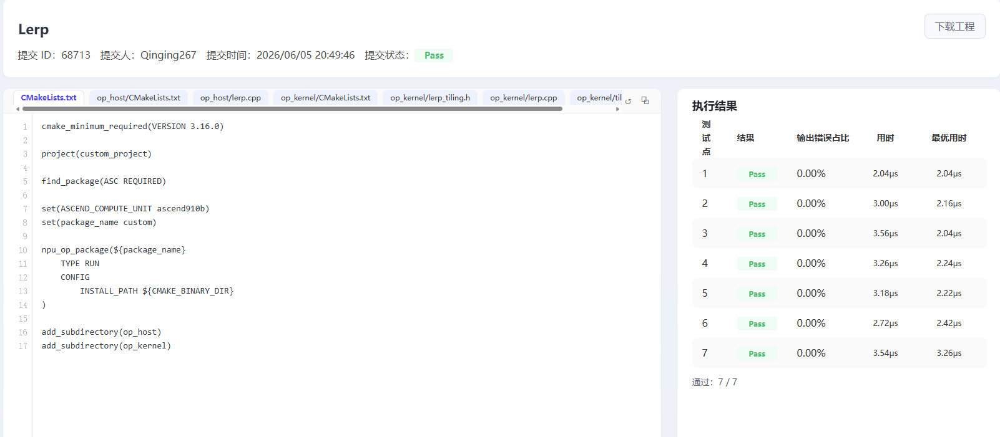

## 个人信息
- 姓名：吴佳祺
- 学号：25303050213
- 联系邮箱：2675334011@qq.com
- CANNJudge 账号：Qinging267
  

## CANNJudge 提交说明
比赛链接：https://cannjudge.cn/fdu-aiops/fdu-competition-2026 
最终提交时间： 2026/06/05 20:33:56
三道题完成情况（附提交成功截图）：

## 算子实现简介

### Addcmul（y = input + x1 * x2 * value）

**实现思路：**

Addcmul 是一个带广播的逐元素融合算子，支持 fp16/fp32/int32/int8 四种数据类型和 numpy 广播语义。整体设计分为两条路径：
- **快速路径（mode=0）**：当三个输入均为标量或与输出同形（无广播）时，各核按总元素数均匀切分连续区间，跳过 stride 地址计算，直接连续搬运。
- **广播路径（mode=1）**：存在非平凡广播时，将输出张量视为 outerSize × lastDim 的二维矩阵，通过逐维广播标记 + stride 机制实现自动广播寻址。

**性能优化方法：**
1. **UB 容量反推 tile**：不写死 tile 上限，根据 UB 容量和 dtype 反推最大 tile（利用率 0.98），tile 越大循环轮次越少，减少指令发射开销。int8 特殊处理，因向量引擎不支持 int8 算术，需切换到 float 中间计算，buffer 布局单独计算。
2. **双缓冲（depth=2）**：MTE 搬运下一个 tile 时 Vector 计算当前 tile，乒乓节奏隐藏 GM 延迟。
3. **自适应核数**：小张量按 GRAIN=2048 收缩核数，避免多核 barrier 同步开销超过计算本身。
4. **相邻同广播签名维度合并**：将广播标记 (fIn, fX1, fX2) 相同的相邻维度合并，减少外层循环层数，增大连续搬运段。
5. **编译期分支消去**：通过 `if constexpr` 按广播组合（8 种）在编译期生成最少向量指令路径；标量×向量指令（Muls/Adds）优先于向量×向量（Mul/Add），前者吞吐更高。
6. **int8 补码回绕**：int8 计算完 float 结果后通过 `wrapI8` 以 256 为模折叠到 [-128, 127]，模拟 int8 溢出语义。
7. **二级核分配**：广播路径下，行数多于核数时分整行（连续搬），行数少于核数时行内切 inner（细粒度并行）。

**遇到的问题：**
- int8 数据类型下 AscendC 向量引擎无 int8 算术指令，需两级 Cast（int8→half→float）中转，且 float 计算结果可能超出 int8 范围，需手动实现补码回绕逻辑。
- 广播路径的 stride 计算需要逐个输入独立推导，且需处理多维坐标到线性地址的映射，调试时容易出错。
- 多核 barrier 同步在小张量场景下开销显著，需要通过 GRAIN 粒度自适应收缩核数。

---

### ClipByValue（y = clamp(x, min, max)）

**实现思路：**

ClipByValue 是逐元素裁剪算子，支持 fp16/fp32/int32 三种数据类型。由于是纯逐元素操作（无广播、无跨元素依赖），实现相对简洁：Host 端按 UB 容量计算 tile 粒度，按数据量自适应决定启核数；Kernel 端采用经典 DoubleBuffer 乒乓流水模式，对齐数据走 DataCopy 快速路径，未对齐尾部走 DataCopyPad 兜底。

**性能优化方法：**
1. **大 tile 策略**：tile 直接拉到 UB/4 上限（DoubleBuffer 双队列各双缓冲 = 4 块常驻 UB），大 tile → 少 DMA 次数 → 高带宽利用率。
2. **自适应核数**：每核至少分 16KB 数据（实验最优值），数据量不足时自动降核避免同步开销。
3. **极速路径**：单核且单 tile 能兜住全部数据时走 fastPath，跳过分核逻辑、对齐判断等所有额外开销，直接一轮 CopyIn → Compute → CopyOut。
4. **32B 对齐搬运**：对齐数据走 DataCopy 快速路径，非对齐尾巴走 DataCopyPad；核间切分也以 32B 对齐粒度为单位，保证各核起始地址对齐。
5. **int32 整型裁剪**：int32 直接在整型域用 Maxs/Mins 裁剪，避免经 float 转换导致 |x| > 2^24 时精度丢失。
6. **循环零分支**：满 tile 先跑 n-1 个，最后单独处理尾巴，循环体内无分支判断。

**遇到的问题：**
- int32 的 min/max 属性是 float 类型，需要做 float→int32 截断转换，需注意向零截断语义。
- 多核切分时各核 offset 必须 32B 对齐，否则 DataCopy 会因非对齐地址降速；需仔细处理上取整和边界截断。

---

### Lerp（y = start + weight * (end - start)）

**实现思路：**

Lerp 是逐元素线性插值算子，支持 fp16/fp32，weight 为标量属性。采用固定深度预取（prefetch）的软件流水模式：先连续发射 BUFFER_NUM=2 笔 CopyIn 填满流水线，进入稳态后每完成一对 Compute+CopyOut 就补一发 CopyIn，MTE2 与 Vector overlap 执行，用计算延迟掩盖片外访存延迟。

**性能优化方法：**
1. **软件流水预取**：通过固定深度预取实现 MTE2 与 Vector 的流水线重叠，CopyIn 和 Compute 乒乓交替，隐藏 GM 访问延迟。
2. **32B 对齐 chunk 分配**：核间以 32B 对齐 chunk 为粒度分发，remainder 个核多领 1 个 chunk，保证各核负载最多差 1 个 chunk，负载均衡且对齐搬运。
3. **双缓冲队列**：start/end/y 三组各开双缓冲队列（共 6 个 slot），MTE2 与 Vector 各持一个 slot 乒乓切换。
4. **对齐快速路径**：搬运字节数对齐 32B 时走 DataCopy，未对齐走 DataCopyPad 兜底。
5. **自适应核数**：block 总数少于核数时自动降核，避免空跑。

**遇到的问题：**
- 精度校验要求 1e-3 相对容差，运算顺序必须严格保持 `y = start + weight * (end - start)`，等价公式 `y = (1-w)*start + w*end` 在 fp16 下因舍入路径不同会产生超差元素。
- 预取深度需自适应：数据量不足 2 个 tile 时预取深度降为实际 tile 数，否则死等不存在的 tile。
- tile 大小需向下取整到 32B 对齐粒度的整数倍，否则每次搬运都是非对齐路径，性能严重退化。
