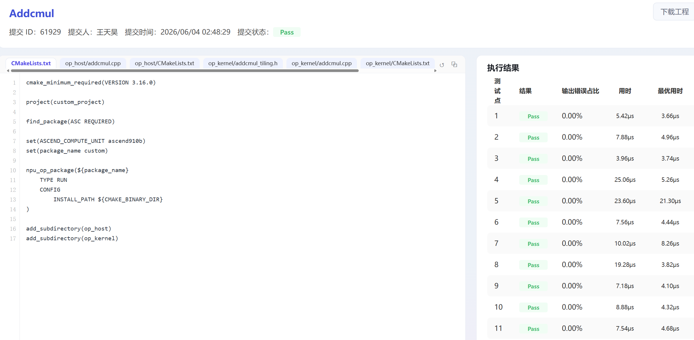
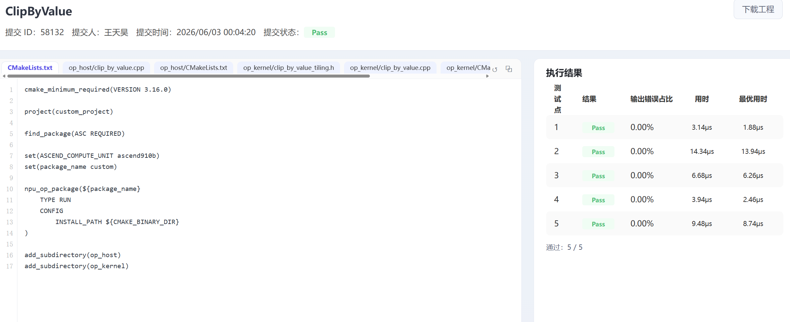
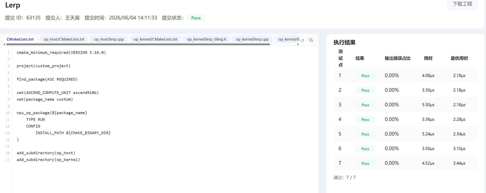

## 个人信息
- 姓名：王天昊
- 学号：25303050223
- 联系邮箱：25303050223@m.fudan.edu.cn
- CANNJudge账号：王天昊

## CANNJudge提交说明
比赛链接：https://cannjudge.cn/fdu-aiops/fdu-competition-2026
最终提交时间：2026/06/04 14:11:33
三道题完成情况（附提交成功截图）：
Addcmul：完成  
  
ClipByValue：完成  
  
Lerp：完成  
  
## 算子实现简介
1. Addcmul  
    - 实现思路：  
        1. Host侧：注册input_data,x1,x2,value,y;推导shape（根据输入，先右对齐，再决定是否可以进行广播）和dtype(输入输出相同)；计算多核切分所需的参数，并填充tiling以让Kernel侧获取所需数据  
        2. Kernel侧：编写KernelAddcmul类与辅助函数，根据输入类型（scalar or not）用不同方法将数据按tile从GM拷贝到UB，按y = input_data + x1 * x2 * value计算出结果，写回GM
    - 性能优化方法：  
        1. 在三个输入shape相同时跳过复杂坐标反解运算，减少计算开销
        2. 根据根据输入长度和硬件核心数，动态设置 coreNum，大数据使用多核，小数据保持单核
        3. 将对齐数据和尾块非对齐数据分开处理(DataCopy/DataCopyPad)
        4. Host侧根据输入的数据类型改成按32B粒度对齐
        5. 广播场景下尽量把尾部连续维度合并成一段 fast 区间，减少offset计算次数
    - 遇到的问题
        1. 最初测试点始终有少量无法通过，猜想为精度问题，通过对float16分步half舍入解决测试点1的问题
        2. int8类型的计算容易溢出，原本采用取边界值的处理，测试出现错误，后改为回绕  
    

2. ClipByValue
    - 实现思路：  
        1. HOST侧：注册x,y,min,max;推导shape和dtype(输入输出相同)；计算多核切分所需的参数，并填充tiling以让Kernel侧获取所需数据  
        2. Kernel侧：编写KernelClipByValue类，获取数据按tile将数据从GM拷贝到UB，按y=MIN(max, MAX(x, min))计算出结果，写回GM  
    - 性能优化方法：  
        1. 根据根据输入长度和硬件核心数，动态设置 coreNum，大数据使用多核，小数据保持单核  
        2. 尝试适当增大tile大小，最终调整为8192  
        3. 将对齐数据和尾块非对齐数据分开处理(DataCopy/DataCopyPad)  
    - 遇到的问题：
        1. 尾块非32字节对齐导致问题。编写DataCopyPad专门处理解决  
        2. 对小数据的处理相对较慢。通过新建让单核处理小数据的新分支解决  

3. Lerp
    - 实现思路：
        1. host侧：注册start,weight,end,y;推导shape和dtype(输入输出相同)；计算多核切分所需的参数，并填充tiling以让Kernel侧获取所需数据  
        2. 编写KernelLerp类，获取数据按tile将数据从GM拷贝到UB,按y=start+weight*(end-start)计算出结果，写回GM  
    - 性能优化方法:   
        1. 根据根据输入长度和硬件核心数，动态设置 coreNum，大数据使用多核，小数据保持单核  
        2. 尝试适当增大tile大小，最终调整为8192  
        3. 将对齐数据和尾块非对齐数据分开处理(DataCopy/DataCopyPad)  
        4. Host侧根据输入的数据类型改成按32B粒度对齐  
    - 遇到的问题：
        1. 尝试变形公式简化计算，似乎会导致精度问题出现WrongAnswer，最终保留了原始公式