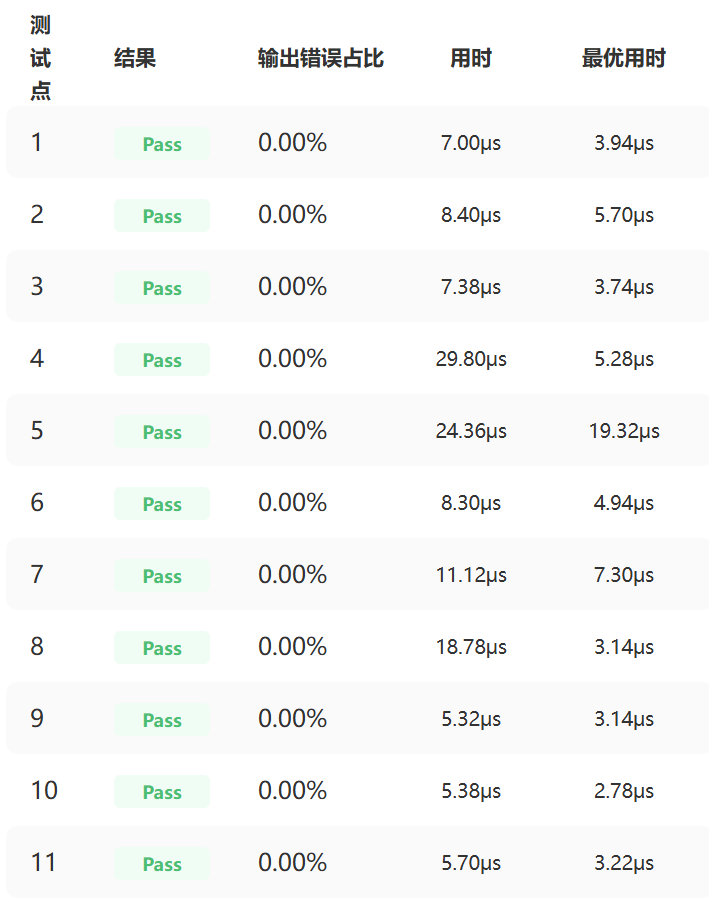
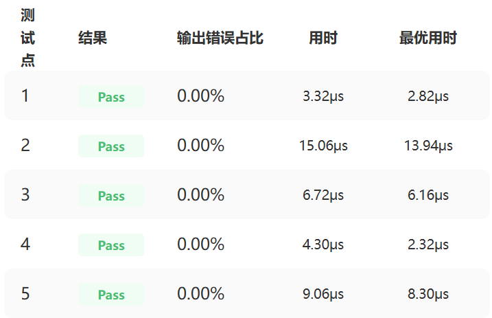
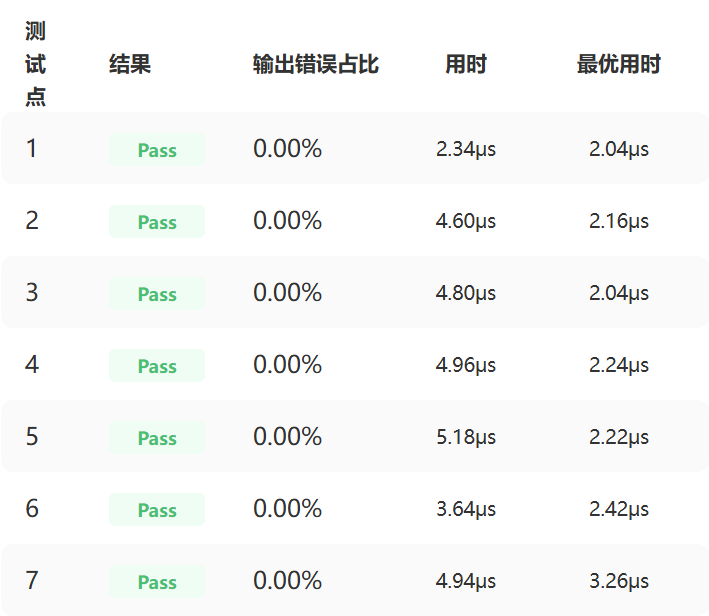

## 个人信息
- 姓名：周佳宜
- 学号：25303050269
- 联系邮箱：25303050269@m.fudan.edu.cn
- CANNJudge 账号：Janezhou

## CANNJudge 提交说明
比赛链接: https://cannjudge.cn/fdu-aiops/fdu-competition-2026  
最终提交时间：2026/06/05 20:52:22
三道题完成情况：
- Addcmul：
- ClipByValue：
- Lerp：

## 算子实现简介
基于 Ascend C 原生开发，以下为各算子实现思路与优化方法概览：

### 1. Addcmul
- **功能**：执行 `input_data + value * (x1 * x2)` 的逐元素计算。
- **实现思路**：
  - Kernel 层使用向量化计算（VEC）对齐 32B 数据。
  - 支持广播语义，非对齐维度通过尾部处理保证正确性。
  - 使用 double buffer，流水线执行数据搬运与计算。
- **优化策略**：
  - 动态 tiling，根据每核处理能力和 UB 大小计算 tileSize。
  - 数据块对齐 32B，减少内存访问冲突。
  - 核间负载均衡，尾部数据单核处理。
  - Double buffer 减少数据搬运等待。

### 2. ClipByValue
- **功能**：将输入张量裁剪到 [min, max] 区间。
- **实现思路**：
  - Kernel 层先按 alignNum 对齐计算，vector 数据使用 Maxs/Mins API。
  - 对尾部数据进行 ProcessTail，保证非对齐元素正确裁剪。
- **优化策略**：
  - 动态 tiling，根据 UB 和 tileNum 自动计算每次计算长度。
  - Double buffer 流水线搬运与计算。
  - 小 shape 保护：当张量元素较少时避免启动过多核，保证性能。
  - 数据块 32B 对齐，保证向量化效率。

### 3. Lerp
- **功能**：执行 start + weight * (end - start) 的逐元素线性插值。
- **实现思路**：
  - Kernel 层使用 tmp buffer 临时存储 end-start 乘权重的结果。
  - Tail 部分单核处理非对齐元素。
  - 支持 float16/float32 类型。
- **优化策略**：
  - 动态 tiling，计算 tileLength 与 tileNum。
  - Double buffer 流水线执行数据搬运与计算。
  - 数据块 32B 对齐，保证向量化计算效率。
  - 核间负载均衡，尾部单核处理非对齐数据。
  - weight = 0 / 1 专用快捷路径，直接拷贝输入得到输出
