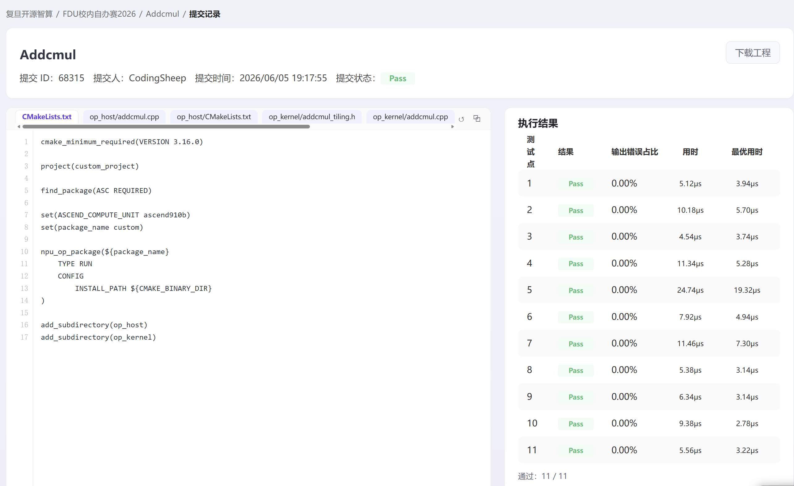
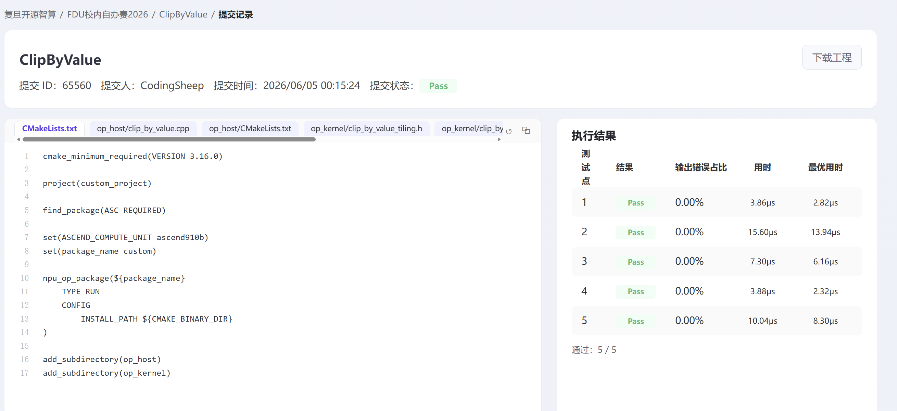
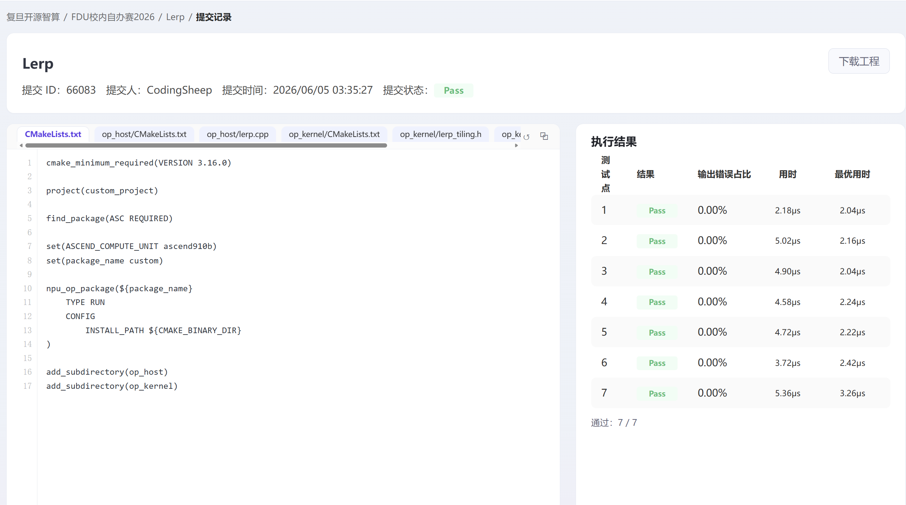

## 个人信息

- 姓名：杨礼嫣
- 学号：25303050294
- 联系邮箱：25303050294@m.fudan.edu.cn
- CANNJudge 账号：CodingSheep

## CANNJudge 提交说明

- 比赛链接：https://cannjudge.cn/fdu-aiops/fdu-competition-2026
- 最终提交时间：5/6 19:41
- 三道题完成情况（附提交成功截图）：

  **Addcmul**（提交 ID 68315，得分 46.09）

  排行榜：

  

  提交记录（11/11 通过）：

  

  **ClipByValue**（提交 ID 65560，得分 63.45）

  排行榜：

  

  提交记录（5/5 通过）：

  

  **Lerp**（提交 ID 66083，得分 49.63）

  排行榜：

  

  提交记录（7/7 通过）：

  

## 算子实现简介

三道题均采用 Ascend C 自定义算子工程（`op_host` + `op_kernel`），目标硬件为 `ascend910b`。各算子 `code/` 目录下执行 `bash build.sh` 可完成编译与打包。

### Addcmul

**功能**：`y = input_data + x1 * x2 * value`，支持 NumPy 风格广播；数据类型包括 float16、float32、int8、int32。

**实现思路**：
- Host 侧判断三输入是否为连续同形张量：连续场景设置 `isContiguous=1` 走快路径，否则计算广播后的输出 shape 与各输入 stride 并下发 Kernel。
- 广播通过 shape 左填充对齐、维度为 1 的轴 stride 置 0 实现，与 PyTorch 广播语义一致。
- 按 UB 容量与 dtype 动态计算 `blockSize`（32B 对齐），结合 AIV 核数均匀分核。

**Kernel 优化**：
- 连续路径 `KernelAddcmul` 使用双缓冲流水线（CopyIn → Compute → CopyOut）。
- 广播路径 `KernelAddcmulBroadcast` 按线性下标 gather 输入，标量输入用 `Duplicate` 避免重复访存。
- `int8` 升精度到 half 计算后四舍五入回写；尾块非 32B 对齐时用 `DataCopyPad` 保证搬运正确。

### ClipByValue

**功能**：`y = clamp(x, min, max)`，支持 float16、float32、int32。

**实现思路**：
- Host 侧读取标量属性 `min`、`max`，按 32B 块对齐元素数进行多核切分，采用大核/小核余数分配策略均衡负载。
- 根据 UB 双缓冲（输入/输出）计算 `tileDataNum`，预计算每核 tile 次数与尾 tile 长度。

**Kernel 优化**：
- 核心计算为两步向量原语：`Maxs(x, min)` 再 `Mins(y, max)`，语义等价于 `min(max(x, min), max)`。
- 对核内越界与总长度不足场景在 `Init` 中裁剪 `coreDataNum`，避免多余计算。
- 浮点/整型通过模板实例化分别处理属性到 UB 标量的类型转换。

### Lerp

**功能**：`y = start + weight * (end - start)`，支持 float16、float32。

**实现思路**：
- Host 侧按字节长度 32B 对齐后确定 `blockDim`，大核多处理 1 个 block 以消化余数。
- UB 按 start、end、output 三路缓冲估算单 tile 元素数，将分核与分 tile 参数写入 `LerpTilingData`。

**Kernel 优化**：
- 向量流水线：`Sub(end, start) → Muls(weight) → Add(start, ...)`，无中间全局写回。
- 每核按 `globalBufferIndex` 绑定 Global Tensor，尾 tile 使用 `tailDataNum` 精确处理剩余元素。

### 遇到的问题

1. **广播与连续分支**：Addcmul 需在 Host 侧准确识别 storage 与 logical shape 均连续的场景，否则误走连续路径会导致结果错误。
2. **尾块对齐**：三题均遇到非 32B 整除的尾块，统一用 `DataCopyPad` / `DataCopyPadExtParams` 处理。
3. **int8 精度**：Addcmul 的 int8 路径需中间提升到 half 并做舍入，才能与参考实现逐元素一致。
