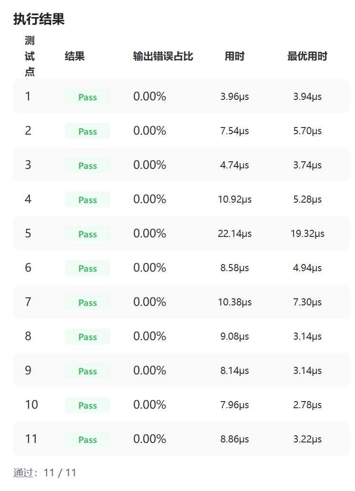
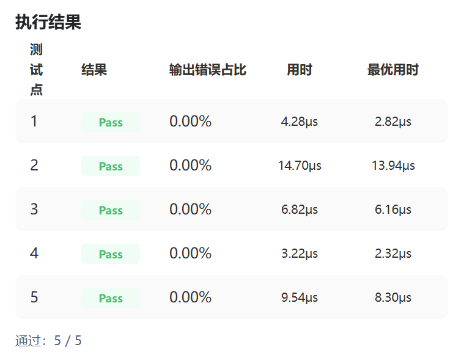
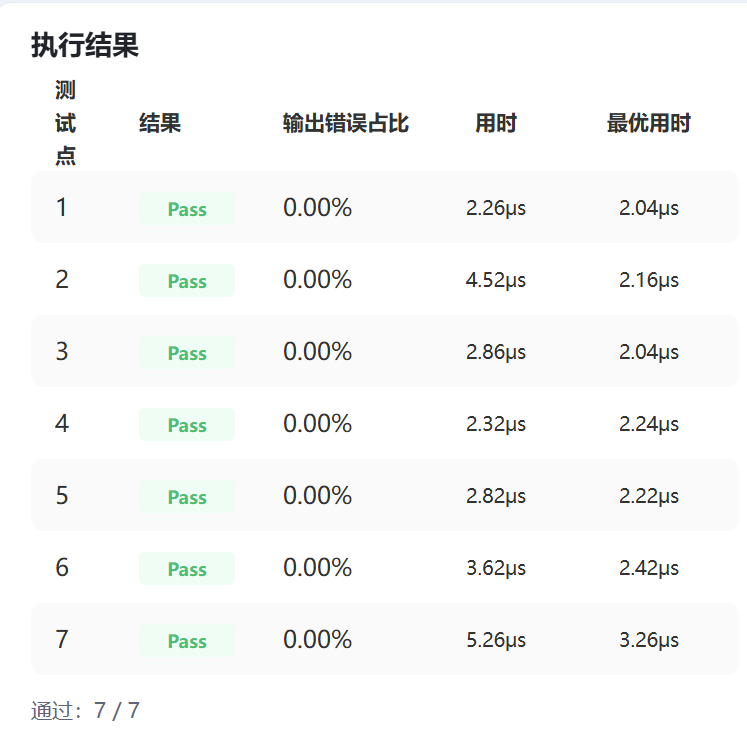

## 个人信息

- 姓名：潘正浩
- 学号：25803050350
- 联系邮箱：25803050350@m.fudan.edu.cn
- CANNJudge 账号：MrWine

## CANNJudge 提交说明

竞赛链接：https://cannjudge.cn/fdu-aiops/fdu-competition-2026

最终提交时间：2026/6/5 19:50:21

三道题完成情况：

- Addcmul：

- ClipByValue：

- Lerp：



## 算子实现简介

本次实现包含 ClipByValue、Lerp 和 Addcmul 三个 Ascend C 自定义算子。整体思路均采用 host 侧 tiling 与 kernel 侧计算分离的设计：host 根据 shape、dtype、平台 core 数和 UB 大小生成 tiling 参数，kernel 根据当前 core 编号确定处理区间，并按 `CopyIn -> Compute -> CopyOut` 的流程完成 GM 与 UB 之间的数据搬运和向量计算。

### ClipByValue

ClipByValue 对齐 `torch.clamp(x, min, max)` 语义，计算公式为：

```cpp
y = min(max(x, min), max)
```

实现上，host 侧读取输入 shape、dtype 和 `min/max` 属性，将输入字节数按 32B block 对齐后进行多核切分，并记录 big core、small core、tile 大小和 tail tile 信息。kernel 侧根据 tiling 确定当前 core 的数据段，float16/float32 直接使用 `Mins + Maxs` 完成裁剪；int32 路径先将输入 Cast 到 float，完成 clamp 后再 Cast 回 int32，以保证计算稳定性。

主要优化包括：

- 按 32B block 分配任务，使用 big/small core 平衡余数 block。
- 对 float32 大输入限制每个 core 至少处理约 3 个 32B block，减少轻量算子过度开核带来的调度开销。
- 使用输入/输出双缓冲；float16/float32 按 4 份 UB 估算，int32 因额外 float 临时区按 5 或 6 份 UB 估算。
- 将最后一个不满 tile 的 tail tile 单独处理，减少主循环内的分支判断。

调试中主要遇到队列同步和 int32 路径稳定性问题。部分直接原地计算或绕过输出队列的方案虽然速度较快，但会导致 Wrong Answer；int32 直接使用整数 min/max 也存在不稳定情况，因此最终保留了更稳妥的 float 临时区方案。

### Lerp

Lerp 对齐 `torch.lerp(start, end, weight)` 语义，计算公式为：

```cpp
y = start + weight * (end - start)
```

host 侧根据输入元素数、dtype、32B 对齐后的 block 数和 UB 大小计算分核与 tile 参数，并根据 `weight` 选择模板模式：`weight=0` 时输出 start，`weight=1` 时输出 end，其余情况执行完整 Lerp 公式。kernel 普通模式下搬入 start 和 end，依次执行 `Sub -> Muls -> Add`；特殊模式下只搬入一个输入，并通过轻量路径输出结果。

主要优化包括：

- 使用 `LERP_MODE` 区分 `weight=0`、`weight=1` 和普通模式，减少特殊场景下的无效搬运和计算。
- 普通模式保持 `start + weight * (end - start)` 的原始计算顺序，避免 float16 下因公式改写引入舍入误差。
- 按 32B 对齐进行分核，kernel 侧使用 `DataCopyPad` 和 `validCoreDataNum` 处理非 32B 对齐 tail，避免读写 padding 区。
- 默认按每 core 约 32 个 32B block 控制 core 数，小样本场景根据 dtype、mode 和测试反馈使用更细的分核策略。
- 固定使用单 buffer，普通模式按 start/end/out 三份 UB 估算，降低 UB 占用和队列管理开销。

调试中主要问题是正确性和性能之间的取舍。曾尝试对 `weight=0/1` 直接拷贝输出，以及将 `weight=0.5` 改写为 `(start + end) * 0.5`，但这些改动在部分测试点出现 WA 或精度偏差。最终保留与 PyTorch 语义一致的计算顺序和稳定的数据流。

### Addcmul

Addcmul 对齐 `torch.addcmul(input_data, x1, x2, value)` 语义，计算公式为：

```cpp
y = input_data + x1 * x2 * value
```

其中 `input_data`、`x1`、`x2` 支持 NumPy/PyTorch 风格广播，`value` 为 shape `[1]` 的标量 tensor，输出 shape 为三者广播后的 shape，支持 float16、float32、int8 和 int32。

host 侧首先完成三输入广播 shape 推导和合法性检查，再根据输出元素数计算 32B block 数、core 切分和 tile 大小。同时根据输入 shape 选择 `ADD_CMUL_MODE`，将无广播、scalar broadcast、last-dim broadcast、suffix broadcast 和通用 broadcast 分发到不同模板路径。kernel 侧根据 mode 执行对应计算：规则场景尽量使用连续 `DataCopy` 和 `Mul + Muls + Add` 向量指令，复杂广播则通过逐元素 offset 计算兜底。

主要优化包括：

- 对无广播场景直接连续搬运三个输入，执行 `Mul(tmp, x1, x2) -> Muls(tmp, tmp, value) -> Add(y, input_data, tmp)`。
- 对 x1/x2/input_data 为 scalar 的场景只读取一次标量，减少 GM 搬运；当 x1 和 x2 均为 scalar 时，预计算 `x1 * x2 * value`，每个元素只需一次 `Adds`。
- 对 suffix broadcast 利用重复连续块搬运，减少通用广播中的多维除法、取模和非连续访存。
- 根据模式动态估算 UB 份数：普通路径为 input/x1/x2/output 四份，单 scalar 路径为三份，双 scalar 路径为两份，从而增大 tile 粒度。
- 对非 32B 对齐的搬运使用 `DataCopyPad`，并通过 `validCoreDataNum` 保证只计算真实输出元素。
- 整数路径显式处理溢出回绕语义：int8 使用 int32 中间结果，int32 使用 int64 中间结果，再截断回目标类型。

调试中主要问题集中在复杂广播、非对齐搬运和整数溢出语义。最初所有广播都走通用 offset 路径时性能较差，后续通过 host 侧提前识别常见广播模式并选择模板 fast path，显著降低了计算和访存开销。最终版本所有测试点均 Pass，输出错误占比为 0。
