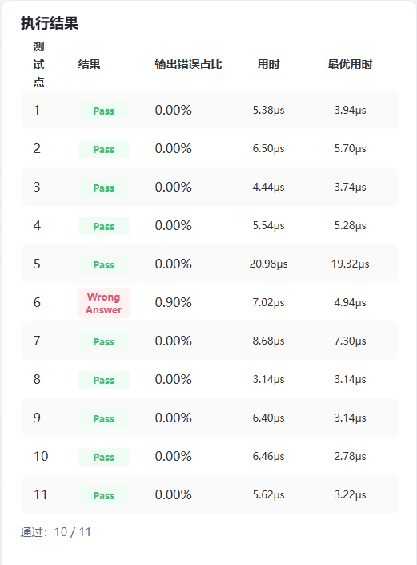
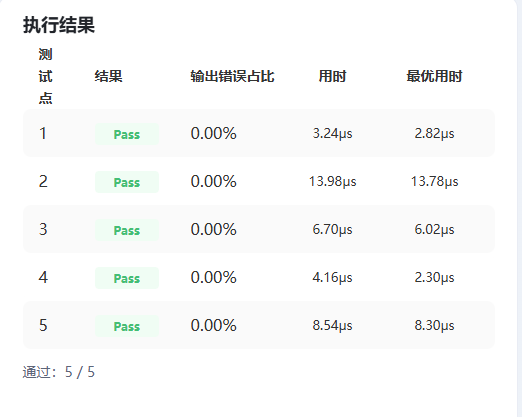
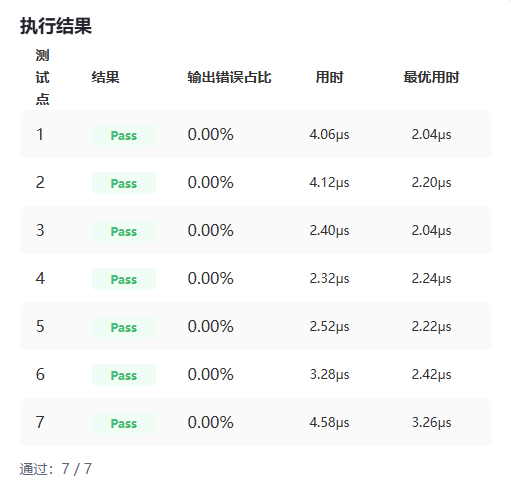

## 个人信息

- 姓名:梁思齐
- 学号:无
- 联系邮箱:3165369792@qq.com
- CANNJudge 账号:saber_liang

## CANNJudge 提交说明

比赛链接: https://cannjudge.cn/fdu-aiops/fdu-competition-2026
最终提交时间:
三道题完成情况（附提交成功截图）:
Addcmul:

ClipByValue:

Lerp:

## 算子实现简介

三道题均为纯 Vector(逐元素)算子,基于 Ascend C 在昇腾 910B(AIV/AIC 分离架构)上原生实现,Host 侧 Tiling + Kernel 侧核函数。整体采用「多核切分 + UB 双缓冲流水(CopyIn→Compute→CopyOut)」的标准结构,并针对"比赛按单测试点延迟评分"做了一系列固定开销与访存优化。

### 一、ClipByValue(152):y = clamp(x, min, max)

- **实现思路**:min/max 为 float ATTR 标量,Kernel 用 `Maxs`/`Mins` 两条向量指令完成钳位;支持 fp16/fp32/int32。
- **精度对齐**:int32 边界按 `static_cast` 截断(对齐 torch.clamp 的向零截断语义),而非 ceil/floor。
- **性能优化**:最大化核并行(核数取 `ceil(length/512)`,封顶 AIV 核数)+ 512 元素块负载均衡;TQue 模板 depth=1 配合 InitBuffer 双缓冲;声明 `KERNEL_TYPE_AIV_ONLY` 避免混合启动空转 Cube 核的头开销。
- **遇到的问题**:int32 钳位语义最初按 ceil/floor 实现导致精度不达标,改为截断后通过。

### 二、Lerp(153):y = start + weight × (end − start)

- **实现思路**:weight 为 float ATTR 标量,同形无广播。Kernel 用 `Sub`→`Muls`→`Add` 朴素式逐步计算,原生 T 精度(不升 float)。
- **精度对齐**:实测评测参考的 fp16 为**原生 fp16** 计算(非升 float opmath),改用原生 + 朴素式后由 4/7 提升到 7/7;`1−w` 等标量运算在 float 标量域完成(AI Core 禁止 half 标量算术)。
- **性能优化**:最大化核并行 + 512 块余数负载均衡(前 rem 核各多 1 块,消除空闲核与尾核不均);ubFormer 取满 UB 单 tile;`KERNEL_TYPE_AIV_ONLY`。
- **遇到的问题**:升 float 反而精度变差;把单 tile 切小做流水反而更慢(每 tile DataCopy 开销 + 小 DMA > 流水收益);TilingData 精简、`K_MAX_SHAPE_DIM 0` 在本算子上为**负优化**(结构本就小、热循环极简,改动扰动 codegen),已排除。

### 三、Addcmul(154):y = input + x1 × x2 × value

- **实现思路**:value 为 tensor[1],在 device 侧读为标量。支持 fp16/fp32/int8/int32 与 NumPy 广播、非对齐维度。Tiling 双路径:三输入同形时塌成 1D **扁平路径**(512 块负载均衡 + 满核),否则走**广播路径**(按行 + 各输入逐维步长,广播维步长记 0)。计算工作类型按 dtype 区分:fp32/int32 原生;fp16 升 float(对齐 torch opmath);int8 经 half 中转到 float(int8 只能与 half 互转)。
- **精度对齐**:fp16 升 float + `Axpy` 融合乘加;int8 在 float 域精确计算(`|结果|<2²⁴`)后末尾单次回绕到 int8(对齐 torch「int 内算、末尾窄化一次」);int32 按 2's complement 回绕,与 torch 一致。
- **性能优化**:满核 + 512 块负载均衡;按 dtype 调大 tile 使单次 DMA 突发逼近带宽饱和区(fp32/int32 20KB、fp16 15KB、int8 10KB),并去掉 fp16 路径白占 UB 的 halfBuf;对齐块(起址与长度均 32B 对齐)走轻量 `DataCopy`、否则 `DataCopyPad`;`Axpy` 把乘加从 3 op 降到 2 op;`KERNEL_TYPE_AIV_ONLY`;TilingData 结构精简(删 kernel 不读的冗余字段 + 类型最小化 + 对齐重排,176B→136B);`K_MAX_SHAPE_DIM 0` 关闭未用的 ShapeInfo 内嵌数组,缩栈空间、减 scalar 指令与 cache miss;中间结果全程留在 UB(不落 GM 再读回)。
- **遇到的问题**:
  1. int8 无法直转 int32/float(只能 int8↔half),整数域加速方案因 cast 不支持失败,退回 float 域;
  2. `DataCopy` 对 GM 起址有 32B 对齐要求(`DataCopyPad` 没有),广播路径的逐行偏移多为非对齐,曾误走 `DataCopy` 读到错位数据导致精度错,加入「起址 + 长度同时对齐才用 DataCopy」判定后修复;
  3. fp16 个别测试点精度卡在 float32 抵消下限(`input ≈ −x1·x2·value` 时相对参考误差放大),float32 域内无法消除(需 float64/张量 FMA,硬件不支持);
  4. 该算子为纯 `3 读 1 写` 访存受限,广播行折叠、Counter 模式 mask、向量趟数精简等计算侧优化均被 DMA 掩盖、无明显收益;真正见效的是固定开销类优化(AIV-only、大结构 TilingData 精简、K_MAX_SHAPE_DIM)。

### 四、通用经验

- 比赛按延迟评分:最大化核并行(`ceil(len/512)` 满核)优于官方"每核 4KB"吞吐规则;
- 固定/per-核开销类优化(AIV-only、TilingData 精简、关闭 ShapeInfo)对**张量多/计算重**的算子(Addcmul)有效,对**简单算子**(Lerp/ClipByValue)反为负优化,需区别对待;
- 纯单遍 elementwise 算子访存量已是数学下限,L2 切分、归约指令选型、UB 融合、TQueBind 等策略不适用。
