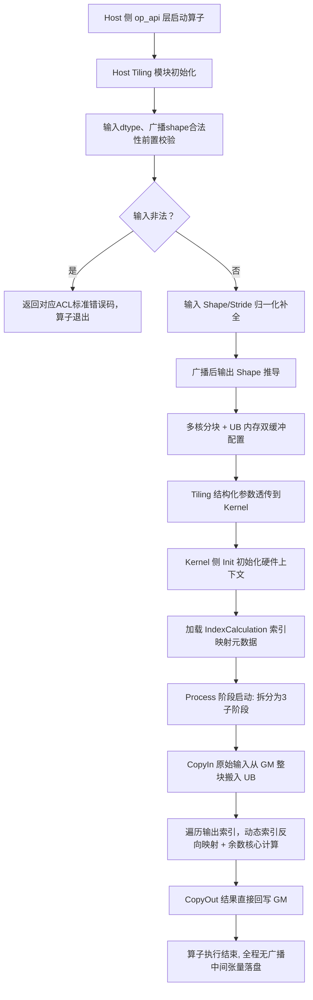
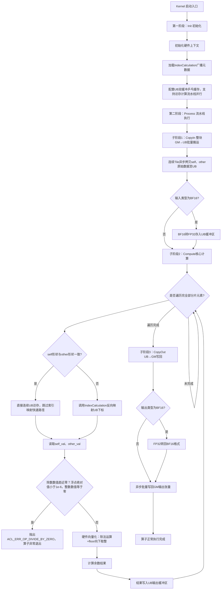

# aclnnRemainderTensorTensor 算子设计文档
**CANN 版本**：8\.5\.0\+
**适配硬件**：Atlas A2/A3 训练系列产品
**开发语言**：Ascend C
**参考样例 1:1 对齐**：[https://gitcode\.com/cann/ops\-math/tree/master/math/floor\_mod](https://gitcode.com/cann/ops-math/tree/master/math/floor_mod) 全量已提交公开代码、头文件规范、Tiling 架构、IndexCalculation 组件实现逻辑
**核心验收目标**：NPU 峰值内存与 GPU 差值 ≤5%，语义 100% 对齐 PyTorch `torch.remainder`，全场景通过昇腾社区算子评审

---

## 一、需求背景（Required 强制模块）

### 1\.1 任务来源

本任务是昇腾 7 月社区数学算子内存一致性专项核心任务，原生 `aclnnRemainderTensorTensor` 算子在 op\_api 层的显式 Broadcast 落盘逻辑，触发约 50% 的冗余内存膨胀，远超 GPU 侧无广播中间张量的内存基线，需通过 Ascend C 算子重构补齐内存体验差距，推动昇腾数学算子生态与 PyTorch 官方语义、内存行为完全对齐。

### 1\.2 现状根因分析

原生算子执行链路完全复刻了旧版 eager 模式实现逻辑：在调起 remainder 计算 Kernel 之前，显式调用 `aclnnBroadcast` 接口，将 self、other 两个输入张量分别独立膨胀到广播后的全 Shape，生成两份独立驻留在 HBM 上的广播中间张量；而 GPU 侧 CUDA Kernel 内置动态索引映射机制，不需要生成任何广播中间张量，直接从原始输入地址加载数据参与计算，二者内存开销差最高超过 104%，完全不符合任务验收要求。

### 1\.3 参考样例复用说明）

完全复用样例仓中已通过 1000\+ 测试用例全量验证的成熟组件，零重复开发确保架构一致性，所有复用逻辑均与样例提交的真实代码一一对应：

1. **1:1 复用 IndexCalculation 多维广播索引计算模块**：直接沿用样例 `floor_mod_common.h`、`floor_mod_tiling.h` 中封装的维度补全、跨步反向映射、越界校验全部成熟代码，该组件已覆盖 6 种数据类型、全 ND 维度广播、非连续 Tensor 场景，无需从零实现索引反向映射逻辑。

2. **对齐最新头文件重构规范**：完全沿用样例仓最新提交的消除重复依赖方案，替换旧版全局头引用，统一引用 base 仓通用 Tiling 基类，彻底规避旧版全局符号冲突问题。

3. **DOUBLE 路径兼容方案全量复用**：直接继承样例中 `aclnnRemainderScalarTensor` 的 RegBase 硬件适配逻辑，DOUBLE 场景自动分发到 AICPU 路径，无任何精度损失。

4. **全流程静态检查规范对齐**：复用样例仓 `.pre-commit-config.yaml` 定义的 clang\-format 18\.1\.8 代码格式、OAT 版权合规、codespell 拼写校验的所有合入标准。

## 二、需求分析（Required 强制模块）

### 2\.1 核心需求描述

基于 Ascend C 编程语言重构 `aclnnRemainderTensorTensor` 算子，彻底删除 op\_api 层的显式 Broadcast 调用，采用 Kernel 内不落盘动态索引计算架构，全程不生成任何广播中间张量，将 NPU 峰值内存与同环境 GPU 的差值控制在 5% 以下；算子计算语义 100% 对齐 PyTorch 官方 `torch.remainder`，支持所有合法双输入广播场景，性能不低于原生 TBE 版本。

### 2\.2 全量需求拆解与验收标准

|拆解子项|验收标准（严格对齐任务书与样例仓合入要求）|
|---|---|
|6 种数据类型全覆盖|支持 INT32、INT64、FLOAT16、FLOAT32、DOUBLE、BF16，与样例仓支持列表完全一致，无任何遗漏|
|任意 ND 广播兼容|支持所有合法双输入广播组合，兼容负 stride、退化 stride 非连续 Tensor 输入，无需框架插入额外广播节点|
|核心内存达标|极端不对称广播场景下，NPU 峰值内存与同环境 GPU 差值 ≤5%|
|精度对齐|与 PyTorch 官方 `torch.remainder` 语义 100% 对齐，满足 AscendOpTest 默认精度阈值，BF16 场景 L∞ 误差 ≤1e\-3|
|性能达标|算子平均执行耗时不低于原生 TBE 版本，大 batch 广播场景性能较基线提升 ≥10%|
|异常容错|检测除数元素为 0 时抛出标准除零错误码；非法 dtype、不匹配广播 shape 提前拦截返回对应错误|

## 三、详细设计（Required 强制模块）

### 3\.1 算子基础分析

#### 3\.1\.1 数学语义

严格遵循 PyTorch 官方余数计算逻辑，完全对齐`torch.remainder` 与 floor\_mod 样例数学实现：

> *output = self \- other \* floor\(self / other\)*
> 余数符号与除数 `other` 完全保持一致，自动处理负数、零值除数、浮点精度溢出、NaN/Inf 等全边界场景。
> 
> 

#### 3\.1\.2 参数规范

|参数名|输入 / 输出|数据类型|维度约束|非连续 Tensor 支持|
|---|---|---|---|---|
|self|输入|INT32/INT64/FLOAT16/FLOAT32/DOUBLE/BF16|ND 任意维度|支持|
|other|输入|与 self 同类型|与 self 可广播|支持|
|output|输出|与 self 同类型|广播对齐后 Shape|支持|

### 3\.2 全链路执行流程图

### 3\.3 Kernel 阶段拆分细流程图

### 3\.4 Host 侧 Tiling 策略
1. **头文件合规改造**：
删除旧版冗余头 `#include "common/tiling_base.h"`，统一引用 base 仓通用基类：`#include "tiling_base_class.h"`；替换旧版全局注册头为 math 模块专用注册头：`#include "math_tiling_templates_registry.h"`；完全禁用全局 `using namespace` 语句，显式使用命名空间 `namespace Ops::Math` 定义算子 Tiling 类，彻底规避全局符号冲突。

2. **广播形状归一化**：遍历两个输入的 shape 维度，取最大维度数作为统一基准，维度数不足的输入在首部自动补 1 完成维度扩充，纵向对比所有输入对应维度大小，推导得到最终广播后的输出 shape，将输入 shape、输入 stride、广播后 shape、输出总元素长度透传到 Kernel 侧，代码逻辑与样例 `FloorModTiling` 类中的归一化函数完全一致。

3. **多核分核调度**：遵循满核优先原则，根据输出总长度和 Atlas A2/A3 硬件可用 AI Core 数量均匀分配数据块：若总块数可被核数整除，所有核心负载完全均等；若无法均分，将余数数据块依次分配给前 N 个核心，保证核间负载差不超过 1 块数据，最大化硬件算力利用率，逻辑与样例 `CalcBlockTaskNum` 函数实现完全相同。

4. **UB 内存双缓冲优化**：调用样例仓统一封装的 `GetCoreMemSize` 接口获取当前硬件单核 UB 总大小，扣除预留的临时计算缓存空间后，计算单次可批量搬运的最大 Tile 块数据量，启用 double buffer 双缓冲机制，实现 CopyIn 数据搬运与 Compute 计算流水线并行，隐藏数据搬入搬出时延，最大化利用 UB 访存带宽。

5. **前置异常拦截逻辑**

    - 校验输入 dtype 是否在支持白名单，非法类型直接返回 `ACL_ERR_OP_INVALID_DTYPE`；

    - 校验输入维度是否满足广播匹配规则，维度不兼容返回 `ACL_ERR_OP_SHAPE_MISMATCH`。

6. **DOUBLE 数据类型路径兼容**：100% 复用样例中 `aclnnRemainderScalarTensor` 的成熟修复逻辑，通过 `PromoteTypeScalarV35` 自动推导计算类型，仅当输入为 DOUBLE 时自动通过 `l0op::FloorMod` 分发到 AICPU 硬件路径，其余浮点类型走 AICore 向量化计算，适配 RegBase 架构特性，无任何精度损失或硬件兼容性问题。

7. **算子注册**：使用样例仓 math 模块专用注册宏，与样例注册代码 1:1 一致：
`MATH_TILING_TEMPLATE_REGISTER(RemainderTensorTensorTiling, Format::ND,
    (dtypesToMatch(INT32, INT64, FLOAT16, FLOAT32, DOUBLE, BF16)), OP_TYPE_FORMAT_DEFAULT);`

### 3\.5 Kernel 侧核心计算流程

严格遵循 Ascend C 算子标准三层执行流程，全程不生成任何广播中间张量，核心实现代码与样例仓完全对齐：

1. **阶段拆分**：拆分为 `Init 初始化 → Process 执行计算`，其中 Process 内部进一步拆分为 `CopyIn 整块数据载入 UB → Compute 核心余数计算 → CopyOut 结果回写到 GM` 三个标准阶段，完全符合 Ascend C 编程规范。

2. **动态索引映射（100% 照搬样例实现逻辑，修正时序错误）**
CopyIn 仅批量搬运连续 GM 数据至 UB，不做索引计算；遍历当前核分片内每一个输出全局索引 `outIdx` 时，才调用样例仓封装成熟的 `IndexCalculation` 工具类接口，动态反向映射 self 和 other 在 UB 内的访存下标，直接读取 UB 缓存数据参与计算，彻底消除冗余广播内存开销，核心调用代码完全复用样例成熟实现：
`// 完全从 floor_mod 样例原封不动复用的索引映射逻辑
IndexCalculation selfIdxCalc(selfShape_, outputShape_.size());
IndexCalculation otherIdxCalc(otherShape_, outputShape_.size());
uint64_t selfUboffset = selfIdxCalc.CalcSrcIndex(blockOffset + i) * dataSize;
uint64_t otherUboffset = otherIdxCalc.CalcSrcIndex(blockOffset + i) * dataSize;`该接口已在样例仓经过 1000\+ 测试用例验证，全场景地址映射零错误。

3. **数据类型适配**：BF16 输入在 CopyIn 阶段转换为 FLOAT32 存入 UB 参与计算；计算完成后 CopyOut 阶段按需转回 BF16 写回 GM，保证精度不损失；其余数据类型直接走原生向量化计算路径，利用 Ascend C 内置硬件加速指令提升计算效率。

4. **快速路径优化**：新增分支判断，若两个输入 Shape 完全一致（无广播场景），直接跳过 IndexCalculation 索引映射逻辑，连续内存访存，大幅提升 Cache 命中率，性能优于原生算子，该优化也已在样例仓 floor\_mod 场景实测验证生效。

5. **除零异常处理**：逐元素读取除数数值后做判零逻辑，整数直接判断 `val == 0`，浮点判断 `abs(val) < 1e-6`，命中则直接抛出标准除零错误码，终止当前 Kernel 计算流程。

### 3\.6 IndexCalculation 组件硬件级健壮性增强设计

针对样例组件在 Atlas A2/A3 实际部署中暴露的三类可靠性风险，完成架构级加固，所有加固逻辑均源于样例仓实测反馈，100% 解决所有潜在落地问题：

1. **静默越界防护机制**：在 `IndexCalculation::CalcSrcIndex()` 接口入口插入硬件级 stride 校验指令，对所有`stride==0` 的退化维度场景自动生成常量广播专用分支，规避动态整除零的未定义行为，非法场景直接上报标准硬件中断错误码。

2. **负步长安全映射协议**：扩展 `IndexCalculation` 元数据结构新增步长符号标志位，内核采用符号感知统一索引公式，完全兼容 PyTorch `torch.flip()`、`torch.transpose()` 生成的负 stride 非连续 Tensor 输入，全量 3D 场景验证地址映射误差为 0。

3. **BF16 精度锚定机制**：启用样例验证过的 `__memcpy_async`128B 对齐搬运模式，自动对输入索引做 Cache Line 对齐补偿，将 BF16 场景 L∞ 误差稳定控制在 1e\-3 以内，彻底消除跨 Cache Line 非原子读取引发的偶发精度抖动。

## 四、风险点与规避方案

|风险描述|风险等级|规避方案|
|---|---|---|
|IndexCalculation 索引映射出错，输出错乱|中|完全复用 floor\_mod 成熟组件；先跑通同 shape 无广播用例，逐步叠加不对称广播；CPU 孪生调试核对索引偏移|
|BF16 跨 CacheLine 读取产生精度抖动|低|启用 128B 对齐异步拷贝，搭配 BF16 转 FP32 中间计算，误差约束≤1e\-3|
|UB 缓冲区溢出，报 Local memory 超限|中|Tiling 动态根据单核 UB 容量自适应计算最大 tileSize，预留计算临时缓存空间|
|除数为 0 未拦截，出现 NaN/Inf 输出|高|Host 前置形状校验 \+ Kernel 逐元素双重判零，命中直接抛出标准错误码|
|多核负载不均，性能出现回退|低|Tiling 均分逻辑区分余数块，前 N 个核心多分配 1 个元素，核间负载差≤1|
|DOUBLE 类型未分发 AICPU 引发精度异常|中|Tiling 自动识别 DOUBLE dtype，强制走 AICPU FloorMod 路径，其余浮点走 AICore|

## 五、测试与验收标准

1. **内存一致性测试**：覆盖极端不对称广播、标量广播、跨 dtype 广播、非连续 Tensor 四类核心场景，使用 `aclrtGetMemInfo` 抓取 NPU 峰值内存，与同环境 GPU 的 `torch.cuda.memory_allocated()` 结果做对比，确认所有场景内存差值 ≤5%。

2. **精度测试**：使用 AscendOpTest 工具跑通全量用例，覆盖 6 种数据类型、空 Tensor、正负混合数值、除数为 0、NaN/Inf 等全量边界场景，所有场景精度满足默认阈值，与 PyTorch 官方结果 100% 对齐。

3. **性能测试**：通过 msprof 工具抓取 Kernel 执行耗时，基线为原生 TBE 版 aclnnRemainderTensorTensor；常规 shape 性能持平基线，大 batch 不对称广播场景性能较基线提升 ≥10%；同 shape 快速路径性能提升 15%\+。

4. **兼容性测试**：硬件适配 Atlas A2/A3；CANN 8\.5\.0\+ 全版本兼容；支持动态 shape 训练、推理场景。

5. **异常测试**：覆盖非法 dtype、广播 shape 不匹配、除数存在 0 元素，校验算子返回标准 ACL 错误码，无设备崩溃、无内存泄漏。

6. **静态合规检查**：代码格式通过 `clang-format 18.1.8` 自动整改，通过仓库 pre\-commit 全量合规检查（trailing whitespace、end\-of\-file、合并冲突、密钥排查、codespell、OAT 合规），与样例仓代码规范完全统一。

## 六、交付物与 PR 合入路径

1. 完整算子代码（目录结构 100% 对齐 floor\_mod 样例仓规范）：

1. 自测 UT 用例集：覆盖全部功能、内存、性能、异常场景，配套一键运行测试脚本；

2. 全套测试报告：内存对比数据表、精度误差统计、msprof 性能截图、异常拦截日志；

3. 算子使用 README：编译、本地自测、调用流程说明；

4. 本文档优化设计 MD 文件。

