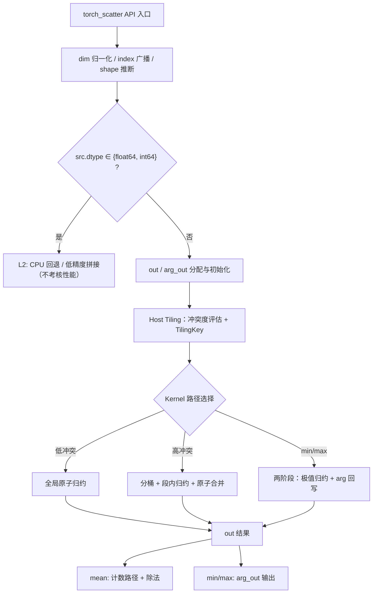

# Scatter 算子设计文档

本文档对应 [2026 年 8 月社区任务 scatter 算子开发任务书](https://gitcode.com/cann/cann-ops-competitions/blob/master/04_tasks/01_community-task-2026/docs/202608/scatter_task_doc.md)，并按照[算子设计文档模板](https://gitcode.com/cann/cann-ops-competitions/blob/master/04_tasks/01_community-task-2026/resources/design_template.md)编写。

# 需求背景

## 需求来源

Scatter 是 PyTorch Geometric 生态的核心算子之一，`torch_scatter.scatter`（https://pytorch-scatter.readthedocs.io/en/latest/functions/scatter.html ）及其子算子（`scatter_sum` / `scatter_add` / `scatter_mul` / `scatter_mean` / `scatter_min` / `scatter_max`）是 GNN 消息聚合、点云特征池化、稀疏索引归约的基础操作。当前昇腾 NPU 缺少与 torch_scatter 接口完全对齐的原生实现，上述场景只能回退 CPU 执行。

本需求要求基于 **Ascend C（Kernel）+ Python（PyTorch 适配层）** 在昇腾 NPU（Ascend 950PR）上实现功能与接口完全对齐的 Scatter 系列算子，完成算子设计、开发、测试全流程，验收通过后提交至昇腾算子开源仓 **ops-gnn**（https://gitcode.com/cann/ops-gnn ）。**对标参考**：torch_scatter（https://github.com/rusty1s/pytorch_scatter ，版本 ≥ 2.1.0）。

**验收口径**：以 **PyTorch 层接口** 的功能、精度、性能为唯一验收基准；C++ 层（aclnn）接口为可选交付项，不作为验收必要条件。

## 背景介绍

### 功能定义

Scatter 是一种**按索引分组的归约（reduce）**操作：将 `src` 中每个元素，沿指定维度 `dim`，根据 `index` 给出的目标位置，聚合写入 `out` 对应槽位。

设 src、index 为 n 维张量，形状为 `(x_0, ..., x_i, ..., x_{n-1})`。若 `dim = i`，则 out 的形状变为：`(x_0, ..., x_{i-1}, y, x_{i+1}, ..., x_{n-1})`。

一维 `reduce="sum"` 时：

$$
\text{out}_k = \sum_{j \,:\, \text{index}_j = k} \text{src}_j
$$

与 `segment_coo` / `segment_csr` 不同：**scatter 不要求 index 有序**，索引可任意排列、可重复。

### 六种归约模式

| reduce 取值 | 对应 Python API | 语义 | 空桶输出（无 src 落入） |
|-------------|-----------------|------|------------------------|
| `sum` | `scatter(..., reduce="sum")` / `scatter_sum` | 求和 | `0` |
| `add` | `scatter(..., reduce="add")` / `scatter_add` | 同 `sum`（别名） | `0` |
| `mul` | `scatter(..., reduce="mul")` / `scatter_mul` | 连乘 | `1` |
| `mean` | `scatter(..., reduce="mean")` / `scatter_mean` | 先 sum 再除以计数 | `0` |
| `min` | `scatter(..., reduce="min")` / `scatter_min` | 求最小值 | `0` |
| `max` | `scatter(..., reduce="max")` / `scatter_max` | 求最大值 | `0` |

**各 reduce 初值与更新规则（自动创建 out 时）**：

| reduce | out 初值 | 更新规则 |
|--------|----------|----------|
| sum/add | `0` | `out[idx] += src[j]` |
| mul | `1` | `out[idx] *= src[j]` |
| mean | 先按 sum 累加，再 `out /= count` | 整数用 floor 除法，浮点用 true divide |
| min | `numeric_limits::max()` | 取更小值；无更新槽最终置 `0` |
| max | `numeric_limits::lowest()` | 取更大值；无更新槽最终置 `0` |

### 对标实现现状分析

对标实现位于 torch_scatter 仓库：

| 文件 | 内容 |
|------|------|
| `torch_scatter/scatter.py` | `scatter` 及 6 个子 API 的 Python 入口，含 index 广播、输出形状推断、dim_size 处理 |
| `csrc/cpu/scatter_cpu.cpp` | CPU 内核：`index` 无序扫描，逐元素归约到 `out[idx]` |
| `csrc/cuda/scatter_cuda.cu` | CUDA 内核：基于 GPU 原子操作 + 分桶/排序等优化路径 |

### 典型应用场景

- 图神经网络（GNN）消息聚合（message passing 中的 aggregate 阶段）；
- 点云特征池化（按邻域/网格索引归约）；
- 稀疏索引归约、bincount 类散射累加。

# 需求分析

## 需求描述

使用 Ascend C 编程语言实现 Scatter 系列算子的 NPU 原生 kernel，并在 Python 层提供与 torch_scatter **函数名、参数列表、默认值、返回值类型完全一致** 的公开 API，可直接作为 `torch_scatter` 的 NPU 后端替换使用。行为（数值、shape、dtype、device 语义）与 torch_scatter CPU/GPU 标杆一致。

## 需求拆解

1. **接口对齐**：7 个公开 API（`scatter` + 6 个子算子）与 torch_scatter 逐字对齐，不得增删改参数；
2. **六种 reduce**：sum/add（等价）/mul/mean/min/max，语义与 torch_scatter 一致；
3. **index 广播**：与 torch_scatter 广播语义一致（1D index 广播到多维 src，`test_broadcasting.py`）；
4. **输出形状推断**：`dim_size` / `index.max()+1` / 空 index 为 0；
5. **提供 out 的原地语义**：sum/add 在现有值上累加；mul/min/max 以现有值为初值；mean 完成 sum 路径后均值化；
6. **min/max 额外输出 arg_out**（INT64，初值 `src.size(dim)`，平局后写者优先）；
7. **L1 NPU 原生路径**：FLOAT16/BFLOAT16/FLOAT32、INT8/16/32/UINT8 走 Ascend C Kernel + 硬件原子归约，**纳入 NPU 性能基线**；
8. **L2 可选路径**：FLOAT64、INT64 走 **CPU 回退** 或 **NPU 低精度拼接**，**不做性能考核**；
9. **算子泛化**：src 1～8 维、dim 维长度 1～65535、index 元素数 0～10⁸、高冲突 index、空张量、非连续 Tensor；
10. **性能要求**：所有用例性能 ≥ 0.6 倍 A100 标杆，验收取最优实现路径。

## 接口定义

### PyTorch 层接口（必选）

须与 torch_scatter 源码逐字对齐：

```python
from typing import Optional, Tuple
import torch

def scatter_sum(src: torch.Tensor,
                index: torch.Tensor,
                dim: int = -1,
                out: Optional[torch.Tensor] = None,
                dim_size: Optional[int] = None) -> torch.Tensor: ...

def scatter_add(src: torch.Tensor,
                index: torch.Tensor,
                dim: int = -1,
                out: Optional[torch.Tensor] = None,
                dim_size: Optional[int] = None) -> torch.Tensor: ...

def scatter_mul(src: torch.Tensor,
                index: torch.Tensor,
                dim: int = -1,
                out: Optional[torch.Tensor] = None,
                dim_size: Optional[int] = None) -> torch.Tensor: ...

def scatter_mean(src: torch.Tensor,
                 index: torch.Tensor,
                 dim: int = -1,
                 out: Optional[torch.Tensor] = None,
                 dim_size: Optional[int] = None) -> torch.Tensor: ...

def scatter_min(src: torch.Tensor,
                index: torch.Tensor,
                dim: int = -1,
                out: Optional[torch.Tensor] = None,
                dim_size: Optional[int] = None) -> Tuple[torch.Tensor, torch.Tensor]: ...

def scatter_max(src: torch.Tensor,
                index: torch.Tensor,
                dim: int = -1,
                out: Optional[torch.Tensor] = None,
                dim_size: Optional[int] = None) -> Tuple[torch.Tensor, torch.Tensor]: ...

def scatter(src: torch.Tensor,
            index: torch.Tensor,
            dim: int = -1,
            out: Optional[torch.Tensor] = None,
            dim_size: Optional[int] = None,
            reduce: str = "sum") -> torch.Tensor: ...
```

**PyTorch 层实现要求**：

| 要求项 | 说明 |
|--------|------|
| 接口一致性 | 函数签名、参数名、默认值、返回值类型与 torch_scatter 源码完全一致 |
| 行为一致性 | 输出数值、shape、dtype、device 语义与 torch_scatter CPU/GPU 标杆一致 |
| 模块导出 | 支持 `from torch_scatter import scatter, scatter_sum, ...` 等价导入（drop-in 替换包） |
| NPU 张量 | L1 dtype 走 NPU Kernel；L2 dtype 可选 CPU 回退或低精度拼接；index 广播等预处理在 Python 层完成 |
| 自动求导 | 验收仅覆盖**前向**；backward 作为后续扩展 |
| 测试方式 | 直接复用或等价移植 torch_scatter 官方 pytest 用例 |

### aclnn C++ 层接口（可选，建议实现）

统一入口 `aclnnScatter`（`GetWorkspaceSize` + 执行入口）及 6 个子算子独立入口：

| aclnn 接口 | 对标 PyTorch API | 返回值 |
|------------|------------------|--------|
| `aclnnScatterSum` | `scatter_sum` | `out` |
| `aclnnScatterAdd` | `scatter_add` | `out`（内部转 sum） |
| `aclnnScatterMul` | `scatter_mul` | `out` |
| `aclnnScatterMean` | `scatter_mean` | `out` |
| `aclnnScatterMin` | `scatter_min` | `out` + `argOut` |
| `aclnnScatterMax` | `scatter_max` | `out` + `argOut` |

> aclnn 层未实现不影响验收；若实现，须保证与 PyTorch 层前向结果一致。

### Kernel 层（必选）

Ascend C 实现 Scatter 核心归约逻辑，由 PyTorch 层（必选）直接调用或通过 aclnn 层（可选）间接调用。

## 算子支持型号

| 支持的芯片版本 | 涉及勾选 |
| --- | --- |
| Ascend 950PR | √ |

# 详细设计

## 算子分析

### 支持数据类型与实现路径分级

Ascend 950PR Vector 原子操作（`SetAtomicType`）**不支持 `double`（float64）及 `int64` 原子归约**，因此 src/out 的 dtype 按实现路径分为两级：

| 级别 | src/out dtype | 实现路径 | 支持 reduce | 性能验收 |
|------|---------------|----------|-------------|----------|
| **L1 NPU 原生（必选）** | FLOAT16、BFLOAT16、FLOAT32 | Ascend C Kernel + 硬件原子归约 | sum/add/mul/mean/min/max | **纳入 NPU 性能基线** |
| **L1 NPU 原生（必选）** | INT8、INT16、INT32、UINT8 | Ascend C Kernel + 硬件原子归约 | sum/add/mul/mean/min/max | **纳入 NPU 性能基线** |
| **L2 可选路径** | **FLOAT64** | **CPU 回退** 或 **NPU 低精度拼接** | sum/add/mul/mean/min/max | **不做性能考核** |
| **L2 可选路径** | **INT64** | **CPU 回退** 或 **NPU 低精度拼接** | sum/add/mul/mean/min/max | **不做性能考核** |

**不支持**：BOOL、COMPLEX64、COMPLEX128 及 Float8 等新类型。

**index 数据类型**：固定 **INT64**（与 torch_scatter 一致）。

**reduce 属性**：STRING 或枚举，取值 `sum` / `add` / `mul` / `mean` / `min` / `max`。

**硬件依据（Ascend 950PR）**：

- `SetAtomicType` 仅支持 `int8/int16/half/bfloat16/int32/float`，**不含 double/int64**；
- 架构白皮书 Vector Core 原生浮点格式为 FP32/FP16/BF16，**无 FP64 原生计算核**。

### 支持形状与泛化

- src 维度：1～8 维，各维 ≥ 0；
- dim 维长度：1～65535（典型 GNN 场景 10～10⁶）；
- index 元素个数：0～10⁸；
- 同一 index 被重复命中（高冲突 scatter）；
- 空张量（`src.numel()==0` 或 `index.numel()==0`）；
- 非连续 Tensor（strided）。

## 算子实现

### 总体方案

采用三层架构：

```
┌─────────────────────────────────────────┐
│  PyTorch 层（必选）— Python              │  ← 验收基准，接口与 torch_scatter 完全相同
├─────────────────────────────────────────┤
│  aclnn 层（可选）— C++                   │  ← 建议实现，便于 CANN 生态集成
├─────────────────────────────────────────┤
│  Kernel 层（必选）— Ascend C             │  ← NPU 算子核心实现（原子归约 + 分桶）
└─────────────────────────────────────────┘
```

**核心设计思路**：

1. **Python/Host 完成预处理**：dim 归一化、index 广播（expand）、输出形状推断、out/arg_out 分配、L1/L2 分流 —— Kernel 接收已对齐的张量，降低 Kernel 复杂度；
2. **Kernel 按 reduce × dtype × 冲突程度分流（TilingKey）**：低冲突走全局原子归约，高冲突走分桶 + 段内归约（私有化累加后合并），min/max 走两阶段 + arg_out 回写；
3. **多路径并行探索，验收取实测最优**：开发中同时实现原子直写与分桶路径，以 A100 标杆 0.6 倍为达标基线，合入代码须为实测最优方案。



### PyTorch 层设计

#### 1. index 广播（Broadcast）

与 torch_scatter 广播语义一致，在 Python 层完成：

1. `dim < 0` 时先归一化为 `dim + src.dim()`；
2. 若 `index` 为 1D：在 `dim` 之前补 leading 维，在尾部补维至 `src.dim()`，再 `expand` 到 `src.shape`；
3. 广播后须满足 `src.dim() == index.dim()`；
4. 对 `i = 0 … index.dim()-2`：`src.size(i) >= index.size(i)`。

**验收用例参考**：torch_scatter `test/test_broadcasting.py`（1D index 广播到 4D src）。

#### 2. 输出形状推断

未提供 `out` 时，输出形状与 `src` 相同，仅 `dim` 维不同：

```
out.size(dim) =
  dim_size                        # 若指定 dim_size
  0                               # 若 index 为空且未指定 dim_size
  index.max() + 1                 # 否则
```

#### 3. 提供 out 时的原地语义

| reduce | 提供 out 时的行为 |
|--------|-------------------|
| sum/add | 在**现有 out 值上累加**（等价 `scatter_add_`） |
| mul/min/max | 以**现有 out 值为初值**继续归约，不重新 fill |
| mean | 在现有 out 上完成 sum 路径后做均值化（与 torch_scatter 一致） |

#### 4. min/max 额外输出 arg_out

| 属性 | 约束 |
|------|------|
| dtype | INT64 |
| shape | 与 `out` 相同 |
| 含义 | `out` 每个位置极值在 `src` 沿 `dim` 维的下标 |
| 初值 | `src.size(dim)`（表示尚未更新） |
| 平局 | 允许多个 src 同值；与 torch_scatter 一致，**后写者优先**（NPU 实现文档化：按 j 升序扫描，取同值中的最大 j） |

统一入口 `scatter(..., reduce="min"/"max")` 仅返回 `out`；独立 API `scatter_min` / `scatter_max` 返回 `(out, arg_out)`。

#### 5. L2 路径（float64 / int64）

| 路径 | 说明 |
|------|------|
| **CPU 回退**（首选） | 透明回退 CPU 完成计算（`src`/`index`/`out` 经 D2H/H2D）；结果与 torch_scatter CPU **bit-wise 一致** |
| **NPU 低精度拼接** | 备选：在 NPU 上以 float32/int32 等低精度分阶段计算并 cast/拼接还原；须在 README 说明精度策略与语义 |

| 要求项 | 说明 |
|--------|------|
| 触发条件 | `src.dtype ∈ {float64, int64}`；与 device 无关 |
| 接口行为 | 函数签名、返回值类型与 torch_scatter **完全相同** |
| 性能要求 | **不做考核**；自验证报告须注明所选 L2 路径 |
| 日志策略 | 建议首次触发 L2 路径时打印 `warning`（含 dtype 与实现路径） |

选择 **CPU 回退为首选路径**：Ascend 950PR 无 float64/int64 硬件原子归约能力，CPU 回退天然 bit-wise 一致、开发成本低；低精度拼接仅作为可选工程探索。

#### 6. 维度线性化（dim≠0 场景）

PyTorch 层将任意 `dim` 场景线性化后传给 Kernel：

```
batch = prod(src.shape[0 : dim])        # dim 前各维之积
C     = prod(src.shape[dim+1 : ])       # dim 后各维之积（feature 维）
```

src 视为 `(batch, N, C)`，out 视为 `(batch, out_dim, C)`，index 视为 `(batch, N)`（广播后）。Kernel 内对每个 `(b, j)` 元素，将 `src[b, j, :]` 归约到 `out[b, idx, :]`，逐 feature 处理或按 C 批量处理。该线性化使 Kernel 只处理三维逻辑形状，降低实现复杂度。

### Host 侧设计

#### 1. 参数校验

| 参数 | 合法范围 / 约束 | 非法输入处理 |
|------|-----------------|--------------|
| `index[i]` | `[0, out.size(dim)-1]` | 建议 Host 侧校验并返回 `ACLNN_ERR_PARAM_INVALID`；不校验时行为未定义 |
| `index[i] < 0` | 不允许 | 返回参数错误 |
| `dim` | `[-src.dim(), src.dim()-1]` | 越界返回参数错误 |
| `dim_size` | `≥ 0`；应满足 `dim_size ≥ index.max()+1` | 不足时返回参数错误 |
| `src` / `index` / `out` device | 须在同一 NPU 设备 | 跨设备返回错误 |
| `src.dtype` | L1：见数据类型分级表；L2：float64/int64 | 其他类型返回错误 |
| `index.dtype` | 仅 INT64 | 其他类型返回错误 |
| `out.dtype` | 须与 src 相同 | 不一致返回错误 |
| `src.numel()==0` | 合法；未提供 out 时 fill 0 后返回 | - |
| `index.numel()==0` | 合法；`out.size(dim)=0`（未指定 dim_size 时） | - |
| `reduce` | 6 种枚举值 | 其他值返回错误 |

#### 2. 分核与冲突度评估

Kernel 按 src 元素（`batch × N` 个）分核：

```
totalElems = batch * N
usedCoreNum = min(aivCoreNum, ceilDiv(totalElems, minElemsPerCore))
```

Host 计算**冲突度**并选择路径：

```
conflictRatio = totalElems / out.size(dim)     # 每个桶平均命中次数
bucketFeatureBytes = out.size(dim) * C * sizeof(T)
```

| 条件 | 路径选择 |
|------|----------|
| `conflictRatio < TH_LOW`（低冲突） | 全局原子归约 |
| `conflictRatio ≥ TH_LOW` 且 `bucketFeatureBytes` 可装入 UB（高冲突） | 分桶 + 段内归约（私有化累加） |
| min/max | 两阶段（极值归约 + arg 回写） |
| 中低桶数且冲突中等 | 私有化直方图 + 合并（备选，实测择优） |

阈值 `TH_LOW`（初值建议 4，依据实测调优）与 UB 容量判断写入 TilingData，避免运行时分支歧义。

#### 3. TilingKey 规划

按「reduce 十位 + dtype 个位 + 路径百位」编码，Host 侧根据参数组合与冲突度确定：

| 维度 | 取值 |
|------|------|
| reduce | 1=sum/add、2=mul、3=mean、4=min、5=max |
| dtype | 1=FP32、2=FP16、3=BF16、4=INT32、5=INT16、6=INT8、7=UINT8 |
| 路径 | 0=全局原子、1=分桶段内归约、2=私有化直方图、3=min/max 两阶段 |

示例：`TilingKey = 304` 表示 mean + INT8 + 全局原子归约。

#### 4. TilingData 参数

| 字段 | 类型 | 含义 |
|------|------|------|
| totalElems | uint64 | `batch × N` 总元素数 |
| batch | uint32 | dim 前各维之积 |
| N | uint32 | 广播后 index / src 的 dim 维长度 |
| C | uint32 | dim 后各维之积（feature 维） |
| dimSize | uint32 | out 在 dim 维长度 |
| usedCoreNum | uint32 | 实际参与核数 |
| tilingKey | uint32 | reduce×dtype×路径编码 |
| bucketFeatureBytes | uint32 | 高冲突路径 UB 评估值 |
| outInitValue / outInitType | uint32 | 空桶初值（0/1/极值）控制 |
| hasOptionalOut | uint32 | 是否提供 out（决定是否 fill） |
| workspaceOffset | uint64 | count/arg_out/partial 区偏移 |

#### 5. Workspace 规划

| 用途 | 说明 |
|------|------|
| count 区（mean） | INT32 计数张量，`dimSize × C` 槽位，原子自增或合并时累加 |
| arg_out 区（min/max） | 极值位置记录，INT64，与 out 同 shape（可复用用户 arg_out 或内部分配） |
| partial 区（分桶路径） | 每核私有 out 副本的合并缓冲 |
| 同步空间 | SyncAll 所需系统 workspace |

### Kernel 侧设计

#### 1. 全局原子归约路径（低冲突，sum/add/mul/mean）

**sum/add**：

```
out 初始化：fill 0（未提供 out 时）
对每个元素 (b, j)：outGm[b * dimSize * C + idx * C + c] += src[b, j, c]   # AtomicAdd
```

- `outGm` 通过 `SetAtomicAdd<atomic_op_type>()` 启用 GM 原子累加；支持 FP16/BF16/FP32/INT8/INT16/INT32/UINT8；
- 逐 feature 列 `c` 或按 C 批量发原子指令；C 较大时对每个元素循环 C 次原子写；
- 提供 out 时跳过初始化，直接累加（等价 `scatter_add_`）。

**mul**：out 初值 fill 1，原子乘（`SetAtomicMul` 或乘路径）。

**min/max**：见「min/max 两阶段实现」。

**浮点非确定性**：并行原子累加顺序不固定，浮点 `sum/add/mean` 允许微小累加顺序差异（与 torch_scatter GPU 行为一致）；整数要求 bit-wise 一致（整数加法可交换，天然确定）。

#### 2. 分桶 + 段内归约路径（高冲突，GNN 典型）

高冲突（大量元素命中同一桶）时 GM 原子争用成为瓶颈，采用**私有化段内累加 + 原子合并**：

1. 每核在 UB 内维护一份**私有 out 切片**（`dimSize × C` 需可装入 UB；否则按 batch 拆分或回退原子路径）；
2. 扫描本核元素区间，全部在 UB 内**无原子累加**（`Add` / `Mul` 等 Vector 指令）；
3. 各核将私有结果合并到 GM out：每个槽位一次原子写（每核每槽至多一次，冲突从「每元素一次」降为「每核每槽一次」）；
4. `SyncAll()` 保证合并前私有累加完成。

**效果**：将原子争用从 `O(N)` 次（每元素）降为 `O(核数 × 槽位)` 次，高冲突场景（如 `scatter_sum` 65536×2048 用例）可显著降低串行化；代价是每核多一份 UB 私有空间与合并流量。

#### 3. mean 计数路径

mean 拆为「sum 累加 + 计数 + 除法」两步：

1. **sum 路径**：与 sum 共用原子/分桶路径，得到 `out_sum[b, k] = Σ src`；
2. **计数路径**：以 `index` 为索引对计数器 `count[b, k]`（INT32 workspace）原子自增，或复用分桶路径在段内本地计数后合并；计数器亦可由「元素扫描 + 原子加 1」完成；
3. **除法**：`out[b, k] = out_sum[b, k] / count[b, k]`，整数 dtype 用 **floor 除法**（`rounding_mode='floor'`），浮点用 true divide；
4. **空桶**：count 为 0 的槽位输出 0（sum 初值），与 torch_scatter 一致。

优化：若分桶路径已获得每桶计数（段长），可直接复用，避免第二次遍历。

#### 4. min/max 两阶段实现 + arg_out

由于 950PR 原子指令无法原子携带「值 + 位置」二元组，采用两阶段：

**阶段一：极值归约**

```
out 初始化：min → numeric_limits::max()；max → numeric_limits::lowest()
对每个元素 (b, j)：outGm[b * dimSize * C + idx * C + c]
    = atomic_min/max(out 当前值, src[b, j, c])
```

**阶段二：arg_out 回写（确定性）**

1. `arg_out` 初始化：`src.size(dim)`（未更新哨兵）；
2. 再次扫描元素（j 升序）：若 `src[b, j, c] == out[b, idx, c]`（即为极值），执行 `AtomicMax(arg_out[b, idx, c], j)`；
3. 取同值中**最大 j**：等价于按 j 升序扫描时的**后写者优先**，结果确定性、可复现，与 torch_scatter 平局语义（后写者优先）对齐并文档化；
4. 无更新槽保持 `src.size(dim)` 哨兵值。

**平局处理说明**：torch_scatter GPU 侧平局由原子执行顺序决定（非确定）；NPU 实现固定为「同值取最大 j」，语义等价且确定，设计文档与 README 中说明。

#### 5. 多路径优选与性能对比

| 路径 | 适用场景 | 预期相对优势 | 实现状态 |
|------|----------|--------------|----------|
| 全局原子归约 | 低冲突、实现简单 | 开发周期短，指令开销小 | 必选实现 |
| 分桶 + 段内归约 | 高冲突 GNN | 减少原子争用，高冲突场景关键 | 必选实现 |
| 私有化直方图 + 合并 | 中低桶数 | 片上累加，降低 GM 原子 | 备选，实测择优 |
| SIMD / SIMT 混合 | 不规则 index | 利用 950PR SIMT 特性 | 备选，实测择优 |

**选择策略**：`conflictRatio` 与 `bucketFeatureBytes` 在 Host 侧评估并写入 TilingKey；开发过程中四种路径并行实现并基准测试，**验收取最优**：合入代码须为实测性能最优方案，并在设计文档与自验证报告中给出多路径对比数据。

**性能优化建议（供设计参考）**：

- `sum`：按 index 分桶后分段归约，减少原子冲突；
- `mean`：融合 sum + count，避免两次全量遍历；
- `min/max`：两阶段（归约 + arg 回写）或单阶段携带 arg 的 CAS 更新（评估可行性）；
- 小 shape（<10µs）允许与 GPU 存在固定开销差，须提供仿真分析说明。

#### 6. 空张量语义

| 场景 | 行为 |
|------|------|
| `src.numel()==0` | 未提供 out 时 fill 初值（sum/mean/min/max 为 0，mul 为 1）后返回；不启动 kernel |
| `index.numel()==0` | `out.size(dim)=0`（未指定 dim_size 时）；fill 后返回 |

#### 7. aclnn 层设计（可选）

统一入口：

```c
aclnnStatus aclnnScatterGetWorkspaceSize(
    const aclTensor *src, const aclTensor *index, int64_t dim,
    const aclTensor *out, int64_t dimSize, const char *reduce,
    uint64_t *workspaceSize, aclOpExecutor **executor);

aclnnStatus aclnnScatter(
    void *workspace, uint64_t workspaceSize, aclOpExecutor *executor,
    const aclTensor *src, const aclTensor *index, int64_t dim,
    aclTensor *out, int64_t dimSize, const char *reduce, aclrtStream stream);
```

Host 侧完成 index 广播、dim 归一化、输出 shape 推断；各子算子独立入口复用统一内核。`aclnnScatterAdd` 内部转 `sum` 路径，保证结果一致。

## 支持硬件

| 支持的芯片版本 | 涉及勾选 |
| --- | --- |
| Ascend 950PR | √ |

## 算子约束限制

1. **索引无序**：scatter 不要求 index 单调递增或唯一；须正确处理重复索引的高冲突累加场景；
2. **浮点非确定性**：`sum` 在并行原子累加场景下允许微小累加顺序差异（与 torch_scatter GPU 行为一致）；验收时 float 采用合理误差阈值，不要求 bit-wise 一致；
3. **mean 整数除法**：整数 dtype 的 mean 必须使用 **floor 除法**（`rounding_mode='floor'`），与 torch_scatter 对齐；
4. **mul 零值**：`src` 含 0 时前向正常；反向梯度由框架层处理，本任务**仅要求前向**；
5. **广播在 Python/Host 完成**：index 广播在 PyTorch 层或 aclnn Host 层完成，Kernel 接收已 expand 的 index；
6. **float64/int64 L2 路径**：Ascend 950PR 无 float64/int64 硬件原子归约能力；可 CPU 回退或 NPU 低精度拼接，须功能验收通过，**不做性能考核**；
7. **不支持反向**：验收仅覆盖**前向计算**；反向接口作为后续扩展。

# 可维可测分析

## 功能测试设计

测试用例覆盖**常规场景、边界场景、广播场景、高冲突场景、空张量、非连续 Tensor、全数据类型、六种 reduce、min/max arg_out** 等所有功能场景，**验收测试须通过 PyTorch 层接口执行**（pytest 直接调用 `scatter` / `scatter_sum` 等 Python API）。

| 编号 | 场景 | 参考来源 | 覆盖 reduce |
|------|------|----------|-------------|
| TC-01 | 1D src，1D index，dim=-1 | `test_scatter.py` tests[0] | 全部 6 种 |
| TC-02 | 2D src，1D index，dim=0 | tests[1] | 全部 |
| TC-03 | 2D src，2D index，dim=1 | tests[2] | 全部 |
| TC-04 | 3D src，2D index，dim=1 | tests[3] | 全部 |
| TC-05 | 广播：index 在 dim 维坍缩 | tests[4][5] | 全部 |
| TC-06 | 1D index 广播到 4D src | `test_broadcasting.py` | 全部 |
| TC-07 | 提供 out 原地累加 | `test_scatter.py::test_out` | sum/mul/min/max |
| TC-08 | 非连续 src/index | `test_scatter.py::test_non_contiguous` | 全部 |
| TC-09 | 空张量 | `test_zero_tensors.py` | 全部 |
| TC-10 | 指定 dim_size 大于 index.max()+1 | 自行构造 | 全部 |
| TC-11 | 高冲突：大量重复 index | GNN 典型 | sum/mean |
| TC-12 | min/max arg_out 正确性 | tests[0] arg_min/arg_max | min/max |
| TC-13 | 全 dtype 遍历（L1 NPU + L2 可选路径） | `testing.py dtypes` | 全部 |
| TC-14 | dim 负数索引 | dim=-1/-2 | sum |
| TC-15 | float64 L2 路径正确性 | 自行构造 | 全部 |
| TC-16 | int64 L2 路径正确性 | 自行构造 | 全部 |

**验收调用示例**：

```python
import torch
import torch_scatter_npu  # 或等价包名，注册 NPU 后端

src = torch.randn(10, 6, 64, device="npu")
index = torch.tensor([0, 1, 0, 1, 2, 1], device="npu")
out = torch_scatter.scatter(src, index, dim=1, reduce="sum")  # 接口与原版完全相同
```

## 精度标准

真值生成方式：以 CPU 版 torch_scatter 为标杆；NPU 结果通过 **PyTorch 层接口** 调用获取并与标杆比对，采用 AscendOpTest（https://gitcode.com/HIT1920/AscendOpTest ）测试。

单标杆不满足时采用 ATK（https://gitcode.com/AscendTest/ATK ）双标杆比对（`cv_fused_double_benchmark`），以更高精度的 CPU 实现为真值；满足条件为 NPU/同精度 CPU 的**最大相对误差比例 ≤ 2**、**平均相对误差比例 ≤ 1.2**、**均方根误差比例 ≤ 1.2**。

| 数据类型 / 场景 | 精度策略 |
|-----------------|----------|
| FLOAT32 / FLOAT16 / BFLOAT16（NPU L1） | 与 torch_scatter CPU 标杆比对；浮点 `sum/add/mean` 允许并行累加顺序导致的非确定性微小误差 |
| INT8 / INT16 / INT32 / UINT8（NPU L1） | 要求 **bit-wise 一致** |
| **FLOAT64 / INT64（L2）** | CPU 回退：与 torch_scatter CPU **bit-wise 一致**；低精度拼接：README 文档化精度策略，功能验收通过 |
| `mul` / `min` / `max` | 整数 bit-wise；浮点 `mul` 对标 CPU；`min/max` 的 `out` 与 `arg_out` 均须一致（平局按后写者优先） |
| 全部 reduce 模式 | L1/L2 均须覆盖 sum/add/mul/mean/min/max 功能用例 |

## 性能标准

- 算子所有用例的性能需 ≥ 0.6 倍标杆性能；
- GPU（A100）耗时基线（按行索引分组归约，索引无序可重复；随机矩阵 N行 × C特征 + 随机组号）：

**sum**

| shape (N行 × C特征) | float32 | float16 | 总元素 |
|-------|---------|---------|--------|
| 16384 × 512 | 0.062ms | 0.077ms | 8.4M |
| 32768 × 512 | 0.124ms | 0.181ms | 16.8M |
| 65536 × 512 | 0.254ms | 0.331ms | 33.6M |
| 65536 × 1024 | 0.496ms | 0.707ms | 67M |
| 65536 × 2048 | 1.053ms | 1.455ms | 134M |

**mean**

| shape (N行 × C特征) | float32 | float16 | 总元素 |
|-------|---------|---------|--------|
| 16384 × 512 | 0.096ms | 0.112ms | 8.4M |
| 32768 × 512 | 0.169ms | 0.226ms | 16.8M |
| 65536 × 512 | 0.319ms | 0.440ms | 33.6M |
| 65536 × 1024 | 0.633ms | 0.820ms | 67M |
| 65536 × 2048 | 1.252ms | 1.643ms | 134M |

**min**

| shape (N行 × C特征) | float32 | float16 | 总元素 |
|-------|---------|---------|--------|
| 16384 × 512 | 0.281ms | 0.304ms | 8.4M |
| 32768 × 512 | 0.534ms | 0.579ms | 16.8M |
| 65536 × 512 | 0.982ms | 0.955ms | 33.6M |
| 65536 × 1024 | 1.875ms | 1.940ms | 67M |
| 65536 × 2048 | 3.755ms | 3.885ms | 134M |

**max**

| shape (N行 × C特征) | float32 | float16 | 总元素 |
|-------|---------|---------|--------|
| 16384 × 512 | 0.281ms | 0.305ms | 8.4M |
| 32768 × 512 | 0.534ms | 0.483ms | 16.8M |
| 65536 × 512 | 0.927ms | 0.955ms | 33.6M |
| 65536 × 1024 | 1.873ms | 1.940ms | 67M |
| 65536 × 2048 | 3.753ms | 3.886ms | 134M |

性能验收取**最优实现**：分档指标为达标基线，开发中可探索多种 Kernel 路径，合入代码须为实测性能最优方案，并在设计文档与自验证报告中给出对比数据。

## 兼容性分析

新算子，不涉及历史兼容性迁移。与 ops-gnn 仓既有 `segment_coo` / `segment_csr` 系列共享「PyTorch 层 + aclnn（可选）+ Ascend C Kernel」三层架构与 host 分核框架；`add` 与 `sum` 作为等价路径处理，不得出现结果差异。

PR 申请合入路径：

```
https://gitcode.com/cann/ops-gnn/tree/master/scatter
```

须包含：`op_host`、`op_kernel`（Ascend C）、**PyTorch 层 Python 适配**、pytest 测试；若实现 aclnn 层，一并提交 `aclnn` 接口及示例。

## 风险分析

| 风险 | 应对方案 |
|------|----------|
| 高冲突 index 原子争用性能退化 | 分桶 + 段内归约路径，原子次数从 O(N) 降为 O(核数×槽位) |
| 浮点原子累加顺序非确定 | 与 torch_scatter GPU 行为一致，验收用合理误差阈值；整数路径天然确定 |
| min/max 平局 arg_out 不确定 | 两阶段 + 取最大 j 的确定性约定，README 文档化 |
| float64/int64 无硬件原子 | L2 CPU 回退（首选，bit-wise 一致）或低精度拼接 |
| index 越界/非法 | Host 侧校验返回参数错误；行为未定义场景文档化 |
| 大 out（dimSize×C）超 UB | 分桶路径按 batch 拆分或回退原子路径（Host 侧 `bucketFeatureBytes` 评估） |
| mean 计数与 sum 两次遍历开销 | 分桶路径复用段长作为计数；sum 与 count 融合 |
| 广播路径物化中间 Tensor 开销 | 1D index 广播在 Python 层 expand（无拷贝）实现 |

## 关联的 Issue

暂无。

## 文档更新

本文档。

## 类型标签

- [ ] Bug 修复
- [ ] 新特性
- [ ] 性能优化
- [ ] 文档更新
- [x] 其他：社区任务算子设计文档
