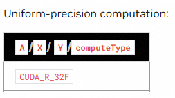
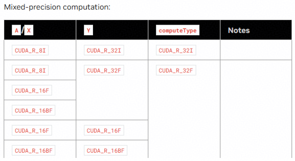
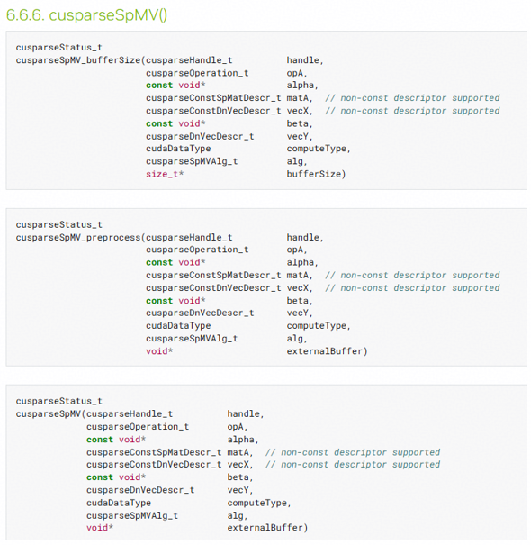
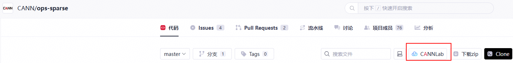

# SPMV算子开发任务书

## 基础信息
- **技术标签**：算子开发
- **适配硬件**：Ascend 950PR
- **开源仓地址**：https://gitcode.com/cann/ops-sparse
- **CANN 版本**：算子开源仓指定版本
- **开发语言**：Ascend C

## 任务概述
参考 [cusparse SPMV](https://docs.nvidia.com/cuda/cusparse/#cusparsespmv) 实现，在昇腾 NPU 上基于 Ascend C 编程语言实现功能一致的算子，完成算子设计、开发、测试全流程工作，验收通过后将算子提交至昇腾算子开源仓。

SPMV 计算公式：
$$Y = \alpha \cdot op(A) \cdot X + \beta \cdot Y$$
其中：
- $op(A)$ 稀疏矩阵（CSR 格式）
  - 当开启 transpose 时：$op(A) = A^T$（矩阵转置）  
  - 当不开启 transpose 时：$op(A) = A$（原矩阵）
- $X$ 为稠密输入向量
- $Y$ 为输入输出稠密向量
- $\alpha$、$\beta$ 为标量系数

## 核心开发要求及验收标准

### 功能实现要求
1. 与 GPU 核心功能对齐，支持CSR稀疏数据格式，支持数据类型组合如下：

| 输入 A、X 类型 | 计算类型 (computeType) | 输出 Y 类型 |
| ---- | ---- | ---- |
| float32 | float32 | float32 |
| int8 | int32 | int32 |
| int8 / float16 / bfloat16 | float32 | float32 |
| float16 | float32 | float16 |
| bfloat16 | float32 | bfloat16 |

2. 算子调用流程与 NVIDIA GPU 实现对齐，分三阶段完成调用：
- 阶段 1：获取workspacesize大小
- 阶段 2：预处理
- 阶段 3：算子执行

3. 必须实现算子泛化功能，满足各类合法输入矩阵/向量规模、稀疏度场景的计算需求，验收阶段将采用泛化数据进行验收。

### 参数说明
以下仅罗列算子底层原始输入参数，实际开发实现过程中，可参考 cuSPARSE 设计思路，将稀疏矩阵相关入参封装为统一描述符结构进行传参使用。

| 参数名 | 输入/输出/属性 | 描述 | 使用说明 | 数据类型 | 数据格式 | 维度Shape | 非连续Tensor |
| ---- | ---- | ---- | ---- | ---- | ---- | ---- | ---- |
| csrRowPtr | 输入 | 稀疏矩阵A行偏移数组 | 存储每行非零元素起始位置 | int32 | 一维数组 | [M+1] | 支持 |
| csrColInd | 输入 | 稀疏矩阵A列索引数组 | 存储非零元素所在列号 | int32 | 一维数组 | [NNZ] | 支持 |
| csrVal | 输入 | 稀疏矩阵A非零元素值 | 存储稀疏矩阵有效数值 | float16, bfloat16, float32, int8 | 一维数组 | [NNZ] | 支持 |
| x_vec | 输入 | 稠密输入向量X | 参与矩阵向量相乘计算 | float16, bfloat16, float32, int8 | 一维 | [K] | 支持 |
| y_vec | 输入输出 | 稠密输出向量Y | 承载最终计算结果，支持原位累加 | float16, bfloat16, float32, int32 | 一维 | [M] | 支持 |
| trans | 属性 | 矩阵转置标识 | 控制是否对A进行转置计算 | bool | - | - | - |
| alpha | 属性 | 前置缩放系数 | 缩放矩阵向量相乘结果 | float32 | - | - | - |
| beta | 属性 | 后置缩放系数 | 缩放原有Y向量数值 | float32 | - | - | - |
| compute_type | 属性 | 中间计算精度 | 指定计算过程数据精度 | int32, float32 | - | - | - |

### 测试标准
测试用例覆盖**常规场景、边界场景、转置/非转置、全数据类型、alpha/beta组合、稀疏度覆盖50%~99.9%**等所有功能场景；自验证报告完整、可复现，所有测试用例执行通过。

### 性能要求
算子整体性能需达到 0.5 倍 GPU（A100）水平，参考用例性能指标如下：

| 编号 | 矩阵规模 | 稀疏度 | 数据类型 | GPU A100 性能 |
| ---- | ---- | ---- | ---- | ---- |
| 1 | 128×128 | 95% | float32 | 43.9us |
| 2 | 1024×1024 | 99% | float32 | 46.3us |
| 3 | 2048×4096 | 97.5% | float32 | 45.4us |
| 4 | 160220×68750 | 99.9% | float32 | 193.2us |

### 精度要求
算子计算精度需严格满足《生态算子开源精度标准》：https://gitcode.com/cann/opbase/blob/master/docs/zh/ops_precision_standard/experimental_standard.md

### 文档规范要求
1. 算子设计文档需根据[参考模板](https://gitcode.com/cann/cann-competitions/blob/master/04_tasks/01_community-task-2026/resources/design_template.md)填写，内容完整、格式规范，且必须通过评审；
2. 自验证报告需要覆盖所有功能场景，参考[xxx算子自验证报告](https://docs.qq.com/sheet/DUmVWWndaUE12WGFB?tab=BB08J2)（不需要模板中TBE样例结果），含测试用例执行日志/截图、整体测试通过截图、性能数据截图，可清晰指导算子使用与测试；
3. README 文档内容完整、规范。

## 验收规则与流程

### 提交验收申请
联系昇腾小助手，提交以下**三类交付件**进行验收：

1. 昇腾开源算子仓 fork 的个人代码仓链接（需包含：算子工程代码、算子 README 文档、多组 aclnn 调用测试代码）；
2. 算子自验证报告；
3. 华为评审通过的算子设计文档（按模板填写），合入 [cann-competitions 仓库](https://gitcode.com/cann/cann-competitions/tree/master/04_tasks/01_community-task-2026/tasklist) 详细说明见 [readme](https://gitcode.com/cann/cann-competitions/blob/master/04_tasks/01_community-task-2026/README.md)。

### 验收结果反馈
验收以提交验收申请时的代码为准，72小时内反馈验收结果，如代码更新请重新提交验收申请，验收时间同步刷新。

### PR 申请合入
验收通过后，在昇腾算子开源仓提交 PR 申请，申请将开发完成的算子合入路径：https://gitcode.com/cann/ops-sparse/tree/master/src/spmv

## 参考资料
1. 文档类：[Ascend C算子开发文档](https://www.hiascend.com/document/detail/zh/CANNCommunityEdition/850/opdevg/Ascendcopdevg/atlas_ascendc_map_10_0002.html)、[算子开发接口文档](https://www.hiascend.com/document/detail/zh/canncommercial/850/API/ascendcopapi/atlasascendc_api_07_0003.html)
2. 课程类：[Ascend C在线课程](https://www.hiascend.com/developer/courses/detail/1691696509765107713)
3. 代码样例：[https://gitcode.com/cann/ops-sparse/tree/master/src/spmv](https://gitcode.com/cann/ops-sparse/tree/master/src/spmv)（当前实现为A2版本）

## 环境获取
1. 开源仓提供100小时免费时长，请不使用时及时关闭，用时耗尽前请务必保存相关资料，建议及时提交备份。
   
   
2. 使用 hidevlab notebook 算力（[https://hidevlab.huawei.com/online-develop-intro?from=hiascend](https://hidevlab.huawei.com/online-develop-intro?from=hiascend)）
3. 如需额外环境资源，请联系昇腾小助手。

## 特别注意事项

1. 开发过程需严格遵循 Ascend C 编程规范及算子开发相关要求；
2. 所有交付件需提前完成自验证，确认符合验收标准后再提交验收申请；
3. 开发前请务必阅读[【社区任务】流程及注意事项](https://gitcode.com/org/cann/discussions/39)，会例行更新。