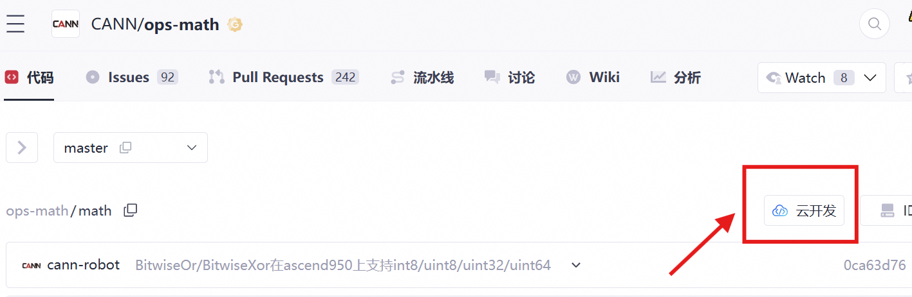
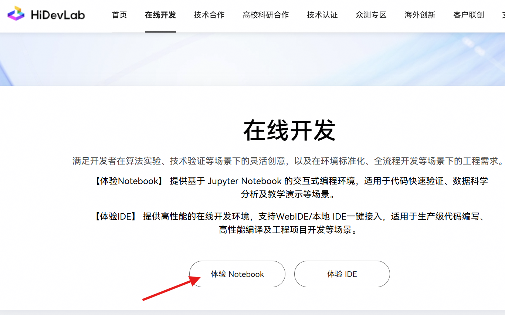

# 三角矩阵求解运算系列算子开发任务书

## 基础信息

- **技术标签**：算子开发
- **适配硬件**：Atlas A2 训练系列产品
- **开源仓地址**：[https://gitcode.com/cann/ops-blas](https://gitcode.com/cann/ops-blas)
- **CANN 版本**：算子开源仓指定版本
- **开发语言**：Ascend C

## 任务概述

参考 cuBLAS 库中的 `cublas<t>trsmBatched` 接口（https://docs.nvidia.com/cuda/cublas/index.html#2.7.12），在昇腾 NPU 上基于 Ascend C 编程语言实现功能一致的算子，完成算子设计、开发、测试全流程工作，验收通过后将算子提交至昇腾算子开源仓。

本任务同时支持 **float32（单精度实数）** 和 **complex<float>（单精度复数）** 两种数据类型。

## 算子定义

### 接口定义

#### StrsmBatched（单精度实数版本）

```c
void aclblasStrsmBatched(
    const char *side,          // 'L': 左乘, 'R': 右乘
    const char *uplo,          // 'U': 上三角, 'L': 下三角
    const char *transa,        // 'N': 不转置, 'T': 转置
    const char *diag,          // 'U': 单位三角, 'N': 非单位三角
    int m,                     // 矩阵 B 的行数
    int n,                     // 矩阵 B 的列数
    float alpha,               // 标量乘子
    float *const a[],          // 三角矩阵 A 的批处理（batchSize 个矩阵）
    int lda,                   // 矩阵 A 的前导维度
    float *const b[],          // 矩阵 B 的批处理（batchSize 个矩阵）
    int ldb,                   // 矩阵 B 的前导维度
    int batchCount             // 批处理数量
)
```

#### CtrsmBatched（单精度复数版本）

```c
void aclblasCtrsmBatched(
    const char *side,          // 'L': 左乘, 'R': 右乘
    const char *uplo,          // 'U': 上三角, 'L': 下三角
    const char *transa,        // 'N': 不转置, 'T': 转置
    const char *diag,          // 'U': 单位三角, 'N': 非单位三角
    int m,                     // 矩阵 B 的行数
    int n,                     // 矩阵 B 的列数
    complex<float> alpha,           // 复数标量乘子
    complex<float> *const a[],      // 三角矩阵 A 的批处理（batchSize 个矩阵）
    int lda,                   // 矩阵 A 的前导维度
    complex<float> *const b[],      // 矩阵 B 的批处理（batchSize 个矩阵）
    int ldb,                   // 矩阵 B 的前导维度
    int batchCount             // 批处理数量
)
```

### 功能描述

执行批量三角矩阵求解运算：求解 `A * X = alpha * B`（side='L'）或 `X * A = alpha * B`（side='R'），其中 A 为三角矩阵。支持批量处理多个相同尺寸的三角求解问题。

- **StrsmBatched**：单精度实数版本（float32），对标 cuBLAS `cublasStrsmBatched`。
- **CtrsmBatched**：单精度复数版本（complex64 / complex<float>），对标 cuBLAS `cublasCtrsmBatched`。

两个版本的计算逻辑一致，仅数据类型不同。复数版本涉及复数乘法、复数求逆等额外运算。

### 数据类型

- **StrsmBatched**：输入/输出为单精度浮点数（float32）
- **CtrsmBatched**：输入/输出为单精度复数浮点数（complex64，即 complex<float>）
- 数据格式：行主序（Row-Major）

## 核心开发要求及验收标准

### 功能实现要求

1. 与 cuBLAS `cublasStrsmBatched` / `cublasCtrsmBatched` 核心功能完全对齐，同时支持 **float32（单精度实数）** 和 **complex<float>（单精度复数）** 两种数据类型。
2. 必须支持左右乘模式（side='L'/'R'）、上下三角模式（uplo='U'/'L'）、转置模式（transa='N'/'T'）、单位三角矩阵模式（diag='U'/'N'）。
3. 必须支持批处理功能（batchCount > 0）。
4. 必须实现算子泛化功能，满足各类合法输入场景的计算需求，验收阶段将采用泛化数据进行验收。

### 测试标准

测试用例覆盖**常规场景、边界场景**等所有功能场景；自验证报告完整、可复现，所有测试用例执行通过。

### 性能要求

1. 算子整体性能需与0.8倍GPU（A100）持平，具体如下：

**StrsmBatched（单精度实数）**

| M | N | batchSize | side | uplo | transa | diag | GPU A100耗时(ms) | GPU A100 GFLOPS |
|---|---|-----------|------|------|--------|------|-------------------|-----------------|
| 64 | 64 | 32 | L | U | N | N | 0.035 | 80.1 |
| 128 | 128 | 16 | L | U | N | N | 0.076 | 147.8 |
| 64 | 64 | 32 | R | L | T | U | 0.021 | 133.0 |
| 128 | 128 | 16 | R | L | T | U | 0.058 | 194.4 |

**CtrsmBatched（单精度复数）**

| M | N | batchSize | side | uplo | transa | diag | GPU A100耗时(ms) | GPU A100 GFLOPS |
|---|---|-----------|------|------|--------|------|-------------------|-----------------|
| 64 | 64 | 32 | L | U | N | N | 0.031 | 366.2 |
| 128 | 128 | 16 | L | U | N | N | 0.076 | 591.5 |
| 64 | 64 | 32 | R | L | T | U | 0.023 | 485.0 |
| 128 | 128 | 16 | R | L | T | U | 0.062 | 726.8 |

### 精度要求

算子计算精度需满足 [AscendOpTest](https://gitcode.com/HIT1920/AscendOpTest) 工具默认阈值

### 文档规范要求

1. 算子设计文档需根据[参考模板](https://gitcode.com/cann/cann-competitions/blob/master/04_tasks/01_community-task-2026/resources/design_template.md)填写，内容完整、格式规范，且必须通过评审；
2. 自验证报告需要覆盖所有功能场景，参考[xxx算子自验证报告](https://docs.qq.com/sheet/DUmVWWndaUE12WGFB?tab=BB08J2)（不需要模板中TBE样例结果），含测试用例执行日志/截图、整体测试通过截图、性能数据截图，可清晰指导算子使用与测试；
3. README 文档内容完整、规范。

## 验收规则与流程

### 提交验收申请

联系昇腾小助手，提交以下**三类交付件**进行验收：

1. 昇腾开源算子仓 fork 的个人代码仓链接（需包含：算子工程代码、算子 README 文档、多组 aclnn 调用测试代码）；
2. 算子自验证报告；
3. 华为评审通过的算子设计文档（按模板填写），合入 [cann-competitions 仓库](https://gitcode.com/cann/cann-competitions/tree/master/04_tasks/01_community-task-2026/tasklist) 详细说明见 [readme](https://gitcode.com/cann/cann-competitions/blob/master/04_tasks/01_community-task-2026/README.md)。

### 验收结果反馈

验收以提交验收申请时的代码为准，72小时内反馈验收结果，如代码更新请重新提交验收申请，验收时间同步刷新。

### PR 申请合入

验收通过后，在昇腾算子开源仓提交 PR 申请，申请将开发完成的算子合入 https://gitcode.com/cann/ops-blas/tree/master/experimental。

## 参考资料

1. 文档类：[Ascend C算子开发文档](https://www.hiascend.com/document/detail/zh/CANNCommunityEdition/850/opdevg/Ascendcopdevg/atlas_ascendc_map_10_0002.html)、[算子开发接口文档](https://www.hiascend.com/document/detail/zh/canncommercial/850/API/ascendcopapi/atlasascendc_api_07_0003.html)
2. 课程类：[Ascend C在线课程](https://www.hiascend.com/developer/courses/detail/1691696509765107713)、[cuBLAS trsmBatched 参考](https://docs.nvidia.com/cuda/cublas/index.html#2.7.12)
3. 代码样例：[https://gitcode.com/cann/ops-blas/tree/master/experimental](https://gitcode.com/cann/ops-blas/tree/master/experimental)

## 环境获取

1. 开源仓提供100小时免费时长，请不使用时及时关闭，用时耗尽前请务必保存相关资料，建议及时提交备份。

   

2. 使用 hidevlab notebook 算力（[https://hidevlab.huawei.com/online-develop-intro?from=hiascend](https://hidevlab.huawei.com/online-develop-intro?from=hiascend)）

   
   

3. 如需额外环境资源，请联系昇腾小助手。

## 特别注意事项

1. 开发过程需严格遵循 Ascend C 编程规范及算子开发相关要求；
2. 所有交付件需提前完成自验证，确认符合验收标准后再提交验收申请；
3. 开发前请务必阅读[【社区任务】流程及注意事项](https://gitcode.com/org/cann/discussions/39)，会例行更新。
