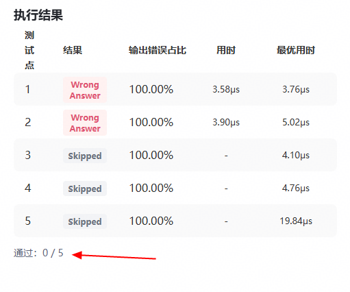
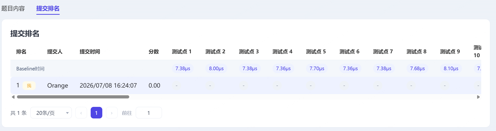

# CANN训练营2026暑期季 – 西安交通大学专场-SyncBatchNormBackwardReduce算子开发任务书

## 基础信息

- **技术标签**：算子开发
- **适配硬件**：Atlas A2 训练系列产品/Atlas A3 系列产品
- **开源仓地址**：https://gitcode.com/cann/ops-nn
- **CANN 版本**：算子开源仓指定版本
- **开发语言**：Ascend C

## 任务概述

参考昇腾版本内置aclnnBatchNormReduceBackward算子的 TBE 实现，在昇腾 NPU 上基于 Ascend C 编程语言实现功能一致的算子, 完成算子设计、开发、测试全流程工作，验收通过后将算子提交至昇腾算子开源仓。

## 核心开发要求及验收标准

### 功能实现要求

1. 与原 TBE 算子核心功能完全对齐，支持原算子对应的所有数据类型、数据格式，并且比较方式从二进制比较改为逻辑值比较。
2. 必须实现算子泛化功能，满足各类合法输入场景的计算需求，验收阶段将采用泛化数据进行验收。

### 测试标准

需参考内置 TBE 算子自行设计全场景自验证用例，验收阶段将采用泛化数据进行功能、精度、性能全维度验证。自验证报告完整、可复现，所有测试用例执行通过。

### 性能要求

1. 暂仅要求**所有核参与计算场景**下，性能不低于原 TBE 算子的 95%。
2. 如小shape无法达标（10us以下场景相差3us），提供性能仿真图和分析结论证明Ascend C实现与TBE完全一致或优于TBE实现。

### 精度要求

算子计算精度需满足 [CANN Judge](https://cannjudge.cn/home)平台对应题目精度默认阈值。

### 文档规范要求

1. 算子设计文档，需根据[参考模板](https://gitcode.com/cann/cann-ops-competitions/blob/master/04_tasks/01_community-task-2026/resources/design_template.md)填写，内容完整、格式规范，且必须通过评审；评审通过后合入[cann-competitions 仓库](https://gitcode.com/cann/cann-competitions/tree/master/04_tasks/01_community-task-2026/tasklist)，详细说明见[readme](https://gitcode.com/cann/cann-competitions/blob/master/04_tasks/01_community-task-2026/README.md)。
2. 自验证报告需要覆盖所有功能场景，参考[xxx算子自验证报告](https://docs.qq.com/sheet/DUmVWWndaUE12WGFB?tab=BB08J2)，含测试用例执行日志/截图、整体测试通过截图、性能数据截图，可清晰指导算子使用与测试；
3. README 文档内容完整、规范。

## 验收交付件

完成算子开发和功能自验（使用[CANNJudge](https://cannjudge.cn/home)平台）后，点击【提交验收】上传交付件。待后台测试通过后，提交PR并成功合入，验收通过。

交付内容：压缩包内需包含自测报告等任务书要求内容。其中，用例结果需要包含：

1，CANNJudge中用例通过数截图（若用例较多，仅需包含用例通过数即可），要求全部通过。

   

2，“提交排名”页面中每一个测试点的性能，要求性能小于Baseline时间，将所有用例的测试结果复制粘贴到excel表格中。

   

并在【说明】中按下图填写算子代码的私仓邀请链接、代码仓路径、分支、算子目录。

   

交付件要求：只能上传zip格式，且文件最大不超过100M。
验收说明：提交验收后将无法修改当前进展，审核期间无法更新验收信息；审核人将根据提交验收时间按序验收。

### PR 申请合入

第一个通过测试的开发者在收到通知后2个工作日内联系昇腾CANN小助手提交需求issue和代码PR，并根据检视意见修改代码，直到PR合入。

需要将开发完成的算子合入（https://gitcode.com/cann/ops-nn/tree/master/experimental/norm）。

## TBE 参考实现路径

本次开发需参考昇腾CANN内置 TBE 算子实现，具体文件路径如下：

1. kernel 实现：`/usr/local/Ascend/ascend-toolkit/latest/opp/built-in/op_impl/ai_core/tbe/impl/dynamic/`
2. 算子原型：`/usr/local/Ascend/ascend-toolkit/latest/opp/built-in/op_proto/inc/`
3. 算子信息库：`/usr/local/Ascend/ascend-toolkit/latest/opp/built-in/op_impl/ai_core/tbe/config/ascend910b`

## 参考资料

1. 文档类：[Ascend C算子开发文档](https://www.hiascend.com/document/detail/zh/CANNCommunityEdition/850/opdevg/Ascendcopdevg/atlas_ascendc_map_10_0002.html)、[TBE算子开发文档](https://www.hiascend.com/document/detail/zh/canncommercial/850/opdevg/tbeaicpudevg/atlasopdev_10_0001.html)、[算子开发接口文档](https://www.hiascend.com/document/detail/zh/canncommercial/850/API/ascendcopapi/atlasascendc_api_07_0003.html)
2. 课程类：[Ascend C在线课程](https://www.hiascend.com/developer/courses/detail/1691696509765107713)
3. 代码样例：[ops-math/experimental/math/bitwise_and ](https://gitcode.com/cann/ops-math/tree/master/experimental/math/bitwise_and)

## 环境获取

1. 开源仓提供100小时免费时长，请不使用时及时关闭，用时耗尽前请务必保存相关资料，建议及时提交备份。

   

2. 使用 hidevlab 算力（[https://hidevlab.huawei.com/online-develop-intro?from=hiascend](https://hidevlab.huawei.com/online-develop-intro?from=hiascend)）

     

3. 如需额外环境资源，请联系昇腾小助手。

## 特别注意事项

1. 开发过程需严格遵循 Ascend C 编程规范及算子开发相关要求；
2. 所有交付件需提前完成自验证，确认符合验收标准后再提交验收申请；
3. 开发前请务必阅读[【社区任务】流程及注意事项](https://gitcode.com/org/cann/discussions/39)，会例行更新。