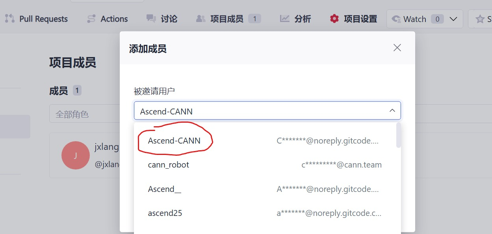

# 7月社区任务-aclnnRemainderTensorTensor算子开发任务书

## 基础信息

- **技术标签**：算子开发、内存优化
- **适配硬件**：Atlas A2/A3 训练系列产品
- **开源仓地址**：https://gitcode.com/cann/ops-math/tree/master/math/floor_mod
- **CANN 版本**：CANN 8.5.0及以上
- **开发语言**：Ascend C

## 任务概述

`Tensor.remainder` 对应的 `aclnnRemainderTensorTensor` 算子当前内存一致性不达标，与 GPU 存在内存差距，需要将内存差距降至 5% 以下。

**现状与根因**：aclnn 侧做了 Broadcast，导致内存膨胀为 Broadcast 推导之后 shape 的大小，膨胀约 50%。GPU 侧不存在该膨胀。

本任务通过消除/优化 Broadcast 带来的中间膨胀，使 `aclnnRemainderTensorTensor` 内存与 GPU 差距控制在 5% 以下。

## 核心开发要求

### 功能实现要求

1. 消除/优化 aclnn 侧 Broadcast 引入的中间 tensor 膨胀（避免先广播落盘再计算），采用 inplace 或不落盘广播计算方式。
2. 内存占用与 GPU 差距控制在 5% 以下。
3. 计算结果与 PyTorch `torch.remainder` / `Tensor.remainder` 语义一致，不影响原有功能。
4. 支持两个 tensor 输入（含 broadcast 场景）。

### 参数说明

| 参数名 | 输入／输出/属性 | 描述 | 使用说明 | 数据类型 | 数据格式 | 维度(shape) | 非连续Tensor |
|---|---|----|------------|----------|----------|-----------|-----|
| self | 输入 | 被除数 tensor | - | INT32、INT64、FLOAT16、FLOAT、DOUBLE、BFLOAT16| ND | 任意 | - |
| other | 输入 | 除数 tensor | 与 self 可广播 | 同 self | ND | 与 self 广播 | - |
| output | 输出 | 余数结果 | 与广播后 shape 一致 | 同 self | ND | 广播后 shape | - |

### 算子约束限制

无

## 测试标准

请根据给出的自测用例和测试指导完成自测，并输出自测报告。

### 内存一致性要求（核心验收）

`aclnnRemainderTensorTensor` 实现与 GPU 内存差距 **5% 以下**。

### 精度要求

和原算子对齐，计算精度需满足 [AscendOpTest](https://gitcode.com/HIT1920/AscendOpTest) 工具默认阈值。

### 性能要求

不低于原算子性能。

## 验收交付件

1. 算子设计文档（含 Broadcast 膨胀优化方案与内存分析），需根据[参考模板](https://gitcode.com/cann/cann-ops-competitions/blob/master/04_tasks/01_community-task-2026/resources/design_template.md)填写，内容完整、格式规范，且必须通过评审；评审通过后合入[cann-competitions 仓库](https://gitcode.com/cann/cann-competitions/tree/master/04_tasks/01_community-task-2026/tasklist)，详细说明见[readme](https://gitcode.com/cann/cann-competitions/blob/master/04_tasks/01_community-task-2026/README.md)。
2. 可指导算子使用与测试的交付件：自测用例、测试代码脚本及脚本运行 README；测试结果报告，需包含所有自测用例结果，含内存对比数据、精度结果、整体测试通过截图。
3. 个人代码仓链接、代码仓路径、分支、算子目录。README 文档内容完整、规范。需要在个人仓邀请账号`Ascend-CANN`作为开发者，如下所示：

## PR 申请合入

测试通过后，在昇腾算子开源仓提交 PR 申请，申请将开发完成的算子合入对应目录：https://gitcode.com/cann/ops-math/tree/master/experimental/math 。

## 参考资料

1. 文档类：[Ascend C算子开发文档](https://www.hiascend.com/document/detail/zh/CANNCommunityEdition/850/opdevg/Ascendcopdevg/atlas_ascendc_map_10_0002.html)、[算子开发接口文档](https://www.hiascend.com/document/detail/zh/canncommercial/850/API/ascendcopapi/atlasascendc_api_07_0003.html)
2. PyTorch 参考：[torch.remainder](https://pytorch.org/docs/stable/generated/torch.remainder.html)
3. 代码样例：https://gitcode.com/cann/ops-math/tree/master/math/floor_mod

## 环境获取

1. 开源仓提供100小时免费时长，请不使用时及时关闭，用时耗尽前请务必保存相关资料，建议及时提交备份。

   

2. 使用 hidevlab 算力（[https://hidevlab.huawei.com/online-develop-intro?from=hiascend](https://hidevlab.huawei.com/online-develop-intro?from=hiascend)）

     

3. 如需额外环境资源，请联系昇腾小助手。

## 特别注意事项

1. 开发过程需严格遵循 Ascend C 编程规范及算子开发相关要求；
2. 所有交付件需提前完成自验证，确认符合验收标准后再提交验收申请；
3. 内存一致性为本任务核心验收项，需提供与 GPU 的内存对比数据（重点覆盖 broadcast 场景）。
4. 开发前请务必阅读[【社区任务】流程及注意事项](https://gitcode.com/org/cann/discussions/39)，会例行更新。
