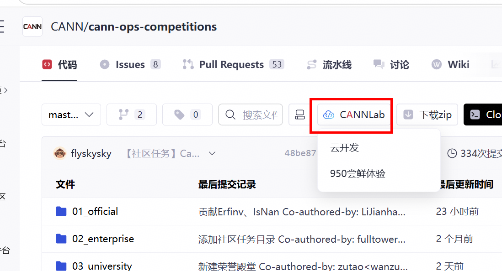

# 8月社区任务 - graclus_cluster 算子开发任务书

## 任务概述

实现与 `torch_cluster.graclus_cluster`（https://github.com/rusty1s/pytorch_cluster ，版本建议≥ 1.6.0） **接口完全一致** 的 NPU 版本。Graclus 为图**贪心聚类**：按随机顺序遍历未标记顶点，将其与未标记邻居中**边权最大**者配对（无权重时取首个未标记邻居）。

**验收口径**：PyTorch 层 `graclus_cluster()` 为准；aclnn 可选。

### 功能定义

- 输入：COO 边 `row`、`col`；可选边权 `weight`；可选 `num_nodes`
- 输出：每个节点的 **cluster 标号**（LongTensor，`[num_nodes]`）

### Python 预处理（须在 PyTorch 层复现）

1. `num_nodes` 默认 `max(row.max(), col.max())+1`
2. **去除自环**：`row != col`
3. **无 weight** 时：随机打乱边顺序
4. 按 `row` **排序** 转 CSR：`rowptr`、`col`（及 weight）
5. 调用 `torch.ops.torch_cluster.graclus(rowptr, col, weight)`

---

## 核心开发要求及验收标准

开发/测试硬件和软件要求：
- **适配硬件**：Ascend 950PR
- **CANN 版本**：算子开源仓（https://gitcode.com/cann/ops-gnn ）指定版本

### 1. PyTorch 层接口（**必选**）

```python
def graclus_cluster(
    row: torch.Tensor,
    col: torch.Tensor,
    weight: Optional[torch.Tensor] = None,
    num_nodes: Optional[int] = None,
) -> torch.Tensor: ...
```

### 2. 参数与约束

| 参数 | 类型 | 约束 |
|------|------|------|
| `row` | Long `[E]` | 源节点，`0 ≤ row[i] < num_nodes` |
| `col` | Long `[E]` | 目标节点，同范围 |
| `weight` | Optional Float `[E]` | 与边一一对应；有 weight 时不随机打乱边 |
| `num_nodes` | Optional int | 默认由 row/col 推断 |

| 输出 | 类型 | 说明 |
|------|------|------|
| cluster | Long `[num_nodes]` | 聚类 ID；配对节点同 ID，未配对节点自身为簇 |

**Kernel 输入（预处理后）**：

| 参数 | 类型 | 约束 |
|------|------|------|
| `rowptr` | Long `[num_nodes+1]` | CSR 行指针，单调 |
| `col` | Long `[E]` | 排序后列索引 |
| `weight` | Optional Float `[E]` | L1 float16/32；L2 float64 可选 CPU 回退或低精度拼接 |

### 3. 数据类型分级

| 级别 | 张量 | 路径 |
|------|------|------|
| L1 | weight: float16/bfloat16/float32 | NPU |
| L2 | weight: float64 | CPU 回退 或 NPU 低精度拼接（**不做性能考核**） |
| — | row/col/rowptr/cluster: int64 | NPU（图索引） |

无 weight 时纯 int64 图逻辑，**全程 NPU**。

### 4. 算子约束

1. 算法含**随机性**（`randperm` 节点顺序、无 weight 时边 shuffle）；同 seed 应可复现；
2. 有 weight 时选 **weight 最大** 的未标记邻居配对；
3. 无 weight 时选 **第一个** 未标记邻居（与 CPU 一致）；
4. 仅验收前向。

### 5. 功能验收用例

| 编号 | 场景 | 参考 |
|------|------|------|
| TC-01 | 小图无 weight | `test/test_graclus.py` |
| TC-02 | 带 weight | 同上 |
| TC-03 | 指定 num_nodes | 同上 |
| TC-04 | 含自环（应被去除） | 自行构造 |
| TC-05 | float64 weight L2 路径 | 自行构造 |
| TC-06 | 空边 | 自行构造 |

### 6. 性能要求

| 分档 | 场景 | **达标基线（≥ A100）** |
|------|------|------------------------|
| S1 | \|V\|=10⁴, \|E\|=10⁵ | **0.50×** |
| S2 | \|V\|=10⁵, \|E\|=10⁶ | **0.45×** |
| S3 | 带 weight | **0.45×** |

验收取最优实现；float64 weight L2 路径**不做性能考核**。

### 7. 精度要求

算子计算精度需严格满足《生态算子开源精度标准（https://gitcode.com/cann/opbase/blob/master/docs/zh/ops_precision_standard/experimental_standard.md ）》，采用 AscendOpTest（https://gitcode.com/HIT1920/AscendOpTest ） 测试。

**真值生成方式**：以 CPU 版 torch_cluster 为标杆；NPU 结果通过 **PyTorch 层 `graclus_cluster()`** 调用获取并与标杆比对。须 **固定 RNG seed**（Python 层 shuffle/randperm）。

**单标杆不满足时**：采用 ATK（https://gitcode.com/AscendTest/ATK ） 双标杆比对（`cv_fused_double_benchmark`），以更高精度的 CPU 实现为真值，同时评估同精度 CPU 与 NPU 算子实现相对于该真值的误差；满足条件为 NPU/同精度 CPU 的**最大相对误差比例 ≤ 2**、**平均相对误差比例 ≤ 1.2**、**均方根误差比例 ≤ 1.2**。

| 数据类型 / 场景 | 精度策略 |
|-----------------|----------|
| cluster 输出（int64） | 固定 seed 下与 CPU 标杆 **bit-wise 一致** |
| L1 weight（float16/32） | 有 weight 时按最大 weight 配对；cluster 与 CPU 一致 |
| L2 float64 weight | CPU 回退 bit-wise 一致；低精度拼接 README 文档化精度策略 |

---

## 验收交付件

在社区任务IT系统中提交验收时， 需要提交以下交付件：

| 序号 | 交付件名称 | 交付件要求 |
|------|-----------|------------|
| 1 | 算子设计文档 | 1. 设计文档模板：https://gitcode.com/cann/cann-competitions/blob/master/04_tasks/01_community-task-2026/resources/design_template.md ；<br> 2. 在cann-competitions 仓库（https://gitcode.com/cann/cann-competitions/tree/master/04_tasks/01_community-task-2026/tasklist ）以PR形式提交设计文档，通过评审后合入仓库，详细说明见：https://gitcode.com/cann/cann-competitions/blob/master/04_tasks/01_community-task-2026/README.md|
| 2 | 自测用例及测试代码 |1. 需要清晰列出精度测试case和性能测试case；<br> 2. 测试代码中的readme文件需要说明测试步骤，保证验收人可以复现测试结果|
| 3 | 自测报告 | 1. 自测报告模板：https://docs.qq.com/sheet/DUmVWWndaUE12WGFB?tab=BB08J2 ；<br> 2. 需要包含用例参数、精度对比结果及截图、性能数据及截图 |
| 4 | 待验收代码地址 | 1. 个人代码仓链接、分支、算子目录；需要在个人仓邀请账号Ascend-CANN作为开发者，如下图所示； <br> 2. 算子目录下需要提供readme文件，参考：https://gitcode.com/cann/ops-transformer/blob/master/attention/chunk_gated_delta_rule/README.md <br> |


### PR 申请合入

- PR 路径建议：`ops-gnn/graclus` （导出 API 名：**`graclus_cluster`**）

## 参考资料

- `torch_cluster/graclus.py`、`csrc/cpu/graclus_cpu.cpp`、`csrc/cuda/graclus_cuda.cu`

## 环境获取

1. 使用 hidevlab webIDE 算力：https://hidevlab.huawei.com/online-develop-intro?from=hiascend ；
   - 如果是新用户，在申请权限的时候需要备注使用的算力类型（A2、A3或者950）；
   - 如果是老用户且需要使用950算力，需要向昇腾CANN小助手反馈账号名（个人中心->基本信息，如下图所示），后台会添加账号至950使用白名单。

     
     

2. 开源仓提供100小时免费时长，请不使用时及时关闭，用时耗尽前请务必保存相关资料，建议及时提交备份。

   

3. 如需额外环境资源，请联系昇腾CANN小助手。

## 特别注意事项

1. **预处理在 Python 层完成**，与原版分工一致；
2. 聚类结果含随机性，验收用固定 seed 或统计等价性；
3. 接口名必须为 `graclus_cluster`；
4. 开发须严格遵循 Ascend C 编程规范、Python/PyTorch 扩展开发规范及 Ascend 950PR 算子开发相关要求；
5. 所有交付件须提前完成自验证，确认符合验收标准后再提交；
6. 开发前务必阅读【社区任务】流程及注意事项（https://gitcode.com/org/cann/discussions/39 ）。