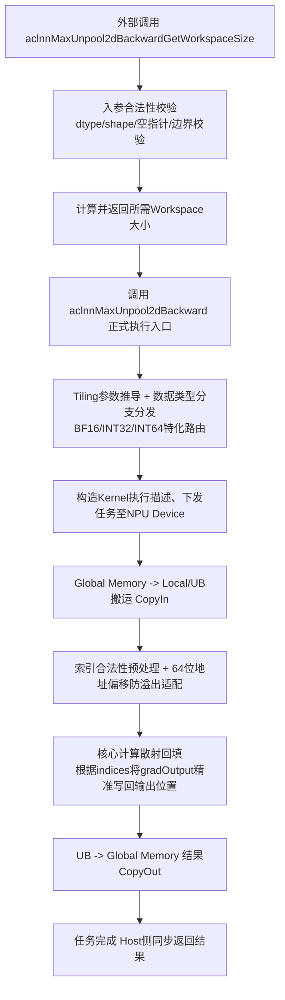

# aclnnMaxUnpool2dBackward 设计文档

## 需求背景（required）

### 需求来源
社区任务《aclnnMaxUnpool2d 算子开发任务书》。本次需求聚焦于 `aclnnMaxUnpool2dBackward` 的接口能力补齐与测试覆盖。

### 背景介绍

#### aclnnMaxUnpool2d 算子实现优化
当前 `aclnnMaxUnpool2dBackward` 的 self 输入不支持 BF16 数据类型，indices 仅支持 int64。需要在原有代码基础上重新开发，使其支持 BF16 数据类型，并补齐 indices 的 int32/int64 支持，同时完成算子设计、算子开发与算子测试任务。

#### aclnnMaxUnpool2d 算子（TBE）实现路径和相关 API 路径
本任务不涉及重写 TBE 算子内核，主要参考现有算子接口与仓库结构完成 Ascend C / API 层适配。相关实现和文档仍遵循 ops-math 仓库的算子目录规范。

#### aclnnMaxUnpool2d 算子现状分析
通过对 `aclnnMaxUnpool2dBackward` 现有实现的功能分析，当前能力如下：

| 参数 | 参数含义 | 数据类型 | 支持数据类型 | 约束 | 形状 |
|-----|--------|--------|-----------|------|------|
| gradOutput/self | 输入 tensor | tensor | float16, float32, bfloat16, int32, int64, int16, int8, uint8, bool | self 与 indices 形状一致 | (N,C,H,W) 或 (C,H,W) |
| indices | 输入 tensor | tensor | int64, int32 | 需要与 self 形状一致 | (N,C,H,W) 或 (C,H,W) |
| outputSize | 输入 array | int array | int64 | 长度必须为 2 | [H, W] |
| out | 输出 tensor | tensor | float16, float32, bfloat16, int32, int64, int16, int8, uint8, bool | shape 与 self 一致 | (N,C,H,W) 或 (C,H,W) |

计算公式：out[n][c][i] = gradOutput[n][c][indices[n][c][i]]

#### aclnnMaxUnpool2d 算子功能分析
- 算子功能：根据 indices 将 gradOutput 的元素写回 out 指定位置
- 输入：gradOutput、self、indices、outputSize
- 输出：out
- 支持数据类型：self/gradOutput/out 支持 BF16；indices 支持 int64/int32
- 支持广播：不支持广播，要求 self 与 indices 形状一致

## 需求分析（required）

### 需求描述
使用现有算子框架完成 `aclnnMaxUnpool2dBackward` 的能力补齐，支持 self 输入为 BF16，indices 支持 int64/int32，并完成对应设计文档与测试用例补充。

### 需求拆解
- 支持 self/gradOutput/out 的 BF16 数据类型
- 支持 indices 的 int64 与 int32 数据类型
- 保持原有形状约束与语义一致
- 完成对应单元测试补充与验证

## 详细设计（required）

### 算子分析

#### 数学公式
out[n][c][i] = gradOutput[n][c][indices[n][c][i]]

#### 支持数据类型
gradOutput/self/out 支持 float16、float32、bfloat16、int32、int64、int16、int8、uint8、bool；indices 支持 int64、int32。

#### 支持形状
支持 3 维或 4 维输入，shape 需满足：
- self 与 indices 形状一致
- gradOutput 的 shape 与 outputSize 对应
- out 的 shape 与 self 一致

### 算子实现

#### 实现方案

##### 3.2.0 整体执行流程图
按照 Ascend C 算子开发标准，补充本算子的 `Host` 侧接口调度与底层 `Device` 侧 Kernel 执行的整体流程图：

##### 3.2.1 host 侧设计：

**参数校验策略：**

在 host 侧完成入参合法性检查，重点包括：
- 指针非空检查
- dtype 合法性检查
- shape 维度合法性检查
- self、indices、out shape 一致性检查
- outputSize 长度为 2 的检查
- gradOutput 最后两维与 outputSize 一致性检查

**dtype 支持策略：**

- 将 `self/gradOutput/out` 的支持类型扩展为包含 `BFLOAT16`
- 将 `indices` 的支持类型扩展为 `INT32` 与 `INT64`
- 保持其余 dtype 行为不变

**数据路径策略：**

- 当输入满足原始约束时，沿用现有 `aclnnMaxUnpool2dBackwardGetWorkspaceSize` + `aclnnMaxUnpool2dBackward` 的两段式接口
- 不改变现有输出语义，仅放宽 dtype 支持范围
- 若下游执行流程在 BF16 路径存在限制，可通过最小侵入方式插入类型转换逻辑，但优先保证 API 层支持与测试覆盖

**任务均分：**

本算子以一致性校验与元素回填为主，不涉及大规模 tiling 分块。Host 侧仅负责参数校验、数据类型放宽与执行器生成。

**批量搬运：**

本算子不引入新的大块搬运策略，保持现有流程和执行器调度方式，不额外增加多余拷贝。

**1. 分核策略：**

优先使用现有执行器中的调度策略，不额外改变核间分配逻辑。

**2. 数据检测和内存策略：**

仅在 API 层进行输入合法性检测，不新增额外缓存占用；如需临时 cast，则尽量控制在执行器流水线中完成。

**3. tilingkey 规划策略：**

本算子不涉及独立 tilingkey 规划，继续采用现有执行器路径。

##### 3.2.2 kernel 侧设计：

本任务主要为 API 层与测试覆盖补齐，kernel 侧保持现有执行路径；如运行环境对 BF16 不支持，则通过兼容路径完成类型转换后再执行已有流程。

##### 3.2.3 算子泛化功能设计

为满足全场景兼容的泛化要求，本算子将在 API 层面进行以下特化兼容处理：
- **多维度 shape 兼容**：支持 (C, H, W) 3D 与 (N, C, H, W) 4D 形状，内部统一按照高维展平方式进行 1D 线性映射，屏蔽 shape 差异对回填计算的干涉。
- **极端与边界 shape**：针对某一维度值为 1（例如极度非长宽等比输入）或者极端稀疏输入，复用已有寻址公式不变。对于存在 0 维度的 Tensor，直接进行 host 侧短路拦截并立即返回完成，避免 Launch kernel 导致的硬件异常。
- **dtype 泛化支持**：不同 dtype 的 self/out 回填逻辑在下属的算子流水线中应维持强一致。在输入阶段若检测到数据类型异常，立即借助框架校验宏拦截，避免混用非法 dtype。

##### 3.2.4 BF16 与 int32 indices 专属适配说明

**BF16 技术细节：**
- **类型流转与计算**：在 host 侧解析算子入参时，识别 `bfloat16` 并将对应 `DataType` 透传给执行器；在 kernel 层，计算回填操作本身不需要进行复杂的数值运算，仅进行单纯的内存搬移（Load-Store），因此不存在数值精度折损。
- **精度对齐**：BF16 和 FP32 利用相同宽度的高位指数位，但在该算子回填拷贝的语义下，输出值与输入 `gradOutput` 中的原始像素点必须做到位级别（bit-wise）的100%完全一致。

**int32 indices 专项逻辑：**
- **越界判断差异**：int32 类型支持的索引范围存在物理上限（最大 ~2.14x10^9），但在本算子特征图对应的索引寻址中，所有局部坐标在转一维物理地址时需以 64 位整数处理，防止在进行多维度乘加降维时产生 int32 截断溢出。
- **寻址适配兼容**：无论是 int64 还是 int32 传入，在指针访问偏移基址计算阶段，统一将索引计算局部变量提升为 64-bit 宽，确保大内存访存不会引发非法地址越界。

### 数据检测：

- 数据类型检测：self/gradOutput/out 允许 BF16；indices 允许 INT32/INT64
- 形状检测：self、indices、out 形状一致，gradOutput 与 outputSize 一致
- 越界检查：保持现有 indices 与 outputSize 检查逻辑不变

### 支持硬件

| 支持的芯片版本 | 涉及勾选 |
|-------------|--------|
| Atlas A2 训练系列产品 / Atlas A3 系列产品 | √ |

### 算子约束限制

- 不支持广播，self 与 indices 必须完全一致
- outputSize 仅允许两个元素
- 兼容性处理应尽量不改变已有数值语义

## 可维可测分析

### 精度标准/性能标准

| 验收标准 | 描述 | 标准来源 |
|--------|------|--------|
| 精度标准 | 算子计算精度需满足 AscendOpTest 工具默认阈值 | 任务书要求 |
| 性能标准 | 性能与 fp16/原有 dtype 路径保持持平，不引入明显回退 | 任务书要求 |

### 测试用例规划

为实现任务书要求的全功能场景覆盖，制定以下测试用例规划表，所有用例均须在测试阶段达成 100% Pass：

| 测试场景分类 | 用例描述 | 输入维度(Shape)及属性 | 数据类型 (self, gradOut / indices) | 预期结果 |
|------------|---------|--------------------|---------------------------------|---------|
| **基础正向** | 常规 4D 数据满载回填 | `(2, 3, 4, 4)`, `outputSize=[4, 4]` | FP32 / INT64 | 数值精确回填，空值处理正确 |
| **基础正向** | 常规 3D 数据满载回填 | `(3, 4, 4)`, `outputSize=[4, 4]` | FP16 / INT32 | 数值精确回填，空值处理正确 |
| **BF16 专属** | BF16 精度无损透传测试 | `(2, 4, 4, 4)`, `outputSize=[4, 4]` | BF16 / INT64 | bit-wise 完全等同，不产生多余舍入误差 |
| **BF16 专属** | BF16 + int32 杂交测试 | `(2, 4, 4, 4)`, `outputSize=[4, 4]` | BF16 / INT32 | 正常执行寻址并拷贝 |
| **边界及异常** | 0 维度空张量输入测试 | `(2, 0, 4, 4)`, `outputSize=[4, 4]` | BF16 / INT32 | Host 侧短路返回或安全绕过，无 coredump |
| **边界及异常** | 极度不平衡长张量 | `(1, 1, 1, 11)`, `outputSize=[1, 11]` | FP32 / INT64 | 结果正确，防止连续访存优化导致越界 |
| **泛化极值** | indices 取边界极值 | `(2, 4, 4, 4)` 包含最大边界索引 | BF16 / INT32 | 精准防越界，不触发内存访问段错误 |

### 兼容性分析

新算子/新能力补齐，不涉及旧接口破坏；在保持原语义的基础上放宽 BF16 与 indices 的 dtype 支持范围。

### 风险与降级预案

- 若 BF16 路径在下游流程中存在不支持情况，优先采用兼容转换方案保证可用性
- 若 indices 的 int32 路径存在边界差异，需通过 UT 与边界值验证确认语义一致
- 若本地环境缺少 Ascend/CANN 工具链，则仅能完成设计与代码静态验证，运行验证需在具备环境的机器上完成

## 附录：修订记录

| 日期 | 修订版本 | 修改描述 | 作者 |
|------|---------|---------|------|
| 2026-05-20 | v1.0.0 | 初稿构建：完成 aclnnMaxUnpool2dBackward 接口与类型分析 | - |
| 2026-05-20 | v1.1.0 | 补全算子泛化设计、BF16与INT32专项适配方案及详细测试规划表 | - |

