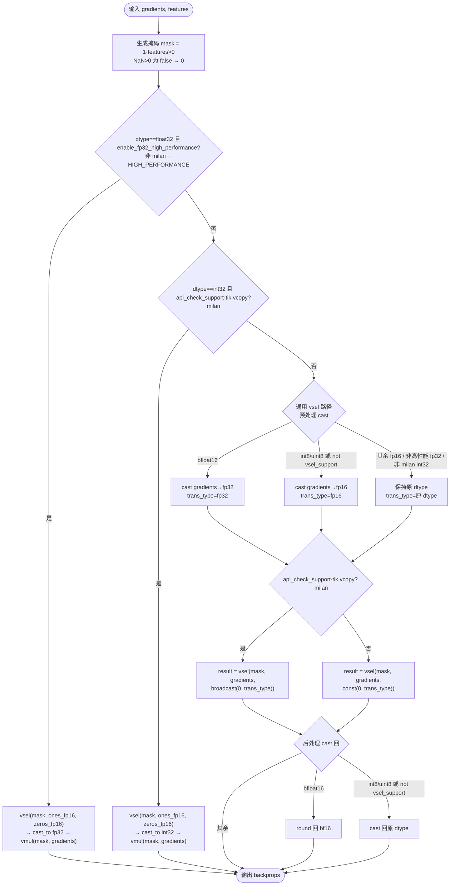
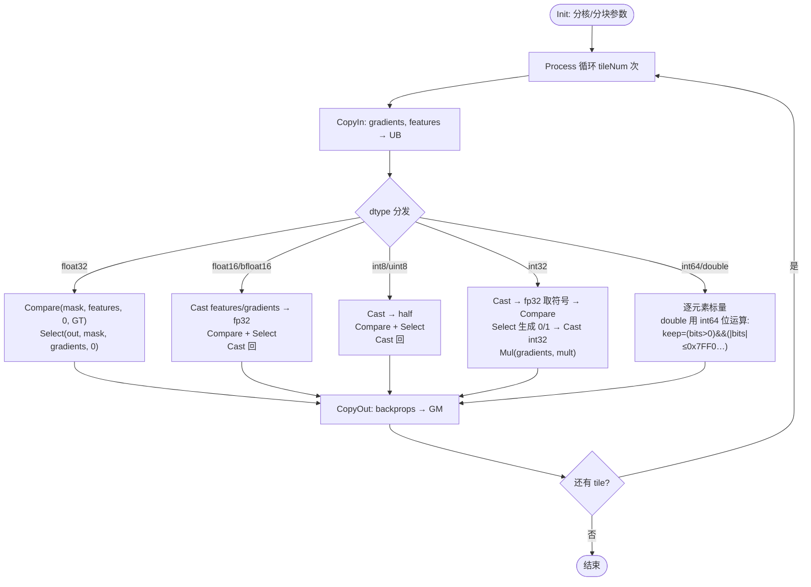

【社区任务】ReluGradV2算子设计文档

# 一、需求背景（required）

## 1.1 需求来源

通过社区任务完成开源仓算子贡献的需求。CANN 社区任务 2026 `02-16 ReluGradV2`：参考昇腾 CANN 内置 ReluGradV2 算子的 TBE 实现，在昇腾 NPU（Atlas A2 训练系列产品）上用 Ascend C 实现功能一致的算子（覆盖原 TBE 全部数据类型与格式）。**注：《算子任务书》明确「暂无需支持 int64、double 数据类型」；本实现在满足任务书必需范围之上，额外增强支持 int64、double（可选，不属验收必需范围）。** 验收通过后合入开源仓 `ops-nn`（`experimental/activation`）。

## 1.2 背景介绍

### 1.2.1 ReluGradV2算子实现优化

基于 ReluGradV2 算子历史 TBE 版本使用 Ascend C 编程语言进行优化（向量化）并扩展数据类型。

ReluGradV2 算子（TBE）实现路径和相关路径（含文件名）：

- TBE kernel 实现：`/usr/local/Ascend/ascend-toolkit/latest/opp/built-in/op_impl/ai_core/tbe/impl/ops_legacy/dynamic/relu_grad_v2.py`
- 算子原型：`/usr/local/Ascend/ascend-toolkit/latest/opp/built-in/op_proto/inc/nn_training_ops.h`（`ReluGradV2`）
- 算子信息库：`/usr/local/Ascend/ascend-toolkit/latest/opp/built-in/op_impl/ai_core/tbe/config/ascend910b/aic-ascend910b-ops-info-legacy.json`（`ReluGradV2`）
- aclnn 接口：`aclnnThresholdBackward`（ReluGradV2 在 aclnn 层对应 ThresholdBackward，threshold=0）。

### 1.2.2 ReluGradV2算子现状分析

#### 1.2.2.1 TBE算子支持的数据类型和数据格式

与算子信息库（`aic-ascend910b-ops-info-legacy.json`）保持一致：

| 参数 | 参数含义 | 数据类型 | 支持数据类型 | 约束 | 数据格式 | 形状 |
| --- | --- | --- | --- | --- | --- | --- |
| gradients | 反向梯度 dy | tensor | float16, float32, bfloat16, int32, int8, uint8 | 与 features 同形同类型 | ND | (N,…) |
| features | 前向 ReLU 特征/掩码 | tensor | float16, float32, bfloat16, int32, int8, uint8 | 与 gradients 一致 | ND | (N,…) |
| backprops | 输出 dx | tensor | float16, float32, bfloat16, int32, int8, uint8 | 与输入一致 | ND | (N,…) |

不支持广播（两输入形状一致）。

#### 1.2.2.2 TBE算子实现描述

TBE `relu_grad_v2_compute` 的核心逻辑（与源码完全一致）：

```
output_backprops = input_gradients * 1(input_features > 0)
```

即 `features > 0` 时取 `gradients`，否则取 0（`NaN>0` 为 false → 0）。但源码**并非按 dtype 简单二分**，而是按 **soc 类型（是否 milan，以 `tbe_platform.api_check_support("tik.vcopy")` 判定）、`impl_mode`、`vsel_support`** 分多条路径（与源码逐行对齐）：

预置变量：

- `mask`：由 `features` 比较生成的 0/1 选择掩码（`NaN>0` 为 false → 0）。
- `enable_fp32_high_performance = (not api_check_support("tik.vcopy")) and (impl_mode == OpImplMode.HIGH_PERFORMANCE)`（源码注释：fp32 在 tuscany 表现差、在 milan 好，故仅非 milan + 高性能模式启用）。
- `vsel_support`：当前 dtype 是否支持 `vsel`。

分支（命中即 `return`）：

1. **`dtype == float32` 且 `enable_fp32_high_performance`**：`vsel(mask, ones_fp16, zeros_fp16)` → `cast_to float32` → `vmul(mask, gradients)`。即「掩码 0/1 → 乘」路径，**仅** fp32 高性能（非 milan）场景走。
2. **`dtype == int32` 且 `api_check_support("tik.vcopy")`（milan）**：`vsel(mask, ones_fp16, zeros_fp16)` → `cast_to int32` → `vmul(mask, gradients)`。即 int32 在 milan 上走「掩码 0/1 → 乘」。
3. **其余全部走通用 vsel 路径**：
   - **预处理 cast**：`bfloat16 → cast_to float32`（`trans_type=float32`）；`int8/uint8 或 not vsel_support → cast_to float16`（`trans_type=float16`）；其余（fp16、非高性能 fp32、非 milan int32）保持原 dtype。
   - **vsel**：milan（vcopy 支持）`result = vsel(mask, gradients, broadcast(0, trans_type))`；否则 `result = vsel(mask, gradients, const(0, trans_type))`。
   - **后处理 cast 回**：`bfloat16 → round 回 bf16`；`int8/uint8 或 not vsel_support → cast_to` 回原 dtype。

注意：bf16 与 fp16 在 TBE 侧**不同路**——bf16 先 cast 到 fp32、最后 `round` 回；fp16（`vsel_support` 为真）保持原 dtype 直接 vsel。

NaN 语义与 TBE `1(features>0)`、PyTorch `threshold_backward`（`grad*(self>threshold)`，`NaN>0` 为 false）一致，即 **NaN → 0**。

#### 1.2.2.3 TBE算子实现流程图



# 二、需求分析（required）

## 2.1 外部组件依赖

无新增外部组件依赖；复用 CANN 运行时（aclnn / l0op）、AscendC 向量计算 API（Compare / Select / Cast / Mul / Duplicate）。

## 2.2 内部适配模块

- aclnn 适配层：`aclnnThresholdBackward`（已适配，扩展 dtype 白名单）。
- op_host：def / infershape / tiling（已适配）。
- op_kernel：AscendC kernel（向量化 + 扩展 dtype）。

## 2.3 需求模块设计

### 2.3.1 AscendC算子原型

| 参数 | 输入/输出 | 类型 | 支持数据类型 | 格式 | 形状 |
| --- | --- | --- | --- | --- | --- |
| gradients | 输入 | tensor | float16/float32/bfloat16/int8/uint8/int32/int64/double | ND | (N,…) |
| features | 输入 | tensor | 同上 | ND | (N,…) |
| backprops | 输出 | tensor | 同上 | ND | (N,…) |

与 TBE 算子对齐，覆盖其全部数据类型与格式。**《算子任务书》「暂无需支持 int64、double」，故表中 int64、double 为超出任务书要求的可选额外增强**（必需类型已全覆盖，int64/double 不属验收必需范围）。

### 2.3.2 AscendC算子相关约束

与 TBE 相比：必需功能完全对齐（覆盖 TBE 全部数据类型）；另作**可选额外增强**支持 int64、double（TBE 无此两类，且《算子任务书》「暂无需支持 int64、double」——本实现额外提供，不属验收必需范围）；不支持广播（与 TBE 一致）。无必需功能缺失。

# 三、需求详细设计（required）

## 3.1 使能方式

ACLNN。通过 `aclnnThresholdBackward`（GetWorkspaceSize + 执行两段式）下发，threshold 标量传 0。

## 3.2 需求总体设计

### 3.2.1 host侧设计

#### 3.2.1.1 分核策略

优先使用满核原则。算子无广播、计算不涉及维度信息，host 侧将输入视为一维向量，仅按元素总数切分：

- 通过 `GetInputShape` / `GetDataTypeLength` 得到元素总数 `totalNum` 与单元素字节数 `dtypeSize`，按 cache-line（32B）对齐切分。
- 若核间能均分：无大小核区分，各核数据块一致；
- 若不能均分：余出的数据块分配到前 `formerNum` 个核（大核 `formerLength`，其余 `tailLength`）。
- 通过平台信息获取 UB 大小与核心数 `coreNum`，据此调整实际启用核数。

#### 3.2.1.2 数据分块和内存优化策略

充分使用 UB 空间原则。核内按 `tileLength` 分块、double-buffer（`BUFFER_NUM=2`）流水。计算公式：

```
可用UB字节 = GetCoreMemSize(UB)
每元素缓冲字节 = dtypeSize × bufferCoef(dtype)        // 见下
tileLength    = AlignDown( 可用UB字节 / 每元素缓冲字节 , alignElems(dtype) )
tileNum       = CeilDiv(coreDataNum, tileLength)
```

`bufferCoef(dtype)`（向量化路径需额外的 zero/mask/中间 fp32 或 half 缓冲）：

| dtype | bufferCoef | 说明 |
| --- | --- | --- |
| float32 | 36 | in+out+zero+mask+对齐余量 |
| float16 / bfloat16 | 36 | 额外 fp32 中间缓冲 |
| int8 / uint8 | dtypeSize×6+16 | 额外 half 中间缓冲 |
| int32 | 56 | mask-multiply 多缓冲（fp32 符号 + mask + int32 乘子） |
| int64 / double | dtypeSize×6 | 标量路径，无向量中间缓冲 |

`alignElems(dtype)`：向量化路径（fp/int8/uint8/int32）按 256B 等效元素对齐（fp32=64 元素），保证 Compare/Select 粒度；标量路径（int64/double）按 cache-line 对齐。

#### 3.2.1.3 tilingKey规划策略

按输入 dtype 分发到对应 kernel 模板（dtype 决定 kernel 走向与缓冲系数）。host 侧由 `DTYPE_*` 生成 TilingKey：fp32 / fp16 / bf16 / int8 / uint8 / int32 / int64 / double 各一路。

### 3.2.2 kernel侧设计

#### 3.2.2.1 kernel侧实现描述

Init 与 Process 两阶段，Process 含 CopyIn → Compute → CopyOut，double-buffer 流水。Compute 按 dtype 分路径（910B/dav_c220 向量指令对部分类型有限制，针对性设计，逻辑与 TBE `1(features>0)·gradients` 一致）：

| dtype | kernel 模板 | 实现（对齐 TBE 逻辑） |
| --- | --- | --- |
| float32 | `KernelReluGradVec` | `Compare(mask, features, 0, GT)` → `Select(backprops, mask, gradients, 0)` 直接向量化 |
| float16 / bfloat16 | `KernelReluGradCastVec<T,float>` | half 的 Compare 不稳，先 `Cast→fp32` 再 Compare+Select，结果 `Cast` 回 |
| int8 / uint8 | `KernelReluGradCastVec<T,half>` | Compare/Select 不支持 8-bit，`Cast→half`（小整数精确，对标 TBE cast-fp16）后 Compare+Select，`Cast` 回 |
| int32 | `KernelReluGradInt32` | Compare/Select 不支持 int32，对标 TBE：`Cast→fp32` 取符号 → Compare → Select 生成 {0,1} → `Cast` int32 → `Mul(gradients, mult)`（乘 0/1 保 int32 精确，等价 TBE vsel+vmul） |
| int64 / double | `KernelReluGradScalar` | 无 64-bit 向量比较；逐元素标量。**double 在 910B AICore 无 fp64 运算**，用 int64 位运算判符号/NaN：`keep =(bits>0) &&(|bits|≤0x7FF0000000000000)`，按位选择输出 `gradients` 或 0 |

NaN 语义：向量化 `Compare GT` 对 NaN 给 false → 0；double 位运算显式排除 NaN → 0；与 TBE/PyTorch 一致。

#### 3.2.2.2 AscendC实现流程图



#### 3.2.2.3 AscendC实现流程图与TBE流程图存在的差异点和原因

| 差异点 | 原因 |
| --- | --- |
| int8/uint8 cast 到 **half**（TBE 同样 cast fp16） | 一致；910B Compare/Select 不支持 8-bit，必须 cast |
| int32 用「Select 生成 {0,1} 掩码 + Mul」而非直接 Select | 910B Compare/Select 不支持 int32，用 mask-multiply 等价实现，对标 TBE 的 vsel+vmul |
| 额外增强的 int64/double 走标量、double 用 int64 位运算 | TBE 无此两类、任务书暂无需；910B 无 64-bit 向量比较、AICore 不支持 fp64 运算，故标量 + 位运算绕开 |
| 其余（fp32/fp16/bf16）Compare+Select | 与 TBE vsel 语义一致 |
| 不复刻 TBE 的 soc 条件分派（`api_check_support("tik.vcopy")` 区分 milan/tuscany、`enable_fp32_high_performance`、vcopy 决定 broadcast/const） | TBE 那套是 milan/tuscany 跨 soc 的性能取舍；本算子目标 910B（Atlas A2）单一 soc，按 dtype 选 Compare+Select / mask-mul 即可，结果语义与 TBE 各分支一致 |
| bf16 在 AscendC 侧与 fp16 同走 Cast→fp32（TBE 侧 bf16→fp32、fp16 原生 vsel） | 910B half 系 Compare 不稳，统一 cast fp32 更稳；最终 `1(features>0)·gradients` 语义一致 |

## 3.3 支持硬件

| 支持的芯片版本 | 是否勾选 |
| --- | --- |
| Atlas A2 训练系列产品 / Atlas 800I/T A2 | √ |

（开发与验证在 Ascend 910B3 + CANN 8.5.2 上完成。）

## 3.4 算子约束限制

- 输入两张量形状、dtype 一致；不支持广播。
- double / int64：《算子任务书》「暂无需支持」，本实现作为**可选额外增强**提供（不属验收必需范围），TBE 无对应基线，仅保证功能正确。

# 四、特性交叉分析

算子能力增强（向量化 + 可选额外的 double/int64）在 `ops-nn/experimental/activation/relu_grad_v2` 现有实现上扩展，不修改其它算子；与既有 dtype（fp16/fp32/int32/int8/uint8）功能与精度保持一致，无特性冲突。

# 五、可维可测分析

## 5.1 精度标准/性能标准

| 验收标准 | 描述 | 标准来源 |
| --- | --- | --- |
| 精度标准 | 满足 AscendOpTest 默认阈值；不低于 TBE | 赛题 |
| 性能标准 | TBE 支持的 6 类（fp16/fp32/bf16/int32/int8/uint8）不低于 TBE 95%（bf16 与 fp16 同路径、性能一致，下表以 fp16 代表）；int64/double 任务书暂无需、为可选额外增强、无 TBE 基线不设性能门槛 | 赛题 |

**精度验证**（910B3，随机 + 边界，与 host golden 逐元素比对）：6 dtype × 7 shape（标量 N=1、非对齐 N=17/127/2145、多 tile N=100000）+ double 边界（±0/±Inf/±NaN/次正规/max/lowest）+ float 边界，**44/44 PASS，mismatches=0**。

**性能验证**（910B3，16M 元素，3× 字节访存）：

| dtype | 优化前(标量) | 优化后(向量化) | 加速 |
| --- | --- | --- | --- |
| float32 | 11941 µs | 34.5 µs | 346× |
| float16 | 11952 µs | 33.6 µs | 356× |
| int8 / uint8 | ~11900 µs | 22.5 µs | 529× |
| int32 | 11972 µs | 49.9 µs | 240× |
| int64 / double | ~11830 µs | 标量（TBE 无此类型，无门槛） | — |

上述 TBE 类型向量化后均贴近访存带宽，远超 TBE 95% 门槛（bf16 与 fp16 同路径，性能一致，未单列）。

## 5.2 兼容性分析

在现有 `relu_grad_v2` 实现上扩展（向量化 + 可选额外的 double），不涉及其它算子，向后兼容，无兼容性问题。
