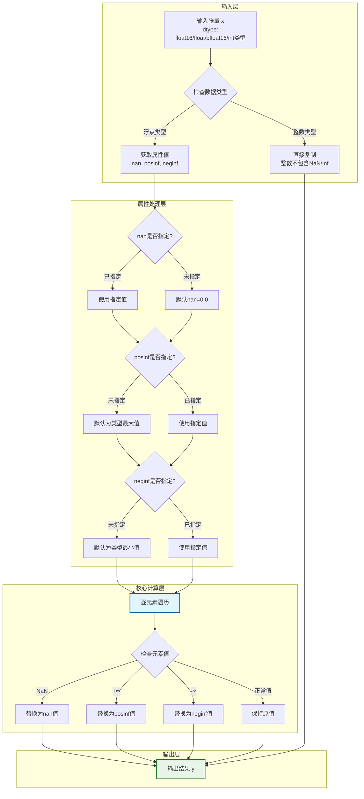
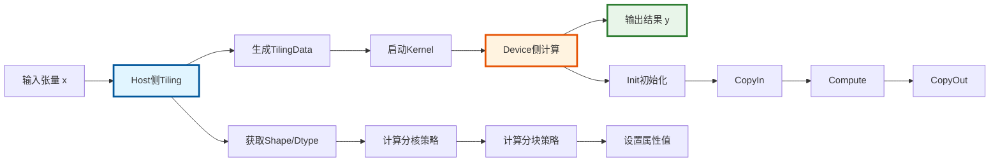
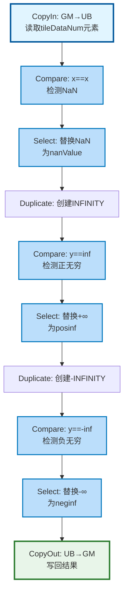
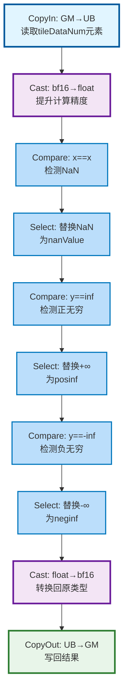

# 1. 需求背景（Required）

## 1.1 需求来源

- **来源活动**：2026昇腾CANN训练营第三期（算子开发方向）。
- **任务编号**：TaskID=5。
- **任务目标**：响应昇腾算子众智计划，丰富Ascend C算子库生态。本任务要求基于Ascend C编程语言重构NanToNum算子，以替换原有的TBE（DSL/Python）实现，旨在提升算子在Atlas A2系列处理器上的执行性能与维护性。

## 1.2 背景介绍

当前的算子通常基于TBE DSL（Tensor Boost Engine Domain Specific Language）开发。为了进一步挖掘硬件算力，提升算子在复杂场景下的调度效率，本项目计划在昇腾NPU（Atlas A2训练系列产品）上，使用Ascend C（C++ Native Programming）编程范式重新实现该算子。

### 1.2.1 NanToNum算子实现优化
（TBE）实现路径和相关API路径

- TBE算子参考实现路径：
/usr/local/Ascend/ascend-toolkit/latest/opp/built-in/op_impl/ai_core/tbe/impl/dynamic/nan_to_num.py

- 算子原型定义路径：
/usr/local/Ascend/cann/opp/built-in/op_proto/inc/nn_ops.h

- 算子信息库路径：
/usr/local/Ascend/ascend-toolkit/latest/opp/built-in/op_impl/ai_core/tbe/config/ascend910b/aic-ascend910b-ops-info-legacy.json

### 1.2.2 NanToNum算子现状分析

#### 1.2.2.1 TBE算子支持的数据类型和数据格式
| **参数名** | **名称** | **类别** | **数据类型 (dtype)**       | **数据格式 (format)** | **Shape** | **描述**         |
| ---------- | -------- | -------- | -------------------------- | --------------------- | --------- | ---------------- |
| **input0**      | x   | 输入     | float16, float, bfloat16, int8, int16, int32, int64, uint8, bool | ND          | All       | 待替换的源张量 |
| **attr0**      | nan   | 属性     | float | -             | -       | 替换NaN的值，默认为0 |
| **attr1**      | posinf   | 属性     | float | -             | -       | 替换正无穷大的值，默认为最大值 |
| **attr2**      | neginf   | 属性     | float | -             | -       | 替换负无穷大的值，默认为最小值 |
| **output0**      | y  | 输出     | float16, float, bfloat16, int8, int16, int32, int64, uint8, bool | ND          | 同输入    | 替换后的张量结果 |

#### 1.2.2.2 TBE算子实现描述
$$ \text{NanToNum}(x, \text{nan}, \text{posinf}, \text{neginf}) = y $$

详细展开形式：
$$ y_i = \begin{cases} 
\text{nan} & \text{if } x_i = \text{NaN} \\
\text{posinf} & \text{if } x_i = +\infty \\
\text{neginf} & \text{if } x_i = -\infty \\
x_i & \text{otherwise}
\end{cases} $$

TBE算子实现流程：
- 输入层：负责检查输入参数的合法性，包括数据类型、形状匹配
- 属性处理层：处理nan、posinf、neginf三个属性参数，根据数据类型设置默认值
- 核心计算层：逐元素检查是否为NaN、正无穷、负无穷，并进行替换
- 输出层：输出替换后的结果张量

#### 1.2.2.3 TBE算子实现流程图


# 2. 需求分析

## 2.1 外部组件依赖

本设计不涉及第三方库（如OpenCV, Protobuf等）的依赖，完全基于CANN提供的Ascend C基础库（`kernel_operator.h` 等）进行开发。

## 2.2 内部适配模块

- **Aclnn接口适配**：需提供适配层的代码，支持上层应用通过接口直接调用。
- **图模式适配**：支持在Graph模式下通过算子原型推导并执行。

## 2.3 需求模块设计

### 2.3.1 AscendC算子原型
 | **名称**  |  **类别**   | **数据类型（dtype）**           | **format** | **Shape**                 | **描述**                                                                 |
 |:---------:|:---------:|:----------------------:|:------:|:------------------------:|:--------------------------------------------------------------------:|
 | x          | 必选输入   | float16/float/bfloat16/int8/int16/int32/int64/uint8/bool | ND     | 任意形状（支持动态形状） | 输入张量，支持动态形状，为待替换的数据源                   |
 | nan       | 必选属性   | float     | ---    | ---                      | 替换NaN的值，默认值为0.0 |
 | posinf       | 必选属性   | float     | ---    | ---                      | 替换正无穷大的值，默认值为数据类型的最大值 |
 | neginf       | 必选属性   | float     | ---    | ---                      | 替换负无穷大的值，默认值为数据类型的最小值 |
 | y          | 必选输出   | float16/float/bfloat16/int8/int16/int32/int64/uint8/bool | ND     | 同输入形状                | 输出张量，形状与输入x相同，为替换后的结果 |

### 2.3.2 AscendC算子相关约束
- 对于整数类型数据，NanToNum算子直接复制输入到输出，因为整数类型不包含NaN和Inf值

# 3. 需求详细设计

## 3.1 使能方式
| **上层框架**     | **涉及勾选** | **说明**                          |
| ---------------- | ------------ | --------------------------------- |
| TF训练/推理      |              |                                   |
| Pytorch训练/推理 |              |                                   |
| **ATC推理**      | **√**        | 支持通过ATC工具进行模型转换       |
| **Aclnn直调**    | **√**        | 支持单算子API调用，便于测试与集成 |
| OPAT调优         |              |                                   |
| SGAT子图切分     |              |                                   |

## 3.2 需求总体设计

### 3.2.1 host侧设计
Host侧主要负责计算任务的切分策略（Tiling），并将计算参数传递给Device侧。

#### 1)分核策略  
使用满核的原则，结合32B内存对齐规则：  
如果核间能均分，可视作无大小核区分，大核小核数据块一致；  
如果核间不能均分，需要将余出的数据块分配到前几个核上。  

输入数据大小计算（基于输入元素数分核，对齐32B内存）：
```
totalBlockNum = inputLengthAlgin / BLOCK_SIZE // 输入总块数（32B对齐）
baseBlockNum = totalBlockNum / coreNum // 每个核心基础处理块数
tailBlockNum = totalBlockNum % coreNum // 需要额外处理块的核数
smallCoreDataNum = baseBlockNum * BLOCK_SIZE / inputBytes // 小核处理元素数
bigCoreDataNum = (baseBlockNum + 1) * BLOCK_SIZE / inputBytes // 大核处理元素数
```

#### 2)数据分块和内存优化策略
充分使用UB空间的原则，兼顾Double Buffer机制和不同精度适配：  
需要考虑不同硬件的UB大小不同、开启double buffer（BUFFER_NUM=2）、不同数据类型（float32/float16/bfloat16）的内存占用，综合考虑单核内切分的大小。  

根据UB内存大小和数据类型，优化数据搬运和计算效率：
- 对于bfloat16类型，需要额外的float临时buffer用于精度转换
- 对于其他类型，直接在原数据类型上操作

UB空间分配：
- BF16: UB_NUM_BF16 = 9（需要更多临时buffer）
- 其他类型: UB_NUM_OTHER = 5

#### 3)tilingkey规划策略
由于NanToNum算子的计算模式相对固定，结合AscendC标准TilingKey生成规范，采用极简的标准化策略：  
`tilingKey = GET_TPL_TILING_KEY(ELEMENTWISE_TPL_SCH_MODE_0) // 基于模板的标准化TilingKey，使用elementwise模板`

同时需将BlockDim设置为实际使用的核心数（coreNum），保证核数分配正确。

#### 4)属性值处理策略
根据输入数据类型确定默认值：
- nanValue：默认为0.0f，可通过属性指定
- posinf：根据数据类型确定默认最大值
  - DT_FLOAT: 3.4028235e+38f
  - DT_FLOAT16: 65504.0f
  - DT_BF16: 3.3895314e+38f
- neginf：默认为对应数据类型的最小值（负数）

### 3.2.2 kernel侧设计

#### 3.2.2.1 kernel侧实现描述
Kernel侧基于Vector编程范式，采用 **SPMD (Single Program Multiple Data)** 模型，通过标准的 CopyIn -> Compute -> CopyOut 三段式流水线。

宿主端负责资源管理、数据传输并启动核函数，核函数通过向量指令（Compare、Select）实现高效并行。

##### 1. Init初始化阶段
- 核心目标：完成输入输出地址绑定、TilingData参数读取、参数合法性校验；
- 关键操作：
  1. 校验输入X、输出Y、TilingData指针非空，若为空则返回错误；
  2. 从TilingData中读取核数、tile数、tileDataNum、tailDataNum等参数；
  3. 根据核ID判断是大核还是小核，设置相应的数据处理参数；
  4. 绑定输入X、输出Y的Global Memory（GM）地址，为后续数据搬运做准备；
  5. 初始化Pipeline Buffer（inQueueX、outQueueY），根据数据类型初始化临时Buffer。

##### 2. Process计算阶段
- 核心目标：按tile循环处理数据，每个tile包含tileDataNum个元素
- 循环逻辑：`for (int32_t i = 0; i < tileNum; i++) { CopyIn → Compute → CopyOut }`
- 最后一个tile处理tailDataNum个元素

##### 3. CopyIn数据搬入阶段
- 计算当前tile的数据起始索引：`progress * tileDataNum`
- 按tileDataNum大小从GM读取数据到UB，生成LocalTensor类型的tile数据
- 将数据放入inQueueX队列

##### 4. Compute核心计算阶段
对于非bfloat16类型：
- 步骤1：使用Compare API检测NaN（通过自比较，NaN != NaN）
- 步骤2：使用Select API将NaN替换为nanValue
- 步骤3：使用Duplicate创建INFINITY常量
- 步骤4：使用Compare API检测正无穷
- 步骤5：使用Select API将正无穷替换为posinf
- 步骤6：使用Duplicate创建-INFINITY常量
- 步骤7：使用Compare API检测负无穷
- 步骤8：使用Select API将负无穷替换为neginf
- 步骤9：将结果放入outQueueY队列

对于bfloat16类型：
- 步骤1：Cast bfloat16 → float（提升精度）
- 步骤2：在float类型上执行上述NaN/Inf检测和替换
- 步骤3：Cast float → bfloat16（转换回原类型）

##### 5. CopyOut数据搬出阶段
- 从outQueueY队列取出计算结果
- 将结果写入GM的输出地址

#### 3.2.2.2 AscendC实现流程图
**整体执行流程图**：


**Kernel核心计算流程图（非BF16路径）**：


**Kernel核心计算流程图（BF16路径）**：


#### 3.2.2.3 AscendC关键差异
- Ascend C 需手动管理内存（aclrtMalloc/aclrtFree）和 线程布局（Grid/Block 计算），TBE 由框架自动调度。
- Ascend C 使用Compare和Select API组合来实现NaN/Inf检测和替换，而不是Python的逐元素判断。
- Ascend C 支持更细粒度的优化（如 Double Buffer、Pipeline），适合高性能场景。
- 对于bfloat16类型，需要先转换为float进行计算以保证精度。

## 3.3 支持硬件
### 产品支持情况

| 产品                                                                | 是否支持 |
|:----------------------------------------------------------------- |:----:|
| <term>Atlas A2 训练系列产品/Atlas 800I A2 推理产品/A200I A2 Box 异构组件</term> | √    |

## 3.4 算子约束限制
- **数据类型限制**：整数类型数据直接复制，不执行NaN/Inf替换
- **维度限制**：输入张量维度不超过8维
- **Shape限制**：输入和输出Shape必须相同

# 4. 特性交叉分析
暂不涉及

# 5. 可维可测分析

## 5.1 精度标准/性能标准
- **精度标准**：精度不低于TBE实现，要求元素级精确匹配
- **性能标准**：性能不低于TBE实现，通过合理的分核和分块策略提升计算效率

## 5.2 兼容性分析
新算子，不涉及兼容性分析
