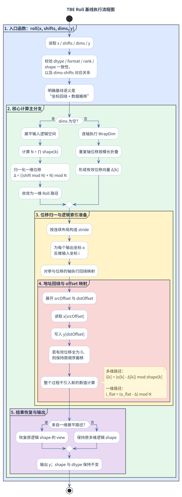
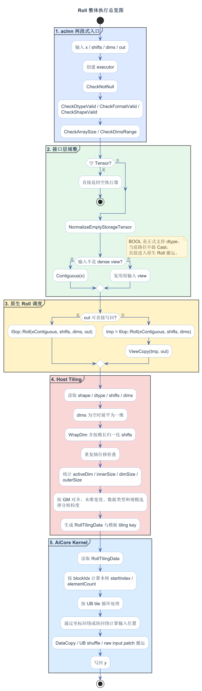
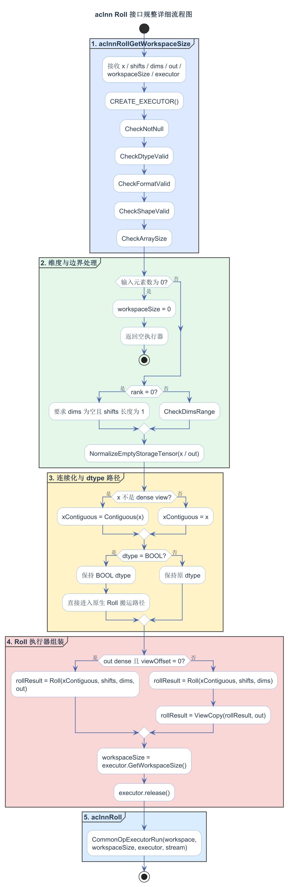
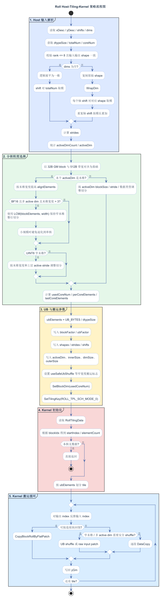

# Roll算子设计文档

## 一、需求背景

### 1.1 需求来源

社区任务 `03-1` 要求参考内置 `TBE Roll`，在昇腾 NPU 上完成 `Roll` 算子的 Ascend C 设计、开发与测试交付。

### 1.2 背景介绍

#### 1.2.1 算子目标

`Roll` 的语义是沿给定维度对输入 Tensor 做循环平移；当 `dims` 为空时，先将输入视为一维逻辑向量，再执行一维循环平移，最后恢复原逻辑 shape。该算子不引入额外算术计算，核心工作是坐标规整、位移归一化、分核切分以及数据搬运。

本次设计目标如下：

1. 功能语义与内置 `TBE Roll` 保持一致。
2. 交付完整的 Ascend C 原生算子工程形态，包括原型、InferShape、Tiling 和 AiCore Kernel。
3. 对外提供稳定的 `aclnn` 两段式接口路径，覆盖合法泛化输入。
4. 当前代码在 `op_host/roll_def.cpp` 中仅注册 `ascend910b` 对应的 AICore 配置；文档承诺与验收范围仅覆盖 Atlas A2 训练系列产品。本次实际复现与验证在 Ascend 910B 训练产品环境完成。

#### 1.2.2 TBE基线来源说明

内置 `TBE Roll` 的源码与注册信息按以下路径获取，本文据此识别基线对象：

| 基线层次 | 直接路径 | 关键文件 / 内容 | 作用 |
| --- | --- | --- | --- |
| TBE Kernel 实现层 | `/usr/local/Ascend/ascend-toolkit/latest/opp/built-in/op_impl/ai_core/tbe/impl/dynamic/` | `roll.py` | 内置 `TBE Roll` 的源码获取路径，用于查看核心语义与调度实现 |
| 算子原型层 | `/usr/local/Ascend/ascend-toolkit/latest/opp/built-in/op_proto/inc/` | `Roll` 原型声明文件 | 用于核对 `Roll` 的正式输入、输出与属性定义 |
| 算子信息库层 | `/usr/local/Ascend/ascend-toolkit/latest/opp/built-in/op_impl/ai_core/tbe/config/ascend910b/` | `aic-ascend910b-ops-info.json` 中的 `Roll` 条目 | 用于核对 `Roll` 的注册条目与编译配置 |

做基线比对时，需要确认 `roll.py`、`Roll` 原型声明、`aic-ascend910b-ops-info.json` 中的 `Roll` 条目与对外暴露 `aclnnRoll` 的软件版本一致；只有版本一致，基线分析才有效。

同时，`aclnnRoll` 的外部行为并不只由底层 `TBE Roll` 决定，还受接口层参数规整路径影响。因此本文在做基线分析时，同时参考开源仓中的以下文件，用于判断正式对齐关系与设计分层职责：

| 层次 | 参考文件 | 作用 |
| --- | --- | --- |
| `aclnn` 接口层 | `op_api/aclnn_roll.cpp` | 参数校验、连续化、`BOOL` 直通调度、空 Tensor / 0 维 Tensor / 特殊二维场景规整 |
| 原生调用层 | `op_api/roll.cpp` | `aclnn` 到原生 `Roll` 路径的调度关系 |
| 算子原型层 | `op_graph/roll_proto.h` | `Roll` 的正式输入输出与属性定义 |
| Host 定义层 | `op_host/roll_def.cpp` | AICore 配置、dtype / format 主路径定义 |
| Shape 推导层 | `op_host/roll_infershape.cpp` | 输出 shape 与输入 shape 一致的推导关系 |
| Tiling 层 | `op_host/roll_tiling.cpp` | 分核、切 UB、模板 tiling key 与搬运参数生成 |
| Kernel 入口层 | `op_kernel/roll.cpp` | 读取 tiling 数据并启动统一 Kernel 执行路径 |

#### 1.2.3 TBE算子现状分析

##### 1.2.3.1 TBE支持的数据类型、数据格式与属性

结合任务书验收口径、`Roll` 原型定义以及 `aclnn` 接口约束，可将 `Roll` 的支持能力拆成“原生 `Roll` 主路径”和“`aclnn` 接口补充能力”两层来看。以下 dtype 描述的是当前原生主路径定义；任务书适配硬件为 Atlas A2 训练系列产品，本次实际复现与验证在 Ascend 910B 训练产品环境完成。

| 层次 | 输入/输出 dtype | format | 说明 |
| --- | --- | --- | --- |
| 原生 `Roll` 主路径 | `BF16`、`FLOAT16`、`FLOAT32`、`INT8`、`UINT8`、`BOOL`、`INT32`、`UINT32` | `ND` | 由 `roll_proto.h` 与 `roll_def.cpp` 约束；输出与输入同 shape、同 dtype |
| `aclnn` 接口补充能力 | 不新增dtype；负责连续化、特殊场景规整与直通调度 | 保持输入逻辑 view format，经连续化后进入原生路径 | 由 `aclnn_roll.cpp` 实现参数校验、连续化与特殊场景规整 |

属性约束如下：

| 属性 | 类型 | 约束 |
| --- | --- | --- |
| `shifts` | `ListInt` | 必填；当 `dims` 为空时长度必须为 `1` |
| `dims` | `ListInt` | `aclnn` 调用时参数对象必传，但数组可为空；数组非空时长度必须与 `shifts` 一致，取值范围为 `[-rank, rank - 1]` |

按任务书要求，本文设计不考虑广播；因此分析和设计均建立在“输入输出元素总数一致、无 broadcast 扩展”的前提上。

##### 1.2.3.2 TBE算子实现描述

设输入 Tensor 的秩为 $r$，逻辑 shape 为

$$
\mathbf{S} = (S_0, S_1, \ldots, S_{r-1}).
$$

对第 $j$ 个位移指令，设原始轴与位移分别为 $d_j$、$s_j$。轴归一化和位移归一化分别为

$$
a_j = ((d_j \bmod r) + r) \bmod r,
$$

$$
\Delta_j = \bigl((s_j \bmod S_{a_j}) + S_{a_j}\bigr) \bmod S_{a_j}.
$$

当同一轴在 `dims` 中重复出现时，顺序执行在该轴上的效果等价于模长相加，因此该轴的等价位移可写为

$$
\widehat{\Delta}_a =
\left(
\sum_{j:\, a_j = a} \Delta_j
\right)
\bmod S_a.
$$

当 `dims` 为空时，输入先展平为长度为 $N$ 的一维向量 $x_{\text{flat}}$，其中

$$
N = \prod_{k=0}^{r-1} S_k.
$$

此时一维 `Roll` 的映射关系为

$$
y_{\text{flat}}[t] = x_{\text{flat}}\bigl[(t - \Delta) \bmod N\bigr], \qquad 0 \le t < N.
$$

当 `dims` 非空时，输出逻辑坐标记为

$$
\mathbf{o} = (o_0, o_1, \ldots, o_{r-1}),
$$

则对应输入坐标为

$$
i_k =
\begin{cases}
(o_k - \widehat{\Delta}_k) \bmod S_k, & k \in \{a_0, a_1, \ldots\}, \\
o_k, & \text{otherwise}.
\end{cases}
$$

于是输出满足

$$
y[\mathbf{o}] = x[\mathbf{i}].
$$

因此 `Roll` 的本质不是数值计算，而是“保持 shape 与 dtype 不变的坐标回绕搬移”。这也是 Host / Kernel 设计重点落在分核、切 UB、对齐和搬运分支上的原因。

##### 1.2.3.3 TBE算子实现流程图

## 二、需求分析

### 2.1 外部组件依赖

不涉及新的外部组件，复用开源算子仓已有的算子编译、`aclnn` 两段式接口以及 Ascend C 运行时环境。

### 2.2 内部适配模块

| 模块 | 对应文件 | 设计职责 |
| --- | --- | --- |
| 算子原型 | `op_graph/roll_proto.h` | 定义 `Roll` 的输入输出、属性与正式语义边界 |
| Host 定义 | `op_host/roll_def.cpp` | 定义 AICore 配置、dtype / format 主路径 |
| Shape 推导 | `op_host/roll_infershape.cpp` | 输出 shape 与输入 shape 对齐 |
| `aclnn` 接口层 | `op_api/aclnn_roll.cpp` | 参数校验、连续化、特殊场景规整与对外执行器组装 |
| 原生调用层 | `op_api/roll.cpp` | `aclnn` 到原生 `Roll` 的调度封装 |
| Tiling 层 | `op_host/roll_tiling.cpp` | 分核、切 UB、模板 tiling key 与搬运参数生成 |
| Kernel 入口 | `op_kernel/roll.cpp` | 读取 `RollTilingData` 并启动统一 Kernel 执行路径 |
| Kernel 主体 | `op_kernel/roll.h` | 按 tiling 数据完成坐标回绕、块回绕、窄末维补偿与循环搬运 |

### 2.3 需求模块设计

#### 2.3.1 Ascend C算子原型

原生 `Roll` 主路径的 Tensor 契约如下。以下指 Atlas A2 训练系列产品上的主执行路径；本次实际复现与验证环境为 Ascend 910B 训练产品环境：

| 名称 | 类别 | 数据类型 | format | shape |
| --- | --- | --- | --- | --- |
| `x` | 输入 | `BF16`、`FLOAT16`、`FLOAT32`、`INT8`、`UINT8`、`BOOL`、`INT32`、`UINT32` | `ND` | `1` 到 `8` 维 |
| `y` | 输出 | 与 `x` 一致 | `ND` | 与 `x` 一致 |

属性契约如下：

| 名称 | 类别 | 类型 | 约束 |
| --- | --- | --- | --- |
| `shifts` | 属性 | `ListInt` | 必填；`dims` 为空时长度必须为 `1` |
| `dims` | 属性 | `ListInt` | `aclnn` 调用时参数对象必传，但数组可为空；数组非空时长度必须与 `shifts` 一致，元素范围为 `[-rank, rank - 1]` |

`aclnn` 接口层在此基础上补充以下能力：

1. `BOOL` 是当前正式支持的数据类型之一，输入输出沿用原生 `Roll` 搬运路径，接口层负责校验与直通调度，避免额外 `Cast` 固定开销。
2. 非连续 Tensor 先连续化，再进入原生 `Roll` 路径。
3. `0` 维 Tensor、空 Tensor、特殊二维 `[1, N]` 场景由接口层单独规整。

#### 2.3.2 设计范围与约束

| 类别 | 约束项 | 约束内容 |
| --- | --- | --- |
| 代码注册范围 | AICore 配置 | `ascend910b` |
| 验收范围 | 硬件范围 | 仅 Atlas A2 训练系列产品 |
| 实际验证环境 | 硬件环境 | Ascend 910B 训练产品环境 |
| 验收范围 | 功能对齐基线 | 以内置 `TBE Roll` 为正式对比基线 |
| 输入约束 | rank | `aclnn` 入口支持 `0` 到 `8` 维；其中原生 `Roll` 主路径覆盖 `1` 到 `8` 维 |
| 输入约束 | `dims` / `shifts` 长度关系 | `dims` 非空时两者长度必须一致；`dims` 为空时 `shifts` 长度必须为 `1` |
| 接口传参 | `dims` 参数对象 | `aclnn` 两段式接口中必须传入；允许空数组，不允许空指针 |
| 输入约束 | `dims` 取值范围 | 非空、非 `0` 维 Tensor 下取值必须在 `[-rank, rank - 1]` |
| 输入约束 | 广播 | 不支持广播 |
| 输出约束 | shape / dtype | 输出与输入同 shape、同 dtype |
| 类型分层 | `BOOL` | 正式支持类型；由 `aclnn` 接口层校验，并在原生 `Roll` 路径中按 1B 数据搬运 |
| 接口分层 | `0` 维 Tensor | 仅由 `aclnn` 接口层特判并 `ViewCopy` 返回，不进入原生 `Roll` 主路径 |

## 三、需求详细设计

### 3.1 使能方式

本设计面向 Ascend C 原生算子工程与 `aclnn` 两段式接口调用场景，文档承诺范围仅覆盖 Atlas A2 训练系列产品，实际复现与验证在 Ascend 910B 训练产品环境完成。

| 上层调用/工具链 | 状态 |
| --- | --- |
| TF训练/推理 | 不涉及 |
| Pytorch训练/推理 | 不涉及 |
| ATC推理 | 不涉及 |
| `aclnn` 直调 | 支持 |
| OPAT调优 | 不涉及 |
| SGAT子图切分 | 不涉及 |

### 3.2 需求总体设计

整体设计分为两层：

1. `aclnn` 接口层：负责对外参数校验、连续化、`BOOL` 直通调度、空 Tensor / `0` 维 Tensor / 特殊二维场景处理。
2. 原生 `Roll` 算子工程层：负责 `Roll` 原型、Shape 推导、Tiling 与 AiCore Kernel 执行。

在 Atlas A2 训练系列产品上，主执行路径是“`aclnn` 完成规整后，直接调用原生 `Roll` AICore 路径”，不再拆成 `Slice` / `ConcatD` / `Transpose` 等多 launch 组合链路。

#### 3.2.1 Host侧设计

##### 3.2.1.1 接口校验与规整策略

`aclnn` 接口层的校验顺序与 `aclnn_roll.cpp` 保持一致：

1. `CheckNotNull`：校验 `x`、`shifts`、`dims`、`out` 非空。
2. `CheckDtypeValid`：校验输入输出 dtype 在接口支持列表内，且 `x` 与 `out` 的 dtype 一致。
3. `CheckShape`：校验输入输出 shape 一致。
4. `CheckArraySize`：校验 `dims` 非空时与 `shifts` 等长，`dims` 为空时 `shifts` 长度为 `1`。
5. `CheckTensorDimSize`：校验 rank 不超过 `8`。
6. 空 Tensor 直接返回；`0` 维 Tensor 仅允许 `dims` 为空且 `shifts` 长度为 `1`。
7. 非空、非 `0` 维 Tensor 再执行 `CheckDimsRange`。

轴归一化和位移归一化分别为

$$
\operatorname{WrapDim}(d, r) =
\begin{cases}
d + r, & d < 0, \\
d, & d \ge 0,
\end{cases}
$$

$$
\Delta = \bigl((s \bmod S_a) + S_a\bigr) \bmod S_a.
$$

接口层还包含三类额外规整：

1. `BOOL` 输入输出直接进入原生 `Roll` 搬运路径，避免 `Cast -> Roll -> Cast` 的额外固定开销。
2. 非连续输入先执行 `Contiguous`。
3. 特殊二维场景满足

$$
(r = 2) \land (S_0 = 1) \land \bigl(\exists j,\ \operatorname{WrapDim}(d_j, r) = 1\bigr)
$$

时，先 `Squeeze` 为一维，再将该轴位移合并为

$$
\Delta' = \sum_{j:\, \operatorname{WrapDim}(d_j, r) = 1} s_j,
$$

执行完 `Roll` 后再 `Unsqueeze` 恢复二维形状。

在 Atlas A2 主路径上，接口层满足 `IsRegBase()`，因此会直接调用

$$
\operatorname{Roll}(x_{\text{contiguous}}, \text{newShifts}, \text{newDims}),
$$

而不会逐轴拆成多个子算子，也不会退化为 `Slice` / `ConcatD` / `Transpose` 组合链路。

##### 3.2.1.2 分核策略

分核策略由 `roll_tiling.cpp` 的 `SplitCore` 与 `SplitCoreforSimd` 两组逻辑完成。

对一般多维路径，先定义缓存线对应的最小切核长度

$$
\text{cacheLineLen} = \frac{\text{cacheLineSize}}{\text{dtypeSize}}.
$$

随后从前向后扫描各轴，寻找可切核的前缀乘积。设前缀乘积为

$$
P_i = \prod_{k=0}^{i} S_k,
$$

当 `S_i \cdot stride_i \le \text{cacheLineLen}` 时停止继续扩大可切核前缀；否则将当前轴纳入切核候选，并在

$$
P_i \ge \text{numBlocks}
$$

时停止扩大。若最终没有找到可切核轴，则走单核路径；否则按以下方式分配核上负载：

$$
\text{blockFactor} = \left\lceil \frac{P}{\text{numBlocks}} \right\rceil,
$$

$$
\text{blockCount} = \left\lceil \frac{P}{\text{blockFactor}} \right\rceil,
$$

$$
\text{blockTailFactor} = P - (\text{blockCount} - 1)\cdot \text{blockFactor},
$$

其中 $P$ 为最终选定切核前缀的乘积。

当前实现不再把 Kernel 拆成多个静态分支文件，而是在 Host 侧把分核粒度规整为 `perCoreElements` 与 `lastCoreElements`，Kernel 侧按线性元素区间统一执行。设总元素数为 $N$、可用核数为 $C$，则

$$
\text{perCoreElements} = \left\lceil \frac{N}{C} \right\rceil,
$$

$$
\text{needCoreNum} = \left\lceil \frac{N}{\text{perCoreElements}} \right\rceil,
$$

$$
\text{lastCoreElements} = N - (\text{needCoreNum} - 1)\cdot \text{perCoreElements}.
$$

该策略保证了常规多维场景优先按“结构边界 + cacheline”切核，而一维与末维切分场景优先按“总元素量均分”切核。

##### 3.2.1.3 数据分块与LocalMemory/UB优化策略

UB 切分由 `SplitUb` 完成，核心目标是：在保留 `DOUBLE_BUFFER` 的前提下，最大化单次搬运元素量，同时避免末维回绕位置带来的对齐损失。

代码中固定使用

$$
\text{BUFFER\_NUM} = 2,
\qquad
\text{ALIVE\_NODE} = 2,
\qquad
\text{ALIGN\_BYTE} = 32.
$$

对窄末维和小块场景，可用字节数为

$$
M_{\text{small}} =
\min\left(
\frac{UB - V}{2 \times 2} - V,\
65535 \times b - 2V
\right),
$$

其中 $UB$ 表示单核 UB 大小，$V$ 表示向量寄存器大小，$b$ 表示元素字节数。

对普通分支，可用字节数为

$$
M_{\text{normal}} = \frac{UB}{2}.
$$

若末维长度为 $S_W$，元素字节数为 $b$，则普通分支会先把末维对齐到 `32B`，得到

$$
W_{\text{alignByte}} =
\left\lceil \frac{S_W \cdot b}{32} \right\rceil \cdot 32.
$$

当右段切分位置

$$
S_W - \text{shift}_W
$$

不满足 `32B` 对齐时，再额外预留一个向量寄存器空间。对 `b8` 类型，代码按 `b16` 估算 UB 开销，因此实际参与 `maxElements` 计算的字节数为

$$
b' = \max(b, 2).
$$

最终每次 UB 能容纳的最大元素数为

$$
\text{maxElements} = \left\lfloor \frac{M}{b'} \right\rfloor.
$$

切 UB 轴从末维向前搜索。设所选轴为 `UbSplitAxis`，则对应的单块基本粒度为

$$
\text{perUbFactor} =
\begin{cases}
1, & \text{UbSplitAxis} = W, \\
\dfrac{\text{stride[UbSplitAxis]}}{S_W} \cdot W_{\text{tile}}, & \text{otherwise},
\end{cases}
$$

其中 $W_{\text{tile}}$ 为按对齐修正后的末维处理长度。

于是单次 UB 能覆盖的该轴长度为

$$
\text{singleUbNeedNum} =
\left\lfloor
\frac{\text{maxElements}}{\text{perUbFactor}}
\right\rfloor.
$$

若 `UbSplitAxis == blockSplitAxis`，则 `UbFactor / UbCount / UbTailFactor` 需要围绕 `blockFactor` 或 `blockTailFactor` 重新计算；否则直接围绕 `shape[UbSplitAxis]` 计算。这样可以保证“切核”和“切 UB”落在同一轴时，尾核与普通核的 UB 规模分别准确收敛。

##### 3.2.1.4 模板tiling key与Host策略

当前 Host 侧固定使用 `GET_TPL_TILING_KEY(ROLL_TPL_SCH_MODE_0)` 设置模板 tiling key，Kernel 入口不再依赖多个数值型 `tilingKey` 分派到独立分支文件。实际执行差异由 `RollTilingData` 中的结构化字段承载，包括：

| 字段类别 | 关键字段 | 作用 |
| --- | --- | --- |
| 形状语义 | `dimNum`、`shapes`、`strides`、`shifts` | 描述规整后的逻辑坐标空间与每轴等价位移 |
| active 轴信息 | `activeDimCount`、`activeDim`、`innerSize`、`dimSize`、`outerSize` | 区分单轴、多轴、末维和非末维回绕场景 |
| 分核信息 | `usedCoreNum`、`perCoreElements`、`lastCoreElements` | 控制每个 AICore 负责的线性区间 |
| UB 信息 | `ubElements`、`blockFactor`、`ubFactor` | 控制单轮搬运规模 |
| 窄宽度策略 | `useSafeUbShuffle` 等标志 | 指示 Kernel 在窄末维、多 active 轴等场景下使用更稳的 UB shuffle 或 raw input patch |

在写入这些字段前，Host 侧会完成以下规整：

1. `dims` 为空时，把输入逻辑展平成一维，并对总元素数取模。
2. `dims` 非空时，对每个轴执行 `WrapDim`，并把重复轴位移折叠为等价位移。
3. 依据 dtype、末维宽度、active 轴位置、总字节数和 32B/512B 对齐要求选择 `alignElements`。
4. 对 `BF16` 多 active 轴且末维宽度为 `3` 的小宽度场景，使用宽度与 block 元素数的最小公倍数维持整行切分，并在小规模下避免退化到单核。

#### 3.2.2 Kernel侧设计

##### 3.2.2.1 Kernel侧实现描述

`op_kernel/roll.cpp` 中的 Kernel 入口读取 `RollTilingData` 后统一进入 `Roll<T>::Process()`。从 Kernel 计算模型看，`Roll` 的核心仍是“线性索引解码 + 目标索引重编码 + 数据搬移”。输出线性索引 `outputIndex` 被还原为多维坐标后，输入线性索引按如下方式重建：

$$
\text{inputIndex} =
\sum_{k=0}^{d-1}
\left(
(\text{idx}_k - \text{shift}_k + S_k) \bmod S_k
\right)
\cdot \text{stride}_k.
$$

随后 Kernel 会按当前 tile 的结构选择更合适的搬运方式：

1. 一维或可连续回绕的场景优先走 `CopyBlockRollByFlatPatch`，减少逐元素索引开销。
2. 多维单 active 轴场景按块或行推导源地址，尽量保持连续 `DataCopy`。
3. 窄末维、多 active 轴或对齐不利的场景使用安全 UB shuffle / raw input patch，避免小宽度跨行搬运导致的额外开销。
4. 本核无有效元素时直接返回，空 Tensor 在接口层已经提前收敛。

##### 3.2.2.2 Ascend C实现流程图

Atlas A2 主路径的接口规整与原生 `Roll` 调用关系见图 3；原生 `Roll` 的 tiling / branch 选择流程见图 4。

##### 3.2.2.3 Ascend C路径与TBE路径的差异点及原因

在保持 `Roll` 对外语义与 `TBE Roll` 对齐的前提下，本文设计与基线存在以下差异：

| 差异点 | Ascend C设计选择 | 原因 |
| --- | --- | --- |
| 接口层分层 | 由 `aclnn` 接口层显式承担空 Tensor、`0` 维 Tensor、`BOOL`、非连续输入、特殊二维 `[1, N]` 的规整 | 将通用外部契约与原生搬运主路径分层，降低 Kernel 复杂度 |
| A2 主路径调用方式 | 在 Atlas A2 训练系列产品上，`aclnn` 规整后直接调用原生 `Roll` 路径 | A2 属于 regbase，允许原生 `Roll` 直接处理多轴位移 |
| 多 launch 组合链路 | 避免 `Slice` / `ConcatD` / `Transpose` 等组合链路，优先单次原生 `Roll` kernel | 降低小 shape 固定开销，并与本任务性能目标对齐 |
| Host 侧规整 | 在 Tiling 前显式执行维度展开、轴归一化、位移折叠和 active 轴统计 | 缩减 Kernel 侧判断量，使搬运策略由结构化 tiling 数据直接驱动 |
| Kernel 组织方式 | 统一进入 `Roll<T>::Process()`，内部按连续块、块回绕、窄末维补偿等搬运场景选择执行路径 | `Roll` 是纯搬移算子，性能优先级直接受切分位置、对齐条件和末维宽度影响 |
| 重复轴处理 | 在原生 `Roll` Tiling 中，重复轴位移按模长累加折叠为等价位移 | 顺序 `Roll` 在同一轴上的效果本就等价于模长相加，因此可安全收敛 |

### 3.3 支持硬件

Atlas A2 训练系列产品。

### 3.4 算子约束限制

1. 不支持广播。
2. 原生 `Roll` 主路径以 `ND` Tensor 为设计中心，输出与输入同 shape、同 dtype。
3. 输入 rank 仅支持 `0` 到 `8` 维。
4. `dims` 非空时，`shifts` 与 `dims` 长度必须一致；`dims` 为空时，`shifts` 长度必须为 `1`。
5. 非空、非 `0` 维 Tensor 下，`dims` 取值必须在 `[-rank, rank - 1]` 范围内。
6. `0` 维 Tensor 仅允许 `dims` 为空且 `shifts` 长度为 `1`。
7. 空 Tensor 在完成基础参数合法性校验后直接返回，不继续进入普通 `dims` 范围校验。
8. `BOOL` 由 `aclnn` 接口层校验后进入原生 `Roll` 搬运路径，按 1B 类型处理。

## 四、特性交叉分析

`Roll` 作为纯数据重排算子，其特性交叉主要体现在以下组合关系上：

| 交叉维度 | 设计关注点 | 应对策略 |
| --- | --- | --- |
| 空 `dims` × 高维输入 | 需要退化为展平后一维语义 | 展平后复用一维 `Roll` 逻辑 |
| 多轴位移 × 重复轴 | 既要支持多轴，也要保证重复轴语义正确 | 接口层保留顺序语义，原生 Tiling 折叠为等价位移 |
| 负轴 × 负位移 × 大位移 | 轴与位移表达形式不唯一 | 统一做轴归一化与模长归一化 |
| 非连续输入 × 原生 `ND` 主路径 | 逻辑 view 与物理存储不一致 | `aclnn` 先连续化，再进入原生路径 |
| `BOOL` × 搬运 Kernel | `BOOL` 不参与数值计算，只需保持逐元素搬运语义 | 直接进入原生 `Roll` 搬运路径，避免额外 `Cast` 开销 |
| 空 Tensor / `0` 维 Tensor × 常规校验 | 普通维度校验顺序不适用 | 在接口层提前分流 |
| 特殊二维 `[1, N]` × axis=1 | 等价于一维循环平移 | `Squeeze -> Roll -> Unsqueeze` |
| 窄末维 / 小块 × 对齐约束 | 尾块过小或末维过窄时整块搬运收益下降 | 通过 `useSafeUbShuffle`、块回绕 patch 和 raw input patch 保持主路径搬运模型稳定 |

## 五、可维可测分析

### 5.1 验收标准与验证口径

| 验收项 | 硬门槛 | 目标值 / 说明 |
| --- | --- | --- |
| 功能标准 | 与内置 `TBE Roll` 功能一致，合法输入下 `aclnn` 两段式接口可正常执行 | 正式对比基线以内置 `TBE Roll` 为准 |
| 精度标准 | 精度不低于内置 `TBE Roll` | `Roll` 本质为数据搬移；浮点按默认阈值对齐，整数与 `BOOL` 需逐元素精确一致 |
| 性能标准 | 所有核参与计算场景下，性能不低于原 `TBE` 算子的 `95%` | 算子整体性能需与原 `TBE` 实现算子持平 |
| 小 shape 例外条款 | 平均耗时低于 `10 us` 的场景，若与原 `TBE` 实现相差不超过 `3 us`，按例外条款评估 | 需提供性能仿真图和分析结论，证明 Ascend C 实现与 `TBE` 实现完全一致或优于 `TBE` |
| 测试标准 | 常规场景、边界场景、非法输入和泛化场景覆盖完整且全部通过 | 保留可追溯执行记录 |
| 文档标准 | 设计文档结构完整、口径前后一致 | 本文需保证基线说明、公式、流程图、分支条件和约束不冲突 |

### 5.2 验证矩阵

| 验证项 | 典型场景 | 验证方式 / 产出 |
| --- | --- | --- |
| 功能正确性 | 空 `dims`、多轴 `dims`、重复 `dims`、负轴、负位移、大位移回绕 | 与内置 `TBE Roll` 逐项对比 |
| 边界场景 | 空 Tensor、`0` 维 Tensor、单元素 Tensor、特殊二维 `[1, N]`、非连续输入 | 构造专项用例验证返回结果与执行路径 |
| 非法输入 | `shifts` / `dims` 长度不一致、`dims` 越界、rank 超限、非法 dtype | 校验错误码与报错路径 |
| 搬运路径覆盖 | 空 Tensor、一维展平、多 active 轴、非末维 active 轴、窄末维、小块、非连续输入 | 形成 shape、dtype、dims / shifts 与结构化 tiling 字段的对应矩阵 |
| 精度验证 | 浮点、整数、`BOOL` | 浮点按默认阈值；整数与 `BOOL` 逐元素精确比对 |
| 性能验证 | Atlas A2 上的 all-core 固定统计场景 | 输出与内置 `TBE Roll` 的性能对比表 |
| 接口验证 | `aclnn` 两段式接口、多组 shape / dtype / dims / shifts 组合 | 保留执行日志与结果比对记录 |

当前交付目录在 `tests/ut/op_kernel` 中保留 Kernel UT 构建入口与最小 smoke 用例。`test_roll.cpp` 覆盖 `float32`、二维 `[4, 3]`、dim0 位移为 `1` 的非末维滚动场景，通过手工构造 `RollTilingData` 直接运行 Kernel 并与 golden 数据比对，用于验证 Kernel 执行链路可独立跑通。更完整的边界、接口与 tiling 组合仍由 `tests/ut/op_api`、`tests/ut/op_host` 与 `examples` 目录中的用例覆盖。

### 5.3 兼容性分析

本设计的兼容性结论如下：

1. `Roll` 的正式语义与内置 `TBE Roll` 保持同一输入输出契约，输出与输入同 shape、同 dtype。
2. `aclnn` 接口层兼容连续与非连续输入的逻辑 view 语义。
3. 兼容空 `dims` 与多轴 `dims` 两类调用方式。
4. 兼容负轴、负位移、大位移回绕和重复轴表达。
5. 在任务书约束范围内，兼容空 Tensor、`0` 维 Tensor、单元素 Tensor 与特殊二维 `[1, N]` 输入。
