# **需求背景**

## **需求来源**

基于 TBE BiasAdd 算子历史版本，使用 Ascend C 编程语言进行改造与优化，以补齐 elementwise broadcast 类算子在 Atlas A2 训练系列产品上的 ACLNN 直调能力，并提升算子在多 dtype、多 format 和通道维广播场景下的可维护性。

BiasAdd 算子用于将一维 bias 加到输入张量 x 的通道维，输出 y 与 x 保持相同 shape。本文先分析 TBE 历史实现的原型、支持范围、shape 约束和核心流程，再基于这些能力约束规划 Ascend C host、kernel 和 ACLNN 接口设计。

## **TBE 源码分析**

通过核对 TBE 内置 BiasAdd 算子源码、算子原型和 910B 配置，当前支持能力和核心流程如下。

TBE算子源码路径：`${ASCEND_INSTALL_PATH}/opp/built-in/op_impl/ai_core/tbe/impl/ops_legacy/dynamic/bias_add.py`

算子原型路径：`${ASCEND_INSTALL_PATH}/opp/built-in/op_graph/inc/elewise_calculation_ops.h`

算子信息库路径：`${ASCEND_INSTALL_PATH}/opp/built-in/op_impl/ai_core/tbe/config/ascend910b/aic-ascend910b-ops-info-legacy.json`

910B kernel config路径：`${ASCEND_INSTALL_PATH}/opp/built-in/op_impl/ai_core/tbe/kernel/config/ascend910b/ops_legacy/bias_add.json`

### **1. 算子原型**

TBE 原型中 BiasAdd 定义如下：

```cpp
REG_OP(BiasAdd)
    .INPUT(x, TensorType::NumberType())
    .INPUT(bias, TensorType::NumberType())
    .OUTPUT(y, TensorType::NumberType())
    .ATTR(data_format, String, "NHWC")
    .OP_END_FACTORY_REG(BiasAdd)
```

原型语义：

| **名称** | **类别** | **说明** |
| -------- | -------- | -------- |
| x | 输入 | 主输入 Tensor，NumberType。 |
| bias | 输入 | 一维 bias Tensor，NumberType。TBE 在编译前根据 x 的 format 和 `data_format` 将其 reshape 成可广播形态。 |
| y | 输出 | 输出 Tensor，shape、dtype、format 与 x 保持一致。 |
| data_format | 属性 | String，可选，默认 `"NHWC"`。TBE 校验值为 `NCHW`、`NHWC`、`NDHWC`、`NCDHW`。 |

计算公式：

$$
y = x + broadcast(bias)
$$

其中 bias 广播到通道维。通道维由 `data_format` 与 x 的 storage format 共同决定。

### **2. 支持的数据类型**

TBE 内置 BiasAdd 的 `bias_add()` 主函数中校验的数据类型为：

| **数据类型** | **字节大小** | **说明** |
| ------------ | ------------ | -------- |
| bfloat16 | 2 | TBE dynamic 实现声明 `support_bfp16=True`，910B 支持。 |
| float16 | 2 | TBE 支持，910B 支持。 |
| float32 | 4 | TBE 源码中写作 `float32`，`op_select_format()` 中写作 `float`。 |
| int32 | 4 | TBE 支持，910B 支持。 |
| int64 | 8 | TBE 在 v220/910B 场景下通过 `is_v220()` 追加支持；当前 Ascend C 设计阶段不纳入首批实现范围。 |

910B kernel config 中预编译 bin 覆盖的 dtype / format 组合如下：

| **x dtype** | **x format** | **bias format** | **y format** |
| ----------- | ------------ | --------------- | ------------ |
| bfloat16 | ND | ND | ND |
| float16 | ND | ND | ND |
| float32 | ND | ND | ND |
| int32 | ND | ND | ND |
| int64 | ND | ND | ND |

说明：910B op info 中 `dynamicFormat.flag=true`，kernel config 只列出 ND 静态 bin，不代表 TBE `op_select_format()` 不支持特殊 format。BiasAdd 的特殊 format 能力需要结合 TBE Python 中 `op_select_format()` 判断。

### **3. 支持的数据格式**

TBE `op_select_format()` 根据 x 的 `ori_shape` rank、bias 长度是否为 16 的倍数、平台是否支持 float32 vmuls 和 BF16 vconv 动态选择 dtype / format 组合。

BiasAdd TBE 支持的主要 format 如下：

| **场景** | **x/y format** | **bias format** | **触发条件** |
| -------- | -------------- | --------------- | ------------ |
| 普通 ND | ND | ND | rank 2 到 4，或未触发特殊 format。 |
| 4D packed | NC1HWC0 | ND | x 原始 rank 为 4，bias 长度为 16 的倍数。 |
| 4D packed bias | NC1HWC0 | NC1HWC0 | x 原始 rank 为 4，bias 长度不是 16 的倍数时，TBE 可选择 packed bias。 |
| 5D channel-last | NDHWC | ND | x 原始 rank 大于 4，bias 对应 C 维。 |
| 5D channel-first | NCDHW | ND | x 原始 rank 大于 4，bias 对应 C 维。 |
| 6D packed 3D | NDC1HWC0 | ND | x 原始 rank 大于 4 且 bias 长度为 16 的倍数。 |

`data_format` 支持值：

| **data_format** | **通道维语义** |
| --------------- | -------------- |
| NCHW | x 的第 2 维为 C。 |
| NHWC | x 的最后一维为 C。 |
| NCDHW | storage format 为 NCDHW 时，x 的第 2 维为 C。 |
| NDHWC | storage format 为 NDHWC 时，x 的第 5 维为 C。 |

### **4. Shape 与属性约束**

TBE 主函数 `bias_add()` 中先做 dtype 和 `data_format` 校验，再根据 x 的 storage format 重写 bias shape，使 `bias_add_compute()` 中的 `tbe.broadcast()` 可以进行 elementwise broadcast。

主要规则如下：

| **x format / data_format** | **x shape 要求** | **bias 长度要求** | **TBE 重写后的 bias shape** |
| -------------------------- | ---------------- | ----------------- | --------------------------- |
| NC1HWC0 + NCHW/NHWC | storage rank = 5 | 与原始 C 维一致 | `(1, C1, 1, 1, C0)` |
| NDHWC | rank = 5 | `bias[0] == x[4]` | `(1, 1, 1, 1, C)` |
| NCDHW | rank = 5 | `bias[0] == x[1]` | `(1, C, 1, 1, 1)` |
| NDC1HWC0 + NDHWC | storage rank = 6 | `bias[0] == ori_shape_x[4]` | `(1, 1, C1, 1, 1, C0)` |
| NDC1HWC0 + NCDHW | storage rank = 6 | `bias[0] == ori_shape_x[1]` | `(1, 1, C1, 1, 1, C0)` |
| ND + NCHW | rank 2 到 4 | `bias[0] == x[1]` | `(1, C, 1, ...)` |
| ND + 非 NCHW | rank >= 2 | `bias[0] == x[-1]` | `(1, ..., C)` |

TBE 使用 `check_equal(a, b)` 处理动态 shape：

```text
当 a 或 b 为 -1 时认为可通过；否则必须相等。
```

### **5. 静态属性与编译配置**

| **类别** | **字段/参数** | **取值** | **说明** |
| -------- | ------------- | -------- | -------- |
| GE 原型 attr | data_format | string，默认 NHWC | 指定通道维语义。 |
| Python 编译入口 | kernel_name | bias_add | TBE 编译入口参数，不是 GE 原型 attr。 |
| 910B 配置 | dynamic shape / rank | 支持 | TBE 支持动态 shape 和 unknown rank 编译分组。 |
| 910B 配置 | dynamic format | 支持 | format 候选由 `op_select_format()` 按平台能力和 shape 生成。 |
| 910B kernel config | deterministic | ignore | 预编译 ND bin 覆盖 BF16、FP16、FP32、INT32、INT64。 |

### **6. TBE 计算流程**

TBE 的计算逻辑分为两层：`bias_add()` 负责把 bias 改写成可广播形态并组织动态 shape 编译分组，`bias_add_compute()` 负责真正的 DSL 计算。

`bias_add()` 中计算前处理：

1. 读取 `shape_x`、`shape_bias`、`range_x`、`range_bias` 和 dtype。
2. 校验 dtype：x / bias / y 均为 `bfloat16`、`float16`、`float32`、`int32`、`int64` 之一，并显式要求 x 与 bias dtype 一致。
3. unknown rank 场景下复用 unknown rank 输入描述，`shape_bias = [-2]`。
4. 非 unknown rank 场景下校验 `data_format`，并按 x storage format 重写 `shape_bias`：
   - `NC1HWC0`：`shape_bias = (1, C1, 1, 1, C0)`。
   - `NDHWC`：`shape_bias = (1, 1, 1, 1, C)`。
   - `NCDHW`：`shape_bias = (1, C, 1, 1, 1)`。
   - `NDC1HWC0`：`shape_bias = (1, 1, C1, 1, 1, C0)`。
   - 普通 ND + `NCHW`：`shape_bias = (1, C, 1, ...)`。
   - 普通 ND + 非 `NCHW` 语义：`shape_bias = (1, ..., C)`。
5. 将重写后的 `shape_bias`、`ori_shape`、`range` 写回 bias 描述，调用 `check_elewise_shape_range(..., support_broadcast=True)`。
6. 使用 `classify([x, bias], OpPatternMode.ELEWISE_WITH_BROADCAST)` 生成动态 shape 编译分组。
7. 每个分组在 `tbe.compute()` 中调用 `shape_util.variable_shape([_x, _bias])` 得到 placeholder shape，创建 `tensor_x` 和 `tensor_bias`。

`bias_add_compute()` 中具体计算：

1. 调用 `shape_util.broadcast_shapes(x.shape, bias.shape)` 得到广播后的 `shape_max`。
2. `data_x = tbe.broadcast(x, shape_max)`：将 x 表示为 `shape_max` 上的 DSL broadcast tensor。
3. `data_bias = tbe.broadcast(bias, shape_max)`：将已 reshape 的 bias 表示为 `shape_max` 上的 DSL broadcast tensor。
4. `res = tbe.vadd(data_x, data_bias)`：对 `shape_max` 上每个元素执行逐元素加法。
5. 计算语义可展开为：

```text
for idx in shape_max:
    y[idx] = x[idx] + bias[broadcast_index(idx)]
```

其中 `broadcast_index(idx)` 由前置的 `shape_bias` 改写决定，通道维保留 C/C1/C0，其余维度为 1 并按 broadcast 规则复用。

调度和构建：

1. `tbe.auto_schedule(res)` 为每个分组生成 schedule。
2. `tbe_context` 写入 `is_unknown_rank` 和 `boardcast_bias_shape` 编译信息。
3. `tbe.build(schedules, config)` 编译 kernel。

### **TBE 整体流程图**

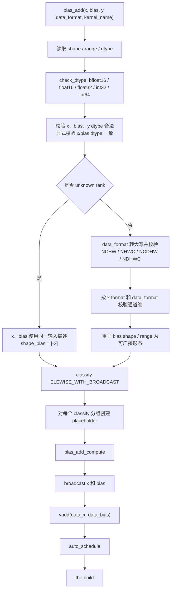

### **TBE Compute 流程图**

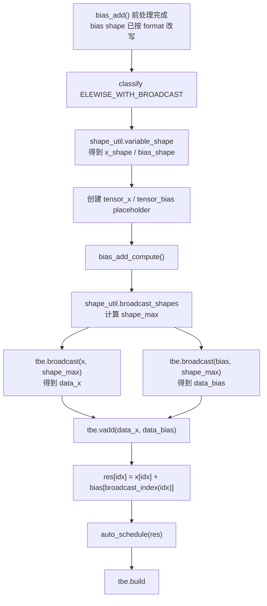

### **TBE op_select_format 流程图**

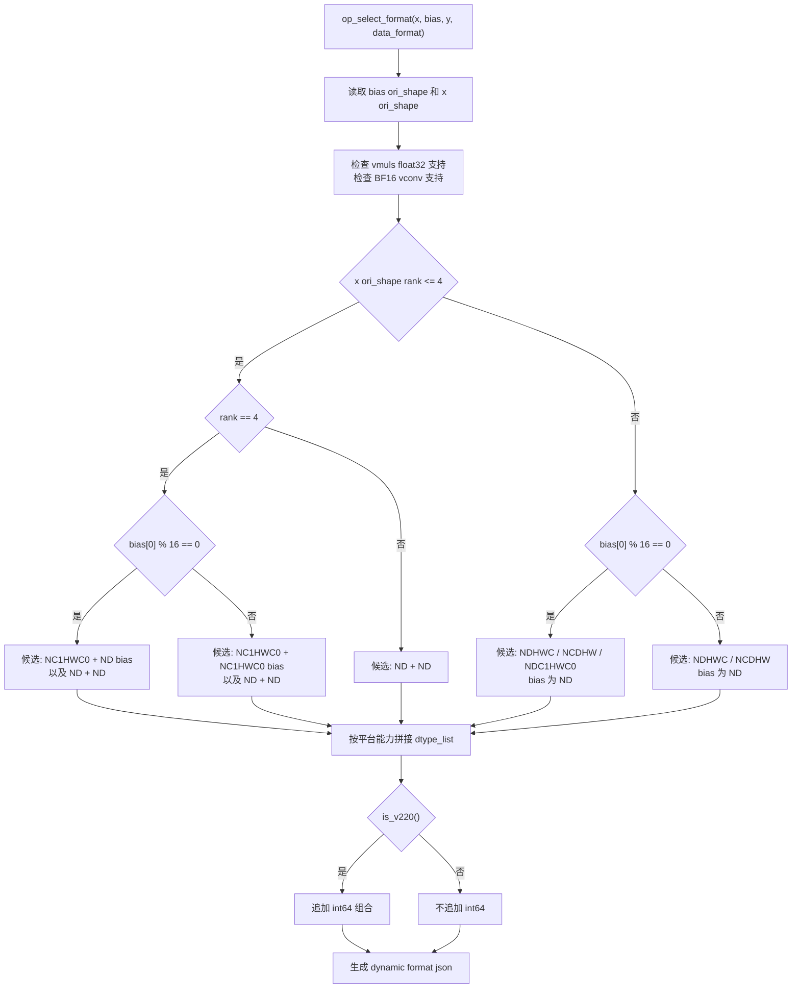

### **TBE Shape 校验流程图**

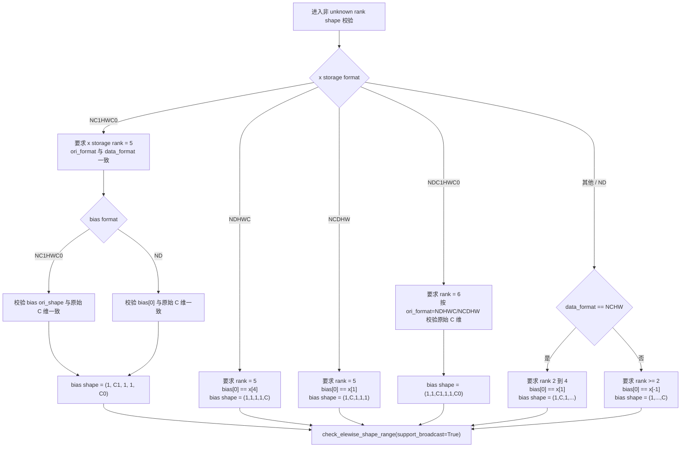

# **需求分析**

## **外部组件依赖**

不涉及额外外部组件依赖。算子实现依赖 CANN / Ascend C 基础组件、ACLNN 调用框架、op_host tiling 框架和 kernel_operator。

## **内部适配模块**

适配 ACLNN 接口调用，补充 BiasAdd 的 Ascend C 设计。设计包含：

- op graph / op def 中声明 BiasAdd 输入、输出、attr、dtype、format。
- ACLNN 层完成 executor 构造、输入/输出/属性注册、support list 匹配和 workspace 查询。
- op host 中完成 shape 推导、dtype / format / attr 校验、tiling 和分核策略。
- op kernel 中根据 tiling 信息完成 bias 索引、广播填充、向量加法、BF16 cast 和搬出。

## **需求模块设计**

### **算子原型**

| **名称** | **类别** | **dtype** | **format** | **shape** | **介绍** |
| -------- | -------- | --------- | ---------- | --------- | -------- |
| x | 输入 | bfloat16 / float16 / float32 / int32 | ND / NCHW / NHWC / NCDHW / NDHWC / NC1HWC0 / NDC1HWC0 | rank >= 2，特殊 format 按 storage rank 约束 | 主输入 Tensor。 |
| bias | 输入 | 与 x 一致 | ND / NC1HWC0 | 通常为一维 C；NC1HWC0 packed bias 为 `(1,C1,1,1,C0)` | 通道 bias。 |
| y | 输出 | 与 x 一致 | 与 x 一致 | 与 x 一致 | 输出 Tensor。 |

说明：

- TBE / 910B 支持 `int64`，但当前 Ascend C 设计首批覆盖 `bfloat16 / float16 / float32 / int32`，不覆盖 `int64`。
- TBE `op_select_format()` 中 `float32` 在 dtype list 中写作 `float`，本文统一写为 `float32`。
- `bias` 为 ND 时必须是一维通道长度；`bias` 为 NC1HWC0 时仅用于 NC1HWC0 packed 场景。

**属性**：

| **名称** | **类型** | **默认值** | **说明** |
| -------- | -------- | ---------- | -------- |
| data_format | string | NHWC | 指定通道维语义，支持 `NCHW`、`NHWC`、`NCDHW`、`NDHWC`。 |

## **算子支持型号**

Atlas A2 训练系列产品 / Atlas 800I A2 推理产品（ascend910b）。

# **需求详细设计**

## **使能方式**

| **上层框架**     | **涉及的框架勾选** |
| ---------------- | ------------------ |
| TF训练/推理      |                    |
| Pytorch训练/推理 |                    |
| ATC推理          |                    |
| Aclnn直调        | √                  |
| OPAT调优         |                    |
| SGAT子图切分     |                    |

## **需求总体设计**

### **host侧设计方案**

BiasAdd host 侧负责完成输出 shape 推导、输入合法性校验、format 语义归一、通道维参数计算、UB 切分和分核策略。

#### **1) InferShape**

BiasAdd 是 shape 保持类算子：

```text
y.shape = x.shape
```

输出 y 的 dtype 和 format 与输入 x 保持一致。

#### **2) dtype 校验**

host tiling 阶段校验：

- x、bias、y dtype 必须一致。
- 首批 Ascend C 支持 `float16`、`float32`、`bfloat16`、`int32`。
- `int64` 为 TBE / 910B 支持项，但当前设计不覆盖。
- tiling 阶段要求 x 和 bias 为 known shape；unknown rank 能力由 op def 声明，当前 kernel 路径不在 tiling 中展开 unknown shape。

不同 dtype 使用不同 tiling key：

| **dtype** | **tiling key** |
| --------- | -------------- |
| float32 | FP32 模板 |
| float16 | FP16 模板 |
| bfloat16 | BF16 模板 |
| int32 | INT32 模板 |

#### **3) format 和 shape 语义**

host 侧将不同 storage format 归一为三类 kernel 计算模式：

| **formatMode** | **场景** | **bias index 规则** |
| -------------- | -------- | ------------------- |
| 0 | 普通 ND / NCHW / NHWC / NCDHW / NDHWC | `(globalIndex / inner) % channel` |
| 1 | NC1HWC0 | `c1 * C0 + c0` |
| 2 | NDC1HWC0 | `c1 * C0 + c0` |

普通 format：

- `data_format=NCHW`：通道轴为第 2 维，rank 支持 2 到 4。
- `data_format=NHWC`：通道轴为最后一维，rank >= 2。
- `data_format=NCDHW`：通道轴为第 2 维，rank = 5。
- `data_format=NDHWC`：通道轴为第 5 维，rank = 5。

packed format：

- NC1HWC0 storage shape 为 `[N, C1, H, W, C0]`。
- NDC1HWC0 storage shape 为 `[N, D, C1, H, W, C0]`。
- packed bias 只在 NC1HWC0 场景支持，shape 为 `[1, C1, 1, 1, C0]`。
- NDC1HWC0 场景 bias 使用一维 ND bias。

ACLNN 直调时，部分 NCDHW / NDC1HWC0 场景可使用 `ACL_FORMAT_ND` 入口表达 storage shape，再由 `data_format` 和 rank 在 tiling 中识别真实语义。

#### **4) 分核策略**

分核以 `totalNum = product(x.storage_shape)` 为总任务量。

- 根据平台信息读取 AI Core 数量 `coreNum` 和 UB 大小 `ubSize`。
- `totalBlocks = ceil(totalNum * typeLength / 32)`。
- `blockDim = min(coreNum, totalBlocks)`。
- 当 `totalNum <= 1024` 时强制 `blockDim = 1`，降低 small case 调度开销。
- 每核处理元素数 `blockFactor = ceil(totalNum / blockDim)`，再按 32B 对齐元素数上对齐。
- 最后一核实际处理量由 `remain = totalNum - blockStart` 截断。

#### **5) UB 容量计算**

Ascend C 设计使用双缓冲：

```text
BUFFER_NUM = 2
BLOCK_SIZE = 32 bytes
```

普通 dtype：

```text
bufferCount = 3
```

分别对应 x 输入、bias 本地展开、y 输出。

BF16：

```text
bufferCount = 6
```

除 x / bias / y 外，还需要 FP32 临时 buffer，用于 BF16 转 FP32 计算和回写。

UB 切分：

```text
ubFactor = ubSize / BUFFER_NUM / bufferCount / typeLength
ubFactor 按 32B 对齐元素数向下对齐
```

### **kernel侧设计方案**

Kernel 侧执行 `Init` 和 `Process` 两个阶段。

1. **初始化阶段（Init）**：
   - 读取 `BiasAddTilingData`。
   - 根据 `blockFactor` 和 `blockIdx` 计算当前核的 `blockStart` 和 `blockLength`。
   - 初始化 x、bias、y 的 `GlobalTensor`。
   - 分配 x 输入队列、bias 本地队列、y 输出队列。
   - BF16 场景额外分配 FP32 临时 buffer。

2. **Process 阶段**：
   - 每个核按 `ubFactor` 对自己的 `blockLength` 分块。
   - 每块执行 `CopyIn -> Compute -> CopyOut`。
   - `CopyIn` 将 x 从 GM 搬入 UB。
   - 根据 formatMode 和 globalIndex 生成本地 bias 展开 Tensor。
   - `Compute` 完成 x + bias。
   - `CopyOut` 将 y 搬出到 GM。

3. **bias 索引计算**：
   - 普通 format：根据 `inner` 和 `channel` 计算 bias index。
   - NC1HWC0：根据 storage linear index 反推出 `c1` 和 `c0`。
   - NDC1HWC0：根据 storage linear index 反推出 `c1` 和 `c0`。

4. **BF16 精度路径**：
   - x 从 BF16 cast 到 FP32。
   - bias 以 FP32 形态填充到本地临时 buffer。
   - 使用 FP32 执行加法。
   - 结果 cast 回 BF16 后写回 y。

5. **非对齐处理**：
   - DataCopy 以 32B 对齐为基本要求。
   - `ubFactor` 和 `blockFactor` 按 dtype 对应的 32B 元素数对齐。
   - 尾块实际 `currentNum` 小于对齐长度时，通过块内有效长度控制，避免越界。

### **Ascend C 流程图**

#### **1. ACLNN 调用流程图**

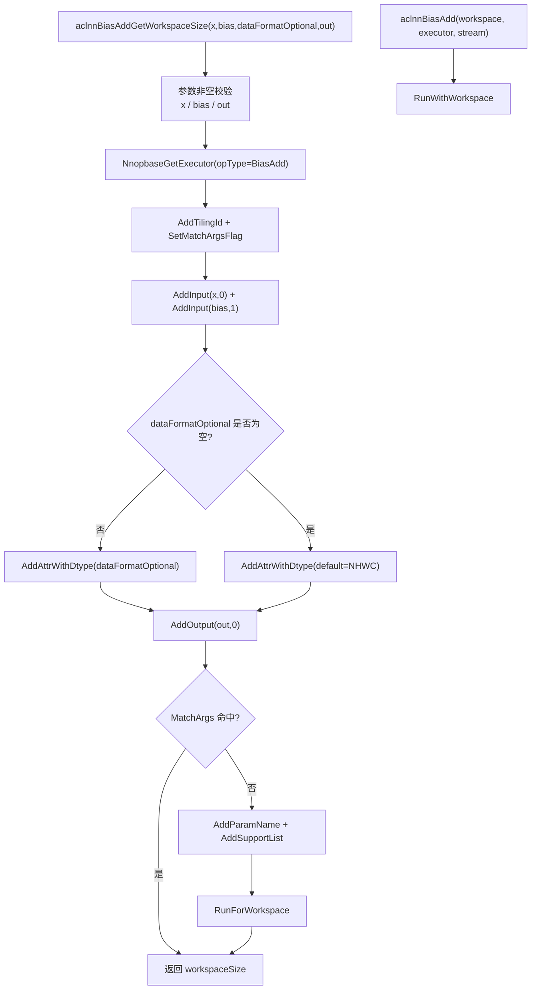

#### **2. L0 / AICore 调度流程图**

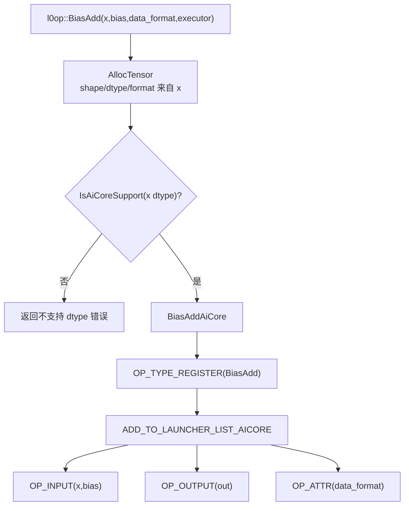

#### **3. Kernel 入口流程图**

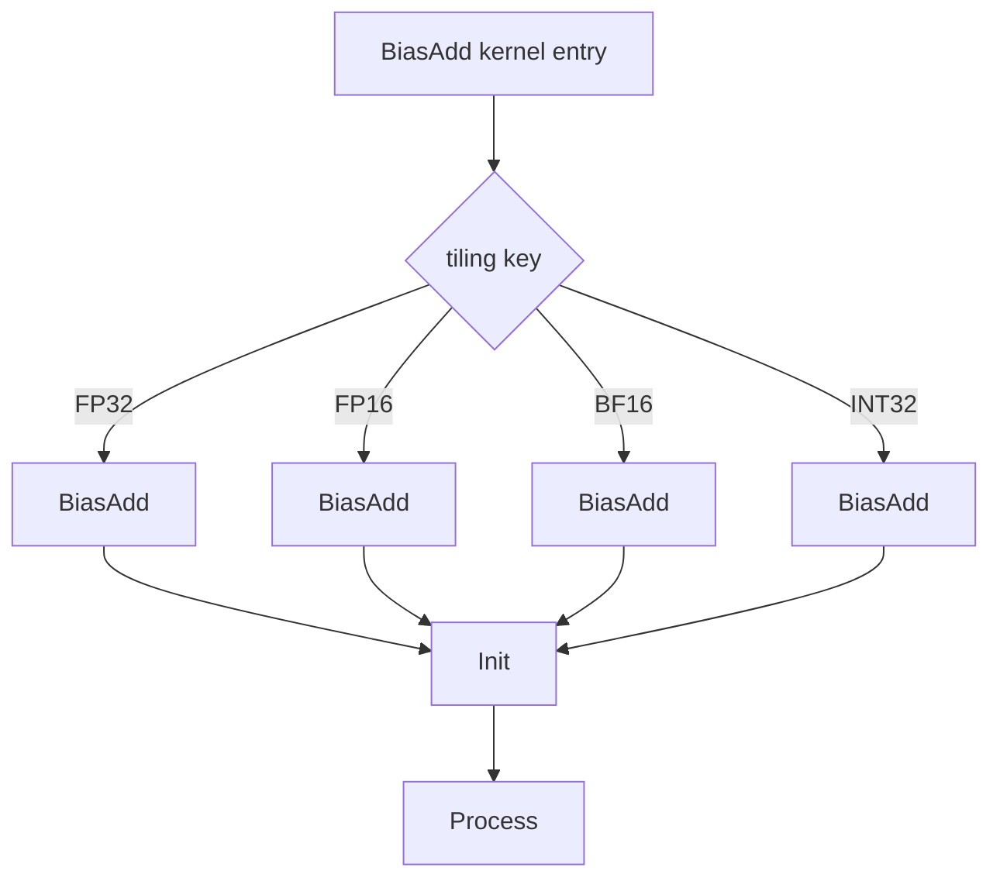

#### **4. Host Tiling 流程图**

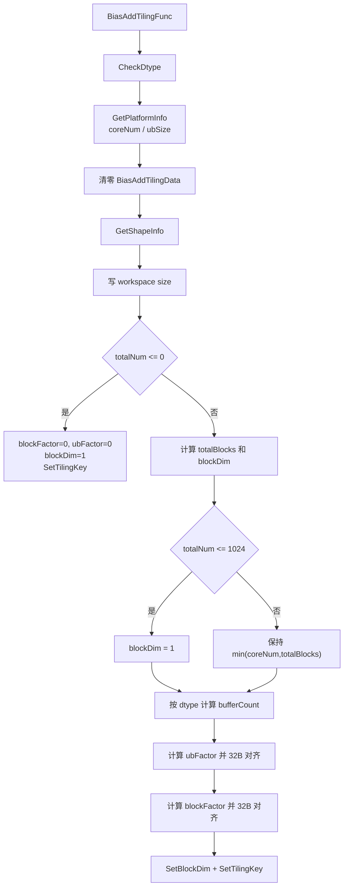

#### **5. GetShapeInfo 流程图**

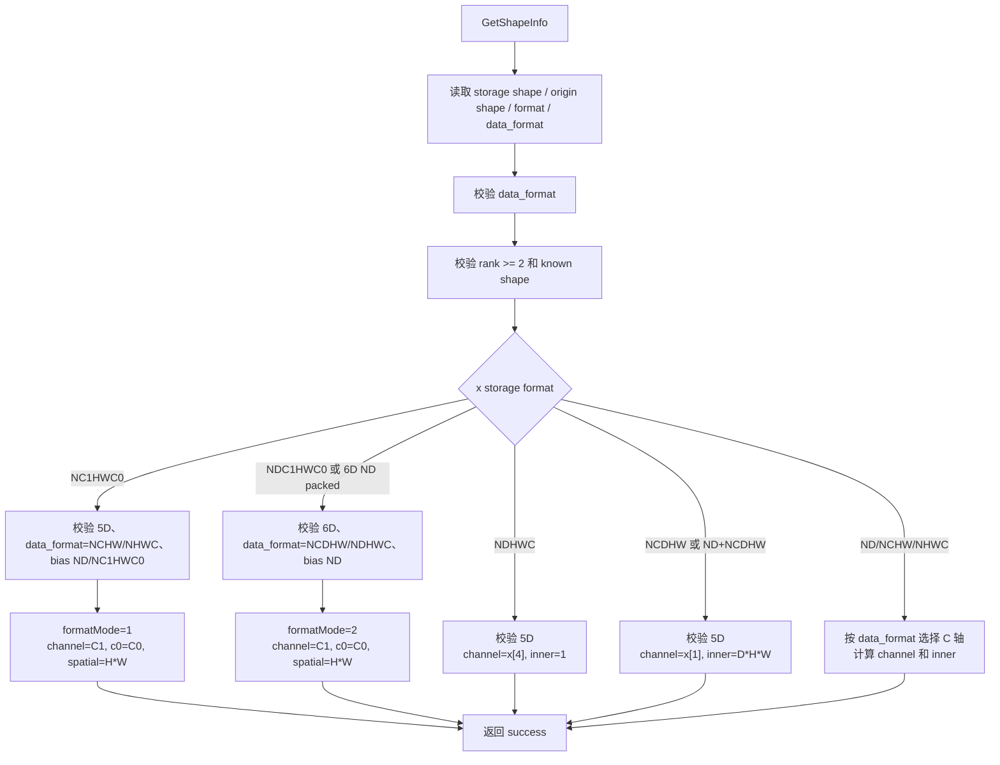

#### **6. Init 流程图**

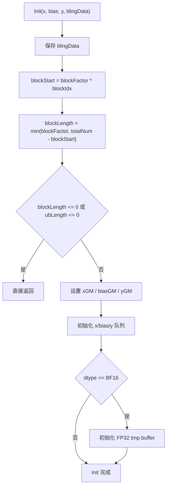

#### **7. Process 流程图**

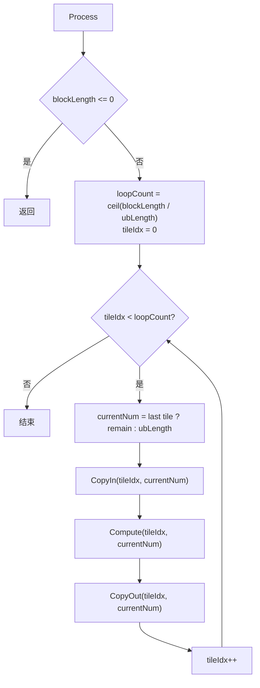

#### **8. CopyIn / Compute / CopyOut 细化流程图**

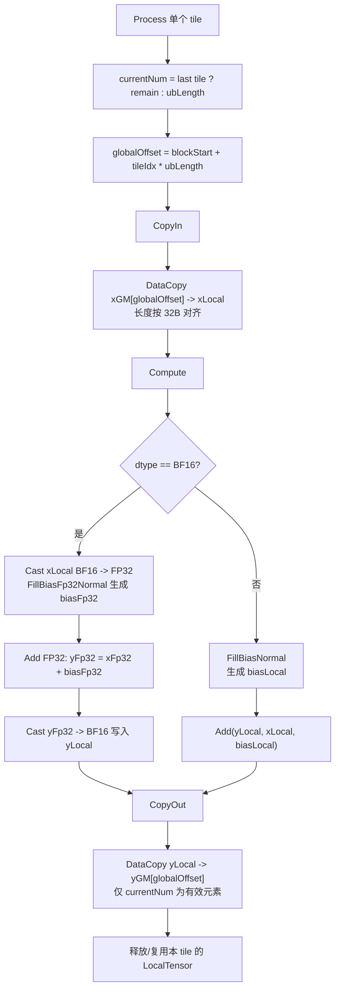

#### **9. Bias 填充与 Compute 细化流程图**

```mermaid
flowchart TD
    A["Compute(tileIdx,currentNum)"] --> B{"dtype == BF16?"}
    B -- "否" --> C["DeQue biasLocal<br/>Add(yLocal,xLocal,biasLocal)"]
    B -- "是" --> D["Cast xLocal -> xFp32"]
    D --> E["FillBiasFp32Normal(biasFp32,<br/>blockStart + tileIdx * ubLength,currentNum)"]
    E --> F["Add(yFp32,xFp32,biasFp32)"]
    F --> G["Cast yFp32 -> BF16 yLocal"]
    C --> H["EnQue yLocal"]
    G --> H

    I["FillBiasNormal / FillBiasFp32Normal"] --> J{"formatMode != 0?"}
    J -- "是且 NC1HWC0 channel==1" --> K["FillBiasInnerOne<br/>按 C0 周期生成 bias"]
    J -- "是且其他 packed" --> L["FillBiasScalar<br/>逐元素 GetBiasIndex"]
    J -- "否" --> M{"inner == 1 && channel > 0?"}
    M -- "是" --> N["FillBiasInnerOne<br/>seed period + Adds 扩展"]
    M -- "否" --> O["按 inner chunk 填充<br/>对齐 chunk 用 Duplicate<br/>非对齐用 FillBiasScalar"]
```

#### **10. Bias Index 流程图**

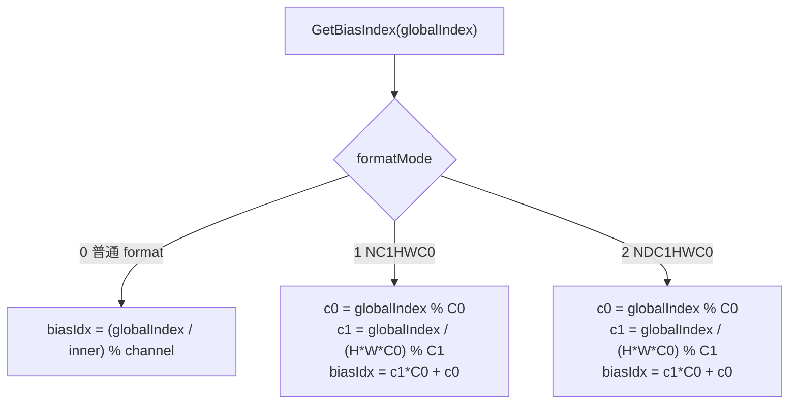

## **支持硬件**

| **支持的芯片版本** | **涉及勾选** |
| ------------------ | ------------ |
| 香橙派OrangePi AIpro | |
| Atlas 200I/500 A2推理产品 | |
| Atlas 800I/T A2 | √ |

## **算子约束限制**

* x、bias、y dtype 必须一致。
* 当前 Ascend C 设计支持 `bfloat16`、`float16`、`float32`、`int32`；`int64` 为 TBE / 910B 支持项，但不纳入首批实现。
* `data_format` 仅支持 `NCHW`、`NHWC`、`NCDHW`、`NDHWC`。
* 普通 ND + `data_format=NCHW` 时，x rank 支持 2 到 4。
* 普通 ND + `data_format=NHWC` 时，x rank 至少为 2。
* NCDHW / NDHWC 场景要求 5D 语义。
* NC1HWC0 场景要求 storage rank 为 5。
* NDC1HWC0 场景要求 storage rank 为 6。
* bias 为 ND 时要求一维；bias 为 NC1HWC0 时仅用于 NC1HWC0 packed bias 场景。
* 输出 y 的 shape、dtype、format 与 x 保持一致。

# **特性交叉分析可维可测分析**

## **关联的 Issue**

暂无。

## **文档更新**

需要同步补充或确认 ACLNN API 参考文档中 BiasAdd 的输入、输出、dtype、format、`data_format` 语义、shape 约束和硬件支持范围。

## **类型标签**

* [ ] Bug修复
* [ ] 新特性
* [ ] 性能优化
* [ ] 文档更新
* [x] 其他，请描述：社区任务算子设计文档
