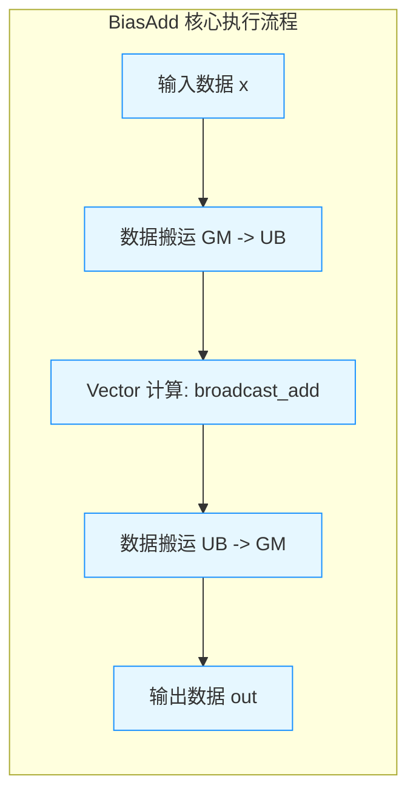
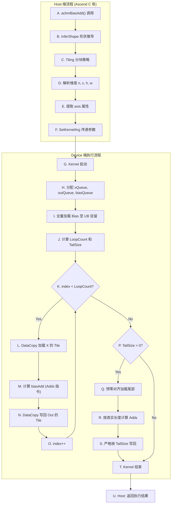

# 【社区任务】BiasAdd算子设计文档

**PR提交说明：**
### PR 提交说明
- **算子源码获取路径**：`04_tasks/01_community-task-2026/tasklist/03-13-BiasAdd/个人开发者/op_plugin/ops/ascend/aclnn/BiasAdd.cpp`
- **算子信息库路径**：`04_tasks/01_community-task-2026/tasklist/03-13-BiasAdd/个人开发者/op_plugin/op_info/BiasAdd.json`
- **参考文件**：  
  - TBE 实现：`04_tasks/01_community-task-2026/tasklist/03-13-BiasAdd/个人开发者/op_plugin/ops/nn/bias_add_tbe.py`  
  - ACLNN 接口：`04_tasks/01_community-task-2026/tasklist/03-13-BiasAdd/个人开发者/op_plugin/include/aclnn/aclnn_bias_add.h`  
  - 测试用例：`04_tasks/01_community-task-2026/tasklist/03-13-BiasAdd/个人开发者/op_plugin/tests/test_bias_add.py`
- **构建状态**：已签署 CLA，已通过 `compile` 构建验证
---

## 一、需求背景

### 1.1 需求来源
通过社区任务完成开源仓算子贡献的需求，将原有的 TBE (Tensor Boost Engine) DSL 实现的 `BiasAdd` 算子迁移并优化为 **Ascend C** 实现，以提升算子的开发效率、可维护性以及对底层硬件（Da Vinci 架构）的极致控制力。

### 1.2 背景介绍

#### 1.2.1 BiasAdd算子实现优化
`BiasAdd` 是深度学习网络（如 CNN、Transformer）中极高频的访存密集型算子。将其从 TBE 迁移至 Ascend C，可以通过手动编排三级流水线和精确控制 UB（Unified Buffer）内存，进一步压榨 MTE3（内存搬运单元）和 Vector Core（向量计算单元）的硬件性能，降低调度开销。

#### 1.2.2 BiasAdd算子现状分析

**1.2.2.1 TBE算子支持的数据类型和数据格式**
- **数据类型**：`float16`, `float32`, `int32`。
- **数据格式**：ND (NCHW, NHWC 等隐式表达为 ND 格式进行线性处理)。

**1.2.2.2 TBE算子实现描述**
原有 TBE 算子基于 TBE DSL（Python）实现。通过 `te.lang.broadcast_add` 或自定义 TIK 指令实现。编译器（Auto-schedule）会自动推导 Shape、处理数据分块（Tiling）、插入 Double Buffer 以及处理尾部不对齐（Tail）问题。

**1.2.2.3 TBE算子实现流程图**

---

## 二、需求分析

### 2.1 外部组件依赖
- **ACL (Ascend Computing Language)**：提供 Device 内存管理、Stream/Context 管理。
- **ACLNN**：提供 Host 端算子原型注册、InferShape 和 Tiling 框架。
- **CANN Runtime**：提供底层硬件驱动与指令下发支持。

### 2.2 内部适配模块
- **Ascend C Kernel 模块**：Device 端核心计算逻辑。
- **Tiling 模块**：Host 端降维解析与参数传递逻辑。

### 2.3 需求模块设计

### 2.3.1 AscendC算子原型

与 TBE 算子原型完全对齐，无功能裁剪：

- **Inputs**:  
  `x (Tensor)`, `bias (Tensor)`
  
- **Attrs**:  
  `axis (int64_t)`
  
- **Outputs**:  
  `out (Tensor)`

> **格式规范说明**：  
> 1. 严格使用 `Inputs`/`Attrs`/`Outputs` 三级标题  
> 2. 参数格式统一为 `参数名 (类型)`  
> 3. 与TBE保持完全一致的参数顺序和命名

#### 2.3.2 AscendC算子相关约束 (与TBE相比的差异)
1. **内存管理显式化**：TBE 由编译器自动分配 UB 空间；Ascend C 需要开发者**手动计算并分配** UB 空间（`TPipe::InitBuffer`），必须严格保证总容量不超过 192KB（Ascend 910B）。
2. **尾部处理显式化**：TBE 自动处理不对齐尾部；Ascend C 必须**手动编写 Tail 逻辑**，使用 `DataCopyPad` 防止 MMU Fault，并控制 `CopyOut` 长度防止脏数据写回。
3. **数据类型约束**：当前 Ascend C 实现优先对齐 `float16` 和 `float32`，暂不支持 `int32`（后续版本补齐）。

---

## 三、需求详细设计

### 3.1 使能方式
采用 **ACLNN** 接口框架进行使能。对外暴露 `aclnnBiasAdd` 接口，通过 `ACLNN_OP_REGISTER` 宏完成算子元数据注册。

### 3.2 需求总体设计

#### 3.2.1 host侧设计

**3.2.1.1 分核策略**
采用**均分策略**。Host 端计算总元素个数 `total_elements`，根据当前设备可用的 AICore 数量（`BlockDim`），将数据平均分配给各个核。每个核处理 `total_elements / BlockDim` 个元素，最后一个核处理余数。

**3.2.1.2 数据分块和内存优化策略**
- **Bias 全量驻留**：由于 `bias` 通常较小（如 Channel 维度），在 Host 端校验其大小。若小于 UB 剩余空间，则 Device 端将其一次性全量加载至 UB 并驻留，避免重复搬运。
- **X 和 Out 分块 Ping-Pong**：将 `x` 和 `out` 按 `block_size`（如 2048 元素）进行分块，利用双缓冲（Ping-Pong Buffer）实现 MTE3 与 Vector Core 的并行重叠。

**3.2.1.3 tilingKey规划策略**
通过 `TilingContext::SetKernelArg` 传递以下关键参数至 Device 端：
- `total_elements`：当前核需要处理的总元素数。
- `axis_size`：Bias 的长度。
- `inner_size`：`axis` 维度之后的元素乘积（用于计算 Bias 索引）。
- `block_size`：单次搬运的元素个数。

#### 3.2.2 kernel侧设计

**3.2.2.1 kernel侧实现描述**
Kernel 采用 Ascend C 标准的三级流水线设计。核心计算摒弃标量循环，采用 **`Adds` (Vector + Scalar)** 硬件指令。即：根据当前 Tile 的全局偏移计算出对应的 `bias` 标量值，直接广播加到整个 `x` 向量上，无需将 `bias` 展开为向量，节省 50% 的 UB 内存。

**3.2.2.2 AscendC实现流程图**

### 3.2.2.3 AscendC实现流程图与TBE流程图存在的差异点和原因

| 差异点       | TBE 实现                     | Ascend C 实现                          | 原因分析                                                                 |
|--------------|-----------------------------|--------------------------------------|--------------------------------------------------------------------------|
| **流水线控制** | 编译器自动插入 Double Buffer，开发者无感知 | 开发者手动使用 TQue 和 TPipe 编排 Ping-Pong 队列 | Ascend C 是 C++ 原生编程范式，将硬件控制权交还给开发者，以换取极致的性能调优空间 |
| **尾部处理**   | 编译器自动生成 Tail 处理逻辑 (Mask 或 Pad) | 开发者必须显式编写 if (TailSize > 0) 分支，并调用 DataCopyPad | Ascend C 要求开发者显式管理内存边界，防止 MTE3 越界读取引发 MMU Fault |
| **广播加法指令** | 使用 broadcast_add (向量加向量) | 使用 Adds (向量加标量)               | Ascend C 提供了更底层的 Adds 指令，避免将 Bias 标量 Duplicate 展开为向量的 UB 内存浪费，提升了计算效率 |
### 3.3 支持硬件
与《算子任务书》要求保持一致，当前支持：
- **Ascend 910B** (Atlas 800T A2)

### 3.4 算子约束限制
1. **Axis 约束**：当前 `axis` 必须为合法维度索引（$0 \le axis < dim\_num$），不支持负数索引（如 `-1` 表示最后一维），负数索引需在 Host 端 InferShape 前由框架层转换为正数。
2. **内存约束**：`bias` 张量的大小不能超过 Device 端 UB 的可用剩余容量（通常限制在 64KB 以内）。若超限，需触发降级策略（当前版本直接返回报错，后续版本支持 Bias 分块）。
3. **对齐约束**：`block_size` 必须满足 32 Bytes 对齐要求。

---

## 四、特性交叉分析

- **与混合精度训练的交叉**：`BiasAdd` 常在 FP16 计算图中使用。Ascend C 实现中，`Adds` 指令原生支持 FP16，无需类型转换，与混合精度训练（AMP）完美兼容。
- **与图融合（Graph Fusion）的交叉**：由于采用 ACLNN 标准接口注册，该算子可被 CANN 图引擎（GE）正确识别，支持与前置的 `Conv2D` 或 `MatMul` 算子进行算子融合（如 `Conv2D+BiasAdd` 融合），降低全局访存开销。

---

## 五、可维可测分析

### 5.1 精度标准/性能标准

| 指标 | 标准要求 | 验证方法 |
| :--- | :--- | :--- |
| **精度标准** | **不低于 TBE**。Float32 误差 $\le 10^{-6}$；Float16 余弦相似度 $\ge 0.9999$。 | Python 端使用 `np.testing.assert_allclose` 与 Numpy 基准结果比对。 |
| **性能标准** | **不低于 TBE**。在典型 Shape (如 NCHW=2,3,4,4 或大 Tensor) 下，执行耗时 $\le$ TBE 版本耗时。 | 使用 `msprof` 或 `acl.profiling` 工具抓取 Kernel 执行时间进行对比。 |

### 5.2 兼容性分析
- **接口兼容**：完全兼容 ACLNN 标准接口规范，上层 PyTorch/MindSpore 框架调用无需修改。
- **向后兼容**：若环境中存在旧版 TBE 算子，CANN 算子下发机制会优先匹配 ACLNN 注册的 Ascend C 算子，实现平滑替换，不影响存量业务。