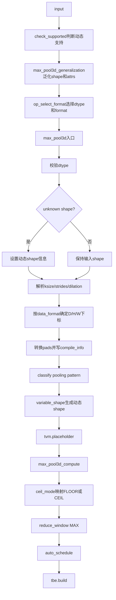
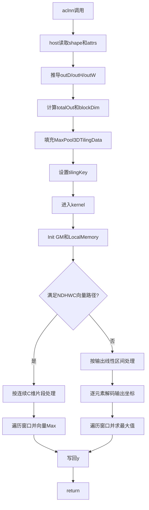

# MaxPool3D 算子设计文档

## 一、需求背景

### 1.1 需求来源

通过社区任务完成 `MaxPool3D` 算子在 `ops-nn` 开源仓中的 Ascend C 实现与 ACLNN 适配。

### 1.2 背景介绍

#### 1.2.1 MaxPool3D 算子实现优化

`MaxPool3D` 对输入张量执行三维最大池化。输入按照 `data_format` 解释为 `NDHWC` 或 `NCDHW`，在 D/H/W 三个空间维度上根据 `ksize`、`strides`、`padding`、`pads`、`dilation`、`ceil_mode` 计算池化窗口，并输出窗口内最大值。

参考 TBE 算子源码、算子原型和算子信息库如下：

- TBE 动态实现：`/Ascend/ascend-toolkit/latest/opp/built-in/op_impl/ai_core/tbe/impl/ops_legacy/dynamic/max_pool3d.py`
- TBE 格式选择实现：`/Ascend/ascend-toolkit/latest/opp/built-in/op_impl/ai_core/tbe/impl/ops_legacy/max_pool3d.py`
- 算子原型：`/Ascend/ascend-toolkit/latest/opp/built-in/op_proto/inc/nn_pooling_ops.h`
- 算子信息库：`/Ascend/ascend-toolkit/latest/opp/built-in/op_impl/ai_core/tbe/config/ascend910b/aic-ascend910b-ops-info-legacy.json`

当前 ACLNN 调用参数顺序为 `x, ksize, strides, padding, pads, dilation, ceilMode, dataFormat, y`，与 TBE 动态入口中的输入、输出和属性语义一致，因此上述文件是本算子的正确参考实现。

#### 1.2.2 MaxPool3D 算子现状分析

##### 1.2.2.1 TBE 算子支持的数据类型和数据格式

内置原型中 `MaxPool3D` 输入/输出包含 `DT_FLOAT16`、`DT_FLOAT32`、`DT_DOUBLE`、`DT_BF16`，本次实现范围为 `float16/float32/bfloat16`。算子信息库声明支持动态编译、动态 format、动态 rank、动态 shape，输入输出 shape 能力为 `all`，属性列表为 `ksize,strides,padding,pads,dilation,ceil_mode,data_format`。

本算子最终支持 5D `ND` storage format，逻辑布局由 `data_format` 解释为 `NDHWC` 或 `NCDHW`，dtype 支持 `float16/float32/bfloat16`。

| 项目 | 本次任务范围 | 当前 Ascend C 实现 |
| --- | --- | --- |
| 输入 | `x` | `x` |
| 输出 | `y` | `y` |
| dtype | float16/float32/bfloat16 | float16/float32/bfloat16 |
| storage format | ND | ND |
| logical format | NDHWC/NCDHW | NDHWC/NCDHW |
| attrs | ksize/strides/padding/pads/dilation/ceil_mode/data_format | 一致 |
| dynamic | dynamic shape/rank/format | 运行时推导 shape 和 tiling |

##### 1.2.2.2 TBE 算子实现描述

TBE 动态实现的主要逻辑如下：

1. `check_supported` 判断动态实现适用场景：unknown shape、`float32`、非默认 `dilation` 等场景返回支持。
2. `max_pool3d_generalization` 在非 `keep_rank` 模式下将 `x/y` shape 泛化为 `[-2]`，并将 `ksize/strides/pads` 置为动态编译信息。
3. `op_select_format` 复用格式选择实现，返回输入输出 dtype/format 组合。
4. `max_pool3d` 入口校验 dtype，并处理动态 shape 输入。
5. `_get_d_h_w_item` 解析 `ksize/strides/dilation`。长度 1 时复制到 D/H/W，长度 3 时直接取 D/H/W，长度 5 时按 `data_format` 提取空间维度。
6. `_get_window_info_and_add_compile_info` 按 `data_format` 确定 D/H/W 下标。`NDHWC` 使用 `1/2/3`，其他逻辑布局使用 `2/3/4`；`pads` 转换为 `[[front,back],[top,bottom],[left,right]]`。
7. `classify` 使用 `OpPatternMode.POOLING` 分类，随后生成动态 shape 并创建 `tvm.placeholder`。
8. `max_pool3d_compute` 将 `ceil_mode` 映射为 `FLOOR/CEIL`，调用 `tbe.reduce_window` 完成 `MAX` 规约。
9. 对分类结果执行 `auto_schedule`，最终通过 `tbe.build` 构建 kernel。

核心计算语义如下：

```text
rounding_mode = FLOOR if ceil_mode == 0 else CEIL
y = reduce_window(x, MAX, window_axes, ksize, strides, dilation, padding, pads, rounding_mode)
```

等价到单个输出元素时，输入窗口坐标为：

```text
id = od * sD + kd * dilationD - padFront
ih = oh * sH + kh * dilationH - padTop
iw = ow * sW + kw * dilationW - padLeft
```

仅当 `0 <= id < inD`、`0 <= ih < inH`、`0 <= iw < inW` 时参与最大值规约。

##### 1.2.2.3 TBE 算子实现流程图



## 二、需求分析

### 2.1 外部组件依赖

| 外部依赖 | 使用位置 | 作用 |
| --- | --- | --- |
| TBE 动态实现 | 功能参考 | 对齐动态泛化、属性解析、padding、ceil、dilation 和 `MAX` 规约语义 |
| GE/GERT 注册接口 | host 侧 | 注册原型、shape 推导、dtype 推导和 tiling |
| Ascend C kernel API | kernel 侧 | 使用 `GlobalTensor`、`TPipe`、`TQue`、`TBuf`、`DataCopyPad`、`Max` |
| ACLNN 接口 | 对外接口 | 两段式调用 `aclnnMaxPool3DGetWorkspaceSize` 和 `aclnnMaxPool3D` |

### 2.2 内部适配模块

| 模块 | 文件 | 作用 |
| --- | --- | --- |
| 原型模块 | `op_graph/max_pool3_d_proto.h` | 定义 `MaxPool3D` 输入、输出和属性 |
| 图推导模块 | `op_graph/max_pool3_d_graph_infer.cpp` | 输出 dtype 跟随输入 dtype |
| host 注册模块 | `op_host/max_pool3_d_def.cpp` | 注册 dtype、format、属性和 `ascend910b` AICore 配置 |
| shape 推导模块 | `op_host/max_pool3_d_infershape.cpp` | 根据输入 shape 和属性推导输出 shape |
| tiling 模块 | `op_host/max_pool3_d_tiling.cpp` | 计算分核和 `MaxPool3DTilingData` |
| kernel 模块 | `op_kernel/max_pool3_d.cpp`、`op_kernel/max_pool3_d.h` | 完成最大池化计算 |

### 2.3 需求模块设计

#### 2.3.1 Ascend C 算子原型

| 名称 | 类别 | dtype | shape/取值 | 说明 |
| --- | --- | --- | --- | --- |
| x | 输入 | ND: float16/float32/bfloat16 | NDHWC `[N,D,H,W,C]`；NCDHW `[N,C,D,H,W]` | 输入张量 |
| y | 输出 | 与 x 相同 | 按输入 shape 和属性推导 | 输出张量 |
| ksize | 属性 | list_int | 长度 1/3/5 | D/H/W 窗口大小 |
| strides | 属性 | list_int | 长度 1/3/5 | D/H/W 滑窗步长 |
| padding | 属性 | string | 标量 | `SAME/VALID/CALCULATED` |
| pads | 属性 | list_int | 长度 6 | `[front, back, top, bottom, left, right]` |
| dilation | 属性 | list_int | 长度 1/3/5 | D/H/W 采样间隔 |
| ceil_mode | 属性 | int | 0 或 1 | 输出尺寸取整方式 |
| data_format | 属性 | string | 标量 | `NDHWC/NCDHW` |

#### 2.3.2 Ascend C 算子相关约束

最终支持范围与 TBE/原型范围保持一致。约束如下：

- x/y dtype 必须一致。
- 输入输出 storage format 必须为 ND，rank 必须为 5。
- `data_format` 仅支持 `NDHWC` 和 `NCDHW`。
- `padding` 仅支持 `SAME`、`VALID`、`CALCULATED`。
- `pads` 必须为长度 6，各值非负且小于对应窗口大小。
- `ksize/strides/dilation` 支持长度 1、3、5，实际 D/H/W 参数必须大于 0。

## 三、需求详细设计

### 3.1 使能方式

当前实现适配 ACLNN 调用框架。调用流程为：

```text
aclnnMaxPool3DGetWorkspaceSize(...)
aclnnMaxPool3D(...)
```

第一段接口完成参数校验、输出 shape 校验、执行器创建和 workspace 查询；第二段接口在指定 stream 上执行。

### 3.2 需求总体设计

#### 3.2.1 host 侧设计

##### 3.2.1.1 分核策略

host 侧在 tiling 阶段解析输入 shape、format 和 D/H/W 属性。总输出元素数为：

```text
totalOut = N * outD * outH * outW * C
```

实际 block 数为：

```text
blockDim = totalOut == 0 ? 1 : min(aivCoreNum, totalOut)
```

普通分核粒度为：

```text
normalCoreOut = ceil(totalOut / blockDim)
tailCoreOut = totalOut - normalCoreOut * (blockDim - 1)
```

kernel 中每个核从 `blockIdx * normalCoreOut` 开始处理本核输出区间。

##### 3.2.1.2 数据分块和内存优化策略

当前 kernel 固定 tile 大小：

```text
OUTPUT_TILE_NUM = 256
ALIGN_BYTES = 32
outBytes = align_up(OUTPUT_TILE_NUM * sizeof(T), 32)
```

LocalMemory 使用情况：

| LocalMemory | 类型 | 大小 | 用途 |
| --- | --- | --- | --- |
| `xInQue_` | `TQue<VECIN, 2>` | `2 * outBytes` | NDHWC 向量路径输入搬运 |
| `calcBuf_` | `TBuf<VECCALC>` | `outBytes` | NDHWC 向量路径保存归约结果 |
| `yOutQue_` | `TQue<VECOUT, 2>` | `2 * outBytes` | 输出队列初始化，当前通用路径直接写回 GM |

通用路径按 256 个输出元素为一个 tile，逐元素计算最大值后写回。NDHWC 向量路径按连续 C 维片段搬运，并使用向量 `Max` 完成窗口归约。

##### 3.2.1.3 tilingKey 规划策略

当前实现设置一个模板 tilingKey：

```text
MAX_POOL3_D_TPL_SCH_MODE_0 = 0
```

host 侧固定设置该 tilingKey，kernel 内部选择通用路径或 NDHWC 向量路径。

#### 3.2.2 kernel 侧设计

##### 3.2.2.1 kernel 侧实现描述

kernel 入口读取 `MaxPool3DTilingData`，实例化 `MaxPool3DKernel<DTYPE_X>`，调用 `Init` 和 `Process`。

kernel 中包含两条计算路径：

- 通用路径 `ProcessGeneric`：按输出线性索引处理，解码坐标后遍历 D/H/W 窗口并求最大值。
- NDHWC 向量路径 `ProcessNdhwcVector`：当 dtype 不是 BF16、`dataFormat=NDHWC`、C 维满足向量对齐时启用。

窗口坐标计算公式：

```text
id = od * sD + kd * dilationD - padFront
ih = oh * sH + kh * dilationH - padTop
iw = ow * sW + kw * dilationW - padLeft
```

仅当 `0 <= id < inD`、`0 <= ih < inH`、`0 <= iw < inW` 时参与最大值计算。通用路径显式判断 NaN；若窗口无合法输入，则输出 dtype 对应负无穷近似值。


##### 3.2.2.2 Ascend C 实现流程图



##### 3.2.2.3 Ascend C 实现流程图与 TBE 流程图存在的差异点和原因

| 差异点 | TBE 实现 | 当前 Ascend C 实现 | 原因 |
| --- | --- | --- | --- |
| 调度方式 | pooling pattern 分类后自动调度 | host tiling + 显式分核 | Ascend C 需手动控制并行粒度 |
| 动态 shape | 泛化后由 TBE 编译流程处理 | 运行时写入 tilingData | ACLNN 执行由 tilingData 驱动 |
| 计算表达 | `reduce_window(MAX)` | 遍历窗口更新最大值 | 实现形式不同，数学语义一致 |
| 数据搬运 | schedule 决定 UB 和 DMA | 显式队列、缓存和 DataCopy | 需明确 UB/GM 访问 |
| 格式处理 | format 选择和 pooling pattern 处理 | format 标记 + kernel 分支寻址 | Ascend C 需手动解码布局 |
| dtype | 支持 float16/float32/bfloat16 | 当前支持 float16/float32/bfloat16 | 与最终测试范围一致 |
| storage format | 支持 ND | 当前支持 ND | 与最终测试范围一致 |

### 3.3 支持硬件

Atlas A2 训练系列产品。

### 3.4 算子约束限制

- 支持 dtype：`float16/float32/bfloat16`。
- storage format 支持 ND，且 x/y 必须一致。
- `data_format` 仅支持 `NDHWC/NCDHW`。
- `padding` 仅支持 `SAME/VALID/CALCULATED`。
- `ksize/strides/dilation` 支持长度 1/3/5，D/H/W 有效值必须大于 0。
- `ksizeD*ksizeH*ksizeW <= 255`，`stridesD/H/W < 64`。
- `pads` 长度固定为 6，各值非负且小于对应窗口。
- y 的 dtype、format 和 shape 必须与推导结果匹配。

## 四、特性交叉分析

| 特性 | 当前实现 |
| --- | --- |
| 动态 shape | host 侧根据运行时 shape 推导输出和 tiling |
| 动态 format | 当前最终自验证范围支持 ND |
| dtype | ND 支持 float16/float32/bfloat16 |
| padding | 支持 SAME/VALID/CALCULATED |
| dilation | 支持 D/H/W dilation，影响有效窗口和采样坐标 |
| ceil_mode | 支持 floor/ceil 输出尺寸计算 |
| NaN | 通用路径按最大值规约语义传播 NaN |
| ACLNN | 提供两段式调用，支持参数校验和执行器调度 |

## 五、可维可测分析

### 5.1 精度标准/性能标准

| 标准 | 描述 |
| --- | --- |
| 精度标准 | 输出满足 AscendOpTest 默认精度阈值，NaN、padding、ceil、dilation 语义与 TBE 对齐 |
| 性能标准 | 所有核参与计算场景下性能不低于 TBE 95%，整体性能与 TBE 持平 |

### 5.2 兼容性分析

当前实现的 ACLNN 参数顺序与 TBE 动态入口语义一致，输入输出、属性列表、dtype/format 注册和 shape 推导均以 TBE 动态实现、算子原型和算子信息库为基准。当前最终自验证范围覆盖 NDHWC/NCDHW、ND、SAME/VALID/CALCULATED、dilation、ceil_mode 和动态 shape 场景。
