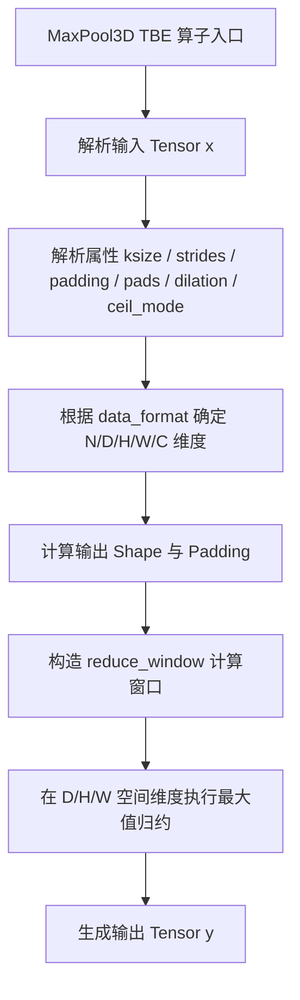
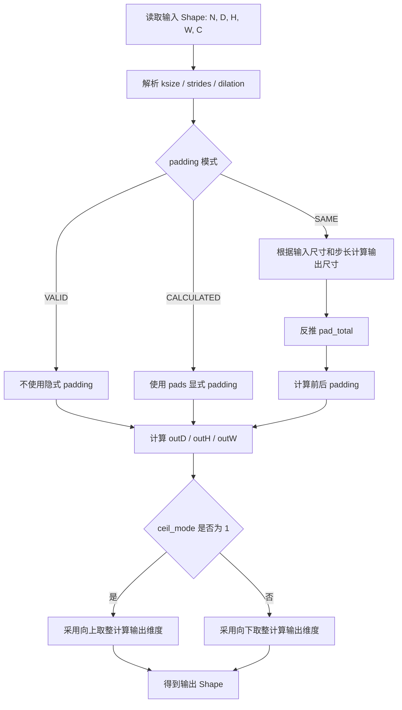
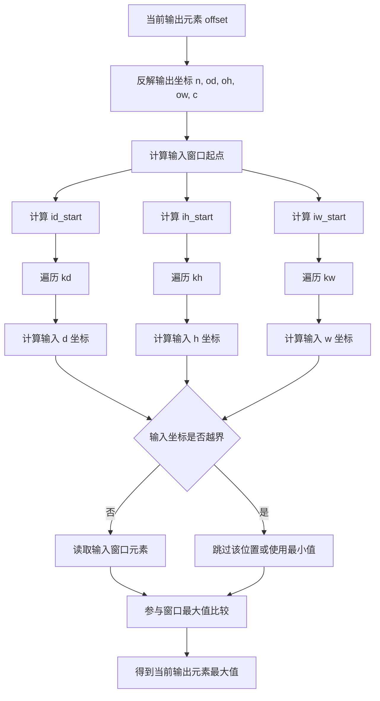
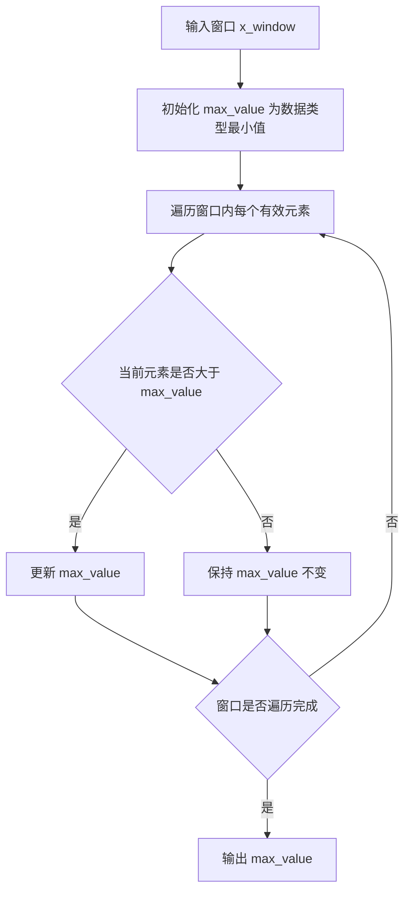
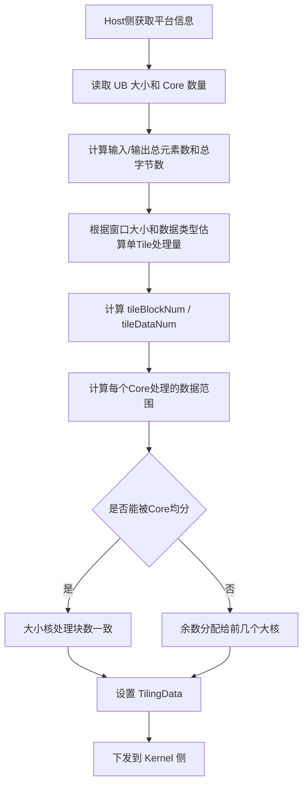
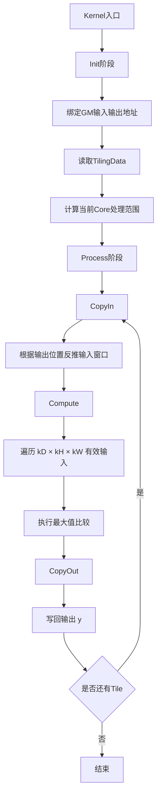

# MaxPool3D 算子设计方案

## 1. 需求背景（required）

### 1.1 需求来源

MaxPool3D 算子实现优化。

### 1.2 背景介绍

基于 MaxPool3D 算子历史 TBE 版本，使用 Ascend C 编程语言进行优化。

参考路径如下：

```text
TBE动态实现参考路径：/usr/local/Ascend/ascend-toolkit/latest/opp/built-in/op_impl/ai_core/tbe/impl/dynamic/
算子原型参考路径：/usr/local/Ascend/ascend-toolkit/latest/opp/built-in/op_proto/inc/
算子信息库参考路径：/usr/local/Ascend/ascend-toolkit/latest/opp/built-in/op_impl/ai_core/tbe/config/ascend910b/
```

### 1.3 MaxPool3D 算子现状分析

通过对 MaxPool3D 算子 TBE 版本的功能分析，当前支持的能力如下：

1. `x` 支持 `float16`、`float32` 两种格式的输入，`y` 与 `x` 保持相同数据类型。算子原型中包含 `float16`、`float32`、`double`，本次 Ascend C 实现暂不支持 `int64`。
2. MaxPool3D 算子不涉及广播，主要对输入 Tensor 在 `D`、`H`、`W` 三个空间维度上进行窗口最大值池化。
3. TBE 版本通过 `reduce_window` 接口实现最大值归约，核心表达式为：

$$
y = \max(x_{window})
$$

其中窗口由 `ksize`、`strides`、`padding`、`pads`、`dilation` 和 `ceil_mode` 共同确定。

MaxPool3D 算子 TBE 版本的整体流程图如下图所示：



MaxPool3D 输出 shape 和 padding 计算流程图建议如下图所示：



MaxPool3D 窗口索引映射流程图建议如下图所示：



对应索引关系如下：

```text
id_start = od * strideD - padD
ih_start = oh * strideH - padH
iw_start = ow * strideW - padW

id = id_start + kd * dilationD
ih = ih_start + kh * dilationH
iw = iw_start + kw * dilationW

读取元素：x[n, id, ih, iw, c]
```

`reduce_window` 接口具体实现如下图所示：



## 2. 需求分析

### 2.1 外部组件依赖

不涉及外部组件依赖。

### 2.2 内部适配模块

适配 Aclnn 接口。

## 3. 需求模块设计

### 3.1 算子原型

#### 3.1.1 原型设计

| 名称 | 类别 | dtype | format | shape | 介绍 |
| ---- | ---- | ---- | ---- | ---- | ---- |
| x | 输入 | fp16 / fp32 / bfloat16 | NDHWC | all | 输入特征图 |
| y | 输出 | fp16 / fp32 / bfloat16 | 同输入 | 同输入 | 输出特征图 |
| ksize | 必选属性 | ListInt | - | - | 池化窗口大小 |
| strides | 必选属性 | ListInt | - | - | 池化窗口滑动步长 |
| padding | 必选属性 | String | - | - | 填充模式，支持 SAME / VALID / CALCULATED |
| pads | 可选属性 | ListInt | - | - | 显式 padding 大小，默认 `{0,0,0,0,0,0}` |
| dilation | 可选属性 | ListInt | - | - | 池化窗口膨胀系数，默认 `{1,1,1,1,1}` |
| ceil_mode | 可选属性 | Int | - | - | 输出 shape 计算是否采用向上取整，默认 `0` |
| data_format | 可选属性 | String | - | - | 输入数据排布格式，默认 `NDHWC` |

#### 3.1.2 相关约束

Atlas A2 训练系列产品 / Atlas 800I A2 推理产品支持 `float16`、`float32`、`bfloat16`。


## 4. 需求详细设计

### 4.1 使能方式

| 上层框架 | 涉及的框架勾选 |
| ---- | :----: |
| TF 训练 / 推理 |  |
| Pytorch 训练 / 推理 |  |
| ATC 推理 |  |
| Aclnn 直调 | √ |
| OPAT 调优 |  |
| SGAT 子图切分 |  |

### 4.2 需求总体设计

#### 4.2.1 Host 侧设计

##### Tiling 策略

MaxPool3D 算子计算过程与输入数据维度、输出数据维度、窗口大小、步长和 padding 强相关，因此 Host 侧需要解析输入 shape 和属性参数，并根据 `data_format` 确定 `N`、`D`、`H`、`W`、`C` 所在位置。

在 Host 侧获取 `x` 输入 shape、`ksize`、`strides`、`dilation`、`pads` 和 `padding` 信息，首先将 `ksize`、`strides`、`dilation` 统一转换为 `D`、`H`、`W` 三个方向的参数；再根据 `SAME`、`VALID` 或 `CALCULATED` 规则计算输出 `D`、`H`、`W` 维度，并获得输出总长度 `total_length`。需要将输入维度、输出维度、窗口参数、步长参数、padding 参数以及 `total_length` 变量传到 Kernel 侧。

任务均分：`coreNum` 根据输出长度和块大小动态调整，确保每个核心处理的输出数据块数均匀。

批量搬运：`tileBlockNum` 和 `tileDataNum` 计算单次处理的输出数据量，通过 `finalSmallTileNum` 和 `finalBigTileNum` 确定小核 / 大核的循环次数。尾块的处理逻辑确保不完整输出块也能参与计算流程，避免越界读写。

##### 1）分核策略

优先使用满核的原则。

如果核间能均分，可视作无大小核区分，大核小核数据块一致；如果核间不能均分，需要将余出的输出数据块分配到前几个核上。

输入输出数据大小计算：通过 `GetInputShape` 和 `GetDataTypeLength` 函数获取输入输出数据大小和类型长度，计算出输入输出数据的总字节数。

UB 内存大小和核心数量获取：通过平台信息获取 UB 内存大小和核心数量，并根据这些信息调整核心数量。

##### 2）数据分块和内存优化策略

充分使用 UB 空间的原则。

需要考虑不同硬件的 UB 大小不同、是否开启 double buffer、Kernel 侧 API 实现过程中是否需要临时数据的储存，以及池化窗口 `kD × kH × kW` 带来的输入数据复用，综合考虑单核内切分的大小。

UB 内存大小获取：通过 `GetCoreMemSize` 函数获取 UB 内存的大小，用于后续的数据切分计算。

Tile 块计算：根据 UB 内存大小、`BLOCK_SIZE`、`BUFFER_NUM` 以及窗口大小计算每个 Tile 块可处理的输出数据数量。

数据切分：将输出数据按照计算出的 Tile 块大小进行切分，计算出每个 core 需要处理的数据块数量和最后一个 block 的剩余数据量。

设置切分参数：将计算出的切分参数，例如输入维度、输出维度、窗口参数、每个 core 的数据量、Tile 块大小等，设置到 `MaxPool3DTilingData` 对象中。

这些策略确保了输出数据在多个核心之间的均匀分布，并且在单个核心内进行了合理切分，以提高并行处理效率。

Tile 分块流程如下：



##### 3）TilingKey 规划策略

需要 TilingKey 的情况：需要感知 Host 侧信息对 Kernel 侧走不同分支。根据 `data_format`、`padding` 模式、`ceil_mode` 以及 `dilation` 是否全 1 规划 TilingKey。常规 `NDHWC` 且 `dilation` 全 1 场景走基础分支；`NDC1HWC0` 或显式 `pads` 场景走泛化分支。

##### 数据检测

对不支持的数据类型、非法 shape、非法 `ksize`、非法 `strides`、非法 `dilation`、非法 `pads` 长度以及输出 shape 为空的场景，在 tiling 策略时返回参数校验错误。

#### 4.2.2 Kernel 侧设计

进行 `Init` 和 `Process` 两个阶段，其中 `Process` 包括数据搬入（`CopyIn`）、计算（`Compute`）、搬出（`CopyOut`）三个阶段。

1. Ascend C 的 MaxPool3D 支持 `float16`、`float32`、 `bfloat16` 数据输入，输出与输入保持相同类型。
2. 在 Kernel 侧的 `CopyIn` 阶段根据输出位置反推输入窗口起始地址，按照 `stride`、`dilation` 和 `padding` 计算有效输入范围，对 padding 区域使用数据类型最小值或直接跳过。
3. 在 `Compute` 阶段对 `kD × kH × kW` 窗口内有效元素进行最大值比较，得到当前输出元素的最大值。
4. 根据不同的 TilingKey 执行不同的核函数。
5. Ascend C 的 MaxPool3D 算子流程见下图。



### 4.3 支持硬件

| 支持的芯片版本 | 涉及勾选 |
| ---- | :----: |
| 香橙派 OrangePi AIpro |  |
| Atlas 200I / 500 A2 推理产品 | √  |
| Atlas 800I / T A2 | √ |

### 4.4 算子约束限制

不支持广播。

暂不支持 `int64` 、 `double` 数据类型。

优先支持 `dilation` 全 1 的常规池化场景，非 1 `dilation` 作为泛化分支处理。

## 5. 特性交叉分析

无。

## 6. 可维可测分析

### 6.1 精度标准 / 性能标准

| 验收标准 | 描述 | 标准来源 |
| ---- | ---- | ---- |
| 精度标准 | 不低于 TBE 版本 | - |
| 性能标准 | 不低于 TBE 版本 | - |

## 7. 兼容性分析

新算子，不涉及兼容性分析。


