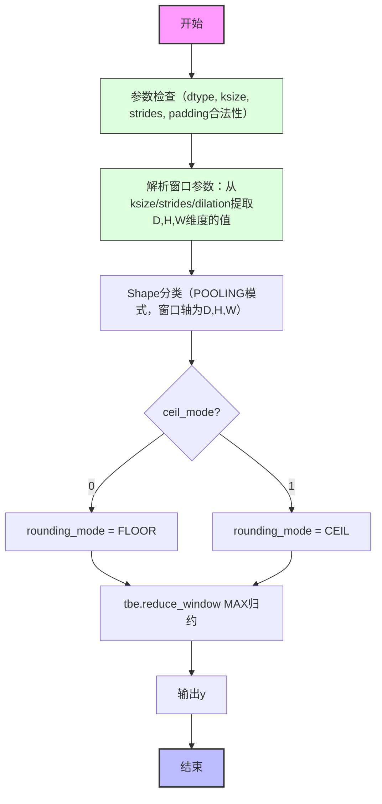
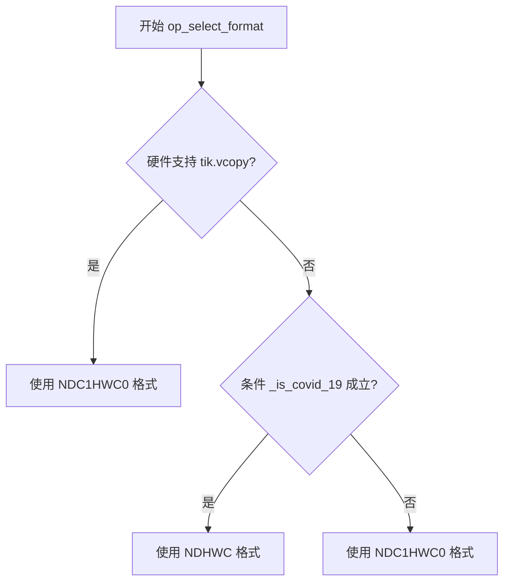
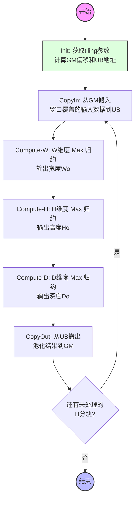

# MaxPool3D 算子设计文档

# 1需求背景
## 1.1需求来源
通过社区任务完成开源仓MaxPool3D算子贡献的需求。
## 1.2背景介绍
### 1.2.1 MaxPool3D算子实现优化
基于MaxPool3D算子历史TBE版本使用Ascend C编程语言进行优化。

MaxPool3D算子（TBE）实现路径和相关API路径  
kernel实现：
/usr/local/Ascend/ascend-toolkit/latest/opp/built-in/op_impl/ai_core/tbe/impl/ops_legacy/dynamic/max_pool3d.py
算子原型：
/usr/local/Ascend/ascend-toolkit/latest/opp/built-in/op_proto/inc/nn_pooling_ops.h (REG_OP(MaxPool3D)部分)
算子信息库：
/usr/local/Ascend/ascend-toolkit/latest/opp/built-in/op_impl/ai_core/tbe/config/ascend910b/aic-ascend910b-ops-info-legacy.json （MaxPool3D部分）

### 1.2.2 MaxPool3D算子现状分析
基于MaxPool3D算子TBE版本的功能分析，当前支持的能力如下：

①**输入输出支持**

1. 输入x：支持float16、float32两种数据类型
2. 输出y：与输入x相同的数据类型
3. 属性ksize：池化窗口大小，支持长度为1、3或5的列表，分别对应(D,H,W)统一值、(D,H,W)独立值、(N,D,H,W,C)完整值
4. 属性strides：池化窗口步长，格式与ksize一致
5. 属性padding：填充模式，支持SAME、VALID、CALCULATED三种
6. 属性pads：显式填充大小，长度为6的列表，格式为(d_front, d_back, h_front, h_back, w_front, w_back)
7. 属性dilation：空洞率，支持长度为1、3或5的列表
8. 属性ceil_mode：取整模式，0表示floor（默认），1表示ceil
9. 属性data_format：数据排布格式，支持NDHWC和NCDHW

②**主要计算流程**

1. 参数解析：从ksize/strides/dilation中提取D、H、W三个维度的窗口大小、步长和空洞率
2. Shape分类：通过classify按POOLING模式对输入shape进行分类，确定窗口轴（D、H、W对应的轴索引）
3. 池化计算：调用tbe.reduce_window，以MAX归约模式在窗口内取最大值
4. 取整处理：根据ceil_mode选择FLOOR或CEIL模式确定输出边界

MaxPool3D算子TBE版本的整体流程图如下图所示：

MaxPool3D算子TBE版本的动态形状选择（op_select_format）流程图如下图所示：

# 2需求分析

## 2.1 外部组件依赖
不涉及外部组件依赖。
## 2.2 内部适配模块
适配geir接口。
### 2.3.1 算子原型
#### 1) 原型设计
| 名称        | 类别 | dtype       | format       | shape                   | 介绍                                     | 必选/可选 | 默认值        |
| ----------- | ---- | ----------- | ------------ | ----------------------- | ---------------------------------------- | -------- | ------------- |
| x           | 输入 | fp16 / fp32 | NDHWC / NCDHW / NDC1HWC0 / ND | (N, D, H, W, C)         | 待池化的3D特征输入                       | 必选     | -             |
| y           | 输出 | fp16 / fp32 | NDHWC / NCDHW / NDC1HWC0 / ND | (N, Do, Ho, Wo, C)      | 池化后的3D特征输出                       | 必选     | -             |
| ksize       | 属性 | int列表     | -            | 长度1/3/5               | 池化窗口大小                             | 必选     | -             |
| strides     | 属性 | int列表     | -            | 长度1/3/5               | 池化窗口步长                             | 必选     | -             |
| padding     | 属性 | str         | -            | -                       | 填充模式：SAME/VALID/CALCULATED          | 必选     | -             |
| pads        | 属性 | int列表     | -            | 长度6                   | 显式填充：(d_f, d_b, h_f, h_b, w_f, w_b) | 可选     | (0,0,0,0,0,0) |
| dilation    | 属性 | int列表     | -            | 长度1/3/5               | 空洞率                                   | 可选     | (1,1,1,1,1)   |
| ceil_mode   | 属性 | int         | -            | 0或1                    | 取整模式：0=floor, 1=ceil                | 可选     | 0             |
| data_format | 属性 | str         | -            | -                       | 数据排布：NDHWC或NCDHW                   | 可选     | NDHWC         |

#### 2)格式选择说明
原型中列出的格式分为用户可指定的ori_format与设备侧实际计算格式两类：

- **用户侧ori_format**：NDHWC、NCDHW，由属性data_format指定，为用户接口层面描述的数据排布方式
- **设备侧计算格式**：NDC1HWC0，为Ascend AI Core硬件实际执行计算时使用的数据排布格式，其中C1*C0=C（C0为硬件对齐因子，通常为16）
- **ND格式**：仅在Ascend 910_95 AI Processor上额外支持

op_select_format格式选择逻辑：
1. 当硬件支持tik.vcopy时，优先选择NDC1HWC0格式（float16/float32均支持）
2. 当硬件不支持tik.vcopy且满足covid_19特殊场景条件时，选择NDHWC格式（仅float16）
3. 其余情况选择NDC1HWC0格式（仅float16）

输出y的格式与输入x的格式一致，由op_select_format统一决定。

#### 3)相关约束
无。

# 3 需求详细设计
## 3.1 使能方式
geir调用。
## 3.2 需求总体设计
### 3.2.1 host侧设计：
#### tiling策略：
MaxPool3D为3D空间池化算子，计算涉及D、H、W三个空间维度的窗口滑动和归约。host侧需根据输入shape、窗口参数进行分核和分块策略规划。

#### 1)分核策略
优先使用满核的原则。

沿D维度（NDHWC格式下axis=1，NCDHW格式下axis=2）进行核间切分。每个核处理一段连续的D维度数据，各核独立完成所分配D片段内全部H、W维度的池化计算。

如果核间能均分D维度，可视作无大小核区分，大核小核数据块一致；

如果核间不能均分，需要将余出的D维度数据分配到前几个核上。

#### 2)数据分块和内存优化策略
充分使用UB空间的原则。

单核内在H维度上进行分块（tiling），每次处理一段H维度的数据。分块大小由UB可用空间、输入数据类型大小和窗口参数共同决定：

- UB内存需容纳输入窗口数据（包含padding区域）和输出结果
- 分块大小计算：从最大可能的H分块开始递减搜索，直到输入数据量×2（pingpong）不超过UB可用空间的一半

W和C0维度因数据量较小，通常整块搬入UB处理，不做二次切分。

#### 3)tilingkey规划策略
暂不划分tilingkey。

数据检测：
输入x仅支持float16/float32类型；
若x为其他类型（如int8/int32/bfloat16等），直接返回不支持的错误日志并终止Tiling流程。

### 3.2.2 kernel侧设计：
#### 3.2.2.1 Kernel侧实现描述
Kernel侧核心分为Init初始化阶段和Process计算阶段，其中Process阶段严格拆分为数据搬入（CopyIn）、核心计算（Compute）、数据搬出（CopyOut）三个子阶段，具体实现如下：

##### 1. Init初始化阶段
- 核心目标：完成输入输出地址绑定、TilingData参数读取、参数合法性校验；
- 关键操作：
  1. 校验输入x、输出y，TilingData指针非空，若为空则返回GRAPH_FAILED并输出错误日志；
  2. 校验数据类型合法性：
     - 输入x仅支持float16/float32，拒绝int8/int32/bfloat16等类型；
  3. 从TilingData中读取核心参数：
     - 基础参数：inputShape（输入形状）、ksize（窗口大小）、strides（步长）、pads（填充大小）、dilation（空洞率）、ceilMode（取整模式）；
     - 适配参数：dataFormat（数据排布格式）、tileHNum（单核H维度分块数）、tileHDataNum（单tile处理H维度元素数）；
  4. 绑定输入x的Global Memory（GM）地址，绑定输出y的GM写入地址，为后续数据搬运做准备；
  5. 初始化UB缓冲区（按Double Buffer机制分配）：为输入x、输出y分别分配2组UB缓冲区（BUFFER_NUM=2），保证数据搬运与计算流水线并行。

##### 2. Process计算阶段
- 核心目标：按tileHDataNum分块循环处理H维度数据，每个tile处理一段H维度的池化计算，整体循环逻辑为：
  `for (int64_t tileIdx = 0; tileIdx < totalTileNum_; tileIdx++) { CopyIn → Compute → CopyOut }`（注：totalTileNum_为单核内H维度总分块数）
- 分阶段详细实现：

###### （1）CopyIn数据搬入阶段
- 核心目标：从GM读取指定tile范围的输入数据到Unified Buffer（UB），考虑padding区域，搬入窗口覆盖的完整输入数据；
- 关键操作：
  1. 根据当前核的block_idx和H维度分块索引，计算输入数据在GM中的偏移；
  2. 考虑padding区域，搬入窗口覆盖的完整输入数据（包含前后padding行）；
  3. 将数据从GM拷贝到UB。

###### （2）Compute核心计算阶段
- 核心目标：按W→H→D的顺序逐维度执行Max归约，完成3D最大池化计算；
- 关键操作：
  1. W维度池化：对W维度上窗口内元素取最大值，输出Wo（ceil_mode=0时）：Wo = (W + pad_w_front + pad_w_back - (ksize_w - 1) * dilation_w - 1) / stride_w + 1；（ceil_mode=1时）：Wo = (W + pad_w_front + pad_w_back - (ksize_w - 1) * dilation_w - 1 + stride_w - 1) / stride_w + 1；
  2. H维度池化：对H维度上窗口内元素取最大值，输出Ho同理计算；
  3. D维度池化：对D维度上窗口内元素取最大值，输出Do同理计算。

###### （3）CopyOut数据搬出阶段
- 核心目标：将UB中计算完成的池化结果写入GM的输出地址；
- 关键操作：
  1. 调用DataCopy把池化结果写回GM。

##### 3. 核函数调度与模板化适配
- 基于schMode（调度模式）实现编译期分支选择，与Host侧TilingKey、芯片类型联动：
  - schMode=0：适配float16类型，实例化MaxPool3D<Float16>类；
  - schMode=1：适配float32类型，实例化MaxPool3D<Float32>类；
- 核函数启动时，直接复用Host侧Tiling设置的BlockDim（核心数），保证核间数据分配与Host侧分核策略一致。

#### 3.2.2.2 AscendC实现流程图

#### 3.2.2.3 AscendC实现流程图与TBE流程图存在差异点和原因

因为TBE侧MaxPool3D的核数分配由框架隐式处理，无显式的分核、大核/小核数据分配逻辑；因此，在AscendC的Host侧Tiling流程中，新增了基于D维度的满核分核策略（计算totalTileNum、bigCoreDataNum/smallCoreDataNum），并补充核数边界约束（单块数据≥输入总量则核数=1），从而手动实现核间数据均分与余数处理，保证硬件满核利用。

因为TBE侧MaxPool3D通过classify按POOLING模式对输入shape进行分类，再调用tbe.reduce_window完成归约计算，无编译期分支选择逻辑；因此，在AscendC的Kernel侧流程图中，新增了基于schMode的编译期分支选择（实例化不同模板类适配数据类型），从而提前剔除冗余分支，提升算子运行时性能，这是TBE解释型运行时判断无法实现的编译期优化。

## 3.3支持硬件
| 支持的芯片版本 | 涉及勾选 |
|:----:|:----:|
| Atlas A2 训练系列产品 |√|
| Atlas 800I A2推理产品 |√|
## 3.4算子约束限制
不支持动态shape。输入x仅支持float16/float32数据类型。ksize、strides、dilation属性需为合法正整数列表。padding为CALCULATED时pads需为长度6的非负整数列表。
# 4特性交叉分析
无
# 5可维可测分析
## 5.1精度标准/性能标准
| 验收标准 | 描述(不涉及说明原因) | 标准来源 |  
|:----:|:----:|:----:|
| 精度标准|不低于TBE版本95%|算子任务书 | 
| 性能标准|整体不低于TBE版本|算子任务书 | 
## 5.2兼容性分析
新算子，不涉及兼容性分析
