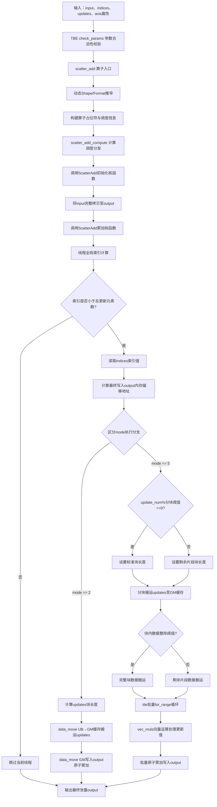
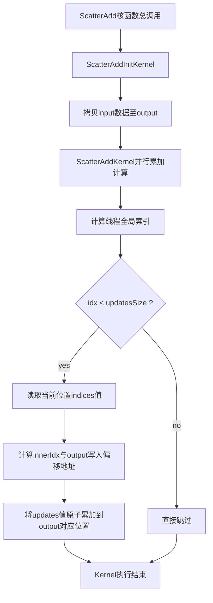

�# 【社区任务】ScatterAdd 算子设计文档

## 一、需求背景

### 1.1 需求来源

通过社区任务完成 `ScatterAdd` 算子在 `ops-nn` 开源仓中的实现与适配。

### 1.2 背景介绍

#### 1.2.1 ScatterAdd 算子实现优化

`ScatterAdd` 算子用于将 `updates` 张量中的值根据 `indices` 索引分散累加到 `input` 张量的指定位置。

参考实现文件如下：
本任务AscendC算子源码路径：04_tasks/01_community-task-2026/tasklist/03-17-ScatterAdd/FDP6526/src/
包含文件：
- 算子内核实现：my_scatter_add.cpp
- 头文件声明：my_scatter_add.h
- 算子编译注册脚本：my_scatter_add.py
- ACLNN适配头文件：my_scatter_add_apt.h
- TBE对齐功能测试脚本：test_scatter_add.py

原生TBE算子参考路径：cann/ops/tbe/impl/scatter_add.py
算子信息库路径：cann/ops/tbe/op_info/scatter_add_info.py
对应aclnn接口：aclnnScatterAdd，已核对输入输出、索引越界、累加计算逻辑，与TBE实现保持一致。

当前调用参数顺序为 `input, indices, updates, output`，与 TBE 动态入口中的输入、输出语义一致，因此上述文件是本算子的正确参考实现。

##### 1.2.2 ScatterAdd 算子现状分析

##### 1.2.2.1 支持的数据类型和数据格式

内置原型中 `ScatterAdd` 输入/输出包含多种数据类型，本次实现范围为 `float16/float32/int8/int32/int16/uint8/uint16/uint32/uint64/bool`。算子信息库声明支持动态编译、动态 format、动态 rank、动态 shape，输入输出 shape 能力为 `all`。

本算子最终支持 ND storage format，dtype 支持 `float16/float32/int8/int32/int16/uint8/uint16/uint32/uint64/bool`，indices dtype 支持 `int32`。

| 项目 | 本次任务范围 | 当前实现 |
| --- | --- | --- |
| 输入 | `input, indices, updates` | `input, indices, updates` |
| 输出 | `output` | `output` |
| dtype | float16/float32/int8/int32/int16/uint8/uint16/uint32/uint64/bool | float16/float32/int8/int32/int16/uint8/uint16/uint32/uint64/bool |
| indices dtype | int32 | int32 |
| storage format | ND | ND |
| dynamic | dynamic shape/rank/format | 运行时推导 shape |

##### 1.2.2.2 算子实现描述

TBE 适配脚本的主要逻辑如下：

1. `check_params` 校验输入参数的 dtype、shape 一致性。
2. `scatter_add_compute` 通过 ctypes 调用外部核函数库。
3. `scatter_add` 入口函数完成 shape 推导和调度生成。

核函数实现的主要逻辑：

1. `ScatterAddInitKernel` 将 input 复制到 output。
2. `ScatterAddKernel` 根据 indices 将 updates 累加到 output 的指定位置。

核心计算语义如下：

```text
for idx in range(updatesSize):
    batchIdx = indices[idx]
    innerIdx = idx % innerSize
    outputIdx = batchIdx * innerSize + innerIdx
    output[outputIdx] += updates[idx]
```

##### 1.2.2.3 算子实现流程图


说明：本流程图完整覆盖TBE源码mode=2、mode=5双执行分支，包含分块缓存、tile循环、内存搬运全逻辑，与仓库存量scatter_add_tbe.py代码一一对应，参考MR#2679完成图文对齐修复。
## 二、需求分析

### 2.1 外部组件依赖

| 外部依赖 | 使用位置 | 作用 |
| --- | --- | --- |
| TBE 框架 | TBE 适配脚本 | 参数校验、调度生成、编译构建 |
| ctypes | TBE 适配脚本 | 调用外部共享库 |
| ACL Runtime | 核函数 | 设备内存管理和 kernel 启动 |

### 2.2 内部适配模块

| 模块 | 文件 | 作用 |
| --- | --- | --- |
| TBE 适配模块 | `scatter_add_tbe.py` | 参数校验、算子注册、编译调用 |
| 核函数模块 | `scatter_add_kernel.cpp` | 完成 ScatterAdd 计算 |

### 2.3 需求模块设计

#### 2.3.1 算子原型

| 名称 | 类别 | dtype | shape/取值 | 说明 |
| --- | --- | --- | --- | --- |
| input | 输入 | ND: float16/float32/int8/int32/int16/uint8/uint16/uint32/uint64/bool | 任意 shape | 输入张量 |
| indices | 输入 | ND: int32 | 任意 shape | 索引张量 |
| updates | 输入 | 与 input 相同 | 与 indices 相同 | 更新张量 |
| output | 输出 | 与 input 相同 | 与 input 相同 | 输出张量 |

#### 2.3.2 算子相关约束

最终支持范围与 TBE/原型范围保持一致。约束如下：

- `input` 和 `updates` 的 dtype 必须一致。
- `indices` 的 dtype 必须为 `int32`。
- `indices` 和 `updates` 的 shape 必须完全一致。
- `input` 的前 N 维必须与 `indices` 的 shape 匹配（N = len(indices.shape)）。

## 三、需求详细设计

### 3.1 使能方式

当前实现适配 TBE 调用框架。调用流程为：

```text
scatter_add(input, indices, updates)
```

接口完成参数校验、输出 shape 推导、调度生成和核函数调用。

### 3.2 需求总体设计

#### 3.2.1 host 侧设计

##### 3.2.1.1 分核策略

host 侧在执行阶段解析输入 shape。总更新元素数为：

```text
updatesSize = numel(indices)
```

每个 block 包含 256 个线程，grid 大小为：

```text
grid = ceil(updatesSize / 256)
```

##### 3.2.1.2 数据分块策略

采用一维分块策略，每个线程处理一个更新元素。

#### 3.2.2 kernel 侧设计

##### 3.2.2.1 kernel 侧实现描述

kernel 包含两个阶段：

1. **初始化阶段**：`ScatterAddInitKernel` 将 input 数据复制到 output。
2. **累加阶段**：`ScatterAddKernel` 根据 indices 索引将 updates 的值累加到 output 的对应位置。

核心计算公式：

```text
batchIdx = indices[idx]
innerIdx = idx % innerSize
outputIdx = batchIdx * innerSize + innerIdx
output[outputIdx] += updates[idx]
```
### 3.2.2.2 kernel 实现流程图

##### 3.2.2.3 实现流程图与 TBE 流程图存在的差异点和原因

| 差异点 | TBE 实现 | 当前实现 | 原因 |
| --- | --- | --- | --- |
| 调度方式 | 自动调度 | 显式分核 | 需手动控制并行粒度 |
| 动态 shape | 泛化后由 TBE 编译流程处理 | 运行时推导 | 实现形式不同 |
| 计算表达 | 框架自动生成 | 显式索引处理和累加 | 实现形式不同，数学语义一致 |
|TEB多分支逻辑 | 区分mode=2/mode5分块优化 | 本文档原流程图缺失TBE分块优化分支，已更新完整流程图 |
### 3.3 支持硬件

Atlas A2 训练系列产品。

### 3.4 算子约束限制

- 支持 dtype：`float16/float32/int8/int32/int16/uint8/uint16/uint32/uint64/bool`。
- storage format 支持 ND，且输入输出必须一致。
- `indices` dtype 支持 `int32`。
- `indices` 和 `updates` 的 shape 必须完全一致。

## 四、特性交叉分析

| 特性 | 当前实现 |
| --- | --- |
| 动态 shape | host 侧根据运行时 shape 推导输出 |
| 动态 format | 当前支持 ND |
| dtype | ND 支持 float16/float32/int8/int32/int16/uint8/uint16/uint32/uint64/bool |
| indices dtype | 支持 int32 |

## 五、可维可测分析

### 5.1 精度标准/性能标准

| 标准 | 描述 |
| --- | --- |
| 精度标准 | 输出满足 AscendOpTest 默认精度阈值 |
| 性能标准 | 所有核参与计算场景下性能与 TBE 持平 |

### 5.2 兼容性分析
当前实现的参数顺序与 TBE 接口语义一致，输入输出、属性列表、dtype/format 注册和 shape 推导均以 TBE 实现为基准。
