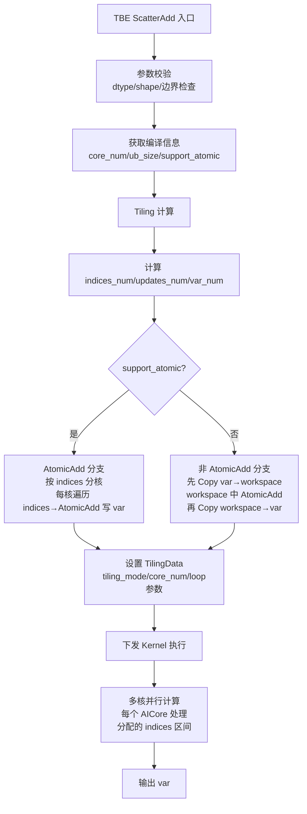
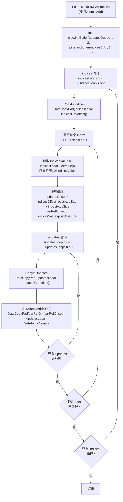
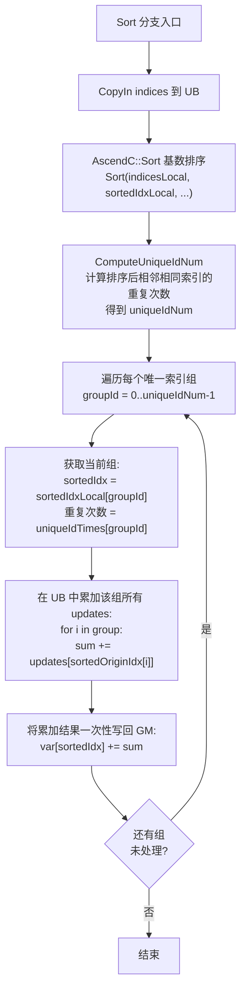

# 需求背景（required）

## 需求来源

昇腾算子开源仓社区任务：基于 Ascend C 编程语言实现 ScatterAdd 算子，替代原 TBE 实现。

## 背景介绍

### ScatterAdd算子实现优化

基于ScatterAdd算子历史TBE版本使用Ascend C编程语言进行优化。

ScatterAdd算子（TBE）实现路径和相关API路径：

- ScatterAdd算子TBE实现路径：/usr/local/Ascend/ascend-toolkit/latest/opp/built-in/op_impl/ai_core/tbe/impl/dynamic/
- ScatterAdd算子原型路径：/usr/local/Ascend/ascend-toolkit/latest/opp/built-in/op_proto/inc/
- ScatterAdd算子信息库路径：/usr/local/Ascend/ascend-toolkit/latest/opp/built-in/op_impl/ai_core/tbe/config/ascend910b

### ScatterAdd算子TBE实现现状分析

通过对ScatterAdd算子TBE版本的功能分析，当前支持的能力如下：

| 参数 | 参数含义 | 数据类型 | 支持数据类型 | 约束 | 形状 |
| --- | --- | --- | --- | --- | --- |
| var | 输入输出tensor | tensor | float16, float32, bfloat16, int32, int8, uint8 | 输入输出shape相同 | (M, N...) |
| indices | 索引tensor | tensor | int32, int64 | 值需在[0, var.shape[0])范围内 | (K...) |
| updates | 更新tensor | tensor | float16, float32, bfloat16, int32, int8, uint8 | 与var同dtype | (K..., N...) |
| use_locking | 属性 | bool | - | 默认false | - |

计算公式：`var[indices[i][j][k]][j][k] += updates[i][j][k]`（对 dim=0）

### ScatterAdd算子TBE实现流程图



### ScatterAdd算子功能分析

ScatterAdd算子功能：根据 indices 指定的索引位置，将 updates 中的值累加到 var 的对应位置。

输入：var、indices、updates

输出：var（与输入var shape相同，原地更新）

支持数据类型：float16、float32、bfloat16、int32、int8、uint8

indices支持数据类型：int32、int64

暂不支持：int64、double数据类型，暂不支持广播操作

# 需求分析（required）

## 需求描述

使用Ascend C编程语言实现ScatterAdd算子，支持float16、float32、bfloat16、int32、int8、uint8数据类型，indices支持int32、int64，暂不支持广播功能。

## 需求拆解

1. 支持float16、float32、bfloat16、int32、int8、uint8数据类型（var和updates同类型）
2. indices支持int32、int64
3. 支持ND格式
4. 支持泛化shape输入
5. 性能不低于TBE版本的95%（所有核参与计算场景）
6. 精度满足AscendOpTest工具默认阈值

# 详细设计（required）

## 算子分析

### 数学公式

```
var[indices[i_1][i_2]...[i_k]][j_1][j_2]...[j_{n-1}] += updates[i_1][i_2]...[i_k][j_1][j_2]...[j_{n-1}]
```

其中 dim=0 为默认散射维度。

### 支持数据类型

| 输入/输出 | 数据类型 |
|-----------|---------|
| var / updates / output | FLOAT, FLOAT16, BFLOAT16, INT32, INT8, UINT8 |
| indices | INT32, INT64 |

### 支持形状

- var 和 output 的 shape 相同
- updates.shape = indices.shape + var.shape[1:]（indices 维度拼接 var 除第一维外的维度）
- indices 中每个值需满足 0 <= indices[i] < var.shape[0]
- ND 格式

### 算子分类

ScatterAdd 属于 **Scatter 类算子**（索引散射类），具有以下特征：
- 多个索引可能指向同一目标位置（需要原子加或排序去重解决写冲突）
- 写入位置由 indices 动态决定，非连续访问
- 涉及读-改-写操作模式

### 核心设计挑战

1. **写冲突**：多个核可能同时写同一 var 位置，需通过 AtomicAdd 或 Sort 去重解决
2. **非连续访问**：indices 决定写入位置，GM 访问不连续
3. **小数据类型原子加不支持**：int8/uint8 不支持 AtomicAdd，需 Cast 到 int32 后操作

## 算子实现

### 实现方案

Atlas A2 训练系列产品不支持 SIMT 模式，因此本算子仅采用 **SIMD 模式**实现，使用 Vector 引擎完成计算：

| 模式 | 条件 | 特点 |
|------|------|------|
| **SIMD（支持AtomicAdd）** | var 类型为 float/half/bfloat16/int32 | 直接使用 SetAtomicAdd + DataCopyPad 写 GM |
| **SIMD（不支持AtomicAdd）** | var 类型为 int8/uint8 | 三阶段：var→workspace Cast → workspace AtomicAdd → workspace→var Cast |

**排序分支**：当 `indices_num > var_shape[0] × 10` 时（索引远多于 var 行数），启用排序分支，先排序 indices 再按组聚合，减少原子加冲突次数，提升性能。

**确定性计算分支**：当 `context->GetDeterministic() == 1` 且数据类型为 float/half/bfloat16 时，不使用 AtomicAdd，改用排序+分组累加方式，确保相同输入多次计算结果完全一致。

#### host侧设计：

##### 1. Tiling 参数结构体

```cpp
BEGIN_TILING_DATA_DEF(ScatterAddTilingData)
  TILING_DATA_FIELD_DEF_ARR(uint64_t, 2, varShape);      // var 的二维化 shape [M, N]
  TILING_DATA_FIELD_DEF(uint64_t, indicesSize);           // indices 元素总数
  TILING_DATA_FIELD_DEF(uint64_t, postAxisSize);          // var 尾轴大小 N
  TILING_DATA_FIELD_DEF(uint64_t, copyCoreNum);           // 参与数据搬运的核数
  TILING_DATA_FIELD_DEF(uint64_t, perCoreHandleVar);      // 每核处理的 var 数据量
  TILING_DATA_FIELD_DEF(uint64_t, atomicAddCoreNum);      // 参与原子加计算的核数
  TILING_DATA_FIELD_DEF(uint64_t, perCoreHandleIndices);  // 每核处理的 indices 数量
  TILING_DATA_FIELD_DEF(uint64_t, ubFactor);              // UB 单次处理数据量
  TILING_DATA_FIELD_DEF(uint64_t, blockFactor);           // 每核循环次数
  TILING_DATA_FIELD_DEF(uint64_t, tailBlockFactor);       // 尾核循环次数
  TILING_DATA_FIELD_DEF(uint64_t, tailUbFactor);          // 尾循环数据量
  TILING_DATA_FIELD_DEF(uint64_t, tailCoreTailUbFactor);  // 尾核尾循环数据量
  TILING_DATA_FIELD_DEF(uint64_t, indicesUbFactor);       // indices UB 单次处理量
  TILING_DATA_FIELD_DEF(uint64_t, indicesLoopSize);       // indices 循环次数
  TILING_DATA_FIELD_DEF(uint64_t, indicesTailUbFactor);   // indices 尾循环数据量
  TILING_DATA_FIELD_DEF(uint64_t, updatesUbFactor);       // updates UB 单次处理量
  TILING_DATA_FIELD_DEF(uint64_t, updatesLoopSize);       // updates 循环次数
  TILING_DATA_FIELD_DEF(uint64_t, updatesTailUbFactor);   // updates 尾循环数据量
  TILING_DATA_FIELD_DEF(uint64_t, isDeterminTemplate);    // 是否确定性计算模板
  TILING_DATA_FIELD_DEF(uint64_t, indicesCastMode);       // indices Cast 模式
  // 排序相关参数
  TILING_DATA_FIELD_DEF(uint64_t, normBlockIndices);
  TILING_DATA_FIELD_DEF(uint64_t, indicesFactor);
  TILING_DATA_FIELD_DEF(uint64_t, normBlockLoop);
  TILING_DATA_FIELD_DEF(uint64_t, tailBlockLoop);
  TILING_DATA_FIELD_DEF(uint64_t, normBlockTail);
  TILING_DATA_FIELD_DEF(uint64_t, tailBlockTail);
  TILING_DATA_FIELD_DEF(uint64_t, sortCoreNum);
  // SIMD 排序+非排序二维切分参数
  TILING_DATA_FIELD_DEF(uint64_t, rowTileNum);    // 行切分份数
  TILING_DATA_FIELD_DEF(uint64_t, colTileNum);    // 列切分份数
  TILING_DATA_FIELD_DEF(uint64_t, normBlockRow);  // 整核分块行数
  TILING_DATA_FIELD_DEF(uint64_t, tailBlockRow);  // 行尾核分块行数
  TILING_DATA_FIELD_DEF(uint64_t, normBlockCol);  // 整核分块列数
  TILING_DATA_FIELD_DEF(uint64_t, tailBlockCol);  // 列尾核分块列数
  TILING_DATA_FIELD_DEF(uint64_t, ubFactorRow);   // UB每次循环搬运的行数
  TILING_DATA_FIELD_DEF(uint64_t, ubFactorCol);   // UB每次循环搬运的列数
END_TILING_DATA_DEF;
```

##### 2. 分核策略

**SIMD 模式多核切分（二维切分）：**

- 切分维度：按 indices 行数 × var 尾轴列数 二维切分
- 切分方式：
  - 行方向：按 indices 数量切分 `rowTileNum` 份
  - 列方向：按 var 尾轴对齐后切分 `colTileNum` 份
  - `atomicAddCoreNum = rowTileNum × colTileNum`
  - 使用 `SimdTiling()` 算法找到最优的行列切分组合，使得：
    1. 核数尽量用满
    2. 尾核与整核数据量差值最小
- 最小分核粒度：每核至少处理 1024 个数据元素
- 整核/尾核参数：
  - `normBlockRow = ceil(indicesNum / rowTileNum)`
  - `normBlockCol = ceil(varShape[1] / colTileNum)`，并对齐到 32B
  - `tailBlockRow = indicesNum - (rowTileNum - 1) × normBlockRow`
  - `tailBlockCol = varShape[1] - (colTileNum - 1) × normBlockCol`

##### 3. UB 切分策略

**支持 AtomicAdd 的类型（float/half/bfloat16/int32）：**

- `updatesQueue_`：2 buffer × updatesUbFactor × sizeof(T)
- `indicesBuf_`：1 buffer × indicesUbFactor × sizeof(U)
- `updatesUbFactor = floorAlign(ubSize / 2 / sizeof(T), 32/sizeof(T))`
- `indicesUbFactor = floorAlign(ubSize / 2 / sizeof(U), 32/sizeof(U))`

**不支持 AtomicAdd 的类型（int8/uint8）：**

- 需三阶段处理：var→workspace Cast → workspace AtomicAdd → workspace→var Cast
- `varInQueue_`：2 buffer × ubFactor × sizeof(T)
- `varCastOutQueue_`：2 buffer × ubFactor × sizeof(int32_t)
- `updatesQueue_`：2 buffer × updatesUbFactor × sizeof(T)
- `updatesCastQueue_`：2 buffer × updatesUbFactor × sizeof(int32_t)
- `indicesBuf_`：1 buffer × indicesUbFactor × sizeof(U)

##### 4. Buffer 规划汇总

| 模式 | Buffer | 位置 | 大小 | 用途 |
|------|--------|------|------|------|
| SIMD(AtomicAdd) | updatesQueue_ | VECIN/VECOUT | 2×updatesUbFactor×sizeof(T) | updates 搬入/搬出 |
| SIMD(AtomicAdd) | indicesBuf_ | VECCALC | indicesUbFactor×sizeof(U) | indices 暂存 |
| SIMD(NoAtomic) | varInQueue_ | VECIN | 2×ubFactor×sizeof(T) | var 搬入 |
| SIMD(NoAtomic) | varCastOutQueue_ | VECOUT | 2×ubFactor×sizeof(int32) | var Cast 后暂存 |
| SIMD(NoAtomic) | updatesQueue_ | VECIN | 2×updatesUbFactor×sizeof(T) | updates 搬入 |
| SIMD(NoAtomic) | updatesCastQueue_ | VECOUT | 2×updatesUbFactor×sizeof(int32) | updates Cast 后暂存 |
| SIMD(NoAtomic) | indicesBuf_ | VECCALC | indicesUbFactor×sizeof(U) | indices 暂存 |

##### 5. Workspace 规划

| 场景 | Workspace 用途 | 大小 |
|------|---------------|------|
| int8/uint8 类型 | var Cast 到 int32 的中间缓冲 | varSize × sizeof(int32) |
| 排序分支 | indices 排序临时空间 | 由 GetSortMaxMinTmpSize 计算 |
| 确定性计算 | var 临时缓冲 | varSize × sizeof(T) |

##### 6. Tiling Key 规划

Atlas A2 不支持 SIMT，Tiling Key 仅覆盖 SIMD 模式分支：

| Tiling Key 名称 | 模式 |
|------------|------|
| UNSORT_SIMD_SCALAR | 非排序, SIMD, 标量updates |
| UNSORT_SIMD_TENSOR | 非排序, SIMD, 张量updates |
| SORT_SIMD_SCALAR | 排序, SIMD, 标量updates |
| SORT_SIMD_TENSOR | 排序, SIMD, 张量updates |

##### 7. Tiling 计算总体流程

```
1. GetPlatformInfo(): 获取核数、UB 大小
2. GetShapeAttrsInfo():
   - 获取 var/indices/updates 的 shape 和 dtype
   - 判断 isSort_ (indicesNum > varShape[0] × 10)
   - 判断 isDeterministic
   - 判断 supportAtomicAdd (非 uint8)
3. DoOpTiling(): 根据 isSort_/supportAtomicAdd 选择 Tiling 路径
4. GetTilingKey(): 生成 tiling key
5. GetWorkspaceSize(): 计算 workspace 大小
6. PostTiling(): 设置 tiling data
```

##### 8. 模式选择决策树

```
SIMD 模式（A2 仅支持 SIMD）
├── 支持 AtomicAdd? (float/half/bfloat16/int32)
│   ├── YES
│   │   ├── indicesNum > varShape[0] × 10?
│   │   │   ├── YES → SORT_SIMD_AtomicAdd
│   │   │   └── NO  → UNSORT_SIMD_AtomicAdd
│   │   └── deterministic? → Deterministic 分支
│   └── NO  → UNSORT_SIMD_NoAtomicAdd (int8/uint8)
└── updates 是标量? → SCALAR / TENSOR
```

##### 9. 关键 Tiling 参数计算公式

```cpp
// SIMD 模式二维切分
baseCol = 4096 / dtypeSize  // 列按 4KB 对齐切分
colNumAlign = ceil(varShape[1] / baseCol)
atomicAddCoreNum = min(totalCoreNum, ceil(indicesSize * colNumAlign * 4096 / 4096))
// 二维切分: SimdTiling(atomicAddCoreNum, colNumAlign, colLimitSize)
//   → rowTileNum, colTileNum

// UB 单次处理量
ubFactor = floorAlign(ubSize / 2 / dtypeSize, 32 / dtypeSize)  // 32B 对齐
indicesUbFactor = floorAlign(ubSize / 2 / indicesDtypeSize, 32 / indicesDtypeSize)
```

### AscendC 实现流程图

#### 整体执行流程

```mermaid
flowchart LR
    A["输入 var/indices/updates"] --> B["Host侧 Tiling"]
    B --> B1["获取 Shape/Dtype"]
    B1 --> B2["判断 Sort/Unsort<br/>indicesNum > varShape[0]×10?"]
    B2 --> B3["判断 AtomicAdd 支持<br/>var类型非uint8?"]
    B3 --> B4["计算二维分核/分块策略<br/>rowTileNum × colTileNum"]
    B4 --> B5["生成 TilingKey<br/>(4种分支)"]
    B5 --> B6["设置 TilingData"]
    B6 --> C["启动 Kernel"]
    C --> D["Device侧计算"]
    D --> E["输出 var"]

    D --> D1["Init: 解析TilingData<br/>绑定GM地址<br/>分配UB Buffer"]
    D1 --> D2["Process"]
    D2 --> D3["CopyIn: GM→UB"]
    D3 --> D4["Compute: AtomicAdd/Sort+Add"]
    D4 --> D5["CopyOut: UB→GM"]
```



#### SIMD 模式核心流程（支持 AtomicAdd：float/half/bfloat16/int32）



#### SIMD 模式核心流程（不支持 AtomicAdd：int8/uint8，三阶段）

```mermaid
flowchart TD
    START["ScatterAddSIMD::Process<br/>(不支持AtomicAdd)"] --> PHASE1["阶段1: ProcessVarToWS"]

    PHASE1 --> P1_LOOP["var 循环"]
    P1_LOOP --> P1_COPYIN["CopyInVar: var(GM) → varInQueue(UB)"]
    P1_COPYIN --> P1_CAST["CastToInt32: T → int32<br/>varCastOutQueue(UB)"]
    P1_CAST --> P1_COPYOUT["CopyOutVarToWS: varCastQue(UB) → workspace(GM,int32)"]
    P1_COPYOUT --> P1_NEXT{"还有var数据?"}
    P1_NEXT -->|"是"| P1_LOOP
    P1_NEXT -->|"否"| P1_SYNC["SyncAll()"]

    P1_SYNC --> PHASE2["阶段2: ProcessAtomicAdd<br/>pipe.Reset() 重新分配Buffer"]
    PHASE2 --> P2_INDICES["indices 循环"]
    P2_INDICES --> P2_COPY_IDX["CopyIn indices"]
    P2_COPY_IDX --> P2_INDEX_LOOP["遍历每个 index"]
    P2_INDEX_LOOP --> P2_COPY_UPD["CopyInUpdates: updates(GM) → updatesQueue(UB)"]
    P2_COPY_UPD --> P2_CAST["CastToInt32: T → int32<br/>updatesCastQueue(UB)"]
    P2_CAST --> P2_ATOMIC["SetAtomicAdd&lt;int32_t&gt;()<br/>DataCopyPad(varCastAtomicAddGm[offset], updatesCastLocal)<br/>SetAtomicNone()"]
    P2_ATOMIC --> P2_NEXT{"循环结束?"}
    P2_NEXT -->|"否"| P2_INDEX_LOOP
    P2_NEXT -->|"是"| P2_SYNC["SyncAll()"]

    P2_SYNC --> PHASE3["阶段3: ProcessVarFromWS<br/>pipe.Reset() 重新分配Buffer"]
    PHASE3 --> P3_LOOP["var 循环"]
    P3_LOOP --> P3_COPYIN["CopyInVarFromWS: workspace(GM,int32) → varCastInQueue(UB)"]
    P3_COPYIN --> P3_CAST["CastToOrigin: int32 → T<br/>varOutQueue(UB)"]
    P3_CAST --> P3_COPYOUT["CopyOutVar: varOutQue(UB) → var(GM)"]
    P3_COPYOUT --> P3_NEXT{"还有var数据?"}
    P3_NEXT -->|"是"| P3_LOOP
    P3_NEXT -->|"否"| END["结束"]
```



#### 排序分支核心流程



#### kernel侧设计：

##### 1. SIMD 模式 Kernel 实现（支持 AtomicAdd：float/half/bfloat16/int32）

**类模板定义：**

```cpp
template<typename T, typename U, bool updatesIsScalar, uint32_t scatterOp>
class ScatterAddSIMDSupportAtomicAdd {
public:
    __aicore__ inline ScatterAddSIMDSupportAtomicAdd(const ScatterAddTilingData& tilingData, TPipe& pipe);
    __aicore__ inline void Init(GM_ADDR var, GM_ADDR indices, GM_ADDR updates, GM_ADDR varRef, GM_ADDR workspace);
    __aicore__ inline void Process();

private:
    AscendC::GlobalTensor<T> varRefGm_;
    AscendC::GlobalTensor<U> indicesGm_;
    AscendC::GlobalTensor<T> updatesGm_;
    TQueBind<QuePosition::VECIN, QuePosition::VECOUT, 2> updatesQueue_;
    TBuf<QuePosition::VECCALC> indicesBuf_;
    TPipe& pipe_;
    const ScatterAddTilingData& tilingData_;
};
```

**Process 流程：**

```
ProcessAtomicAdd():
  for each indicesLoop:
    CopyIn indices to UB
    for each index in indicesLocal:
      读取 indicesValue = indicesLocal.GetValue(i)
      计算 varRefOffset = indicesValue * postAxisSize
      计算 updatesOffset = indicesOffset * postAxisSize + i * postAxisSize
      for each updatesLoop:
        CopyInUpdates(updatesOffset, updatesUbFactor)
        SetAtomicAdd<T>()
        DataCopyPad(varRefGm_[varRefOffset], updatesLocal, ...)
        SetAtomicNone()
```

##### 2. SIMD 模式 Kernel 实现（不支持 AtomicAdd：int8/uint8，三阶段）

**类模板定义：**

```cpp
template<typename T, typename U, bool updatesIsScalar, uint32_t scatterOp>
class ScatterAddSIMDImpl {
public:
    __aicore__ inline ScatterAddSIMDImpl(const ScatterAddTilingData& tilingData, TPipe& pipe);
    __aicore__ inline void Init(GM_ADDR var, GM_ADDR indices, GM_ADDR updates, GM_ADDR varRef, GM_ADDR workspace);
    __aicore__ inline void Process();

private:
    AscendC::GlobalTensor<T> varGm_;
    AscendC::GlobalTensor<U> indicesGm_;
    AscendC::GlobalTensor<T> updatesGm_;
    AscendC::GlobalTensor<T> varRefGm_;
    AscendC::GlobalTensor<int32_t> varCastGm_;
    AscendC::GlobalTensor<int32_t> varCastAtomicAddGm_;
    TQue<QuePosition::VECIN, 2> updatesQueue_;
    TQue<QuePosition::VECOUT, 2> updatesCastQueue_;
    TQue<QuePosition::VECIN, 2> varInQueue_;
    TQue<QuePosition::VECOUT, 2> varCastOutQueue_;
    TQue<QuePosition::VECIN, 2> varCastInQueue_;
    TQue<QuePosition::VECOUT, 2> varOutQueue_;
    TBuf<QuePosition::VECCALC> indicesBuf_;
    TPipe& pipe_;
    const ScatterAddTilingData& tilingData_;
};
```

**三阶段 Process 流程：**

```
阶段1 - ProcessVarToWS():
  for each varLoop:
    CopyInVar(varOffset, ubFactor)           // var(GM) → varQue(UB)
    CastToInt32(varCastLocal, varLocal, ...)  // Cast T → int32
    CopyOutVarToWS(varOffset, ubFactor)       // varCastQue(UB) → workspace(GM, int32)
  SyncAll()

阶段2 - ProcessAtomicAdd():
  pipe_.Reset()  // 重置管道，重新分配 Buffer
  for each indicesLoop:
    CopyIn indices
    for each index:
      CopyInUpdates(updatesOffset, dataLen)
      CastToInt32(updatesCastLocal, updatesLocal, ...)  // Cast T → int32
      SetAtomicAdd<int32_t>()
      DataCopyPad(varCastAtomicAddGm_[varRefOffset], updatesCastLocal, ...)
      SetAtomicNone()
  SyncAll()

阶段3 - ProcessVarFromWS():
  pipe_.Reset()
  for each varLoop:
    CopyInVarFromWS(varOffset, ubFactor)     // workspace(GM, int32) → varCastInQue(UB)
    CastToOrigin(varLocal, varCastLocal, ...) // Cast int32 → T
    CopyOutVar(varOffset, ubFactor)           // varOutQue(UB) → var(GM)
```

##### 3. 排序分支实现

当 `indicesNum > varShape[0] × 10` 时启用排序分支：

1. 将 indices 搬入 UB
2. 使用 `AscendC::Sort` 对 indices 进行基数排序
3. 计算排序后相邻相同索引的重复次数（uniqueIdNum）
4. 按组聚合：对同一 var 行，先在 UB 中累加所有 updates，再一次性写回 GM

排序分支的优势：减少对同一 var 位置的多次原子加，合并为一次写，减少原子加冲突，提升性能。

##### 4. 确定性计算分支

当 `context->GetDeterministic() == 1` 且数据类型为 float/half/bfloat16 时启用：

- 不使用 AtomicAdd（AtomicAdd 结果不确定）
- 改用排序+分组累加方式
- 确保相同输入多次计算结果完全一致

##### 5. Kernel 入口分发

```cpp
extern "C" __global__ __aicore__ void scatter_add(GM_ADDR var, GM_ADDR indices,
    GM_ADDR updates, GM_ADDR y, GM_ADDR workspace, GM_ADDR tiling)
{
    SetSysWorkspace(workspace);
    GM_ADDR userWs = GetUserWorkspace(workspace);
    GET_TILING_DATA(tilingData, tiling);
    TPipe pipe;
    KERNEL_TASK_TYPE_DEFAULT(KERNEL_TYPE_MIX_AIV_1_0);

    if (TILING_KEY_IS(UNSORT_SIMD_SCALAR)) {
        // 非排序 + SIMD + 标量updates
        ScatterAddUnsortSimdScalar(var, indices, updates, y, userWs, tiling, pipe);
    } else if (TILING_KEY_IS(UNSORT_SIMD_TENSOR)) {
        // 非排序 + SIMD + 张量updates
        ScatterAddUnsortSimdTensor(var, indices, updates, y, userWs, tiling, pipe);
    } else if (TILING_KEY_IS(SORT_SIMD_SCALAR)) {
        // 排序 + SIMD + 标量updates
        ScatterAddSortSimdScalar(var, indices, updates, y, userWs, tiling, pipe);
    } else if (TILING_KEY_IS(SORT_SIMD_TENSOR)) {
        // 排序 + SIMD + 张量updates
        ScatterAddSortSimdTensor(var, indices, updates, y, userWs, tiling, pipe);
    }
}
```

## 分支场景覆盖

### 数据类型分支

| var 类型 | indices 类型 | 实现路径 |
|----------|-------------|---------|
| float | int32/int64 | SIMD AtomicAdd |
| float16 | int32/int64 | SIMD AtomicAdd |
| bfloat16 | int32/int64 | SIMD AtomicAdd |
| int32 | int32/int64 | SIMD AtomicAdd |
| int8 | int32/int64 | SIMD + Cast to int32（三阶段） |
| uint8 | int32/int64 | SIMD + Cast to int32（三阶段） |

### Shape 分支

| 场景 | 条件 | 处理策略 |
|------|------|---------|
| 索引密集 | indicesNum > varShape[0] × 10 | 排序分支 |
| 索引稀疏 | indicesNum <= varShape[0] × 10 | 非排序分支 |
| 标量 updates | updates 为标量 | Duplicate 后 AtomicAdd |
| 张量 updates | updates 为张量 | 逐行 CopyIn + AtomicAdd |

### 对齐分支

| 场景 | 条件 | 处理策略 |
|------|------|---------|
| 32B 对齐 | updatesDataNum % (32/dtypeSize) == 0 | 正常 DataCopyPad |
| 非对齐 | updatesDataNum % (32/dtypeSize) != 0 | DataCopyPad 带 padding |
| 不足 1 block | updatesDataNum < 32/dtypeSize | 特殊小数据处理 |

## 性能优化策略

### 已采用的优化

1. **排序去重**：索引密集场景先排序再聚合，减少原子加冲突
2. **Double Buffer**：所有 Queue 使用 2 buffer 实现搬运与计算流水
3. **AtomicAdd 直接写 GM**：支持原子加的类型直接写 GM，避免中间缓冲
4. **二维切分**：SIMD 模式按行列二维切分，最大化核利用率
5. **indices Cast 优化**：int64 indices 在排序分支中 Cast 到更小类型（int16/int32/uint8）以减少排序开销和 UB 占用

### 性能预期

- 所有核参与计算场景下，性能不低于 TBE 算子的 95%
- 小 shape（10us 以下）场景，提供仿真图和分析结论证明 Ascend C 实现与 TBE 完全一致或优于 TBE 实现

## 支持硬件

| 支持的芯片版本 | 涉及勾选 |
| --- | --- |
| Atlas A2 训练系列产品 | √ |

## 算子约束限制

- 暂不支持 int64、double 数据类型
- 暂不支持广播操作
- 不支持 SIMT 模式（A2 硬件限制）
- indices 值需在 [0, var.shape[0]) 范围内，越界索引将被跳过

# 可维可测分析

## 精度标准/性能标准

| 验收标准 | 描述 | 标准来源 |
| --- | --- | --- |
| 精度标准 | float: rtol=1e-5, atol=1e-8; float16: rtol=1e-3, atol=1e-5; bfloat16: rtol=1e-2, atol=1e-5; int类型: 精确匹配 | AscendOpTest默认阈值 |
| 性能标准 | 所有核计算场景下性能不低于TBE算子95%，整体性能持平 | 任务书要求 |

## 兼容性分析

新算子，不涉及兼容性分析
