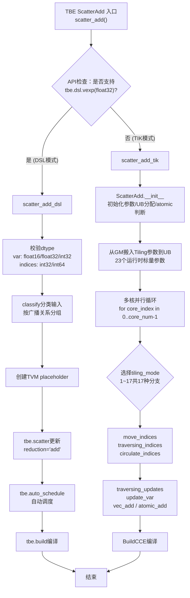
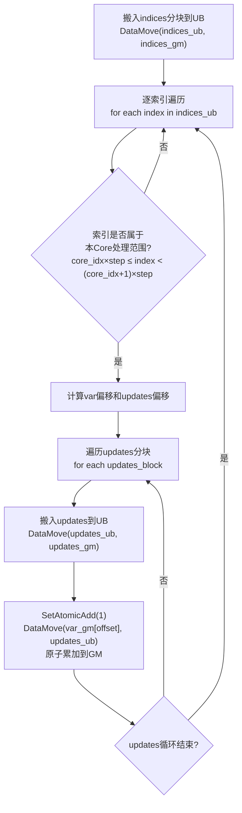
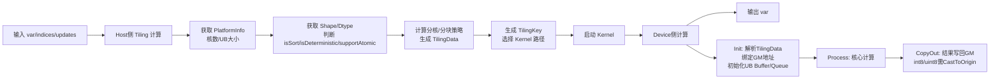
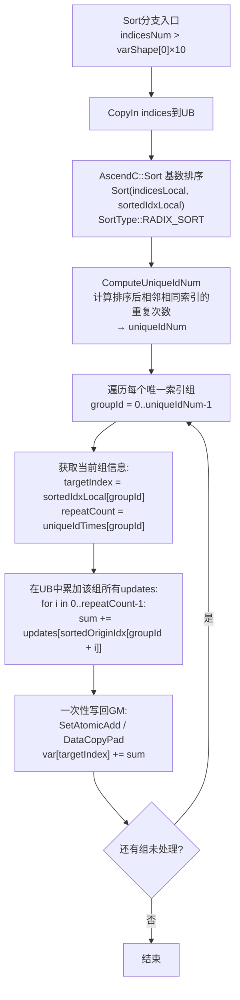

# 【社区任务】ScatterAdd算子设计文档

| 项目 | 详情 |
|------|------|
| 算子名称 | ScatterAdd |
| 开发语言 | AscendC |
| 适配硬件 | Atlas A2 训练系列产品 (Ascend 910B) |
| 对齐基准 | CANN内置TBE版本ScatterAdd算子 |
| CANN版本 | cann8.5.0 |
| 最终合入仓 | ops-nn 开源仓 (experimental/index) |

---

## 1 需求背景（required）

### 1.1 需求来源

昇腾算子开源仓社区任务：基于AscendC编程语言重新实现ScatterAdd算子，替代原TBE（Tensor Boost Engine）实现，功能和性能对齐内置TBE版本，最终合入开源仓供社区使用。

### 1.2 背景介绍

#### 1.2.1 ScatterAdd算子实现优化

**算子功能描述**：ScatterAdd（散射累加）算子将源张量（updates）中的值，按照索引张量（indices）指定的位置，逐个累加到目标张量（var）的对应位置上。若多个updates值被映射到var的同一位置，则这些值会在该位置进行累加（原子加语义）。该算子广泛应用于Embedding层梯度更新、图神经网络邻居聚合、稀疏矩阵运算等场景。

**计算公式**（以 dim=0 为例）：

$$var[indices[i_1][i_2]...[i_k]][j_1][j_2]...[j_{n-1}] \mathrel{+}= updates[i_1][i_2]...[i_k][j_1][j_2]...[j_{n-1}]$$

其中 $i$ 遍历indices的所有元素，$j$ 遍历var除第一维外的剩余维度。

**TBE算子源码获取路径（含完整文件名）**：

| 层次 | 文件路径 | 说明 |
|------|----------|------|
| 算子原型 | `/usr/local/Ascend/ascend-toolkit/latest/opp/built-in/op_proto/inc/matrix_calculation_ops.h`（L933） | C++ REG_OP宏注册，定义输入/输出/属性签名 |
| 算子信息库 | `/usr/local/Ascend/ascend-toolkit/latest/opp/built-in/op_impl/ai_core/tbe/config/ascend910b/aic-ascend910b-ops-info-legacy.json`（L42409） | 声明支持的数据类型/格式/Shape组合 |
| TBE动态适配层（TIK+DSL） | `/usr/local/Ascend/ascend-toolkit/latest/opp/built-in/op_impl/ai_core/tbe/impl/ops_legacy/dynamic/scatter_add.py` | Python编译调度入口，含TIK手写和DSL两套路径 |
| TBE通用Scatter基类 | `/usr/local/Ascend/ascend-toolkit/latest/opp/built-in/op_impl/ai_core/tbe/impl/ops_legacy/util/compute/scatter.py` | 通用Scatter基类实现（已标记为Deprecated） |
| AscendC内核入口 | `/usr/local/Ascend/ascend-toolkit/latest/opp/built-in/op_impl/ai_core/tbe/impl/ops_legacy/ascendc/scatter_add/scatter_add.cpp` | AscendC Kernel入口，TilingKey分发 |
| AscendC SIMT实现 | `/usr/local/Ascend/ascend-toolkit/latest/opp/built-in/op_impl/ai_core/tbe/impl/ops_legacy/ascendc/scatter_add/arch35/scatter_add_simt.h` | SIMT路径非排序实现 |
| AscendC SIMT Sort实现 | `/usr/local/Ascend/ascend-toolkit/latest/opp/built-in/op_impl/ai_core/tbe/impl/ops_legacy/ascendc/scatter_add/arch35/scatter_add_simt_sort.h` | SIMT路径排序优化实现 |
| AscendC SIMD实现 | `/usr/local/Ascend/ascend-toolkit/latest/opp/built-in/op_impl/ai_core/tbe/impl/ops_legacy/ascendc/scatter_add/arch35/scatter_add_simd.h` | SIMD路径三阶段实现（int8/uint8） |
| AscendC SIMD AtomicAdd | `/usr/local/Ascend/ascend-toolkit/latest/opp/built-in/op_impl/ai_core/tbe/impl/ops_legacy/ascendc/scatter_add/arch35/scatter_add_simd_support_atomicadd.h` | SIMD路径AtomicAdd实现 |
| AscendC SIMD Sort+AtomicAdd | `/usr/local/Ascend/ascend-toolkit/latest/opp/built-in/op_impl/ai_core/tbe/impl/ops_legacy/ascendc/scatter_add/arch35/scatter_add_simd_sort_support_atomicadd.h` | SIMD路径排序+AtomicAdd |
| AscendC Deterministic | `/usr/local/Ascend/ascend-toolkit/latest/opp/built-in/op_impl/ai_core/tbe/impl/ops_legacy/ascendc/scatter_add/arch35/scatter_add_deterministic.h` | 确定性计算实现 |
| AscendC公共函数 | `/usr/local/Ascend/ascend-toolkit/latest/opp/built-in/op_impl/ai_core/tbe/impl/ops_legacy/ascendc/scatter_add/arch35/scatter_add_common.h` | 通用工具函数（CastToInt32/CastToOrigin等） |
| 内核编译配置 | `/usr/local/Ascend/ascend-toolkit/latest/opp/built-in/op_impl/ai_core/tbe/kernel/config/ascend910b/ops_legacy/scatter_add.json` | 预编译Shape范围、简化Key和Bin信息 |
| aclnn接口 | `/usr/local/Ascend/ascend-toolkit/latest/aarch64-linux/include/aclnnop/aclnn_scatter_add.h` | aclnn调用接口定义 |

#### 1.2.2 ScatterAdd算子TBE实现现状分析

##### 1.2.2.1 TBE算子支持的数据类型和数据格式

**算子信息库配置**（`aic-ascend910b-ops-info-legacy.json`，自L42409起）：

**输入var / updates（6组dtype-format组合，与indices一一对应）**：

| 序号 | 数据类型（dtype） | 数据格式（format） | 对应indices dtype |
|------|-------------------|---------------------|--------------------|
| 1 | float16 | ND | int32 |
| 2 | float（float32） | ND | int32 |
| 3 | int32 | ND | int32 |
| 4 | float16 | ND | int64 |
| 5 | float（float32） | ND | int64 |
| 6 | int32 | ND | int64 |

> **说明**：同一dtype出现两次分别对应indices为int32和int64场景。输出var的dtype/format排列与输入var保持一致。

**输入indices（6组dtype-format组合）**：

| 序号 | 数据类型（dtype） | 数据格式（format） |
|------|-------------------|---------------------|
| 1 | int32 | ND |
| 2 | int32 | ND |
| 3 | int32 | ND |
| 4 | int64 | ND |
| 5 | int64 | ND |
| 6 | int64 | ND |

**算子原型定义**（`matrix_calculation_ops.h` L933-L941）：

```cpp
REG_OP(ScatterAdd)
    .INPUT(var, TensorType({DT_FLOAT16, DT_FLOAT, DT_INT32, DT_INT8, DT_UINT8}))
    .INPUT(indices, TensorType::IndexNumberType())
    .INPUT(updates, TensorType({DT_FLOAT16, DT_FLOAT, DT_INT32, DT_INT8, DT_UINT8}))
    .OUTPUT(var, TensorType({DT_FLOAT16, DT_FLOAT, DT_INT32, DT_INT8, DT_UINT8}))
    .ATTR(use_locking, Bool, false)
    .OP_END_FACTORY_REG(ScatterAdd)
```

> **注意**：算子原型声明支持INT8/UINT8类型，但算子信息库当前**未配置**int8/uint8的预编译dtype组合，说明int8/uint8通过JIT动态编译路径覆盖。

**算子信息库关键配置项**：

| 配置项 | 值 | 说明 |
|--------|-----|------|
| `dynamicCompileStatic` | true | 支持动静统一编译 |
| `dynamicShapeSupport` | true | 支持动态Shape |
| `dynamicRankSupport` | true | 支持动态Rank（1D~8D） |
| `slicePattern` | "scatter" | 切片模式为scatter类型 |
| `needCompile`（output0） | false | 输出var复用输入var的内存（in-place语义） |

**Shape约束**（来自算子原型注释）：

$$updates.shape = indices.shape + var.shape[1:]$$

即indices的shape决定了要更新哪些"行"，updates的shape必须是indices的shape拼接上var除第一维外的shape（updates也可为空标量）。var支持1D~8D的ND格式张量。

##### 1.2.2.2 TBE算子实现描述

TBE版本的ScatterAdd算子提供**两套实现路径**：

**路径一：DSL模式**（`scatter_add_dsl`函数，当前默认路径）

适用于支持`tbe.dsl.vexp`的新版本环境：

- 校验dtype（var: float16/float32/int32, indices: int32/int64, updates: 与var一致）
- 使用`classify([var, indices, updates], "scatter")`对输入按广播关系分类
- 对每组输入创建TVM placeholder
- 调用`tbe.scatter(var_tensor, indices_tensor, updates_tensor, "add", support_out_of_bound_index=...)`内置函数
- 使用`tbe.auto_schedule(res)`自动调度
- 通过`tbe.build(schedules, config)`编译

**路径二：TIK模式**（`scatter_add_tik`函数，老版本兼容路径）

TIK模式通过手写TIK指令完成完整计算，核心类为`ScatterAdd`：

- **初始化阶段**：校验dtype，获取芯片参数（AI Core数量、UB大小扣除8KB预留），判断是否支持atomic add（仅float32），分配UB缓冲区（支持atomic时indices和updates各占一半UB；不支持时var/updates各占3/8 UB，indices占1/4 UB），创建23个tiling标量参数
- **Tiling参数阶段**：从tiling_ub加载23个运行时参数（tiling_mode、indice_step、core_num、update_data_num、各循环次数等）
- **核心计算阶段**：多核并行循环`for_range(0, core_num_var, block_num=core_num_var)`，根据tiling_mode选择17种执行分支之一
- **17种tiling_mode分支**覆盖了：是否支持atomic add、32B对齐情况、UB是否能存下全部var/updates、是否为单核场景等各种组合

**多核分片策略**（TIK模式）：按var第一维索引范围分核——`indice_step = ceil(var.shape[0] / core_num)`，每个Core处理特定索引范围的indices，各Core处理的var区域不重叠，无需原子操作。

##### 1.2.2.3 TBE算子实现流程图

**TBE整体执行流程**：



**TIK模式核心子流程（以mode 2为例）**：



---

## 2 需求分析（required）

### 2.1 需求描述

使用AscendC编程语言实现ScatterAdd算子，替代原TBE实现。需支持float16、float32、int32数据类型（var和updates同类型），indices支持int32和int64，支持ND格式和泛化shape输入。性能不低于TBE版本的95%（所有核参与计算场景），精度满足AscendOpTest工具默认阈值。int8/uint8为可选扩展类型，暂不支持double和广播操作。

### 2.2 需求拆解

| 序号 | 需求项 | 详细描述 | 优先级 |
|------|--------|----------|:------:|
| 1 | 数据类型支持 | var/updates: float16, float32, int32；indices: int32, int64 | P0 必做 |
| 2 | 数据类型扩展 | var/updates: int8, uint8（通过int32中间类型Cast实现） | P1 可选 |
| 3 | 格式支持 | ND格式（1D~8D） | P0 必做 |
| 4 | 泛化Shape | 支持任意合法shape输入，动态Shape | P0 必做 |
| 5 | 功能对齐 | 与TBE版本功能完全一致 | P0 必做 |
| 6 | 性能要求 | 所有核参与计算场景不低于TBE 95% | P0 必做 |
| 7 | 精度要求 | 满足AscendOpTest默认阈值 | P0 必做 |
| 8 | 不支持项 | 不支持double、不支持广播、不支持FP64 | — |

### 2.3 核心设计挑战

| 挑战 | 描述 | 解决思路 |
|------|------|----------|
| **写冲突** | 多个索引可能指向var同一位置，多核并行时存在数据竞争 | 按var第一维范围分核（各Core处理的var区域不重叠）；对于重叠场景使用AtomicAdd或Sort去重 |
| **非连续GM访问** | indices决定的写入位置非连续，GM访问效率低 | 使用DataCopyPad对齐搬运（32B对齐）；排序分支通过Sort+聚合减少随机写次数 |
| **小数据类型原子加不支持** | int8/uint8不支持硬件AtomicAdd | 三阶段方案：Cast到int32→AtomicAdd→Cast回原类型 |
| **负载均衡** | indices分布不均匀导致各Core计算量差异大 | 多维切分（行×列）减少负载不均衡；SimdTiling算法优化行列切分比例 |
| **确定性计算** | AtomicAdd结果因浮点累加顺序不同而不确定 | 确定性分支使用Sort+分组累加替代AtomicAdd |

---

## 3 详细设计（required）

### 3.1 外部组件依赖

| 组件 | 说明 | 是否已适配 |
|------|------|:----------:|
| CANN | 昇腾计算架构，版本 ≥ 8.5.0 | √ |
| AscendC编译器（bisheng） | 编译AscendC内核代码 | √ |
| aclnn算子调用框架 | 提供aclnnScatterAdd接口供Host侧调用 | √ |
| AscendOpTest工具 | 算子功能/精度/性能测试工具 | √ |
| 昇腾NPU驱动 | 适配Atlas A2训练系列产品（Ascend 910B） | √ |

### 3.2 内部适配模块

| 模块 | 说明 | 适配情况 |
|------|------|----------|
| 算子原型（op_proto） | 复用已有TBE版本`REG_OP(ScatterAdd)` | √ 无需修改 |
| 算子信息库（ops-info） | `aic-ascend910b-ops-info-legacy.json`已有配置 | √ 可能需要补充int8/uint8 |
| AscendC内核实现 | 新的AscendC C++实现，含SIMT/SIMD多路径 | 需全新开发 |
| Host侧Tiling & 调度 | 分核/分块策略计算，生成TilingData | 需全新开发 |
| aclnn接口适配 | 对接`aclnnScatterAddGetWorkspaceSize`/`aclnnScatterAdd` | √ 已有接口定义 |
| 内核编译配置 | `kernel/config/ascend910b/ops_legacy/scatter_add.json` | 需更新配置 |

### 3.3 使能方式

AscendC ScatterAdd算子通过**aclnn接口**使能调用：

- **接口1**：`aclnnScatterAddGetWorkspaceSize` — 根据输入Tensor的shape和dtype计算kernel所需workspace大小
- **接口2**：`aclnnScatterAdd` — 传入workspace和stream执行算子计算

**aclnn接口签名**：

```c
aclnnStatus aclnnScatterAddGetWorkspaceSize(
    const aclTensor* self, int64_t dim, const aclTensor* index,
    const aclTensor* src, aclTensor* out,
    uint64_t* workspaceSize, aclOpExecutor** executor);

aclnnStatus aclnnScatterAdd(
    void* workspace, uint64_t workspaceSize,
    aclOpExecutor* executor, const aclrtStream stream);
```

参数对应关系：`self`→var, `dim`→axis（ScatterAdd默认dim=0）, `index`→indices, `src`→updates, `out`→输出var。

### 3.4 算子分析

#### 3.4.1 数学公式

以 dim=0（默认散射维度）为例：

$$var[indices[i_1][i_2]...[i_k]][j_1][j_2]...[j_{n-1}] \mathrel{+}= updates[i_1][i_2]...[i_k][j_1][j_2]...[j_{n-1}]$$

- $var$ 维度为 $[M, N_1, N_2, ..., N_{n-1}]$
- $indices$ 维度为 $[K_1, K_2, ..., K_k]$
- $updates$ 维度为 $[K_1, K_2, ..., K_k, N_1, N_2, ..., N_{n-1}]$

#### 3.4.2 支持数据类型

| 输入/输出 | 支持数据类型 | 格式 |
|-----------|-------------|------|
| var / updates / output | FLOAT16, FLOAT32, INT32（INT8, UINT8为可选扩展） | ND |
| indices | INT32, INT64 | ND |

> **注意**：TBE算子原型声明支持INT8/UINT8但算子信息库未预配置，TBE算子原型**不支持**BFLOAT16。设计文档以算子原型的`TensorType`声明为准。

#### 3.4.3 支持形状

- var和output的shape相同（in-place语义）
- `updates.shape = indices.shape + var.shape[1:]`（或updates可为空标量）
- indices值需满足 $0 \leq indices[i] < var.shape[0]$
- 支持1D~8D的ND格式动态Shape

#### 3.4.4 算子分类

ScatterAdd属于**Scatter类算子**（索引散射型），核心特征：

- 写入位置由indices动态决定 → **非连续GM访问**
- 多索引可能指向同一目标 → **需要AtomicAdd或Sort去重解决写冲突**
- 涉及读-改-写操作 → **两端数据搬运（var搬入+写回）**

### 3.5 算子实现方案

#### 3.5.1 总体架构

算子整体采用**Host侧Tiling计算 + Kernel侧多路径分发**的两级架构。Kernel侧同时支持**SIMT**和**SIMD**两种执行模式，通过TilingKey在编译/运行时选择最优路径。

**实现模式总览**：

| 模式 | 条件 | 特点 |
|------|------|------|
| **SIMT + AtomicAdd** | var类型为float/half/int32 | 逐索引搬入updates，使用AtomicAdd直接写GM |
| **SIMT + Sort + AtomicAdd** | indices密集场景（`indicesNum > varShape[0]×10`） | 先排序indices再按组聚合，减少原子加冲突 |
| **SIMD + AtomicAdd** | var类型为float/half/int32，SIMT不可用或SIMD更优 | 行列二维切分，DataCopyPad批量AtomicAdd写GM |
| **SIMD + Sort + AtomicAdd** | indices密集 + SIMD | 排序+分组聚合+二维切分 |
| **SIMD (NoAtomicAdd)** | var类型为int8/uint8 | 三阶段：var→workspace Cast→AtomicAdd(int32)→Cast回写 |
| **Deterministic** | 确定性计算模式 | Sort+分组累加替代AtomicAdd，保证浮点累加顺序一致 |

#### 3.5.2 Host侧设计

##### 3.5.2.1 分核策略

**策略一：按var第一维范围分核（SIMT模式默认）**

将var的第一维（被索引维度）按索引范围均分：

- `indice_step = ceil(var.shape[0] / core_num)`
- Core $i$ 处理满足 $i \times indice\_step \le indices[j] < (i+1) \times indice\_step$ 的索引

**优点**：各Core处理的var区域不重叠，无需原子操作或锁
**缺点**：indices分布不均匀时负载不均衡

**策略二：按indices数据量二维切分（SIMD模式默认）**

- 行方向：按indices数量切分`rowTileNum`份
- 列方向：按var尾轴对齐后切分`colTileNum`份
- 总核数：`atomicAddCoreNum = rowTileNum × colTileNum`
- 使用`SimdTiling()`算法找最优行列比例，使得：
  - 核数尽量用满
  - 整核与尾核数据量差值最小

**首版分核策略选择**：根据具体数据类型和indices密度自动选择——indices稀疏走SIMT按索引分核，indices密集走SIMD二维切分。

**特殊情况**：
- `var.shape[0] < core_num`时退化为少核或单核执行
- 最小分核粒度：每核至少处理1024个数据元素

##### 3.5.2.2 数据分块与UB内存优化策略

**UB空间总览**（Ascend 910B：UB总大小192KB，扣除8KB预留，可用约184KB）：

**SIMT模式UB分配**（支持AtomicAdd类型）：

| 缓冲区 | 位置 | 数量与大小 | 用途 |
|--------|------|-----------|------|
| `updatesQueue_` | VECIN/VECOUT | 2 × `updatesUbFactor` × sizeof(T) | updates双缓冲搬运 |
| `indicesBuf_` | VECCALC | 1 × `indicesUbFactor` × sizeof(U) | indices暂存 |

**SIMD模式UB分配**（不支持AtomicAdd，三阶段）：

| 缓冲区 | 位置 | 数量与大小 | 用途 |
|--------|------|-----------|------|
| `varInQueue_` | VECIN | 2 × `ubFactor` × sizeof(T) | var搬入 |
| `varCastOutQueue_` | VECOUT | 2 × `ubFactor` × sizeof(int32_t) | var Cast后暂存 |
| `updatesQueue_` | VECIN | 2 × `updatesUbFactor` × sizeof(T) | updates搬入 |
| `updatesCastQueue_` | VECOUT | 2 × `updatesUbFactor` × sizeof(int32_t) | updates Cast后暂存 |
| `indicesBuf_` | VECCALC | 1 × `indicesUbFactor` × sizeof(U) | indices暂存 |

**UB因子计算公式**：

```
// 支持AtomicAdd类型
updatesUbFactor = floorAlign(ubSize / 2 / sizeof(T), 32 / sizeof(T))
indicesUbFactor = floorAlign(ubSize / 2 / sizeof(U), 32 / sizeof(U))

// 以float32为例 (UB ≈ 184KB)
updatesUbFactor = floorAlign(184×1024/2/4, 32/4) = floorAlign(23552, 8) = 23552
indicesUbFactor = floorAlign(184×1024/2/4, 32/4) = 23552
```

**32B对齐约束**：所有GM↔UB数据搬运必须满足32字节对齐，burst_len计算使用ceil_div。

**Double Buffer优化**：所有Queue使用2 buffer（`DB_BUFFER=2`）实现乒乓流水，数据搬运与计算可重叠执行。

##### 3.5.2.3 Tiling参数结构体

```cpp
BEGIN_TILING_DATA_DEF(ScatterAddTilingData)
  TILING_DATA_FIELD_DEF_ARR(uint64_t, 2, varShape);           // var二维化shape [M, N]
  TILING_DATA_FIELD_DEF(uint64_t, indicesSize);               // indices元素总数
  TILING_DATA_FIELD_DEF(uint64_t, postAxisSize);              // var尾轴大小N
  TILING_DATA_FIELD_DEF(uint64_t, copyCoreNum);               // 参与数据搬运的核数
  TILING_DATA_FIELD_DEF(uint64_t, perCoreHandleVar);          // 每核处理的var数据量
  TILING_DATA_FIELD_DEF(uint64_t, atomicAddCoreNum);          // 参与原子加计算的核数
  TILING_DATA_FIELD_DEF(uint64_t, perCoreHandleIndices);      // 每核处理的indices数量
  TILING_DATA_FIELD_DEF(uint64_t, ubFactor);                  // UB单次处理数据量
  TILING_DATA_FIELD_DEF(uint64_t, blockFactor);               // 每核循环次数
  TILING_DATA_FIELD_DEF(uint64_t, tailBlockFactor);           // 尾核循环次数
  TILING_DATA_FIELD_DEF(uint64_t, tailUbFactor);              // 尾循环数据量
  TILING_DATA_FIELD_DEF(uint64_t, tailCoreTailUbFactor);      // 尾核尾循环数据量
  TILING_DATA_FIELD_DEF(uint64_t, indicesUbFactor);           // indices UB单次处理量
  TILING_DATA_FIELD_DEF(uint64_t, indicesLoopSize);           // indices循环次数
  TILING_DATA_FIELD_DEF(uint64_t, indicesTailUbFactor);       // indices尾循环数据量
  TILING_DATA_FIELD_DEF(uint64_t, updatesUbFactor);           // updates UB单次处理量
  TILING_DATA_FIELD_DEF(uint64_t, updatesLoopSize);           // updates循环次数
  TILING_DATA_FIELD_DEF(uint64_t, updatesTailUbFactor);       // updates尾循环数据量
  TILING_DATA_FIELD_DEF(uint64_t, isDeterminTemplate);        // 确定性计算模板标志
  TILING_DATA_FIELD_DEF(uint64_t, indicesCastMode);           // indices类型转换模式
  // 排序分支参数
  TILING_DATA_FIELD_DEF(uint64_t, normBlockIndices);
  TILING_DATA_FIELD_DEF(uint64_t, indicesFactor);
  TILING_DATA_FIELD_DEF(uint64_t, normBlockLoop);
  TILING_DATA_FIELD_DEF(uint64_t, tailBlockLoop);
  TILING_DATA_FIELD_DEF(uint64_t, normBlockTail);
  TILING_DATA_FIELD_DEF(uint64_t, tailBlockTail);
  TILING_DATA_FIELD_DEF(uint64_t, sortCoreNum);
  // SIMD二维切分参数
  TILING_DATA_FIELD_DEF(uint64_t, rowTileNum);                // 行切分份数
  TILING_DATA_FIELD_DEF(uint64_t, colTileNum);                // 列切分份数
  TILING_DATA_FIELD_DEF(uint64_t, normBlockRow);              // 整核分块行数
  TILING_DATA_FIELD_DEF(uint64_t, tailBlockRow);              // 行尾核分块行数
  TILING_DATA_FIELD_DEF(uint64_t, normBlockCol);              // 整核分块列数
  TILING_DATA_FIELD_DEF(uint64_t, tailBlockCol);              // 列尾核分块列数
  TILING_DATA_FIELD_DEF(uint64_t, ubFactorRow);               // UB每次循环搬运行数
  TILING_DATA_FIELD_DEF(uint64_t, ubFactorCol);               // UB每次循环搬运列数
END_TILING_DATA_DEF;
```

##### 3.5.2.4 Workspace规划

| 场景 | Workspace用途 | 大小 |
|------|--------------|------|
| int8/uint8类型 | var Cast到int32的中间缓冲 | `varSize × sizeof(int32_t)` |
| 排序分支 | indices排序所需的临时空间 | 由`GetSortMaxMinTmpSize`计算 |
| 确定性计算 | var临时缓冲（避免AtomicAdd） | `varSize × sizeof(T)` |

##### 3.5.2.5 TilingKey规划策略

TilingKey用于在Kernel入口处根据场景选择最优执行路径。参考内置AscendC散列编码方式，使用64位唯一值标识每种分支：

**SIMT模式TilingKey**：

| TilingKey名称 | 编码特征 | 适用场景 |
|--------------|----------|----------|
| `UNSORT_SIMT_ADDR32_SCALAR` | 非排序, SIMT, 32位地址, 标量updates | indices可一次放入UB，单元素更新 |
| `UNSORT_SIMT_ADDR32_TENSOR` | 非排序, SIMT, 32位地址, 张量updates | indices需分块处理，多元素更新 |
| `UNSORT_SIMT_ADDR64_SCALAR` | 非排序, SIMT, 64位地址, 标量updates | indices为int64，可一次放入UB |
| `UNSORT_SIMT_ADDR64_TENSOR` | 非排序, SIMT, 64位地址, 张量updates | indices为int64，需分块处理 |
| `SORT_*_SIMT_ADDR32/64_*` | 排序, SIMT, +Cast级别 | indices密集场景，先排序再聚合 |

**SIMD模式TilingKey**：

| TilingKey名称 | 编码特征 | 适用场景 |
|--------------|----------|----------|
| `UNSORT_SIMD_SCALAR` | 非排序, SIMD, 标量updates | SIMD二维切分，单元素更新 |
| `UNSORT_SIMD_TENSOR` | 非排序, SIMD, 张量updates | SIMD二维切分，多元素更新 |
| `SORT_*_SIMD_*` | 排序, SIMD, +Cast级别 | indices密集+SIMD组合优化 |

**首版TilingKey简化策略**（按优先级实现）：

| 优先级 | TilingKey范围 | 覆盖场景 |
|:------:|--------------|----------|
| P0 | UNSORT_SIMT_ADDR32_TENSOR | float16/float32/int32 + int32 indices（最常见业务场景） |
| P0 | UNSORT_SIMD_TENSOR | int8/uint8三阶段路径 |
| P1 | UNSORT_SIMT_ADDR64_TENSOR | int64 indices场景 |
| P1 | SORT_SIMT_ADDR32_TENSOR | indices密集场景排序优化 |
| P2 | SCALAR/DETERMINISTIC系列 | 标量更新和确定性计算 |

**Host侧Tiling计算总体流程**：

```
1. GetPlatformInfo(): 获取核数、UB大小
2. GetShapeAttrsInfo():
   - 获取var/indices/updates的shape和dtype
   - 判断isSort_: indicesNum > varShape[0] × 10
   - 判断isDeterministic: context->GetDeterministic()
   - 判断supportAtomicAdd: var非int8/uint8
3. DoOpTiling(): 根据isSort_/supportAtomicAdd选择Tiling路径
4. GetTilingKey(): 生成64位TilingKey
5. GetWorkspaceSize(): 计算workspace大小
6. PostTiling(): 设置TilingData
```

##### 3.5.2.6 关键Tiling参数计算公式

```cpp
// SIMD模式二维切分
baseCol = 4096 / dtypeSize;       // 列按4KB对齐切分
colNumAlign = ceil(varShape[1] / baseCol);
atomicAddCoreNum = min(totalCoreNum,
                       ceil(indicesSize * colNumAlign * 4096 / 4096));
// SimdTiling(atomicAddCoreNum, colNumAlign, colLimitSize)
//   → rowTileNum, colTileNum

// UB单次处理量
ubFactor = floorAlign(ubSize / 2 / dtypeSize, 32 / dtypeSize);
indicesUbFactor = floorAlign(ubSize / 2 / indicesDtypeSize, 32 / indicesDtypeSize);
```

**模式选择决策树**：

```
├── 支持AtomicAdd? (float/half/int32)
│   ├── YES
│   │   ├── indicesNum > varShape[0] × 10?
│   │   │   ├── YES → SIMT_SORT / SIMD_SORT
│   │   │   └── NO  → SIMT_UNSORT / SIMD_UNSORT
│   │   └── deterministic? → Deterministic分支
│   └── NO → SIMD_NoAtomicAdd (int8/uint8三阶段)
└── updates是标量? → SCALAR / TENSOR子分支
```

#### 3.5.3 Kernel侧设计

##### 3.5.3.1 SIMT模式Kernel实现（支持AtomicAdd：float/half/int32）

**类模板定义**：

```cpp
template <typename IDX_T, typename VAR_T, typename CAST_T,
          typename ADDR_T, bool isUpdateScalar>
class ScatterAddSimt {
public:
    __aicore__ inline ScatterAddSimt(
        const ScatterAddTilingData& tilingData, TPipe& pipe);
    __aicore__ inline void Init(
        GM_ADDR var, GM_ADDR indices, GM_ADDR updates, GM_ADDR workspace);
    __aicore__ inline void Process();

private:
    GlobalTensor<VAR_T> var_;
    GlobalTensor<IDX_T> indices_;
    GlobalTensor<VAR_T> updates_;
    GlobalTensor<CAST_T> varWorkspaceGm_;  // int8/uint8中间缓冲
    TQue<QuePosition::VECIN, 2> varQue_;
    TQue<QuePosition::VECIN, 2> varCastQue_;
    TPipe& pipe_;
    const ScatterAddTilingData& td_;
};
```

**Process核心流程**：

```
阶段1 (int8/uint8预处理):
  for each varLoop:
    CopyInVar → CastToInt32 → CopyOutVarToWS (workspace, int32)

阶段2 (核心AtomicAdd):
  for each indicesLoop:
    DataCopyPad(indicesLocal, indicesGm_[offset])
    for each index in indicesLocal:
      bounds_check: 0 ≤ index < varShape[0]
      计算 varOffset = index × postAxisSize
      计算 updOffset = globIdx × postAxisSize
      for each updatesLoop:
        DataCopyPad(updatesLocal, updatesGm_[updOffset + k×ubFactor])
        SetAtomicAdd<VAR_T>()
        DataCopyPad(varGm_[varOffset + k×ubFactor], updatesLocal)
        SetAtomicNone()
      处理updates尾块

阶段3 (int8/uint8后处理):
  for each varLoop:
    CopyInVarFromWS → CastToOrigin → CopyOutVar (var_gm)
```

##### 3.5.3.2 SIMD模式Kernel实现（不支持AtomicAdd：int8/uint8，三阶段）

**类模板定义**：

```cpp
template <typename T, typename U, bool updatesIsScalar, uint32_t scatterOp>
class ScatterAddSIMDImpl {
public:
    __aicore__ inline ScatterAddSIMDImpl(
        const ScatterAddTilingData& tilingData, TPipe& pipe);
    __aicore__ inline void Init(
        GM_ADDR var, GM_ADDR indices, GM_ADDR updates,
        GM_ADDR varRef, GM_ADDR workspace);
    __aicore__ inline void Process();

private:
    GlobalTensor<T> varGm_;
    GlobalTensor<U> indicesGm_;
    GlobalTensor<T> updatesGm_;
    GlobalTensor<T> varRefGm_;
    GlobalTensor<int32_t> varCastGm_;
    GlobalTensor<int32_t> varCastAtomicAddGm_;
    TQue<QuePosition::VECIN, 2> updatesQueue_;
    TQue<QuePosition::VECOUT, 2> updatesCastQueue_;
    TQue<QuePosition::VECIN, 2> varInQueue_;
    TQue<QuePosition::VECOUT, 2> varCastOutQueue_;
    TQue<QuePosition::VECIN, 2> varCastInQueue_;
    TQue<QuePosition::VECOUT, 2> varOutQueue_;
    TBuf<QuePosition::VECCALC> indicesBuf_;
    TPipe& pipe_;
    const ScatterAddTilingData& tilingData_;
};
```

**三阶段Process流程**：

```
阶段1 - ProcessVarToWS():
  遍历var分块:
    CopyInVar: var(GM) → varInQueue(UB)
    CastToInt32: T → int32 (varCastOutQueue)
    CopyOutVarToWS: varCastQueue(UB) → workspace(GM, int32)
  SyncAll()

阶段2 - ProcessAtomicAdd():
  pipe_.Reset()  // 重置管道并重新分配Buffer
  遍历indices分块:
    搬入indices
    遍历每个index:
      搬入updates → CastToInt32 → SetAtomicAdd<int32_t>() → AtomicAdd写workspace
  SyncAll()

阶段3 - ProcessVarFromWS():
  pipe_.Reset()  // 重置管道并重新分配Buffer
  遍历var分块:
    CopyInVarFromWS: workspace(GM,int32) → varCastInQueue(UB)
    CastToOrigin: int32 → T (varOutQueue)
    CopyOutVar: varOutQueue(UB) → varGm(GM)
```

##### 3.5.3.3 排序分支实现

当`indicesNum > varShape[0] × 10`（索引密度远大于var行数）时启用排序分支：

1. 将indices搬入UB
2. 使用`AscendC::Sort`（基数排序，`SortType::RADIX_SORT`）对indices进行排序
3. 计算排序后相邻相同索引的重复次数（`ComputeUniqueIdNum`）
4. 按组聚合：对同一var目标行，先在UB中累加所有映射到该行的updates值，再一次性写回GM

**排序分支优势**：
- 减少对同一var位置的多次原子加冲突（合并为一次写操作）
- 提升GM访问的空间局部性
- 在大规模Embedding场景下显著提升吞吐

**indices Cast优化**（排序分支）：int64 indices在排序前Cast到更小类型（如int16/int32/uint8）以减少排序UB占用，排序后再还原。

##### 3.5.3.4 确定性计算分支

当`context->GetDeterministic() == 1`且数据类型为float/half时启用：

- 不使用AtomicAdd（浮点累加顺序不确定）
- 改用排序+分组累加方式
- 先Sort indices，再对每组相同索引按固定顺序累加
- 确保相同输入多次计算结果**bit级一致**

##### 3.5.3.5 Kernel入口分发

```cpp
extern "C" __global__ __aicore__ void scatter_add(
    GM_ADDR var, GM_ADDR indices, GM_ADDR updates,
    GM_ADDR y, GM_ADDR workspace, GM_ADDR tiling)
{
    SetSysWorkspace(workspace);
    GM_ADDR userWs = GetUserWorkspace(workspace);
    GET_TILING_DATA(tilingData, tiling);
    TPipe pipe;
    KERNEL_TASK_TYPE_DEFAULT(KERNEL_TYPE_MIX_AIV_1_0);

    // === SIMT 分支 ===
    if (TILING_KEY_IS(UNSORT_SIMT_ADDR32_SCALAR)) {
        ScatterAddSimt<DTYPE_INDICES, DTYPE_VAR, DTYPE_VAR, uint32_t, true> op;
        op.Init(var, indices, updates, userWs); op.Process();
    } else if (TILING_KEY_IS(UNSORT_SIMT_ADDR32_TENSOR)) {
        if (tilingData.isDeterminTemplate) {
            ScatterAddDeterministicImpl<DTYPE_VAR, DTYPE_INDICES> op;
            op.Init(var, indices, updates, y, userWs); op.Process();
        } else if /* int8/uint8 */ {
            ScatterAddSimt<DTYPE_INDICES, DTYPE_VAR, int32_t, uint32_t, false> op;
            op.Init(var, indices, updates, userWs); op.Process();
        } else {
            ScatterAddSimt<DTYPE_INDICES, DTYPE_VAR, DTYPE_VAR, uint32_t, false> op;
            op.Init(var, indices, updates, userWs); op.Process();
        }
    }
    // ... addr64 variants / sort variants ...

    // === SIMD 分支 ===
    else if (TILING_KEY_IS(UNSORT_SIMD_TENSOR)) {
        if (platform::IsSupportAtomicAddTypeSIMD<DTYPE_VAR>()) {
            ScatterAddSIMDSupportAtomicAdd<DTYPE_VAR, DTYPE_INDICES, false> op;
            op.Init(var, indices, updates, y, userWs); op.Process();
        } else {
            ScatterAddSIMDImpl<DTYPE_VAR, DTYPE_INDICES, false> op;
            op.Init(var, indices, updates, y, userWs); op.Process();
        }
    }
    // ... sort+SIMD variants ...
}
```

#### 3.5.4 AscendC实现流程图

##### 3.5.4.1 整体执行流程



##### 3.5.4.2 SIMT模式核心流程（支持AtomicAdd）

```mermaid
flowchart TD
    START["ScatterAddSimt::Process<br/>支持AtomicAdd"] 
    START --> INT8_CHECK{"var为int8/uint8?"}
    INT8_CHECK -->|"是"| CAST_VAR["阶段1: ProcessVarToWS<br/>var(GM) → CastToInt32 → workspace(GM,int32)"]
    INT8_CHECK -->|"否"| MAIN["阶段2: 核心AtomicAdd计算"]
    CAST_VAR --> MAIN

    MAIN --> IDX_LOOP["indices分块循环<br/>for idxLoop in 0..indicesLoopNum"]
    IDX_LOOP --> COPY_IDX["CopyIn: indices(GM) → indicesBuf(UB)<br/>DataCopyPad"]
    COPY_IDX --> INDEX_ITER["逐索引遍历<br/>for j in 0..indicesUbFactor"]
    
    INDEX_ITER --> GET_VAL["读取 index = indicesLocal.GetValue(j)"]
    GET_VAL --> BOUND_CHECK{"越界检查<br/>0 ≤ index < varShape[0]?"}
    BOUND_CHECK -->|"否"| INDEX_ITER
    BOUND_CHECK -->|"是"| CALC_OFFSET["计算偏移<br/>varOffset = index × postAxisSize<br/>updOffset = globIdx × postAxisSize"]
    
    CALC_OFFSET --> UPD_LOOP["updates分块循环<br/>for updLoop in 0..updatesLoopNum"]
    UPD_LOOP --> COPY_UPD["CopyIn: updates(GM) → updatesQueue(UB)<br/>DataCopyPad"]
    COPY_UPD --> ATOMIC["SetAtomicAdd<br/>DataCopyPad(varGm[varOffset], updatesLocal)<br/>SetAtomicNone"]
    ATOMIC --> UPD_NEXT{"updates循环结束?"}
    UPD_NEXT -->|"否"| UPD_LOOP
    UPD_NEXT -->|"是"| UPD_TAIL{"updates尾块?"}
    UPD_TAIL -->|"是"| PROCESS_TAIL["处理尾部未对齐数据"]
    UPD_TAIL -->|"否"| IDX_NEXT{"index遍历结束?"}
    PROCESS_TAIL --> IDX_NEXT
    IDX_NEXT -->|"否"| INDEX_ITER
    IDX_NEXT -->|"是"| IDX_TAIL{"indices尾块?"}
    IDX_TAIL -->|"是"| PROCESS_IDX_TAIL["处理indices尾块"]
    IDX_TAIL -->|"否"| INT8_POST{"var为int8/uint8?"}
    PROCESS_IDX_TAIL --> INT8_POST
    INT8_POST -->|"是"| CAST_BACK["阶段3: ProcessVarFromWS<br/>workspace(GM,int32) → CastToOrigin → var(GM)"]
    INT8_POST -->|"否"| END["结束"]
    CAST_BACK --> END
```



##### 3.5.4.3 排序分支核心流程



##### 3.5.4.4 AscendC实现流程与TBE流程差异分析

| 差异点 | TBE实现 | AscendC实现 | 原因 |
|--------|---------|-------------|------|
| **17种tiling_mode分支** | TIK模式设置17种分支（按atomic支持、32B对齐、UB容量、单核等组合） | 通过TilingKey+模板特化实现多路径分发，分类维度为SIMT/SIMD×Sort/Unsort×addr32/64×scalar/tensor×Cast级别 | 17种分支是历史兼容产物；AscendC利用`if constexpr`和模板消除冗余分支，编译期即确定路径 |
| **Atomic Add使用方式** | TIK: `set_atomic_add(1)`→`data_move`→`set_atomic_add(0)` | AscendC: `SetAtomicAdd<T>()`→`DataCopyPad`→`SetAtomicNone()` | API不同但语义等价；AscendC的DataCopyPad自带padding处理 |
| **classify + variable_shape** | TBE DSL使用TVM的classify广播分类，variable_shape处理动态shape | AscendC直接使用ND格式shape参数，不依赖TVM图IR | AscendC是底层Kernel语言，直接面对张量数据 |
| **多核同步** | TIK: `for_range(0, core_num, block_num=core_num)` | AscendC: `GetBlockIdx()`/`GetBlockNum()` + grid配置 | 本质等价，表达方式不同 |
| **int8/uint8处理** | TIK不支持int8/uint8（check_input_params仅校验float32/int32/float16） | AscendC内置三阶段（Cast→AtomicAdd(int32)→Cast回原类型） | AscendC利用编译期`if constexpr`零开销处理类型转换 |
| **排序优化** | TIK模式无排序路径 | AscendC内置Sort+聚合一阶段写回 | 排序对密集索引场景有显著性能提升，是AscendC的增强优化 |
| **确定性计算** | 无 | AscendC内置DeterministicImpl路径 | 精度验证和调试场景需求 |
| **二维切分** | TIK仅按var第一维一维切分 | SIMD模式按行列二维切分，SimdTiling优化行列比 | 二维切分能更好利用多核并行度 |

### 3.6 分支场景覆盖

#### 3.6.1 数据类型分支

| var/updates类型 | indices类型 | 实现路径 | 首版支持 |
|----------------|-------------|---------|:------:|
| float32 | int32/int64 | SIMT/SIMD AtomicAdd | √ P0 |
| float16 | int32/int64 | SIMT/SIMD AtomicAdd | √ P0 |
| int32 | int32/int64 | SIMT/SIMD AtomicAdd | √ P0 |
| int8 | int32/int64 | SIMD三阶段（Cast→AtomicAdd(int32)→Cast回写） | √ P1 |
| uint8 | int32/int64 | SIMD三阶段（Cast→AtomicAdd(int32)→Cast回写） | √ P1 |

#### 3.6.2 Shape分支

| 场景 | 条件 | 处理策略 |
|------|------|----------|
| 索引稀疏 | `indicesNum ≤ varShape[0] × 10` | 非排序分支，逐索引AtomicAdd |
| 索引密集 | `indicesNum > varShape[0] × 10` | 排序分支，Sort+分组聚合一阶段写回 |
| 标量updates | `updatesIsScalar = true` | Duplicate后AtomicAdd |
| 张量updates | `updatesIsScalar = false` | 逐行分块CopyIn + AtomicAdd |
| 非2的幂次维度 | `updatesDataNum`非32B对齐 | DataCopyPad带padding处理尾部 |

#### 3.6.3 对齐分支

| 场景 | 条件 | 处理策略 |
|------|------|----------|
| 32B对齐 | `dataNum % (32/dtypeSize) == 0` | 正常DataCopyPad |
| 非32B对齐 | `dataNum % (32/dtypeSize) != 0` | DataCopyPad带zero padding |
| 不足1 block | `dataNum < 32/dtypeSize` | 特殊小数据标量处理路径 |

### 3.7 支持硬件

| 产品 | 是否支持 |
|------|:--------:|
| Atlas A2 训练系列产品 / Atlas 800I A2 推理产品 / A200I A2 Box 异构组件 | √ |

### 3.8 算子约束限制

| 约束类别 | 约束内容 | 说明 |
|----------|---------|------|
| **数据类型** | 不支持FP64/DOUBLE | 任务书明确排除，算子原型不支持 |
| **数据类型** | 不支持BFLOAT16 | 算子原型`TensorType`中未声明，TBE也不支持 |
| **数据类型** | INT8/UINT8首版可选（P1） | 算子原型支持但信息库未预配置，通过三阶段Cast实现 |
| **广播** | 不支持Broadcast广播操作 | 任务书明确标注"不用支持广播操作" |
| **确定性** | 确定性计算首版可选（P2） | 非核心业务需求，后续版本扩展 |
| **越界索引** | indices值需在`[0, var.shape[0])`范围内 | 越界索引将被跳过（不更新任何位置） |
| **硬件** | 仅支持Atlas A2训练系列产品（Ascend 910B） | 与任务书要求一致 |
| **内存** | 输入Tensor必须在NPU Device侧 | 不支持CPU侧Tensor |
| **格式** | 仅支持ND连续内存格式 | 不支持NCHW等特殊格式 |
| **属性** | `use_locking`属性忽略，不生效 | 兼容TF接口的占位属性 |

---

## 4 工程目录结构

```
scatter_add/
├── CMakeLists.txt
├── README.md
├── op_kernel/
│   ├── scatter_add_apt.cpp                              # kernel入口，tiling_key分发
│   └── arch35/
│       ├── scatter_add_common.h                         # 公共工具函数
│       ├── scatter_add_simt.h                           # SIMT模式实现
│       ├── scatter_add_simt_sort.h                      # SIMT+Sort排序优化
│       ├── scatter_add_simd.h                           # SIMD模式实现（三阶段）
│       ├── scatter_add_simd_support_atomicadd.h         # SIMD+AtomicAdd
│       ├── scatter_add_simd_sort_support_atomicadd.h    # SIMD+Sort+AtomicAdd
│       └── scatter_add_deterministic.h                  # 确定性计算
├── op_host/
│   ├── scatter_add_def.cpp                              # 算子定义
│   ├── scatter_add_infershape.cpp                       # InferShape推导
│   └── arch35/
│       ├── scatter_add_tiling.h                         # tiling结构体定义
│       ├── scatter_add_tiling.cpp                       # tiling计算
│       ├── scatter_add_tiling_base.h                    # tiling基类
│       └── scatter_add_tiling_base.cpp                  # tiling基类实现
├── op_api/
│   ├── aclnn_scatter_add.h                              # aclnn接口声明
│   └── scatter_add.cpp                                  # l0实现
├── op_graph/
│   └── scatter_add_proto.h                              # proto定义
├── examples/
│   └── test_aclnn_scatter_add.cpp                       # 调用示例
├── tests/
│   └── ut/                                              # 单元测试
└── docs/
    └── aclnnScatterAdd.md                               # 接口文档
```

---

## 5 可维可测分析（required）

### 5.1 精度标准 / 性能标准

**精度标准**：

| 数据类型 | 绝对误差（atol） | 相对误差（rtol） | 说明 |
|----------|:---------------:|:---------------:|------|
| float32 | 1e-5 | 1e-5 | AscendOpTest默认阈值 |
| float16 | 1e-3 | 1e-3 | AscendOpTest默认阈值 |
| int32 | 精确匹配 | 精确匹配 | 整数运算无误差 |
| int8/uint8 | 精确匹配 | 精确匹配 | Cast路径保证精度 |

- 无NaN、Inf等异常数值输出
- AscendC版本计算结果与TBE版本功能完全一致

**性能标准**：

| 场景 | 标准 |
|------|------|
| 所有核参与计算 | 性能**不低于TBE版本的95%** |
| 整体性能 | 与TBE版本持平 |
| 小shape（< 10μs） | 性能差距 < 3μs可接受，需提供性能仿真分析报告 |
| 稳定性 | 多次测试时延波动率 ≤ 5% |

**性能优化策略**：

1. **排序去重**：索引密集场景先排序再聚合，减少原子加冲突次数
2. **Double Buffer**：所有Queue使用2 buffer实现搬运与计算流水重叠
3. **AtomicAdd直接写GM**：支持原子加的类型避免中间缓冲
4. **二维切分**：SIMD模式行列二维切分，最大化核利用率
5. **indices Cast优化**：int64 indices在排序分支中Cast到更小类型以减少UB占用
6. **编译期分支消除**：通过`if constexpr`处理不同dtype/地址宽度分支，零运行时开销

### 5.2 兼容性分析

**与TBE版本兼容性**：

| 兼容维度 | 分析结论 |
|----------|----------|
| 接口兼容 | 完全兼容。复用现有`aclnnScatterAdd`接口，Host侧封装签名一致 |
| 功能兼容 | 核心功能完全对齐（float16/float32/int32 + int32/int64 indices），int8/uint8为扩展功能 |
| 精度兼容 | 采用相同计算逻辑（加法累加），精度对齐TBE版本 |
| 性能兼容 | 目标不低于TBE 95%，通过分核策略、双缓冲和排序优化达到或超越TBE |
| Shape兼容 | 对齐TBE版本，支持动态Shape（1D~8D ND格式） |

**与任务书要求兼容性**：

| 任务书要求 | 满足情况 |
|------------|:--------:|
| 用AscendC语言在昇腾NPU上实现 | ✓ |
| 功能对齐TBE版本 | ✓（核心dtype组合） |
| 性能不低于TBE 95% | ✓（设计目标） |
| 精度满足AscendOpTest默认阈值 | ✓ |
| 支持动态Shape泛化 | ✓ |
| 不支持double数据类型 | ✓ |
| 不支持广播操作 | ✓ |
