# **需求背景**

## **需求来源**

基于 CANN TBE 内置 ScatterNd 算子历史实现，使用 Ascend C 编程语言进行改造与优化，在 Atlas A2 / ascend910b 场景下补齐 index 类算子的 Ascend C 能力，并提升算子在昇腾芯片上的执行效率和泛化能力。

ScatterNd 算子用于将 `updates` 中的数据按 `indices` 指定的多维索引位置累加到输出 Tensor 上。该算子常用于稀疏更新、嵌入表查找更新、梯度累积等网络结构。本文先分析 TBE 历史实现的原型、支持范围、tiling 与 scatter 累加流程，再基于这些能力约束规划 Ascend C host、kernel 和 ACLNN 接口设计。

## **TBE 源码分析**

通过核对 TBE 内置 ScatterNd 算子源码（`scatter_nd.py` 中 `ScatterNd` 类、`scatter_nd_tik()`、`scatter_nd_dsl()`、`scatter_nd()`、`check_input_params()`、`tiling_args()`、`scatter_nd_compute_tiling()`、`scatter_nd_operator()` 等函数）、原型和 910B 配置，当前支持的能力与核心流程如下。

TBE算子源码路径：`${ASCEND_INSTALL_PATH}/opp/built-in/op_impl/ai_core/tbe/impl/ops_legacy/dynamic/scatter_nd.py`

算子原型路径：`${ASCEND_INSTALL_PATH}/opp/built-in/op_graph/inc/selection_ops.h`

算子信息库路径：`${ASCEND_INSTALL_PATH}/opp/built-in/op_impl/ai_core/tbe/config/ascend910b/aic-ascend910b-ops-info-legacy.json`

910B kernel config路径：`${ASCEND_INSTALL_PATH}/opp/built-in/op_impl/ai_core/tbe/kernel/config/ascend910b/ops_legacy/scatter_nd.json`

### **1. 算子原型**

TBE 原型中 ScatterNd 定义如下。该原型没有显式属性，`shape` 作为第三个输入传入，输出 `y` 的 shape 由该输入描述。

```cpp
REG_OP(ScatterNd)
    .INPUT(indices, TensorType::IndexNumberType())
    .INPUT(x, TensorType::BasicType())
    .INPUT(shape, TensorType::IndexNumberType())
    .OUTPUT(y, TensorType::BasicType())
    .OP_END_FACTORY_REG(ScatterNd)
```

原型语义：

| **名称** | **类别** | **说明** |
| -------- | -------- | -------- |
| indices | 输入 | ND 索引 Tensor，`IndexNumberType`，最后一维为 `indexDepth`。 |
| x | 输入 | updates Tensor，`BasicType`，待累加的数据。 |
| shape | 输入 | 1-D 形状 Tensor，`IndexNumberType`，描述输出 `y` 的 shape。 |
| y | 输出 | 输出 Tensor，`BasicType`，shape 由 `shape` 输入描述。 |

计算公式：

```text
out = zeros(shape_value)
index_depth = indices.shape[-1]
for i in range(product(indices.shape[:-1])):
    out[indices[i, 0], ..., indices[i, index_depth - 1], ...] += x[i, ...]
```

原型注释约束：

| **约束项** | **规则** |
| ---------- | -------- |
| shape rank | `shape.rank` 范围为 `[1, 7]`。 |
| indices last dim | `indices.shape[-1] <= shape.rank`。 |
| x shape | `x.shape = indices.shape[:-1] + shape[indices.shape[-1]:]`。 |

### **2. 支持的数据类型**

TBE TIK 路径 `check_input_params()` 中校验的数据类型如下：

| **参数** | **支持 dtype** | **说明** |
| -------- | -------------- | -------- |
| indices | int32 / int64 | 索引输入，TIK 与 DSL 路径均支持。 |
| x | float16 / float32 / int32 | updates 输入，TIK 与 DSL 路径均支持。 |
| shape | int32 / int64 | 输出 shape 输入，TIK 与 DSL 路径均支持。 |
| y | float16 / float32 / int32 | 输出 dtype 通常与 x 一致；TIK 路径额外支持 `float16 x -> float32 y` 的 cast atomic 场景。 |

910B op info 中 `ScatterNd` 支持动态编译静态化、动态 rank、动态 shape，`needCheckSupport=true`，`prebuildPattern=Opaque`，`slicePattern=scatter`。910B kernel config 中预编译 bin 覆盖的 dtype / format 组合如下：

| **x dtype** | **indices dtype** | **shape dtype** | **x/y format** | **其他 format** |
| ----------- | ----------------- | --------------- | -------------- | --------------- |
| float16 | int32 / int64 | int32 / int64 | ND | ND |
| float32 | int32 / int64 | int32 / int64 | ND | ND |
| int32 | int32 / int64 | int32 / int64 | ND | ND |

说明：

- kernel config 中 `implMode` 为 `high_precision` 和 `support_out_of_bound_index` 组合。
- float16 / float32 组合存在 deterministic 为 `true` 和 `false` 的 bin；int32 组合 deterministic 为 `ignore`。
- op info 中 `shape` 输入带 `valueDepend=optional`，运行期 shape 值参与输出 shape 与 tiling 推导。

### **3. 支持的数据格式**

TBE ScatterNd 在 910B op info 与 kernel config 中 unknown shape format 均为 ND。该算子按扁平化 ND 地址进行 scatter 累加，不支持 NC1HWC0、FRACTAL_NZ 等特殊 format 选择。

| **场景** | **x/y format** | **indices/shape format** | **触发条件** |
| -------- | -------------- | ------------------------ | ------------ |
| 普通动态 shape 路径 | ND | ND | 910B op info unknownshape_format 全部为 ND。 |
| 预编译 bin 路径 | ND | ND | kernel config 中所有 bin 均为 ND。 |

### **4. Shape 与属性约束**

ScatterNd 无显式 attr。TBE 的 shape 语义来自原型注释、op info 和 DSL `shape_util.variable_shape(..., "scatter")` 分类，核心约束如下：

| **约束项** | **规则** |
| ---------- | -------- |
| indices 维度 | 至少 1-D，最后一维为 `indexDepth`。 |
| shape rank | `shape` 为 1-D shape Tensor，其元素个数描述 `rank(y)`，原型约束 `rank(y)` 范围为 `[1, 7]`。 |
| indexDepth | `indices.shape[-1] <= rank(y)`。 |
| x shape | `x.shape = indices.shape[:-1] + y.shape[indexDepth:]`。 |
| 输出初始化 | ScatterNd 语义为先构造全 0 输出，再按 indices 将 x 累加到 y。 |
| 越界策略 | DSL 路径将 `impl_mode` 转为 `support_out_of_bound_index` 参数；TIK BuildCCE 打开 `out_of_bound_sync_check`。 |

### **5. 静态属性与编译配置**

ScatterNd TBE 原型没有显式 attr。Python 入口参数中的 `kernel_name` 和 `impl_mode` 属于编译入口参数，不是 GE 原型静态属性。

| **类别** | **字段/参数** | **取值** | **说明** |
| -------- | ------------- | -------- | -------- |
| GE 原型 attr | 无 | - | `REG_OP(ScatterNd)` 只声明 3 个输入和 1 个输出。 |
| Python 编译入口 | `kernel_name` | 默认 `ScatterNd` | TBE build kernel 名称。 |
| Python 编译入口 | `impl_mode` | `None` / `high_precision` / `support_out_of_bound_index` 等 | DSL 路径用于转换 `support_out_of_bound_index`；不是原型 attr。 |
| op info | `dynamicCompileStatic.flag` | `true` | 支持动态编译静态化。 |
| op info | `dynamicRankSupport.flag` | `true` | 支持动态 rank。 |
| op info | `dynamicShapeSupport.flag` | `true` | 支持动态 shape。 |
| op info | `needCheckSupport.flag` | `true` | 编译前需要 check support。 |
| op info | `prebuildPattern.value` | `Opaque` | 预编译模式。 |
| op info | `slicePattern.value` | `scatter` | scatter 类切分模式。 |
| op info | `input2.valueDepend` | `optional` | `shape` 输入值可参与输出 shape 与 tiling 推导。 |
| kernel config | `implMode` | `high_precision` / `support_out_of_bound_index` | 910B 预编译 bin 覆盖两类实现模式。 |
| kernel config | `deterministic` | float16/float32 为 `true` / `false`，int32 为 `ignore` | 浮点类型区分确定性 bin，int32 不区分。 |
| kernel config | `int64Mode` | `false` | 通过 dtype 组合覆盖 int32/int64 indices 与 shape。 |

TIK 路径关键常量：

| **常量** | **值** | **用途** |
| -------- | ------ | -------- |
| `TILING_ARG_NUM` | 35 | runtime tiling 参数个数。 |
| `RESERVED_UB_SIZE` | 8 * 1024 | 从平台 UB 中预留 8KB。 |
| `BLOCK_BYTES` | 32 | GM/UB 搬运按 32B block 对齐。 |
| `VECTOR_BYTE_SIZE` | 256 | vector 单 repeat 覆盖 256B。 |
| `MAX_REPEAT` | 255 | vector 指令 repeat 上限。 |

### **6. TIK Runtime Tiling 参数**

| **下标** | **字段** | **含义** |
| -------- | -------- | -------- |
| 0 | tiling_mode | 执行模式，决定 atomic / non-atomic / deepfm 分支。 |
| 1 | indice_step | 多核按输出行范围切分时每核负责的 index span。 |
| 2 | core_num | tiling 实际使用核数。 |
| 3 | update_data_num | 单个 index 对应的连续 update 元素数。 |
| 4 | indices_loop_num | indices 全量循环次数。 |
| 5 | indices_last_num | indices 尾块元素数。 |
| 6 | updates_num | updates 总元素或当前分块元素规模。 |
| 7 | updates_loop_num | updates 分块循环次数。 |
| 8 | updates_last_num | updates 尾块元素数。 |
| 9 | var_num | 输出 y 需要处理的元素规模。 |
| 10 | var_loop_num | 输出 y 分块循环次数。 |
| 11 | var_last_num | 输出 y 尾块元素数。 |
| 12 | var_each_core_burst_len | 普通核输出分块搬运 burst 长度。 |
| 13 | var_last_core_burst_len | 尾核输出分块搬运 burst 长度。 |
| 14 | max_indice | indices 可访问的最大扁平化行号边界。 |
| 15 | var_each_core_data | 每核负责的输出元素数量。 |
| 16 | indices_last_dim | `indices.shape[-1]`，即 indexDepth。 |
| 17-23 | var_offset_index_tiling[0..6] | 每个索引维度对应的 y 扁平化 stride，最多 7 维。 |
| 24 | var_each_core_set_zero_loop_num | 普通核输出清零循环次数。 |
| 25 | var_each_core_set_zero_last_num | 普通核输出清零尾块元素数。 |
| 26 | var_last_core_set_zero_loop_num | 尾核输出清零循环次数。 |
| 27 | var_last_core_set_zero_last_num | 尾核输出清零尾块元素数。 |
| 28 | indices_each_core_data | deepfm 路径普通核负责的 indices 数量。 |
| 29 | indices_last_core_data | deepfm 路径尾核负责的 indices 数量。 |
| 30 | each_core_indices_loop_num | deepfm 普通核 indices 循环次数。 |
| 31 | each_core_indices_last_num | deepfm 普通核 indices 尾块数量。 |
| 32 | last_core_indices_loop_num | deepfm 尾核 indices 循环次数。 |
| 33 | last_core_indices_last_num | deepfm 尾核 indices 尾块数量。 |
| 34 | running core count | 设置 `core_num_var`，决定 `for_range` 的 block 数。 |

### **7. TBE 编译信息**

TIK 顶层 `scatter_nd_operator()` 在 build 前写入 compile info：

| **字段** | **含义** |
| -------- | -------- |
| ub_size | 扣除预留空间后的 UB 字节数。 |
| core_num | 平台 AI Core 数。 |
| updates_size | x dtype 字节数。 |
| indices_size | indices dtype 字节数。 |
| support_atomic | 当前 dtype 是否走 atomic 路径。 |
| need_cast | 是否为 `float16 x -> float32 y` cast atomic 路径。 |
| is_tik | 标记该路径为 TIK kernel。 |

`BuildCCE` 输入为 `(indices_gm, updates_gm, shape_gm)`，输出为 `out_gm`，`flowtable=[tiling_gm]`，配置打开 `out_of_bound_sync_check` 和 `enable_const_fold`。

### **TBE 整体流程图**

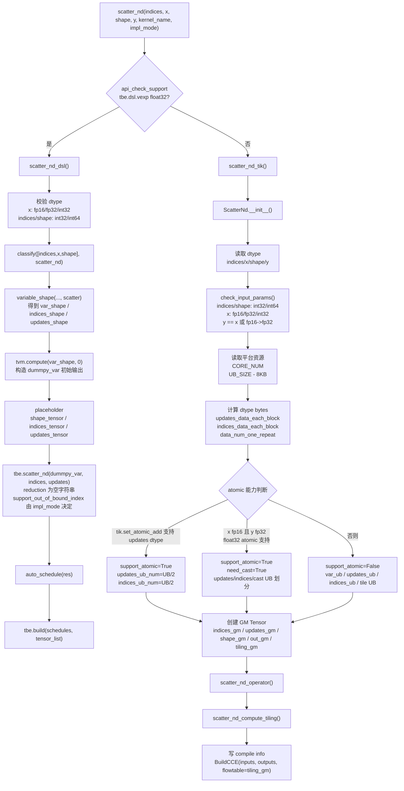

### **TBE TIK Compute 细化流程图**

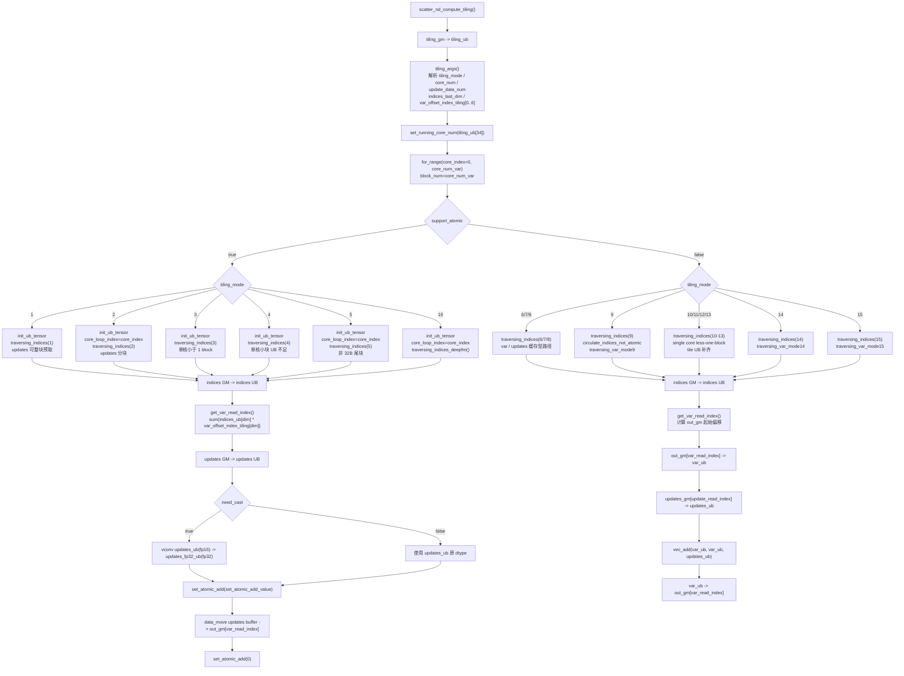

### **TBE DSL Compute 细化流程图**

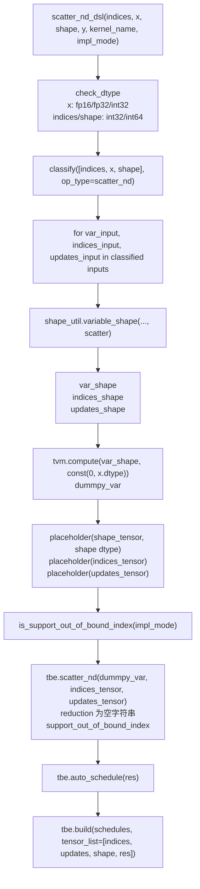

# **需求分析**

## **外部组件依赖**

不涉及额外外部组件依赖。算子实现依赖 CANN / Ascend C 基础组件、ACLNN 调用框架、op_host tiling 框架和 kernel_operator。

## **内部适配模块**

适配 ACLNN 接口调用，补充 ScatterNd 的 Ascend C 设计。设计包含：

- op graph / op def 中声明 `data`、`indices`、`updates`、`out` 的 dtype、format 和输入输出关系。
- ACLNN 层完成空指针、dtype、rank、shape 关系校验，连续化输入，并在 `data` 与 `out` 非同地址时先通过 `TensorMove` 复制 `data` 初值。
- op host 中完成输出 shape 推导、tiling shape 校验、平台信息读取、UB 容量计算、模式选择和分核策略。
- op kernel 中根据 tiling 信息完成 ND 索引展平、updates 分块搬运、atomic / row-partition / row-cache 累加。
- docs 中记录 TBE 来源、910B 能力、TBE 流程和 Ascend C 设计流程。

## **需求模块设计**

### **算子原型**

| **名称** | **类别** | **dtype** | **format** | **shape** | **介绍** |
| -------- | -------- | --------- | ---------- | --------- | -------- |
| data | 输入 | float16 / float32 / int32 | ND | 1-8 维 | 原始 Tensor，作为输出初值。 |
| indices | 输入 | int32 / int64 | ND | 1-8 维，最后一维为 indexDepth | ND 索引 Tensor。 |
| updates | 输入 | 与 data 一致 | ND | `indices.shape[:-1] + data.shape[indexDepth:]` | 待累加数据。 |
| out | 输出 | 与 data 一致 | ND | 与 data 相同 | 输出 Tensor。 |

说明：

- TBE / 910B 内置原型为 `indices, x, shape -> y`，其中 `shape` 描述从零初始化输出的形状；Ascend C 设计原型为 `data, indices, updates -> out`，输出 shape 与 `data` 一致。
- 当前 Ascend C 设计支持 `int64` 作为 indices dtype，不包含 TBE 原型中的 `shape` 输入。
- 当前设计不支持 float16 updates -> float32 out 的 cast 场景，`data`、`updates`、`out` dtype 必须一致。

**属性**：无。

## **算子支持型号**

Atlas A2 训练系列产品 / Atlas 800I A2 推理产品（ascend910b）。

# **需求详细设计**

## **使能方式**

| **上层框架**     | **涉及的框架勾选** |
| ---------------- | ------------------ |
| TF训练/推理      |                    |
| Pytorch训练/推理 |                    |
| ATC推理          |                    |
| Aclnn直调        | √                  |
| OPAT调优         |                    |
| SGAT子图切分     |                    |

## **需求总体设计**

### **host侧设计方案**

ScatterNd host 侧负责完成输出 shape 推导、输入合法性校验、format 语义归一、tiling 计算和分核策略。Ascend C 设计细节来自 ops-nn `scatter_nd` 分支中的目标实现代码，不从 TBE DSL/TIK 流程反推。

#### **1) InferShape**

ScatterNd Ascend C 输出 shape 由 `data` 输入决定：

```text
out.shape = data.shape
out.dtype = data.dtype
```

host 侧 infer shape 实现中，`InferShape4ScatterNd` 直接将 input0 `data` 的 shape 赋给 output0 `out`，`InferDataType4ScatterNd` 将 `data` dtype 赋给 `out`。

#### **2) dtype 校验**

ACLNN 参数检查和 op def 支持范围如下：

- `data` 支持 `float16`、`float32`、`int32`。
- `indices` 支持 `int32`、`int64`。
- `updates` dtype 必须与 `data` 一致。
- `out` dtype 必须与 `data` 一致。
- 当前实现不支持 TBE 中 `float16 x -> float32 y` 的 cast atomic 场景。

#### **3) format 和 shape 语义**

当前设计仅支持 ND 格式，所有输入输出均为 ND。

ACLNN 层 `CheckShapeForScatterNd` 和 tiling 层 `CheckScatterNdShape` 的 shape 校验规则如下：

| **约束项** | **校验逻辑** |
| ---------- | ------------ |
| rank 范围 | `data`、`indices`、`updates`、`out` 均为 1-8 维。 |
| out shape | `out.shape == data.shape`。 |
| data / indices 空 | `data` 和 `indices` 必须至少 1-D。 |
| indexDepth | `0 <= indexDepth <= rank(data)`。 |
| updates rank | `rank(updates) == rank(indices) - 1 + rank(data) - indexDepth`。 |
| updates 前缀 | `updates.shape[:rank(indices)-1] == indices.shape[:-1]`。 |
| updates 后缀 | `updates.shape[rank(indices)-1:] == data.shape[indexDepth:]`。 |

ACLNN 层会对 `data`、`indices`、`updates` 分别执行 `Contiguous`。当 `data->GetData() != out->GetData()` 时，先分配 `dataCopy` 并通过 `TensorMove(dataContiguous, dataCopy)` 将 `data` 复制为 scatter 目标；当二者同地址时，直接以连续化后的 `data` 作为 scatter 目标。kernel 入口虽然保留 `data` 参数，但实际 `scatter_nd.cpp` 中只使用 `indices`、`updates`、`out` 和 tiling，`out` 已在 ACLNN 层承载 `data` 初值。

#### **4) 分核策略**

分核策略根据 mode 选择不同的并行单元：

| **mode** | **并行单元** | **分核对象** |
| -------- | ------------ | ------------ |
| MODE_ATOMIC_BATCH (1) | updateRows | 按 updates 行分核，atomic add。 |
| MODE_ROW_CACHE (2) | varRows | 按输出前缀行分核，UB 缓存本地输出行。 |
| MODE_ROW_PARTITION (0) | varRows | 按输出前缀行分核，读改写。 |

- `atomicCoreNum = min(coreNum, updateRows)`（atomic batch 模式）。
- `coreNum = min(coreNum, varRows)`（row cache / row partition 模式）。
- 每核处理量由 `ceilDiv(parallelUnitNum, coreNum)` 计算。

#### **5) UB 容量计算**

UB 切分以 `usableUb = ubSize - RESERVED_UB_BYTES` 为可用容量。

```text
tileElems = AlignUp(usableUb / dtypeSize / 4, elemsPerBlock)
tileElems = min(tileElems, sliceSize)
```

Atomic batch 模式：

- `indexBytes = INDEX_TILE_NUM * indicesDtypeSize`
- `updateBytes = AlignUp(tileElems, elemsPerBlock) * dtypeSize`
- `batchBudgetElems = (usableUb - indexBytes - updateBytes) / dtypeSize`
- `batchRows = min(batchBudgetElems / rowStrideElems, maxIndexRowsPerTile, indicesPerAtomicCore)`
- 当 UB 能容纳双份 batch buffer 时启用 ping-pong 双缓冲（bufferNum = 2）。

Row cache 模式：

- `cacheElems = rowsPerCore * sliceSize`
- 当 `cacheBytes + indexBytes + updateBytes <= usableUb` 且 `sliceSize % elemsPerBlock == 0` 时启用。

### **kernel侧设计方案**

Kernel 侧执行 `Init` 和 `Process` 两个阶段，支持三种执行模式。

1. **初始化阶段（Init）**：
   - 读取 `ScatterNdTilingData`。
   - 将 `out` 绑定为 `varGm_`，将 `indices`、`updates` 分别绑定为 `indicesGm_`、`updatesGm_`。
   - 分配 varBuf、updateBuf、indicesBuf 的 UB buffer。
   - 计算 `tileElemsAligned`、`cacheElemsAligned`、`elemsPerBlock`。

2. **ProcessRowPartition 模式**：
   - 每核负责一段连续的输出前缀行范围 `[rowStart, rowEnd)`。
   - 按 `maxRowsPerTile` 分批读入 indices。
   - 对每个 index，计算 `outputRow`，若在当前核范围内则执行 `AddUpdateSlice`。
   - `AddUpdateSlice` 将 `out` 中对应行读入 UB，与 updates 逐元素相加，再写回 `out`。

3. **ProcessAtomicByIndices 模式**：
   - 每核负责一段连续的 updates 行范围 `[idxStart, idxEnd)`。
   - 启用 `SetAtomicAdd<T>()`。
   - 对每个 index，计算 `outputRow`，直接将 updates slice atomic add 到 GM。

4. **ProcessAtomicBatchByIndices 模式（默认）**：
   - 每核负责一段连续的 updates 行范围。
   - 将一批 updates 行和对应的 indices 读入 UB。
   - 对每个 index，计算 `outputRow`，将 updates slice atomic add 到 GM。
   - 支持 ping-pong 双缓冲：当前批 atomic add 的同时，预读下一批 indices/updates。

5. **ProcessRowCache 模式**：
   - 每核负责一段连续的输出前缀行范围。
   - 将该范围内的所有输出行一次性读入 UB 缓存。
   - 遍历所有 indices，对落在当前范围内的输出行，在 UB 内直接累加 updates。
   - 最后将 UB 缓存一次性写回 GM。

6. **GetOutputRow 索引计算**：
   - `indexDepth == 0`：outputRow = 0。
   - `indexDepth == 1`：outputRow = indices[localRow]。
   - `indexDepth == 2`：outputRow = indices[base] * dataStrides[0] + indices[base+1]。
   - `indexDepth > 2`：循环计算 `sum(indices[base+dim] * dataStrides[dim])`。

### **Ascend C 流程图**

#### **1. ACLNN 调用流程图**

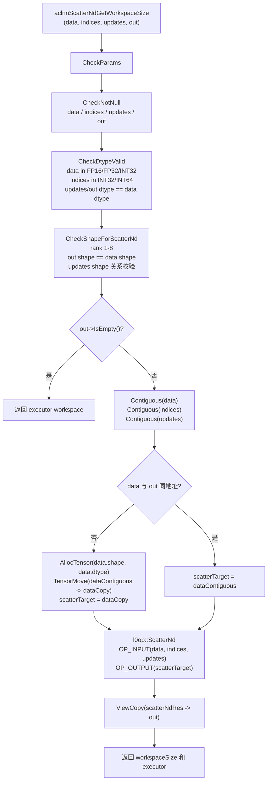

#### **2. Kernel 入口流程图**

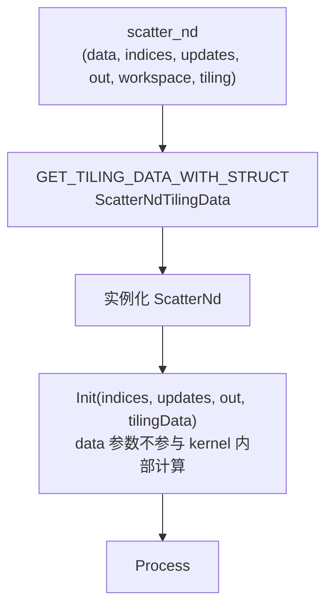

#### **3. Host Tiling 流程图**

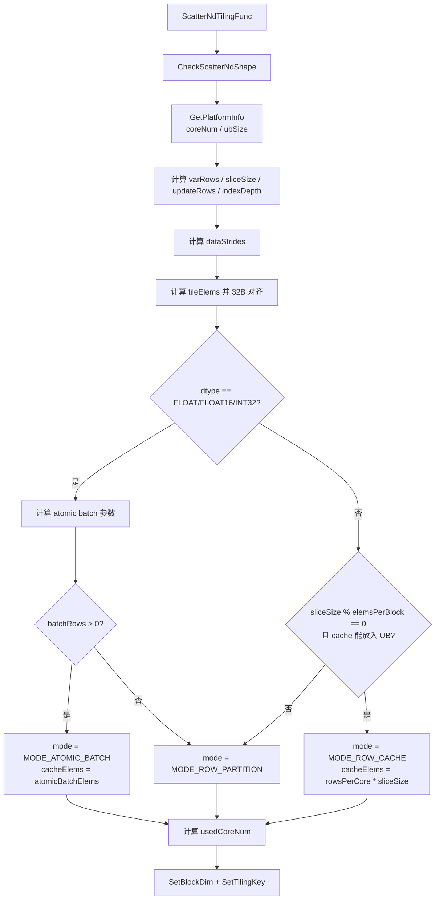

#### **4. Init 流程图**

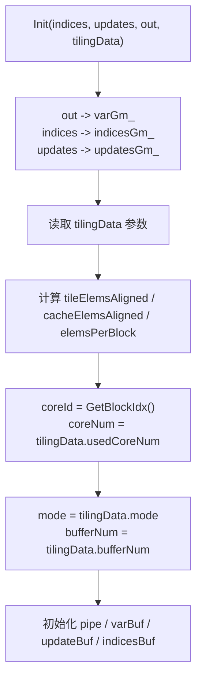

#### **5. Process 主流程图**

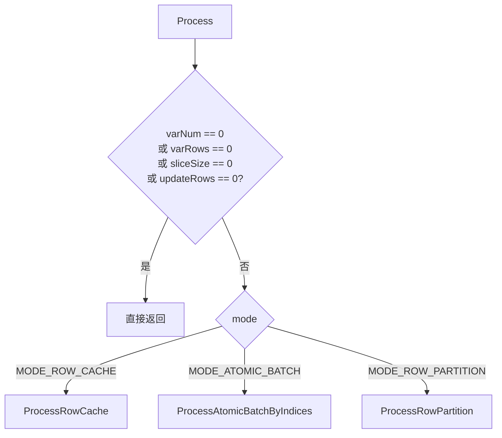

#### **6. Atomic Batch 流程图**

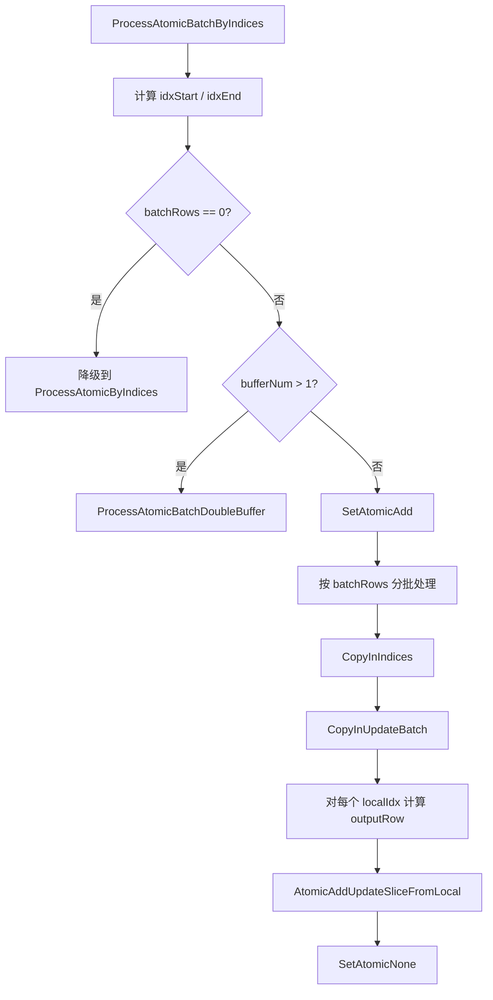

#### **7. Double Buffer 流程图**

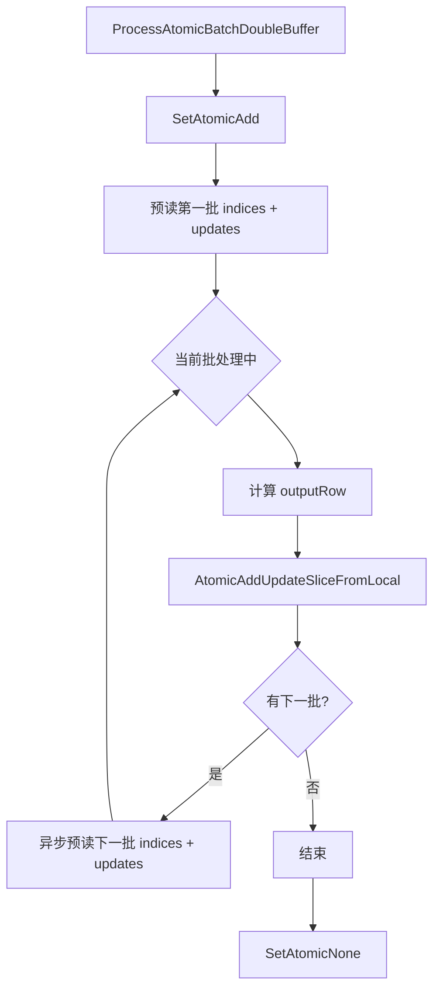

#### **8. Row Partition 流程图**

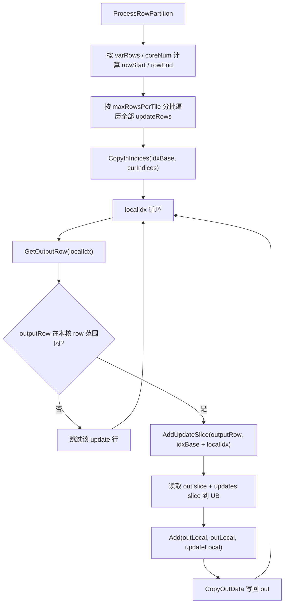

#### **9. Row Cache 流程图**

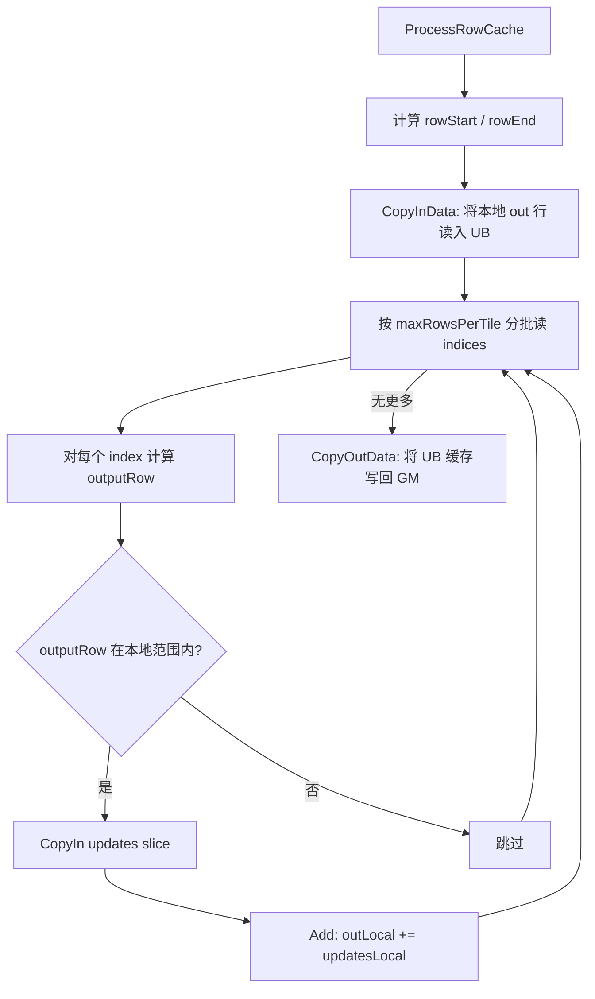

#### **10. Atomic / Add Slice 细化流程图**

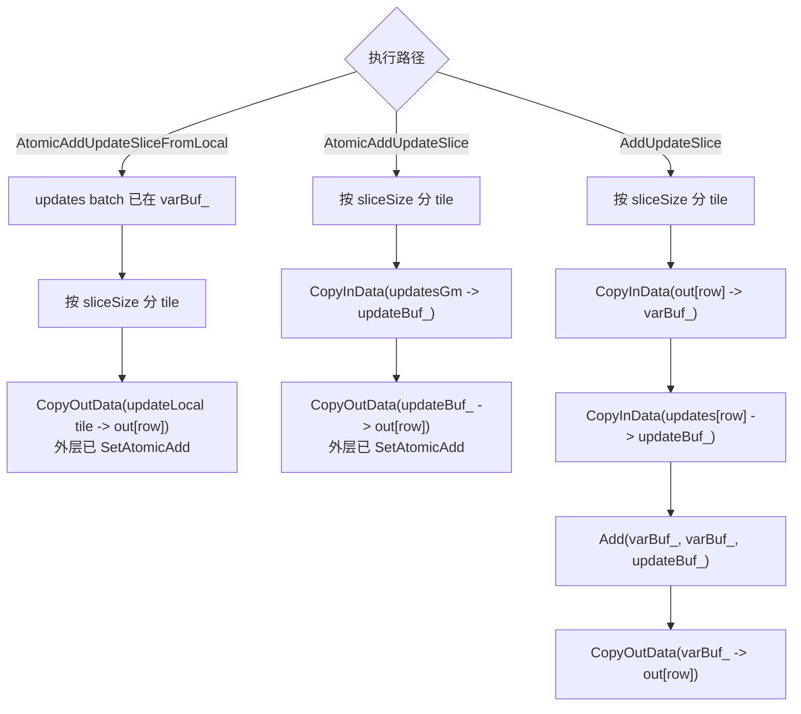

#### **11. GetOutputRow 流程图**

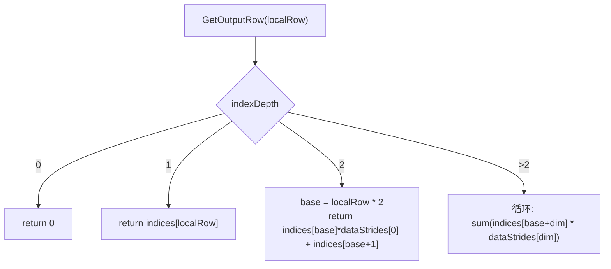

## **支持硬件**

| **支持的芯片版本** | **涉及勾选** |
| ------------------ | ------------ |
| 香橙派OrangePi AIpro | |
| Atlas 200I/500 A2推理产品 | |
| Atlas 800I/T A2 | √ |

## **算子约束限制**

* 支持 ND 格式，暂不支持特殊 format。
* `data/updates/out` dtype 必须为 `float16`、`float32` 或 `int32`，且三者 dtype 一致。
* `indices` dtype 必须为 `int32` 或 `int64`。
* `data`、`indices`、`updates`、`out` rank 必须在 `[1, 8]` 范围内。
* `out.shape` 必须与 `data.shape` 一致。
* `indexDepth` 必须在 `[0, rank(data)]` 范围内。
* `updates` rank 必须等于 `rank(indices) - 1 + rank(data) - indexDepth`。
* `updates` 前缀 shape 必须等于 `indices.shape[:-1]`。
* `updates` 后缀 shape 必须等于 `data.shape[indexDepth:]`。
* 当前任务不要求广播。
* ACLNN 非原地输出时先将 `data` 复制到临时 scatter 目标，再将结果 `ViewCopy` 到 `out`；原地同地址时直接在连续化后的目标上累加。

# **特性交叉分析可维可测分析**

## **验收标准**

| **验收标准** | **描述** |
| ------------ | -------- |
| 精度标准 | 不低于 TBE 版本。`float32` 最大绝对误差 ≤ `1e-5`，`float16` / `bfloat16` 最大绝对误差 ≤ `1e-3`。 |
| 性能标准 | 算子整体性能与原 TBE 实现算子持平。 |

## **关联的 Issue**

暂无。

## **文档更新**

本文档。

## **类型标签**

* [ ] Bug修复
* [ ] 新特性
* [ ] 性能优化
* [ ] 文档更新
* [x] 其他，请描述：社区任务算子设计文档
