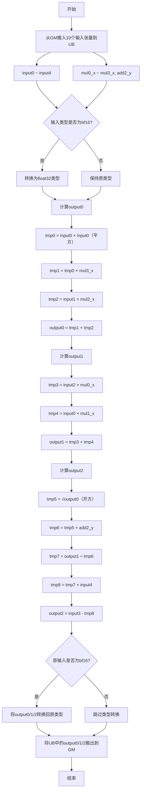

## 需求背景

### 需求来源

- 通过社区任务完成开源仓算子贡献的需求

### 背景介绍

算子功能: 实现Adam优化器的融合算子，用于BERT模型的参数优化更新。该算子将多个Adam优化步骤融合为一个算子，减少内存访问次数，提升训练性能。

计算公式：
- output0 = input1 × mul2_x + input0² × mul3_x
- output1 = input2 × mul0_x + input0 × mul1_x  
- output2 = input3 - (output1 ÷ (sqrt(output0) + add2_y)) × input4

其中：
- output0：更新后的二阶矩估计
- output1：更新后的一阶矩估计
- output2：更新后的参数

1. adam_apply_one算子实现优化
   - kernel实现：
      - /usr/local/Ascend/ascend-toolkit/latest/opp/built-in/op_impl/ai_core/tbe/impl/ops_legacy/dynamic/adam_apply_one.py
   - 算子原型：
      - /usr/local/Ascend/ascend-toolkit/latest/opp/built-in/op_proto/inc/elewise_calculation_ops.h
   - 算子信息库：
      - /usr/local/Ascend/ascend-toolkit/latest/opp/built-in/op_impl/ai_core/tbe/config/ascend910b/aic-ascend910b-ops-info.json

2. adam_apply_one算子现状分析
   1. TBE算子支持的数据类型和数据格式
      - adam_apply_one算子输入数据支持BFLOAT16、FLOAT16、FLOAT32数据类型。
      - 支持的数据格式：
        - 通用场景：ND格式
        - 特殊场景：当所有输入shape完全相同时，额外支持NDC1HWC0和FRACTAL_Z_3D格式
      - 输出数据类型与输入数据类型保持一致。
   2. TBE算子实现描述
      1. 参数校验与形状处理阶段
         - 通过 @para_check 检查10个输入、3个输出以及 kernel_name 的合法性。
         - 获取所有输入的shape和dtype信息。
         - 调用 shape_util.scalar2tensor_one 处理输入shape，将标量转换为tensor。
         - 构建动态输入列表和名称映射字典：
            - data_dict：建立数据名称到索引的映射
            - data_dtype：收集所有输入的数据类型
            - data_inputs：预分配10个输入张量的存储空间
            - data_names：定义10个输入的名称列表
      2. 动态Shape分类与处理阶段
         - 调用 classify(dynamic_inputs, OpPatternMode.ELEWISE_WITH_BROADCAST) 对10个输入进行分类。
         - 根据 ELEWISE_WITH_BROADCAST 模式，识别输入的广播关系和shape变化。
         - 遍历分类后的输入组（_dinputs）：
            - 调用 shape_util.variable_shape(_dinputs) 获取动态形状列表。
            - 为每个动态shape创建TVM占位符。
      3. TVM占位符创建阶段
         - 为10个输入张量创建TVM占位符：
            - data_grad（对应input0）
            - data_v（对应input1）
            - data_m（对应input2）
            - data_var（对应input3）
            - data_input4（对应input4）
            - data_input_mul（对应mul0_x）
            - data_input_mul1（对应mul1_x）
            - data_input_mul2（对应mul2_x）
            - data_input_mul3（对应mul3_x）
            - data_input_add2（对应add2_y）
         - 指定每个占位符的动态shape和dtype。
      3. 核心计算逻辑（adam_apply_one_compute）阶段
         - **步骤1：计算平方（square）**
           - 调用 shape_broadcast 广播 data_input0
           - 执行 vmul(data_input0, data_input0) 得到 input0²
         - **步骤2：计算mul_3**
           - 广播 square_result 和 data_input_mul3
           - 执行 vmul(square_result, data_input_mul3) 得到 input0² × mul3_x
         - **步骤3：计算mul_2**
           - 广播 data_input1 和 data_input_mul2
           - 执行 vmul(data_input1, data_input_mul2) 得到 input1 × mul2_x
         - **步骤4：计算output0（add_1）**
           - 广播 mul_3_result 和 mul_2_result
           - 执行 vadd(mul_2_result, mul_3_result) 得到 output0
         - **步骤5：计算开方（sqrt）**
           - 执行 vsqrt(output0) 得到 √output0
         - **步骤6：计算add_2**
           - 广播 data_input_add2 和 sqrt_result
           - 执行 vadd(sqrt_result, data_input_add2) 得到 √output0 + add2_y
         - **步骤7：计算mul_0**
           - 广播 data_input2 和 data_input_mul
           - 执行 vmul(data_input2, data_input_mul) 得到 input2 × mul0_x
         - **步骤8：计算mul_1**
           - 广播 data_input0 和 data_input_mul1
           - 执行 vmul(data_input0, data_input_mul1) 得到 input0 × mul1_x
         - **步骤9：计算output1（add_0）**
           - 广播 mul_0_result 和 mul_1_result
           - 执行 vadd(mul_0_result, mul_1_result) 得到 output1
         - **步骤10：计算除法（truediv）**
           - 广播 add_2_result 和 output1（得到output1_brd）
           - 执行 vdiv(output1_brd, add_2_result) 得到 output1 ÷ (√output0 + add2_y)
         - **步骤11：计算mul_4**
           - 广播 truediv_result 和 data_input4
           - 执行 vmul(truediv_result, data_input4) 得到除法结果 × input4
         - **步骤12：计算output2（sub）**
           - 广播 mul_4_result 和 data_input3
           - 执行 vsub(data_input3, mul_4_result) 得到 output2
         - 返回三个输出张量 [output0, output1, output2]
      4. 调度与编译构建阶段
         - 将输入张量和输出张量组合成 tensors 列表。
         - 基于CCE目标创建自动调度（auto_schedule）。
         - 将调度添加到 schedules 列表中。
         - 循环处理所有动态shape组合。
         - 调用 tbe.build 编译调度和计算张量，生成CCE内核。
         - 配置参数包括 kernel_name 和 tensor_list。
      5. 输出结果阶段
         - 输出三个张量：output0（二阶矩）、output1（一阶矩）、output2（更新参数）
      6. 格式选择策略（op_select_format）
         - 检查所有输入shape是否完全相同
         - 如果shape相同且非动态输入：
            - 支持格式：ND、NDC1HWC0、FRACTAL_Z_3D
            - 数据类型：float16、float32、bfloat16
         - 如果shape不同：
            - 仅支持格式：ND
            - 数据类型：float16、float32、bfloat16
   3. TBE算子实现流程图
      - adam_apply_one算子TBE版本的整体流程图如下图所示：

## 需求详细设计

### 使能方式

创建aclnnAdamApplyOne相关接口，调用此算子。

### 需求总体设计

#### host侧设计

1. 分核策略
   1. 优先使用满核的原则。
   2. 如果核间能均分，可视作无大小核区分，大核小核数据块一致。
   3. 如果核间不能均分，需要将余出的数据块分配到前几个核上。
   4. 数据量很小时，直接使用单核处理，不再用多核。

2. 数据分块和内存优化策略
   单core内切分策略：
   1. 充分使用UB空间的原则。
   2. 需要考虑不同硬件的UB大小不同、是否开启double buffer。
   3. 由于算子涉及多个中间结果（square、sqrt、mul、add、div、sub），需要合理规划UB空间：
      - 分配输入缓冲区
      - 分配中间计算缓冲区
      - 分配输出缓冲区
   4. 数据搬移需满足32字节对齐要求。

3. tilingKey规划策略
   1. 根据输入shape是否相同，选择不同的tiling策略：
      - tilingKey=0：所有输入shape相同，可使用优化的数据搬移策略
      - tilingKey=1：输入shape不同，需要广播处理

#### kernel侧设计

   1. kernel侧实现描述
      - 进行Init和Process两个阶段，其中Process包括搬入（CopyIn）、计算（Compute）、搬出（CopyOut）三个阶段。
      - 从GM搬入10个输入张量到UB中：
        - input0、input1、input2、input3、input4
        - mul0_x、mul1_x、mul2_x、mul3_x、add2_y
      - 计算步骤：
        1. **计算output0**：
           - tmp0 = input0 × input0（平方）
           - tmp1 = tmp0 × mul3_x
           - tmp2 = input1 × mul2_x
           - output0 = tmp1 + tmp2
        2. **计算output1**：
           - tmp3 = input2 × mul0_x
           - tmp4 = input0 × mul1_x
           - output1 = tmp3 + tmp4
        3. **计算output2**：
           - tmp5 = √output0（开方）
           - tmp6 = tmp5 + add2_y
           - tmp7 = output1 ÷ tmp6（除法）
           - tmp8 = tmp7 × input4
           - output2 = input3 - tmp8
      - 如果输入是bf16类型，需要转换为float32进行计算。
      - 将UB中的output0、output1、output2三个张量搬出到Global Memory中。

   2. AscendC实现流程图
   adam_apply_one算子流程见下图。

#### AscendC实现流程图与TBE流程图存在的差异点和原因

1. 任务书中AscendC不需要实现广播逻辑。

### 支持硬件

| 产品                                                                            | 是否支持 |
| :------------------------------------------------------------------------------ | :------: |
| <term>Atlas A2 训练系列产品/Atlas 800I A2 推理产品/A200I A2 Box 异构组件</term> |    √     |

### 算子原型

| 参数名  | 类别     | 描述                            | 数据类型                   | 数据格式                     | shape |
| :------ | :------- | :------------------------------ | :------------------------- | :--------------------------- | :---- |
| input0  | 输入张量 | 用于计算平方和mul_1的输入张量。 | BFLOAT16、FLOAT16、FLOAT32 | ND、NDC1HWC0*、FRACTAL_Z_3D* | all   |
| input1  | 输入张量 | 用于计算mul_2的输入张量。       | BFLOAT16、FLOAT16、FLOAT32 | ND、NDC1HWC0*、FRACTAL_Z_3D* | all   |
| input2  | 输入张量 | 用于计算mul_0的输入张量。       | BFLOAT16、FLOAT16、FLOAT32 | ND、NDC1HWC0*、FRACTAL_Z_3D* | all   |
| input3  | 输入张量 | 用于计算sub的输入张量。         | BFLOAT16、FLOAT16、FLOAT32 | ND、NDC1HWC0*、FRACTAL_Z_3D* | all   |
| input4  | 输入张量 | 用于计算mul_4的输入张量。       | BFLOAT16、FLOAT16、FLOAT32 | ND、NDC1HWC0*、FRACTAL_Z_3D* | all   |
| mul0_x  | 输入张量 | mul_0的乘数张量。               | BFLOAT16、FLOAT16、FLOAT32 | ND、NDC1HWC0*、FRACTAL_Z_3D* | all   |
| mul1_x  | 输入张量 | mul_1的乘数张量。               | BFLOAT16、FLOAT16、FLOAT32 | ND、NDC1HWC0*、FRACTAL_Z_3D* | all   |
| mul2_x  | 输入张量 | mul_2的乘数张量。               | BFLOAT16、FLOAT16、FLOAT32 | ND、NDC1HWC0*、FRACTAL_Z_3D* | all   |
| mul3_x  | 输入张量 | mul_3的乘数张量。               | BFLOAT16、FLOAT16、FLOAT32 | ND、NDC1HWC0*、FRACTAL_Z_3D* | all   |
| add2_y  | 输入张量 | add_2的加数张量。               | BFLOAT16、FLOAT16、FLOAT32 | ND、NDC1HWC0*、FRACTAL_Z_3D* | all   |
| output0 | 输出张量 | 更新后的二阶矩估计。            | BFLOAT16、FLOAT16、FLOAT32 | ND、NDC1HWC0*、FRACTAL_Z_3D* | all   |
| output1 | 输出张量 | 更新后的一阶矩估计。            | BFLOAT16、FLOAT16、FLOAT32 | ND、NDC1HWC0*、FRACTAL_Z_3D* | all   |
| output2 | 输出张量 | 更新后的参数。                  | BFLOAT16、FLOAT16、FLOAT32 | ND、NDC1HWC0*、FRACTAL_Z_3D* | all   |

### 算子约束限制

1. 所有输入的数据类型和shape必须一致。
2. 支持float16、float32、bfloat16类型。

### 精度标准/性能标准

精度不低于TBE，性能不低于TBE
