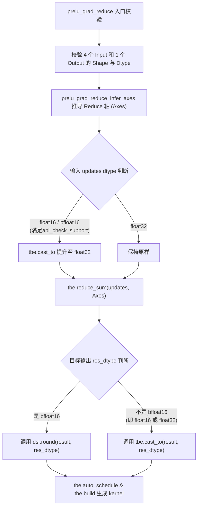
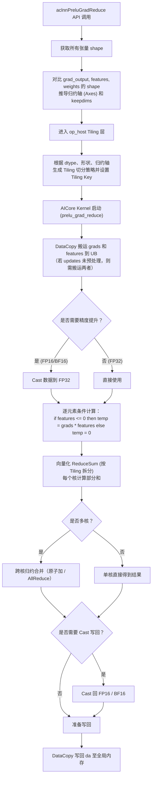

# 【社区任务】PReluGradReduce算子设计文档

## 一、需求背景（required）

### 1.1 需求来源

本需求来源于 CANN 社区任务中的算子开发任务。任务要求参考昇腾 CANN 内置 `PreluGradReduce` 算子的 TBE 实现，在昇腾 NPU 上基于 Ascend C 编程语言实现功能一致的算子。

任务对应开源仓为 `https://gitcode.com/cann/ops-nn`，目标算子目录规划为 `experimental/activation/prelu_grad_reduce`（具体依开源仓结构而定）。

### 1.2 背景介绍

#### PReluGradReduce 算子实现优化

PReLU（Parametric Rectified Linear Unit）是带参数的激活函数。在神经网络的反向传播（Backward）计算中，PReLU 的梯度计算通常分为两部分：一是计算输入特征（features）的梯度，二是计算可学习参数（weights/alpha）的梯度。

`PReluGradReduce` 算子的核心作用正是用于计算**可学习参数（weights）的梯度（对应输出 `da`）**。由于 `weights` 通常在通道维度上共享或全局共享，其梯度需要对未约简的更新值（`updates`）在特定维度上执行 ReduceSum 操作。

本次任务基于 Ascend C 对该算子进行全新实现，要求功能与 TBE 版本完全一致，并跑通全流程适配。

PReluGradReduce算子（TBE）实现路径和相关API路径：

PReluGradReduce算子实现路径为：`/usr/local/Ascend/ascend-toolkit/latest/opp/built-in/op_impl/ai_core/tbe/impl/dynamic`

PReluGradReduce算子实现中的API路径：`/usr/local/Ascend/ascend-toolkit/latest/python/site-packages/tbe/dsl`

### 1.3 PReluGradReduce 算子 TBE 实现现状分析

通过对原始 `prelu_grad_reduce.py` 源码的功能分析，当前支持的能力如下：

| 参数名 | 参数含义 | 数据类型 | 支持数据类型 | 形状 |
| --- | --- | --- | --- | --- |
| grads | 输入的梯度 | tensor | FLOAT16、FLOAT32、BFLOAT16 | ND, NCHW, NC1HWC0 |
| features | PReLU的正向输入 | tensor | FLOAT16、FLOAT32、BFLOAT16 | ND, NCHW, NC1HWC0 |
| weights | 可学习参数 | tensor | FLOAT16、FLOAT32、BFLOAT16 | ND, NC1HWC0 |
| updates | 未约简的权重梯度 | tensor | FLOAT16、FLOAT32、BFLOAT16 | ND, NCHW, NC1HWC0 |
| da | 输出的权重梯度 | tensor | FLOAT16、FLOAT32、BFLOAT16 | 需与 weights 形状一致 |

**关键分析结论**：虽然算子有 4 个输入（`grads`, `features`, `weights`, `updates`），但在 TBE 计算图（`prelu_grad_reduce_compute`）中，**真正参与底层计算的只有 `updates`**。其他三个输入（`grads`, `features`, `weights`）仅在 Host 侧用于**推导需要进行 Reduce 归约的轴（Axes）**。

### 1.4 算子目标原型

基于任务书（暂无需支持 int64、double 数据类型，支持 Atlas A2），本任务目标算子原型如下：

| 参数名 | 输入/输出 | 描述 | 数据类型 | 数据格式 |
| --- | --- | --- | --- | --- |
| grads | 输入 | 梯度Tensor（用于形状推导） | FLOAT16、FLOAT32、BFLOAT16 | ND, NCHW, NC1HWC0 |
| features | 输入 | 特征Tensor（用于形状推导） | FLOAT16、FLOAT32、BFLOAT16 | ND, NCHW, NC1HWC0 |
| weights | 输入 | 权重Tensor（用于形状推导） | FLOAT16、FLOAT32、BFLOAT16 | ND, NC1HWC0 |
| updates | 输入 | 待执行ReduceSum的更新值 | FLOAT16、FLOAT32、BFLOAT16 | ND, NCHW, NC1HWC0 |
| da | 输出 | 归约后的权重梯度 | FLOAT16、FLOAT32、BFLOAT16 | 需与 weights 一致 |

### 1.5 算子功能分析

**算子功能**：在推导出的特定轴（Axes）上，对 `updates` 张量执行求和归约（ReduceSum），以匹配 `weights` 的形状。

**计算公式**：
$$
da = \sum_{i \in Axes} updates_{i}
$$

为了保证精度，TBE 源码中明确：当输入为 `float16` 或 `bfloat16` 时，需先将其 Cast 为 `float32` 进行累加求和，最终再 Cast 回原始数据类型。

### 1.6 TBE 算子实现描述

根据云开发环境中： `/home/developer/Ascend/cann-8.5.2/opp/built-in/op_impl/ai_core/tbe/impl/ops_legacy/dynamic/prelu_grad_reduce.py`的 `prelu_grad_reduce.py` 源码，TBE 版本的核心逻辑如下：

1. **入口校验**：通过 `para_check.check_op_params` 校验 4 个输入和 1 个输出的 dtype 和 shape 是否合法（要求 dtype 一致）。
2. **轴推导（Infer Axes）**：调用 `prelu_grad_reduce_infer_axes` 函数，对比 `updates` 和 `weights` 的 shape。
   - 若 weight 为标量（全局共享），则在所有维度上求和（`weight_share=True`）。
   - 若 weight 为通道级共享，则推导求出对应的空间和 Batch 维度（例如 NCHW 下对轴 0, 2, 3 归约）。
3. **精度提升**：在 `prelu_grad_reduce_compute` 中，判断 `updates` 的 dtype，如果是 `bfloat16` 或 `float16`，则先插入 `tbe.cast_to(input_updates, "float32")`。
4. **归约计算**：调用 `tbe.reduce_sum` 沿推导出的 Axes 进行求和。
5. **数据写回**：将 `float32` 的求和结果通过 `round` 或 `cast_to` 转换回目标的输出 dtype。
6. **算子编译**：生成算子调度 Schedule，通过 `tbe.build` 编译生成内核二进制文件。

### 1.7 TBE 算子实现流程图

## 二、需求模块设计

### 2.1 算子原型

#### 2.1.1 原型设计

| 名称 | 类别 | dtype | format | shape | 介绍 |
| --- | --- | --- | --- | --- | --- |
| grads | 输入 | fp16/fp32/bf16 | ND | 与 features 一致 | PReLU 正向输出的反向梯度，用于接口对齐和校验 |
| features | 输入 | fp16/fp32/bf16 | ND | ND | PReLU 正向输入，用于接口对齐和校验 |
| weights | 输入 | fp16/fp32/bf16 | ND | [1] 或 [C] | PReLU 正向权重，决定 da 输出 shape 和 reduce axes |
| updates | 输入 | fp16/fp32/bf16 | ND | 与 features 一致 | weight 梯度中间结果，参与 reduce_sum |
| da | 输出 | fp16/fp32/bf16 | ND | 与 weights 一致 | weights 的梯度输出 |

#### 2.1.2 相关约束

Atlas A2 训练系列产品 / Atlas A2 推理系列产品支持 `float16`、`float32`、`bfloat16`。当前不支持广播权重，不支持 `int64`、`double`。、

## 三、需求总体设计

### 3.1 详细设计（required）

#### 3.1.1 算子分析

##### 数学公式

计算公式为带有类型转换的求和归约：

$$
da = CastTo(Dtype_{out}, \sum_{i \in Axes} CastTo(FP32, updates_{i}))
$$

##### 支持形状

支持 ND 格式，以及常见的 NCHW, NC1HWC0 格式。`updates` 的维度数 >= `weights` 的维度数。输出 `da` 的形状与 `weights` 完全一致。

#### 3.1.2 算子实现

本算子的整体实现策略是：**Host 侧重推导，Kernel 侧重计算**。

##### Host 侧设计

1. **API 层参数推导**  
   在 `op_api` 层接收到所有的输入后，不再将 `grads`、`features`、`weights` 传入底层 Kernel，而是利用它们获取 Shape 信息，在 CPU 端实现等价于 `prelu_grad_reduce_infer_axes` 的逻辑。计算出需要进行 ReduceSum 的具体的轴（例如 `[0, 2, 3]`），并将这些信息序列化，传递给 Host Tiling 函数。

2. **Tiling 策略**  
   算子本质上是 ReduceSum 操作，根据推导出的归约轴（Axes），将其转化为底层的 Reduce 计算维度信息（如 `reduceAxis`）。  
   - 如果是对所有维度归约（全局共享 PReLU），属于 **ReduceAll** 场景。  
   - 如果是只对 N, H, W 归约，保留 C，属于 **ReduceAxis** 场景。  
   Tiling 函数需根据输入数据总量、AI Core 核数、UB (Unified Buffer) 内存限制，计算出 Block 分块大小、尾块大小，填入自定义的 TilingData 结构体中。

3. **Tiling Key 规划**  
   根据输入数据类型进行 Tiling Key 的分配，以便 Kernel 侧路由到不同的计算图分支：

| tiling key | updates 数据类型 | 累加数据类型 (ComputeT) |
|------------|----------------|-------------------------|
| 1          | FLOAT32        | FLOAT32                 |
| 2          | FLOAT16        | FLOAT32                 |
| 3          | BFLOAT16       | FLOAT32                 |

##### Kernel 侧设计

Kernel 侧只接收 `updates` 作为输入，`da` 作为输出。核心算子计算利用 Ascend C 的 `ReduceSum` API 或自定义 Vector 规约指令实现。

**计算流程（DAG）**：

1. **CopyIn**：使用 `DataCopy` 将 `updates` 数据从 Global Memory 搬运到 Local Memory。
2. **Cast**：根据 Tiling Key 判断，如果是 Key=2/3 (FP16/BF16)，调用 Ascend C 的 `Cast` 接口，将其转换为 FP32。
3. **Compute**：调用针对多维矩阵的归约指令或 API（如 `WholeReduceSum` 等），根据 Tiling 传入的参数对指定维度执行累加计算。
4. **CastBack**：将归约后的 FP32 结果 Cast 回原数据类型（FLOAT16/BFLOAT16）。
5. **CopyOut**：将结果 `da` 搬运回 Global Memory。

##### tiling 策略（补充说明）

Host 侧通过 `ReduceOpTmpl::GetInputParam(context, opInput, UPDATES_INDEX)` 以 `updates` 作为规约输入，获取输入 dtype、shape 等基础信息。随后执行 shape 和 dtype 校验，确保 reduce 输入和输出满足 kernel 读写约束。

当 `weights` 元素个数为 1 时，`axes` 设置为 `features` 的全部维度，输出 `da` 为 `[1]`。当 `weights` 为一维通道向量 `[C]` 时，要求 `features` 的 rank 不小于 2，且 `weights[0]` 等于 `features.shape[1]`，`axes` 设置为 `{0, 2, ..., rank-1}`，保留 C 维。

`Tiling4ReduceOp` 根据 `opInput.axes`、输入 dtype 和硬件 `compileInfo` 生成 `ReduceOpTilingData`，并通过 `GEN_REDUCE_TILING_KEY` 生成 `tilingKey`，kernel 侧据此选择 `ReduceSch` 模板实例。

##### 分核策略

复用通用 `ReduceOpTmpl` 的分核策略，根据规约形态、输出大小、输入总量和 AIV 核数生成任务切分。scalar weight 场景为全量 reduce；channel weight 场景按保留通道维组织输出，并对 N 维和空间维做规约。

##### 数据分块和内存优化策略

Host 侧在 `TilingPrepare` 阶段通过 `PlatformAscendC` 获取 `vectorCoreNum`、UB size、`cacheLineSize`、`ubBlockSize`、`vRegSize` 等硬件信息。`ReduceOpTmpl` 根据 UB 能力和 reduce 形态决定 `ubFactorA`、`ubFactorR`、`sliceShape`、`sliceStride` 等参数，减少重复搬运并保证 UB 内计算粒度合理。

##### tilingKey 规划策略

PreluGradReduce 使用 `REDUCE_TPL_KEY_DECL` / `GEN_REDUCE_TILING_KEY` 生成通用 reduce tiling key。需要感知 reduce pattern、`loopARCount`、`loopInnerARCount` 等模板参数，用于 kernel 侧 `ReduceSch` 模板展开。

##### 数据检测

Host 侧检测 `grads`、`features`、`updates` shape 一致性；检测 `weights` 与 `da` shape 一致性；检测 `grads`、`features`、`weights`、`updates`、`da` dtype 一致性；检测 channel weight 必须为一维且长度匹配 `features.shape[1]`。不满足约束时 tiling 返回 `GRAPH_FAILED`。

##### Kernel 侧 Reduce DAG 流程

### 3.2 Ascend C 实现流程图

## 四、支持硬件

| 支持的芯片版本 | 涉及勾选 |
| --- | --- |
| 香橙派OrangePi AIpro |  |
| Atlas 200I/500 A2推理产品 |  |
| Atlas 800I/T A2 | √ |

## 五、算子约束限制

不支持广播权重；`weights` 仅支持 `[1]` 或 `[C]`；channel 模式固定使用 `features.shape[1]` 作为通道维；`grads`、`features`、`weights`、`updates`、`da` dtype 必须一致；`updates` 必须由前序阶段生成。

## 六、特性交叉分析

PreluGradReduce 属于 PReLU backward 的子算子，依赖前序 PReluGradUpdate / 等价逻辑生成 `updates`。与前序阶段的交叉点主要包括 `updates` 的语义一致性、`features` shape 与 channel 维定义一致性、`weight` shape 与 `da` shape 一致性。

当前 experimental 版本不引入广播，因此与广播、动态 rank、混合 dtype 等特性存在边界约束；后续若需要对齐正式 PReluGradReduce 的多维 weight/broadcast 行为，应扩展 axes 推导与测试覆盖。

## 七、可维可测分析

### 7.1 精度标准 / 性能标准

| 验收标准 | 描述（不涉及说明原因） | 标准来源 |
| --- | --- | --- |
| 精度标准 | 与 numpy/reference reduce_sum 结果一致；fp32 建议误差不超过 1e-4，fp16/bf16 按半精度容差验收 | 算子功能定义 |
| 性能标准 | 在所有核参与计算场景下，Ascend C 实现性能不低于原 TBE 算子的 95%；若小 shape 场景无法达标，需补充性能仿真图和分析结论。 | 算子开发任务书性能要求 |

### 7.2 测试策略

- Kernel UT 覆盖 scalar weight fp32 全量 reduce 场景，并读取 `golden_da.bin` 对输出进行 `EXPECT_NEAR` 校验。
- Host UT 覆盖 infer shape 与 infer dtype，验证 `da` shape / dtype 从 `weights` 推导。
- 建议继续补充 channel weight `[N,C,H,W] -> [C]`、fp16 / bf16、大 shape、多 core、非法 shape / dtype 等用例。

## 八、兼容性分析

新 experimental 算子，不涉及存量接口兼容性风险。 