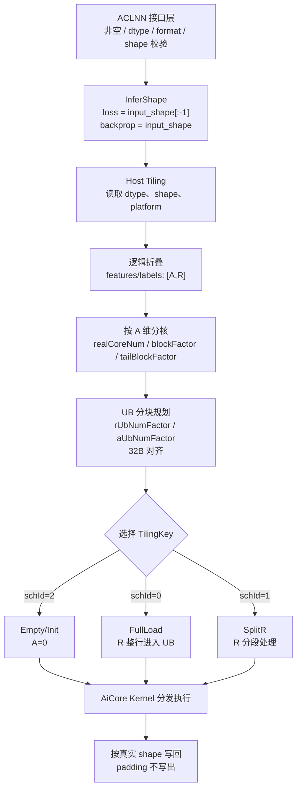
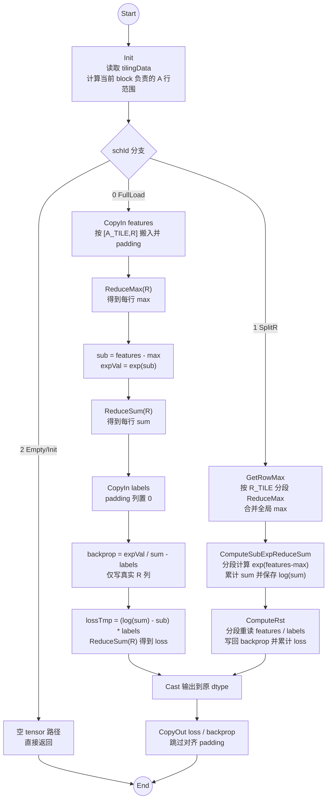
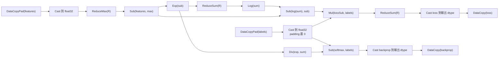

# 【社区任务】SoftmaxCrossEntropyWithLogits算子设计文档

## 一、需求背景

### 1.1 需求来源

通过社区任务完成 `SoftmaxCrossEntropyWithLogits` 算子 Ascend C 化开发，参考昇腾 CANN 内置 TBE 实现，在昇腾 NPU 上实现功能一致、性能满足验收要求的算子，并按任务书要求提交到昇腾算子开源仓 `ops-nn` 的 `experimental/activation` 目录（`https://gitcode.com/cann/ops-nn/tree/master/experimental/activation`）。

### 1.2 背景介绍

#### 1.2.1 SoftmaxCrossEntropyWithLogits算子实现优化

本任务要求将历史 TBE 算子迁移为 Ascend C 算子，完成算子设计、开发、测试和文档交付。任务书约束如下：

- 适配硬件：Atlas A2 训练系列产品。
- 开发语言：Ascend C。
- 开源仓地址：`https://gitcode.com/cann/ops-nn`。
- 验收性能：所有核参与计算场景下，性能不低于原 TBE 算子的 95%。
- 验收精度：满足 AscendOpTest 默认阈值。
- 不要求支持 `int64`、`double` 数据类型。
- 不要求支持广播操作。

SoftmaxCrossEntropyWithLogits 算子 TBE 实现路径和相关 API 路径如下：

- kernel 实现：`${ASCEND_INSTALL_PATH}/opp/built-in/op_impl/ai_core/tbe/impl/dynamic/softmax_cross_entropy_with_logits.py`
- TBE DSL/API 路径：`${ASCEND_INSTALL_PATH}/python/site-packages/tbe/dsl`
- 算子原型：`${ASCEND_INSTALL_PATH}/opp/built-in/op_proto/inc/nn_norm_ops.h`
- 算子信息库：`${ASCEND_INSTALL_PATH}/opp/built-in/op_impl/ai_core/tbe/config/ascend910b/aic-ascend910b-ops-info.json`
- aclnn 接口：`${ASCEND_INSTALL_PATH}/aarch64-linux/include/aclnnop/aclnn_softmax_cross_entropy_with_logits.h`

TBE 版本核心计算依赖归约、指数、对数和逐元素计算能力。Ascend C 迁移时使用 `ReduceMax`、`ReduceSum`、`Exp`、`Log`、`Div`、`Sub`、`Mul`、`Cast` 等接口完成等价替换，Host 侧负责把 TBE 自动调度中的 shape、分核和 UB 切分策略显式化。

#### 1.2.2 SoftmaxCrossEntropyWithLogits算子现状分析

通过 TBE 源码和算子信息库分析，`SoftmaxCrossEntropyWithLogits` 用于计算 softmax 交叉熵损失和反向梯度。算子原型（`nn_norm_ops.h` 中 `REG_OP(SoftmaxCrossEntropyWithLogits)`）支持 `float16`、`float32`、`double`，原型语义为 `batch_size * num_classes` 二维矩阵；`bfloat16` 为 aclnn 接口侧扩展的数据类型。本任务按任务书裁剪掉 `double`，保留 `float16/bfloat16/float32`；TBE 存在广播处理逻辑，本任务不实现广播，要求 `features` 与 `labels` shape 一致。

##### 1.2.2.1 TBE算子支持的数据类型和数据格式

当前任务支持能力如下：

1. 数据类型：`float16`、`bfloat16`、`float32`。
2. 数据格式：ACLNN 直调场景支持 `ND`；若图模式按 TBE 信息库走 `NCHW/NHWC`，需按格式定义归一化轴：`ND/NHWC` 以最后一维为 `R`，`NCHW` 以 `C` 轴为 `R`。本文后续设计均以 ACLNN `ND` 直调场景为目标。
3. 动态能力：支持动态 shape；动态 rank 可在 host 侧规约为合法二维输入后处理。
4. 输入约束：`features` 与 `labels` dtype、format、shape 一致，不做广播。

##### 1.2.2.2 TBE算子实现描述

输入 `features` 为模型未归一化 logits，输入 `labels` 为同 shape 的标签分布。沿类别维 `R` 计算：

```text
max_i = max(features_i)
sub_i = features_i - max_i
sum = Σ exp(sub_i)
softmax_i = exp(sub_i) / sum
loss = -Σ labels_i * log(softmax_i)
     = Σ labels_i * (log(sum) - sub_i)
backprop_i = softmax_i - labels_i
```

其中减去 `max_i` 用于避免 `exp` 溢出。`float16`、`bfloat16` 输入在计算过程中提升到 `float32`，输出再 cast 回原 dtype；`float32` 输入保持 `float32` 计算和输出。

##### 1.2.2.3 TBE算子实现流程图

TBE 动态源码计算流程如下，对应 `${ASCEND_INSTALL_PATH}/opp/built-in/op_impl/ai_core/tbe/impl/dynamic/softmax_cross_entropy_with_logits.py` 中的 `check_supported`、`input_broadcast`、`softmax_cross_entropy_with_logits` 入口、`softmax_cross_entropy_with_logits_compute` 和 `softmax_cross_entropy_with_logits_nchw_compute`。流程图按源码语句顺序展开动态/静态选择、输入规整、动态 shape 分类、TVM compute 图构建、auto schedule 和 build 过程；其中普通 compute 分支使用 `axis=-1`，`NCHW + bfloat16` 分支使用 `axis=1`。`FullLoad`、`SplitR`、`schId`、UB 分块等属于本文后续 Ascend C 显式实现策略，不属于 TBE Python 源码流程。

```mermaid
flowchart TD
    Start((Start)) --> CS_Start["check_supported(input_features, input_labels,<br/>output_loss, output_backprop, kernel_name, impl_mode)"]

    subgraph CS["check_supported 源码流程"]
        CS_Start --> CS_ShapeF["shape_features = shape_util.shape_to_list(<br/>input_features.get(&quot;shape&quot;))"]
        CS_ShapeF --> CS_ShapeL["shape_labels = shape_util.shape_to_list(<br/>input_labels.get(&quot;shape&quot;))"]
        CS_ShapeL --> CS_Dtype["dtype_features = input_features.get(&quot;dtype&quot;).lower()"]
        CS_Dtype --> CS_ForF["for _, dim_val in enumerate(shape_features)"]
        CS_ForF --> CS_DynF{"dim_val &lt; 0?"}
        CS_DynF -- 是 --> CS_ReturnDynF["return True, &quot;&quot;"]
        CS_DynF -- 否 --> CS_ForFEnd{"shape_features 遍历完成?"}
        CS_ForFEnd -- 否 --> CS_ForF
        CS_ForFEnd -- 是 --> CS_ForL["for _, dim_val in enumerate(shape_labels)"]
        CS_ForL --> CS_DynL{"dim_val &lt; 0?"}
        CS_DynL -- 是 --> CS_ReturnDynL["return True, &quot;&quot;"]
        CS_DynL -- 否 --> CS_ForLEnd{"shape_labels 遍历完成?"}
        CS_ForLEnd -- 否 --> CS_ForL
        CS_ForLEnd -- 是 --> CS_Bf16{"dtype_features == &quot;bfloat16&quot;?"}
        CS_Bf16 -- 是 --> CS_ReturnBf16["return True, &quot;goto dynamic operator&quot;"]
        CS_Bf16 -- 否 --> CS_Rank{"len(shape_features) &gt; 2<br/>or len(shape_labels) &gt; 2?"}
        CS_Rank -- 是 --> CS_ReturnStaticRank["return False, &quot;goto static operator&quot;"]
        CS_Rank -- 否 --> CS_Fp16{"dtype_features == &quot;float16&quot;<br/>and DIM0_FP16_LOWER &lt;= shape_features[0] &lt;= DIM0_FP16_UPPER<br/>and DIM1_FP16_LOWER &lt;= shape_features[-1] &lt;= DIM1_FP16_UPPER?"}
        CS_Fp16 -- 是 --> CS_ReturnStaticFp16["return False, &quot;goto static operator&quot;"]
        CS_Fp16 -- 否 --> CS_Fp32{"dtype_features == &quot;float32&quot;<br/>and DIM0_FP32_LOWER &lt;= shape_features[0] &lt;= DIM0_FP32_UPPER<br/>and DIM1_FP32_LOWER &lt;= shape_features[-1] &lt;= DIM1_FP32_UPPER?"}
        CS_Fp32 -- 是 --> CS_ReturnStaticFp32["return False, &quot;goto static operator&quot;"]
        CS_Fp32 -- 否 --> CS_ShapeDiff{"list(shape_features) != list(shape_labels)?"}
        CS_ShapeDiff -- 是 --> CS_BrcShape["shape_features, shape_labels, shape_broadcast =<br/>shape_util.broadcast_shapes(shape_features, shape_labels)"]
        CS_ShapeDiff -- 否 --> CS_KeepShape["shape_broadcast = shape_features"]
        CS_BrcShape --> CS_Not920
        CS_KeepShape --> CS_Not920["not_920 = intrinsic_check_support(<br/>&quot;Intrinsic_data_move_l12ub&quot;)"]
        CS_Not920 --> CS_CurC["current_csize_maximum_fp32 =<br/>15360 if not_920 else 11264"]
        CS_CurC --> CS_HighC["high_perf_csize_maximum_fp32 =<br/>20000 if not_920 else 15000"]
        CS_HighC --> CS_StaticC{"current_csize_maximum_fp32 &lt; shape_broadcast[1]<br/>and shape_broadcast[1] &lt; high_perf_csize_maximum_fp32<br/>and api_check_support(vexp, float32)<br/>and not_920?"}
        CS_StaticC -- 是 --> CS_ReturnStaticC["return False, &quot;goto static operator&quot;"]
        CS_StaticC -- 否 --> CS_ReturnDyn["return True, &quot;&quot;"]
    end

    CS_ReturnDynF --> Entry
    CS_ReturnDynL --> Entry
    CS_ReturnBf16 --> Entry
    CS_ReturnDyn --> Entry
    CS_ReturnStaticRank --> StaticOp["框架选择 static operator"]
    CS_ReturnStaticFp16 --> StaticOp
    CS_ReturnStaticFp32 --> StaticOp
    CS_ReturnStaticC --> StaticOp
    StaticOp --> StaticEnd((Static End))

    Entry["softmax_cross_entropy_with_logits(...)"] --> GetShapeF["shape_features = input_features.get(&quot;shape&quot;)"]
    GetShapeF --> GetShapeL["shape_labels = input_labels.get(&quot;shape&quot;)"]
    GetShapeL --> IB_Start["input_broadcast(shape_features, shape_labels,<br/>input_features, input_labels)"]

    subgraph IB["input_broadcast 源码流程"]
        IB_Start --> IB_Feature1D{"len(shape_features) == 1<br/>and len(shape_labels) == 2?"}
        IB_Feature1D -- 是 --> IB_FeatureMatchLast{"shape_features[0] == shape_labels[1]?"}
        IB_FeatureMatchLast -- 是 --> IB_FeatureToRow["shape_features = [1, shape_features[0]]"]
        IB_FeatureMatchLast -- 否 --> IB_FeatureMatchFirst{"shape_features[0] == shape_labels[0]?"}
        IB_FeatureMatchFirst -- 是 --> IB_FeatureToCol["shape_features = [shape_features[0], 1]"]
        IB_FeatureMatchFirst -- 否 --> IB_FeatureRaise["raise_err_specific_reson:<br/>features can not be broadcasted to 2-dimensional"]
        IB_FeatureRaise --> ErrorEnd((Error End))
        IB_FeatureToRow --> IB_FeatureRange
        IB_FeatureToCol --> IB_FeatureRange["input_features['range'] = [[1, 1], input_features['range'][0]]"]
        IB_FeatureRange --> IB_FeatureShape["input_features['shape'] = shape_features"]
        IB_FeatureShape --> IB_Label1D
        IB_Feature1D -- 否 --> IB_Label1D{"len(shape_features) == 2<br/>and len(shape_labels) == 1?"}
        IB_Label1D -- 是 --> IB_LabelMatchLast{"shape_labels[0] == shape_features[1]?"}
        IB_LabelMatchLast -- 是 --> IB_LabelToRow["shape_labels = [1, shape_labels[0]]"]
        IB_LabelMatchLast -- 否 --> IB_LabelMatchFirst{"shape_labels[0] == shape_features[0]?"}
        IB_LabelMatchFirst -- 是 --> IB_LabelToCol["shape_labels = [shape_labels[0], 1]"]
        IB_LabelMatchFirst -- 否 --> IB_LabelRaise["raise_err_specific_reson:<br/>labels can not be broadcasted to 2-dimensional"]
        IB_LabelRaise --> ErrorEnd
        IB_LabelToRow --> IB_LabelRange
        IB_LabelToCol --> IB_LabelRange["input_labels['range'] = [[1, 1], input_labels['range'][0]]"]
        IB_LabelRange --> IB_LabelShape["input_labels['shape'] = shape_labels"]
        IB_LabelShape --> IB_Return
        IB_Label1D -- 否 --> IB_Return["return shape_features, shape_labels,<br/>input_features, input_labels"]
    end

    IB_Return --> Unknown{"is_unknown_rank_input((input_features, input_labels))?"}
    Unknown -- 是 --> SetShapeF["shape_features = [-1, -1]"]
    SetShapeF --> SetShapeL["shape_labels = [-1, -1]"]
    SetShapeL --> WriteUnknownF["input_features[&quot;shape&quot;] = shape_features"]
    WriteUnknownF --> WriteUnknownL["input_labels[&quot;shape&quot;] = shape_labels"]
    WriteUnknownL --> RangeF["range_features = [(1, None), (1, None)]"]
    RangeF --> RangeL["range_labels = [(1, None), (1, None)]"]
    RangeL --> WriteRangeF["input_features[&quot;range&quot;] = range_features"]
    WriteRangeF --> WriteRangeL["input_labels[&quot;range&quot;] = range_labels"]
    Unknown -- 否 --> CompareDtype
    WriteRangeL --> CompareDtype["shape_util.compare_tensor_dict_key(<br/>input_features, input_labels, &quot;dtype&quot;)"]
    CompareDtype --> CheckList["check_list = (&quot;float16&quot;, &quot;bfloat16&quot;, &quot;float32&quot;)"]
    CheckList --> InputDtype["input_dtype = input_features.get(&quot;dtype&quot;).lower()"]
    InputDtype --> CheckDtype["para_check.check_dtype(input_dtype, check_list,<br/>param_name=&quot;input_features&quot;)"]
    CheckDtype --> ScalarF["shape_features = shape_util.scalar2tensor_one(shape_features)"]
    ScalarF --> ScalarL["shape_labels = shape_util.scalar2tensor_one(shape_labels)"]
    ScalarL --> WriteShapeF["input_features[&quot;shape&quot;] = shape_features"]
    WriteShapeF --> WriteShapeL["input_labels[&quot;shape&quot;] = shape_labels"]
    WriteShapeL --> NchwFlagInit["shape_features_nchw_flag = False"]
    NchwFlagInit --> Rank4{"len(shape_features) == 4?"}
    Rank4 -- 是 --> ExtraNchw["extra_params = {}"]
    ExtraNchw --> NchwFlagTrue["shape_features_nchw_flag = True"]
    Rank4 -- 否 --> ExtraNorm["extra_params = {input_shape_type: [1, 1],<br/>same_input_shape_group: [[]],<br/>runtime_broadcast_axes: {0: [0, 1], 1: [0, 1]}}"]
    NchwFlagTrue --> ReduceAxis
    ExtraNorm --> ReduceAxis["reduce_axis = [1, ]"]
    ReduceAxis --> Classify["ins = classify([input_features, input_labels, reduce_axis],<br/>OpPatternMode.NORM, extra_params)"]
    Classify --> RankCheck1{"len(shape_features) == 1<br/>and len(shape_labels) == 1?"}
    RankCheck1 -- 是 --> RaiseRank1["raise_err_specific_reson:<br/>rank of two inputs can not be 1"]
    RaiseRank1 --> ErrorEnd
    RankCheck1 -- 否 --> RankCheck2{"(len(shape_features) &gt; 2 or len(shape_labels) &gt; 2)<br/>and input_dtype != &quot;bfloat16&quot;?"}
    RankCheck2 -- 是 --> RaiseRank2["raise_err_specific_reson:<br/>features and labels must be 2-dimensional<br/>or broadcasted to 2-dimensional"]
    RaiseRank2 --> ErrorEnd
    RankCheck2 -- 否 --> InitList["schedules, tensors = [], []"]
    InitList --> Loop["for (x1, x2, _) in ins"]
    Loop --> ComputeCtx["with tbe.compute()"]
    ComputeCtx --> VarShape["shape_features, shape_labels =<br/>shape_util.variable_shape([x1, x2], op_mode=&quot;norm&quot;)"]
    VarShape --> PlaceholderF["data_features = tvm.placeholder(shape_features,<br/>dtype=input_dtype, name=&quot;data_features&quot;)"]
    PlaceholderF --> PlaceholderL["data_labels = tvm.placeholder(shape_labels,<br/>dtype=input_dtype, name=&quot;data_labels&quot;)"]
    PlaceholderL --> ComputeBranch{"shape_features_nchw_flag<br/>and input_dtype == &quot;bfloat16&quot;?"}
    ComputeBranch -- 是 --> NchwStart["softmax_cross_entropy_with_logits_nchw_compute(...)"]
    ComputeBranch -- 否 --> NdStart["softmax_cross_entropy_with_logits_compute(...)"]

    subgraph ND["softmax_cross_entropy_with_logits_compute：axis=-1"]
        NdStart --> NdShape["shape_features = shape_to_list(input_features.shape)<br/>shape_labels = shape_to_list(input_labels.shape)<br/>dtype = input_features.dtype.lower()"]
        NdShape --> NdAlias["input_features1 = input_features<br/>input_labels1 = input_labels"]
        NdAlias --> NdShapeDiff{"list(shape_features) !=<br/>list(shape_labels)?"}
        NdShapeDiff -- 是 --> NdBrcShape["broadcast_shapes(input_features.shape,<br/>input_labels.shape)<br/>得到 shape_broadcast"]
        NdBrcShape --> NdBrcFeature["input_features_broad = tbe.broadcast(input_features, shape_broadcast, dtype)<br/>input_features_broad1 = tbe.broadcast(input_features1, shape_broadcast, dtype)"]
        NdBrcFeature --> NdAssignFeature["input_features = input_features_broad<br/>input_features1 = input_features_broad1"]
        NdAssignFeature --> NdBrcLabel["input_labels_broad = tbe.broadcast(input_labels, shape_broadcast, dtype)<br/>input_labels_broad1 = tbe.broadcast(input_labels1, shape_broadcast, dtype)"]
        NdBrcLabel --> NdAssignLabel["input_labels = input_labels_broad<br/>input_labels1 = input_labels_broad1"]
        NdShapeDiff -- 否 --> NdKeepShape["shape_broadcast = shape_features"]
        NdAssignLabel --> NdMax
        NdKeepShape --> NdMax["data_max = tbe.reduce_max(input_features,<br/>axis=-1, keepdims=True)"]
        NdMax --> NdMaxBrc["data_max_broadcast =<br/>tbe.broadcast(data_max, shape_broadcast)"]
        NdMaxBrc --> NdImproveInit["has_improve_precision = False"]
        NdImproveInit --> NdImprove{"dtype == float16 and<br/>api_check_support(vexp, float32)?"}
        NdImprove -- 是 --> NdCastLabel["input_labels_cast_fp32 =<br/>tbe.cast_to(input_labels, &quot;float32&quot;)"]
        NdCastLabel --> NdAssignLabelCast["input_labels = input_labels_cast_fp32"]
        NdAssignLabelCast --> NdCastFeature1["input_features1_cast_fp32 =<br/>tbe.cast_to(input_features1, &quot;float32&quot;)"]
        NdCastFeature1 --> NdAssignFeature1Cast["input_features1 = input_features1_cast_fp32"]
        NdAssignFeature1Cast --> NdCastLabel1["input_labels1_cast_fp32 =<br/>tbe.cast_to(input_labels1, &quot;float32&quot;)"]
        NdCastLabel1 --> NdAssignLabel1Cast["input_labels1 = input_labels1_cast_fp32"]
        NdAssignLabel1Cast --> NdImproveTrue["has_improve_precision = True"]
        NdImprove -- 否 --> NdSub
        NdImproveTrue --> NdCastMax{"has_improve_precision?"}
        NdCastMax -- 是 --> NdMaxCast["data_max_broadcast =<br/>cast_to(data_max_broadcast, float32)"]
        NdCastMax -- 否 --> NdSub
        NdMaxCast --> NdSub["data_sub = tbe.vsub(input_features1,<br/>data_max_broadcast)"]
        NdSub --> NdExp["data_exp = tbe.vexp(data_sub)"]
        NdExp --> NdSum["data_sum = tbe.reduce_sum(data_exp,<br/>axis=-1, keepdims=True)"]
        NdSum --> NdSumBrc["data_sum_broadcast =<br/>tbe.broadcast(data_sum, shape_broadcast)"]
        NdSumBrc --> NdDiv["data_div = tbe.vdiv(data_exp,<br/>data_sum_broadcast)"]
        NdDiv --> NdLogTmp["data_log_tmp = tbe.vlog(data_sum_broadcast)"]
        NdLogTmp --> NdLog["data_log = tbe.vsub(data_sub, data_log_tmp)"]
        NdLog --> NdMul["data_mul = tbe.vmul(data_log, input_labels)"]
        NdMul --> NdMuls["data_muls = tbe.vmuls(data_mul,<br/>Constant.SCALAR_MINUS_ONE)"]
        NdMuls --> NdLoss["loss = tbe.reduce_sum(data_muls,<br/>axis=-1, keepdims=True)"]
        NdLoss --> NdBackprop["backprop = tbe.vsub(data_div, input_labels1)"]
        NdBackprop --> NdOutCast{"has_improve_precision?"}
        NdOutCast -- 是 --> NdCastLossOut["loss = tbe.cast_to(loss, &quot;float16&quot;)"]
        NdCastLossOut --> NdCastBackOut["backprop = tbe.cast_to(backprop, &quot;float16&quot;)"]
        NdOutCast -- 否 --> NdRes
        NdCastBackOut --> NdRes["res = [loss, backprop]<br/>return res"]
    end

    subgraph NCHW["softmax_cross_entropy_with_logits_nchw_compute：axis=1"]
        NchwStart --> NchwShape["shape_features = shape_to_list(input_features.shape)<br/>dtype = input_features.dtype.lower()<br/>shape_labels = shape_to_list(input_labels.shape)"]
        NchwShape --> NchwShapeDiff{"list(shape_features) !=<br/>list(shape_labels)?"}
        NchwShapeDiff -- 是 --> NchwBrcShape["broadcast_shapes(input_features.shape,<br/>input_labels.shape)<br/>得到 shape_broadcast"]
        NchwBrcShape --> NchwBrc["input_labels = tbe.broadcast(input_labels, shape_broadcast, dtype)<br/>input_features = tbe.broadcast(input_features, shape_broadcast, dtype)"]
        NchwShapeDiff -- 否 --> NchwKeepShape["shape_broadcast = shape_features"]
        NchwBrc --> NchwMax
        NchwKeepShape --> NchwMax["data_max = tbe.reduce_max(input_features,<br/>axis=1, keepdims=True)"]
        NchwMax --> NchwMaxBrc["data_max_broadcast =<br/>tbe.broadcast(data_max, shape_broadcast)"]
        NchwMaxBrc --> NchwSub["data_sub = tbe.vsub(input_features,<br/>data_max_broadcast)"]
        NchwSub --> NchwExp["data_exp = tbe.vexp(data_sub)"]
        NchwExp --> NchwSum["data_sum = tbe.reduce_sum(data_exp,<br/>axis=1, keepdims=True)"]
        NchwSum --> NchwSumBrc["data_sum_broadcast =<br/>tbe.broadcast(data_sum, shape_broadcast)"]
        NchwSumBrc --> NchwDiv["data_div = tbe.vdiv(data_exp,<br/>data_sum_broadcast)"]
        NchwDiv --> NchwLogTmp["data_log_tmp = tbe.vlog(data_sum_broadcast)"]
        NchwLogTmp --> NchwLog["data_log = tbe.vsub(data_sub, data_log_tmp)"]
        NchwLog --> NchwMul["data_mul = tbe.vmul(data_log, input_labels)"]
        NchwMul --> NchwMuls["data_muls = tbe.vmuls(data_mul,<br/>Constant.SCALAR_MINUS_ONE)"]
        NchwMuls --> NchwLoss["loss = tbe.reduce_sum(data_muls,<br/>axis=1, keepdims=True)"]
        NchwLoss --> NchwBackprop["backprop = tbe.vsub(data_div, input_labels)"]
        NchwBackprop --> NchwRes["res = [loss, backprop]<br/>return res"]
    end

    NdRes --> TensorList["tensor_list = [data_features, data_labels] + list(res)"]
    NchwRes --> TensorList
    TensorList --> AppendTensor["tensors.append(tensor_list)"]
    AppendTensor --> ScheduleCtx["with tvm.target.cce()"]
    ScheduleCtx --> Schedule["schedule = tbe.auto_schedule(res[:2])"]
    Schedule --> AppendSchedule["schedules.append(schedule)"]
    AppendSchedule --> LoopDone{"ins 遍历完成?"}
    LoopDone -- 否 --> Loop
    LoopDone -- 是 --> Config["config = {&quot;name&quot;: kernel_name,<br/>&quot;tensor_list&quot;: tensors}"]
    Config --> Build["tbe.build(schedules, config)"]
    Build --> End((End))
```



源码对应关系说明：

- `check_supported` 根据动态维、`bfloat16`、rank、静态多核特殊 shape、广播后类别维大小和平台能力返回 dynamic 或 static operator 选择结果。
- `input_broadcast` 按源码展开 1D/2D 输入互相广播的两个方向，并保留 `range`、`shape` 字段写回和错误分支。
- `softmax_cross_entropy_with_logits` 入口先读取 shape，调用 `input_broadcast` 处理 1D/2D 可广播输入；unknown rank 场景会逐项写回输入 shape 与 range。
- 入口函数完成 dtype 一致性检查、`float16/bfloat16/float32` 合法性检查、shape 标量规整、`shape_features_nchw_flag` 设置和 `classify` 分类，再在 `for (x1, x2, _) in ins` 中创建 `tvm.placeholder` 并调用 compute 函数。
- `softmax_cross_entropy_with_logits_compute` 与源码保持 `input_features1/input_labels1` 别名、`broadcast_shapes`、四次 `tbe.broadcast` 和 shape 回写流程；该分支使用 `axis=-1` 做 `reduce_max`、`reduce_sum` 和 loss 归约。
- `softmax_cross_entropy_with_logits_nchw_compute` 与源码保持 `input_labels`、`input_features` 两次 broadcast 流程；该分支只在 `shape_features_nchw_flag` 且输入 dtype 为 `bfloat16` 时进入，使用 `axis=1` 做类别维归约。
- TBE 源码通过 `broadcast_shapes`、`tbe.broadcast` 保留广播能力；本任务根据任务书裁剪广播能力，只保留 `features` 与 `labels` 同 shape 路径。
- TBE 源码计算图由 `tbe.auto_schedule` 自动调度并 `tbe.build` 编译，不显式出现 Ascend C 设计中的 `tilingKey`、`schId`、`FullLoad` 或 `SplitR`。

## 二、需求分析

### 2.1 外部组件依赖

不涉及第三方外部组件依赖。依赖 CANN Ascend C 基础能力：

- `kernel_operator.h`
- `kernel_tiling/kernel_tiling.h`
- Ascend C 向量计算接口：`ReduceMax`、`ReduceSum`、`Exp`、`Log`、`Div`、`Sub`、`Mul`、`Cast`
- ACLNN 两段式接口和 op executor

### 2.2 内部适配模块

适配 `aclnnSoftmaxCrossEntropyWithLogits` 直调接口，交付内容包括：

- 算子原型及 infer/校验逻辑。
- host 侧 tiling 计算。
- kernel 侧 Ascend C 实现。
- README 和 aclnn 调用说明。
- 自验证测试用例和测试报告。

### 2.3 需求模块设计

#### 2.3.1 AscendC算子原型

##### ACLNN 接口

```cpp
aclnnStatus aclnnSoftmaxCrossEntropyWithLogitsGetWorkspaceSize(
    const aclTensor* features,
    aclTensor* labels,
    aclTensor* loss,
    aclTensor* backprop,
    uint64_t* workspaceSize,
    aclOpExecutor** executor);

aclnnStatus aclnnSoftmaxCrossEntropyWithLogits(
    void* workspace,
    uint64_t workspaceSize,
    aclOpExecutor* executor,
    const aclrtStream stream);
```

##### 参数说明

| 名称 | 类别 | 数据类型 | format | shape | 说明 |
| --- | --- | --- | --- | --- | --- |
| `features` | 输入 | `float16`、`bfloat16`、`float32` | `ND` | 至少 2 维 | logits，最后一维为类别维 |
| `labels` | 输入 | 同 `features` | `ND` | 同 `features` | 标签分布 |
| `loss` | 输出 | 同 `features` | `ND` | 输入 shape 去掉最后一维 | 每个样本的交叉熵损失 |
| `backprop` | 输出 | 同 `features` | `ND` | 同 `features` | 对 logits 的反向梯度 |

说明：

- TBE 原型包含 `double`，本任务不支持 `double`。
- TBE 动态实现包含广播路径，本任务不支持广播，`features` 和 `labels` 必须 shape 一致。
- 原型语义为二维 `[batch_size, num_classes]`。本设计在保持二维语义等价的前提下，将 rank>2 的 `ND` 输入按"末维为 `R`、其余维度 flatten 为 `A`"扩展为泛化能力，`loss` shape 为输入去掉最后一维；host 侧 InferShape 据此推导 `loss`/`backprop` 输出 shape。
- 若输入为二维 `[N, C]`，输出 `loss` 为 `[N]`，`backprop` 为 `[N, C]`。
- 若 `ND` 输入 rank 大于 2，host 侧将最后一维作为 `R`，其余维度乘积作为 `A`，按 `[A, R]` 计算，`loss` shape 为原 shape 去掉最后一维。

#### 2.3.2 AscendC算子相关约束

| 约束项 | 约束内容 |
| --- | --- |
| 硬件范围 | Atlas A2 训练系列产品，按平台接口获取 AI Core 数量、UB 大小和数据块对齐约束 |
| dtype | 支持 `float16`、`bfloat16`、`float32`；不支持 `double`、`int64` |
| format | ACLNN 直调场景支持 `ND` |
| shape | `features` 和 `labels` shape 必须一致，不支持广播 |
| rank | 输入 rank 不能小于 2，最后一维 `R` 必须大于 0 |
| 输出 | `loss` shape 由输入 shape 去掉最后一维得到；`backprop` shape 与输入一致 |

## 三、需求详细设计

### 3.1 使能方式

本设计主要面向 `aclnnSoftmaxCrossEntropyWithLogits` 两段式直调接口。图模式/ATC 推理不是当前社区任务的核心交付范围；若后续按 TBE 信息库接入图模式，需要补齐图模式注册、format 适配和 `NCHW/NHWC` 输出元数据校验。

| 上层框架 | 是否涉及 |
| --- | --- |
| TF 训练/推理 | 否 |
| PyTorch 训练/推理 | 否 |
| ATC 推理 | 否 |
| ACLNN 直调 | 是 |
| OPAT 调优 | 否 |
| SGAT 子图切分 | 否 |

### 3.2 需求总体设计

算子以输入最后一维作为 reduce 轴 `R`，其余维度展平为 `A`：

```text
input_shape = [D0, D1, ..., Dk]
A = D0 * D1 * ... * D(k-1)
R = Dk
features -> [A, R]
labels   -> [A, R]
loss     -> [A]
backprop -> [A, R]
```

kernel 每次处理若干行 `A_TILE` 和一段类别维 `R_TILE`。当一行完整的 `R` 能放入 UB 时走全载模板；当 `R` 过大无法一次放入 UB 时走 `R` 轴切分模板。

Host-Tiling-Kernel 策略图如下：



#### 3.2.1 host侧设计

host 侧完成参数校验、分核、UB 分块和 tilingKey 规划。参数校验策略如下：

1. `features`、`labels` 非空，`loss`、`backprop` 非空。
2. `features`、`labels` dtype 一致且属于 `float16/bfloat16/float32`。
3. `features`、`labels` format 一致，ACLNN 直调要求 `ND`。
4. `features`、`labels` shape 一致，不进行广播。
5. rank 大于等于 2，`R = shape[-1] > 0`。
6. `loss` shape 等于 `features` 去掉最后一维，`backprop` shape 等于 `features`。

数据检测策略如下：

- 对不在 `float16/bfloat16/float32` 范围内的数据类型直接返回参数错误，不进入 tiling 和 kernel。
- 对 `features` 与 `labels` dtype、format、shape 不一致的输入直接报错，不执行广播补齐。
- 对 rank 小于 2 或 `R=0` 的输入直接报错；某一非 `R` 维为 0 导致 `A=0` 时允许进入 Empty/Init 分支。
- 若目标硬件或 CANN 版本不支持 `bfloat16` 到 `float32` 的 Cast 能力，则在 host/tiling 阶段返回失败，避免 kernel 执行到不支持路径。

##### 3.2.1.1 分核策略

以 `A` 轴进行 core 间切分，优先使用满核：

```text
coreNumLimit  = min(aiCoreNum, A)
blockFactor   = ceil(A / coreNumLimit)
realCoreNum   = ceil(A / blockFactor)          # 用主核行数反推实际参与计算的核数
tailBlockFactor = A - blockFactor * (realCoreNum - 1)
```

先用 `coreNumLimit` 估算主核行数 `blockFactor`，再用 `blockFactor` 反推 `realCoreNum`，可保证 `tailBlockFactor` 恒落在 `(0, blockFactor]` 区间，避免直接用 `coreNumLimit` 计算尾核时在非整除场景出现负值或 0 行空转核。

> 反例说明：若 `A=5`、`aiCoreNum=4`，直接令 `realCoreNum=4`、`blockFactor=ceil(5/4)=2` 会得到 `tailBlockFactor=5-2*3=-1`（非法）。按上式修正后 `blockFactor=2`、`realCoreNum=ceil(5/2)=3`、`tailBlockFactor=5-2*2=1`，3 个核分别处理 2/2/1 行，无空转核。

若 `A` 不能被 `realCoreNum` 均分，最后一个核处理 `tailBlockFactor` 行。各核独立处理连续的 `A` 行，输出 `loss` 和 `backprop` 也按连续地址写回。

##### 3.2.1.2 数据分块和内存优化策略

UB 空间需要同时容纳：

- `features` 输入 tile。
- `labels` 输入 tile。
- `backprop` 输出 tile。
- 中间 `float32` buffer：`max`、`sub`、`exp`、`sum`、`log`、`lossTmp`。

按 dtype 和 UB 大小计算可承载的 `A_TILE`、`R_TILE`：

- `rUbNumFactor`：单次可放入 UB 的 `R` 方向元素数，按 32B 对齐。
- `aUbNumFactor`：单次可放入 UB 的 `A` 方向行数，按 32B 对齐和 UB 剩余空间计算。
- `aLoopTimes` / `aLoopTail`：主核 `A` 方向循环次数和尾块。
- `aLoopTimesT` / `aLoopTailT`：尾核 `A` 方向循环次数和尾块。
- `rLoopTime` / `rLoopTile` / `rLoopTileAlign`：`R` 方向切分循环次数、尾块和对齐后尾块。

##### 3.2.1.3 tilingKey规划策略

设计三个调度模板：

| schId | 模板 | 适用场景 |
| --- | --- | --- |
| `0` | `FullLoad` | 单行 `R` 能完整放入 UB，直接对整行做 `ReduceMax/ReduceSum` |
| `1` | `SplitR` | `R` 过大，需按 `R_TILE` 分段累计 max、sum 和 loss |
| `2` | `Empty/Init` | 空 tensor 边界场景（`A=0`，即某一非 `R` 维为 0 导致 `loss`/`backprop` 元素数为 0）：不做实际计算，仅按合法 shape 完成输出初始化并返回。`R=0` 在 host 侧校验阶段直接拦截，不进入本模板 |

模板参数还包含：

- `featuresBrc`、`labelsBrc`：本任务默认为 0，不启用广播路径。
- `db`：是否启用 double buffer。全载模板可启用 double buffer；`SplitR` 为减少 UB 占用可关闭。

host 侧下发给 kernel 的 tiling 数据如下：

| 字段 | 说明 |
| --- | --- |
| `realCoreNum` | 实际参与计算 core 数 |
| `a` | 展平后的批量行数 |
| `r` | 类别维长度 |
| `blockFactor` | 主核处理的 `A` 行数 |
| `tailBlockFactor` | 尾核处理的 `A` 行数 |
| `rUbNumFactor` | `R` 方向单 tile 对齐后元素数 |
| `aUbNumFactor` | `A` 方向单 tile 行数 |
| `aLoopTimes` | 主核 `A` 方向整 tile 循环次数 |
| `aLoopTimesT` | 尾核 `A` 方向整 tile 循环次数 |
| `aLoopTail` | 主核 `A` 方向尾 tile 行数 |
| `aLoopTailT` | 尾核 `A` 方向尾 tile 行数 |
| `rLoopTime` | `SplitR` 模板 `R` 方向循环次数 |
| `rLoopTile` | `SplitR` 模板 `R` 方向尾 tile 实际元素数 |
| `rLoopTileAlign` | `SplitR` 模板 `R` 方向尾 tile 对齐元素数 |
| `kTimesTail` | `SplitR` 二分累计时存在主尾块相加的次数 |
| `kTimes` | `SplitR` 二分累计循环次数 |

#### 3.2.2 kernel侧设计

##### 3.2.2.1 kernel侧实现描述

kernel 侧采用 `Init` + `Process` 结构。`Process` 内部按 tile 循环执行 `CopyIn`、`Compute`、`CopyOut`。

##### 3.2.2.2 AscendC实现流程图

Kernel 计算流程图如下：



Kernel 侧主要 Ascend C API 链路如下：



FullLoad 模板说明如下。

适用场景：`R` 维完整数据可放入 UB。

单 tile 处理流程：

1. `CopyIn(features)`：搬入 `[A_TILE, R]`，尾部按 32B 对齐 padding。`features` padding 值使用 dtype 对应最小值，保证不影响 `ReduceMax`，且 `exp(min - max) ≈ 0` 不影响 `sum`。
2. `ReduceMax`：沿 `R` 轴计算每行最大值 `max`。
3. `Sub + Exp`：计算 `sub = features - max` 和 `exp = exp(sub)`。
4. `ReduceSum`：沿 `R` 轴计算 `sum = Σ exp`。
5. `CopyIn(labels)`：搬入同 tile 的标签。`labels` 的对齐 padding 列必须显式置 0（搬运后对 `[R_real, R_align)` 区间做 `Duplicate(0)`），否则后续 loss 归约会被污染（见步骤 7、8 说明）。
6. `backprop`：计算 `exp / sum - labels` 并写回 `backprop`（仅写真实 `R_real` 列，跳过 padding）。
7. `lossTmp`：计算 `(log(sum) - sub) * labels`。注意 padding 列上 `sub_pad = min - max` 为极负值、`(log(sum) - sub_pad)` 为极大正值，必须依赖步骤 5 中 `labels_pad = 0` 使 `lossTmp_pad = 0`。
8. `ReduceSum(lossTmp)`：沿 `R` 轴累加得到 `loss`。归约长度可取真实 `R_real`（带 mask）或依赖 padding 列 `lossTmp_pad = 0`，二者保证等价；实现上至少满足其一，避免对齐填充列污染 `loss`。
9. `CopyOut(loss/backprop)`：按真实 shape 写回，去掉 padding。

`float16/bfloat16` 在计算前 cast 到 `float32`，`loss` 和 `backprop` 写回前 cast 到原类型。

SplitR 模板说明如下。

适用场景：`R` 维过大，单行完整数据无法放入 UB。

该模板分三阶段处理每个 `A_TILE`：

1. `GetRowMax`
   - 按 `R_TILE` 分段搬入 `features`。
   - 每段对 `R_TILE` 做 `ReduceMax`。
   - 将各段最大值继续合并，得到每行全局 `max`。

2. `ComputeSubExpReduceSum`
   - 再次按 `R_TILE` 分段搬入 `features`。
   - 计算 `exp(features - max)`。
   - 每段做 `ReduceSum`，并在 cache buffer 中累计各段结果。
   - 对最终 `sum` 取 `log`，保存 `sum` 和 `log(sum)`。

3. `ComputeRst`
   - 按 `R_TILE` 分段搬入 `features` 和 `labels`。
   - 计算 `backprop = exp(features - max) / sum - labels`，分段写回（仅写真实列）。
   - 计算分段 `lossTmp = (log(sum) - (features - max)) * labels`。
   - 对分段 loss 累计，最终写回 `loss`。
   - 尾段（`rLoopTile < rLoopTileAlign`）同 FullLoad 处理：对齐填充列的 `labels` 必须置 0，或分段归约长度取 `rLoopTile`，避免污染 `loss` 与 `sum`。

`SplitR` 会多次读取 `features`（`GetRowMax`、`ComputeSubExpReduceSum`、`ComputeRst` 各一遍，且第三阶段重算一次 `exp(features - max)`），但可避免超大类别维下 UB 不足的问题，保证泛化 shape 可执行。性能权衡：在超大 `R` 场景下 `features` 带宽约为全载模板的 3 倍，若验收性能未达 95%，可考虑在第二阶段将 `exp(features - max)` 结果缓存到 workspace 供第三阶段复用，以减少一次重算（仍需读 GM，需结合实际 shape 评估收益）。

数据搬运与对齐策略如下：

- GM 到 UB 使用 `DataCopyPad`，尾部按 32B 对齐。
- `features` padding 使用最小值，避免影响最大值计算，并使 `exp(min - max) ≈ 0` 不影响 `sum`。
- `labels` 对齐 padding 列必须置 0（搬运后 `Duplicate(0)`），保证 `loss = ReduceSum((log(sum)-sub)*labels)` 在对齐填充列上贡献为 0；`labels` padding 不参与 `backprop`/`loss` 的真实范围写回。
- `backprop` 按 `[A_TILE, R_REAL]` 写回，跳过对齐 padding。
- `loss` 按 `[A_TILE]` 连续写回。

精度策略如下：

| 输入 dtype | 中间计算 dtype | 输出 dtype |
| --- | --- | --- |
| `float16` | `float32` | `float16` |
| `bfloat16` | `float32` | `bfloat16` |
| `float32` | `float32` | `float32` |

计算采用稳定 softmax 公式，先减每行最大值再做 `exp`，降低溢出风险。`loss` 使用等价公式 `Σ labels * (log(sum) - sub)`，避免直接对 softmax 结果取 log。

##### 3.2.2.3 AscendC实现流程图与TBE流程图存在的差异点和原因

| 差异项 | TBE 实现 | 本设计 |
| --- | --- | --- |
| `double` | 原型支持 | 任务书明确暂不支持 |
| 广播 | TBE 动态实现包含广播逻辑 | 任务书明确暂不支持 |
| 实现语言 | TBE DSL | Ascend C |
| 调度方式 | TBE 自动调度 | host tiling + Ascend C 模板调度 |
| 大 `R` 场景 | 由 TBE schedule 处理 | 显式 `SplitR` 模板处理 |

### 3.3 支持硬件

| 支持的芯片版本 | 涉及勾选 | 说明 |
| --- | --- | --- |
| 香橙派 OrangePi AIpro | 否 | 非本任务目标硬件 |
| Atlas 200I/500 A2 推理产品 | 否 | 非本任务目标硬件 |
| Atlas 800I A2 / Atlas A2 训练系列产品 | 是 | 本任务目标硬件，按 `ascend910b` 平台信息获取核数和 UB 规格 |

### 3.4 算子约束限制

- `features` 和 `labels` dtype 必须一致。
- `features` 和 `labels` format 必须一致，ACLNN 直调场景要求为 `ND`。
- `features` 和 `labels` shape 必须一致，不支持广播。
- 输入 rank 不能小于 2，最后一维 `R` 必须大于 0。
- 不支持 `double`、`int64`。
- 输出 `loss` shape 由输入 shape 去掉最后一维得到；输出 `backprop` shape 与输入一致。

## 四、特性交叉分析

不涉及与其它新特性的交叉影响。该算子为独立 ACLNN 算子，输入输出无状态，不依赖随机数、全局缓存或跨算子融合。

## 五、可维可测分析

### 5.1 精度标准/性能标准

| 验收标准 | 描述 | 标准来源 |
| --- | --- | --- |
| 精度标准 | `loss` 和 `backprop` 满足 AscendOpTest 默认阈值，不低于 TBE 参考实现 | 社区任务书 / TBE 基线 |
| 性能标准 | 所有核参与计算场景下性能不低于 TBE 95%；小 shape 场景按任务书例外条款分析 | 社区任务书 / TBE 基线 |
| 功能标准 | 与 TBE 核心功能一致，支持 `float16/bfloat16/float32` 和 `ND`，不支持广播、`double`、`int64` | 社区任务书 / TBE 原型 |

### 5.2 测试设计

测试用例覆盖以下场景：

| 类型 | 场景 |
| --- | --- |
| dtype | `float16`、`bfloat16`、`float32` |
| shape | 小 shape、中等 shape、大 shape |
| rank | 2D `[N, C]`，高维 ND `[D0, ..., C]` |
| tiling | `FullLoad` 模板、`SplitR` 模板、尾块场景 |
| core | 单核、多核、满核、非均分尾核（如 `A=5` 且核数=4，验证尾核行数为正且无空转核） |
| 数值 | 普通 logits、极大/极小 logits、one-hot labels、非 one-hot 概率 labels |
| 边界 | `A=1`、`R=1`、`R` 非 32B 对齐（验证 `labels` 对齐填充列不污染 `loss`）、`A` 非 core 数整除、空 tensor（`A=0`，走 `Empty/Init` 模板） |
| 精度基线 | `float32` 直接对比；`float16`/`bfloat16` 分别单列精度基线（bf16 阈值较松，需单独取证） |
| 负例 | dtype 不一致、shape 不一致、rank 小于 2、`double` 输入、广播输入 |

参考 golden 可使用 CPU/Numpy 公式：

```python
max_x = np.max(features, axis=-1, keepdims=True)
sub = features - max_x
exp = np.exp(sub)
sum_exp = np.sum(exp, axis=-1, keepdims=True)
softmax = exp / sum_exp
loss = np.sum(labels * (np.log(sum_exp) - sub), axis=-1)
backprop = softmax - labels
```

### 5.3 兼容性分析

本任务为社区新增 Ascend C 实现，不改变原 TBE 算子的核心数学语义。兼容性边界如下：

1. ACLNN 接口保持两段式调用方式，`loss` 和 `backprop` 的 dtype 与输入保持一致。
2. 二维 `[N, C]` 输入与 TBE 原型语义一致；rank 大于 2 的 `ND` 输入按末维为类别维、其余维度展平为 `A` 处理，输出 `loss` 去掉最后一维。
3. `float16/bfloat16` 输入使用 `float32` 中间计算，再 cast 回原 dtype，精度结果按 AscendOpTest 默认阈值验收。
4. 任务书明确排除的 `double`、`int64`、broadcast 输入不进入 kernel 主路径，由接口或 host 校验拒绝。
5. 当前文档以 ACLNN `ND` 直调为目标；若后续支持图模式或 TBE ops-info 中的 `NCHW/NHWC` 口径，需要扩展 format 校验、类别维选择和输出 format 元数据。

## 六、交付清单

1. `SoftmaxCrossEntropyWithLogits` Ascend C 算子工程代码（合入路径：`ops-nn/experimental/activation`）。
2. 算子 README 文档和 `aclnnSoftmaxCrossEntropyWithLogits` 调用说明。
3. 多组 ACLNN 调用测试代码。
4. 测试用例设计文档。
5. 自验证报告，包含功能、精度、性能执行日志和截图。
6. 本算子设计文档。
