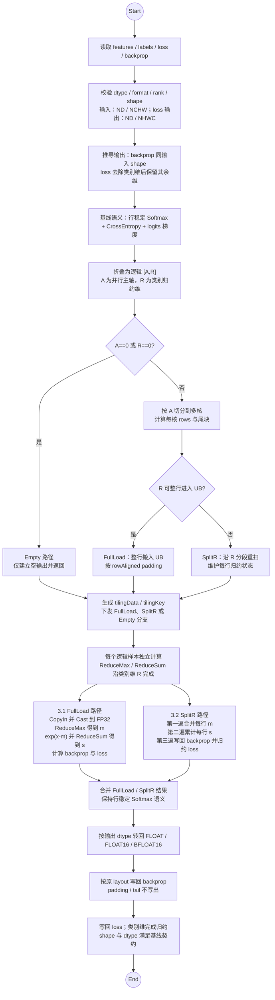
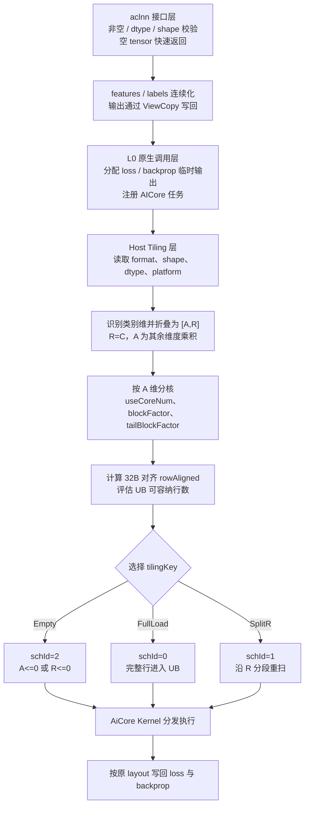
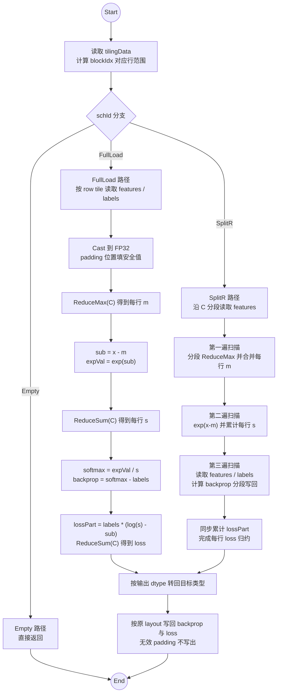

# SoftmaxCrossEntropyWithLogits算子设计文档

## 一、需求背景

### 1.1 需求来源

社区任务 `03-8` 要求参考内置 `TBE SoftmaxCrossEntropyWithLogits`，在昇腾 NPU 上完成 `SoftmaxCrossEntropyWithLogits` 算子的 Ascend C 设计、开发与测试交付。

### 1.2 背景介绍

#### 1.2.1 算子目标

`SoftmaxCrossEntropyWithLogits` 用于分类训练场景。输入 `features` 表示 logits，输入 `labels` 表示标签分布，算子输出每个样本的交叉熵损失 `loss`，同时输出对 logits 的梯度 `backprop`。

本次设计目标如下：

1. 功能语义与任务环境中的内置 `TBE SoftmaxCrossEntropyWithLogits` 对齐。
2. 交付 Ascend C 原生算子工程，包含 Host 定义、InferShape、Tiling、AiCore Kernel、`aclnn` 两段式接口、样例与测试框架。
3. 面向 Atlas A2 训练系列产品，支持 `FLOAT`、`FLOAT16`、`BFLOAT16` 三类浮点输入输出。
4. 按任务环境内置 TBE 基线实现 `ND` 二维输入和 `NCHW` 四维输入支持，`features` 与 `labels` 同 shape、同 dtype，`backprop` 与输入同 shape，`loss` 在类别维归约后按 TBE 输出 format 写回。
5. 对 TBE 配置中的 dtype、format、rank 和 shape 推导规则进行设计对齐，不把任务书明确排除的数据类型和输入广播纳入设计承诺。

#### 1.2.2 TBE基线来源说明

内置 TBE 算子是本任务的功能、精度与性能对齐基线。基线信息需要在任务 CANN 环境中从以下位置确认：

| 基线层次 | 直接路径 | 关键文件 / 内容 | 作用 |
| --- | --- | --- | --- |
| TBE Kernel 实现层 | `/usr/local/Ascend/ascend-toolkit/latest/opp/built-in/op_impl/ai_core/tbe/impl/dynamic/` | `softmax_cross_entropy_with_logits` 相关实现 | 核对 TBE 的核心计算语义与调度方式 |
| 算子原型层 | `/usr/local/Ascend/ascend-toolkit/latest/opp/built-in/op_proto/inc/` | `SoftmaxCrossEntropyWithLogits` 原型声明 | 核对输入、输出、dtype、format 和 shape 推导 |
| 算子信息库层 | `/usr/local/Ascend/ascend-toolkit/latest/opp/built-in/op_impl/ai_core/tbe/config/ascend910b/` | `SoftmaxCrossEntropyWithLogits` 配置条目 | 核对 Atlas A2 / `ascend910b` 上的注册与编译配置 |

本工作区已在 CANN 8.5.2、910B3 容器中完成基线探测。探测结论为：任务环境内置 TBE 的 `op_proto/inc/nn_norm_ops.h` 中保留 `ND or NHWC`、`2D/4D` 等原型描述；`op_impl/ai_core/tbe/config/ascend910b/aic-ascend910b-ops-info-legacy.json` 中 `features/labels/backprop` 的 format 为 `NCHW,ND`，`loss` 的 format 为 `NHWC,ND`；`op_impl/ai_core/tbe/kernel/config/ascend910b/ops_legacy/softmax_cross_entropy_with_logits.json` 的动态 kernel 配置列出 `FLOAT`、`FLOAT16`、`BFLOAT16` 的 `ND` 格式，`aclnnop/aclnn_softmax_cross_entropy_with_logits.h` 声明 aclnn 入参与出参数据格式支持 `ND`。本设计按 TBE 口径支持 `FLOAT`、`FLOAT16`、`BFLOAT16`，输入支持二维 `ND` 和四维 `NCHW` 同形输入，`loss` 输出支持 `ND/NHWC`，`backprop` 输出支持 `ND/NCHW`；任务书明确排除 `int64`、`double` 与 broadcast，因此这三类能力不纳入本次设计。

#### 1.2.3 TBE算子现状分析

##### 1.2.3.1 支持的数据类型、数据格式与形状

本次 Ascend C 设计范围如下：

| 参数 | 输入/输出 | 数据类型 | format | shape |
| --- | --- | --- | --- | --- |
| `features` | 输入 | `FLOAT`、`FLOAT16`、`BFLOAT16` | `ND/NCHW` | `ND: [N, C]`；`NCHW: [N, C, H, W]` |
| `labels` | 输入 | 与 `features` 一致 | 与 `features` 一致 | 与 `features` 同 shape |
| `loss` | 输出 | 与 `features` 一致 | 与 TBE 输出 format 对齐 | `ND: [N]`；`NCHW: [N, H, W]` |
| `backprop` | 输出 | 与 `features` 一致 | 与 `features` 一致 | 与 `features` 同 shape |

其中 `N` 表示 batch 数量，`C` 表示类别数量，`H/W` 表示四维布局下的空间维。`features` 与 `labels` 必须同 shape、同 dtype、同 format；`loss` 和 `backprop` 的 dtype 必须与 `features` 一致。

格式边界说明如下：

| 来源 | 数据类型与格式口径 | 本设计处理 |
| --- | --- | --- |
| 任务书 | 要求对齐原 TBE 数据类型、数据格式；明确排除 `int64`、`double` 与 broadcast | 保留浮点 `FLOAT/FLOAT16/BFLOAT16`，不支持 broadcast、整数和双精度 |
| TBE proto | 历史原型文字包含 `ND or NHWC`、`2D/4D`，并保留 broadcast 描述 | 作为原 TBE 背景记录；其中 broadcast 已被任务书排除 |
| `ascend910b` ops-info | `features/labels/backprop` 为 `NCHW/ND`，`loss` 为 `NHWC/ND` | 输入按 `ND/NCHW` 支持；`loss` 输出 format 按 `ND/NHWC` 对齐 |
| `ascend910b` kernel config 与 aclnn 头文件 | 动态 kernel 配置与 aclnn 头文件列出 `ND` | 作为二维 aclnn 直调路径的基线口径 |

关于审核反馈中的 `NCHW`：CANN 8.5.2 的 `ascend910b` ops-info 中 `features/labels` 输入为 `NCHW/ND`，`backprop` 输出为 `NCHW/ND`，`loss` 输出为 `NHWC/ND`；原型说明中四维输入对应 `loss` 为 3D。因此本设计按 TBE 口径处理四维 layout：输入不声明 `NHWC` 支持；`ND` 使用最后一维为类别维，`NCHW` 使用第 1 维为类别维；`backprop` 与输入同 shape；`loss` 去除类别维后保留其余维度，`NCHW [N,C,H,W]` 对应 `loss [N,H,W]`，输出 format 与 TBE 的 `NHWC/ND` 元数据对齐。Kernel 侧统一折叠为逻辑 `[A, R]` 计算域，其中 `R=C` 为类别归约维，`A` 为其余维度乘积。

本任务不支持整数输入、不支持双精度输入、不支持 `features` 与 `labels` 间的 shape 扩展或广播。

##### 1.2.3.2 算子数学语义

设输入 `features` 和 `labels` 按 format 折叠为逻辑二维计算域 `[A, R]`，其中 `R=C` 为类别归约维，`A` 为 batch 与非类别维乘积。对第 `a` 个逻辑样本，先求类别维最大值：

$$
m_a = \max_{0 \le r < R} x_{a,r}.
$$

使用稳定 softmax 形式计算指数和：

$$
s_a = \sum_{r=0}^{R-1}\exp(x_{a,r} - m_a).
$$

softmax 概率为：

$$
p_{a,r} = \frac{\exp(x_{a,r} - m_a)}{s_a}.
$$

`loss` 输出为：

$$
\text{loss}_a = -\sum_{r=0}^{R-1} y_{a,r}\log(p_{a,r}).
$$

Kernel 中使用等价形式避免直接计算 `log(softmax)`：

$$
\text{loss}_a =
\sum_{r=0}^{R-1}
y_{a,r}\left(\log(s_a) - (x_{a,r} - m_a)\right).
$$

`backprop` 输出为：

$$
\text{backprop}_{a,r} = p_{a,r} - y_{a,r}.
$$

##### 1.2.3.3 TBE算子计算语义分析

TBE / 参考实现的核心调度抽象是把输出 `backprop` 的有效计算域折叠为 `[A, R]`，其中 `R` 是类别归约维，`A` 是其余维度乘积。二维 `ND [N, C]` 场景下即 `A=N`、`R=C`；四维 `NCHW [N, C, H, W]` 场景下即 `A=N*H*W`、`R=C`。本设计沿用该 `[A, R]` 抽象，Host 侧负责根据 format 做逻辑维度折叠和输出 shape 推导。

该算子的计算可以拆为三类操作：

1. 沿类别维 `C` 做 `ReduceMax`，得到稳定 softmax 所需的行最大值。
2. 沿类别维 `C` 做 `ReduceSum`，得到指数和以及 loss 归约结果。
3. 对逻辑 `[A, R]` 元素做逐元素指数、除法、乘法和减法，按原 layout 写回 `backprop`，并对每个逻辑样本写回 `loss`。

由于不同逻辑样本之间没有数据依赖，分核主轴选取 `A` 维。类别维 `R` 决定 UB 组织方式：`R` 可完整进入 UB 时使用 FullLoad；`R` 较大时使用 SplitR 分段重扫。

TBE 基线流程图如下：




## 二、需求分析

### 2.1 外部组件依赖

不引入新的第三方组件，复用开源算子仓已有能力：

| 组件 | 用途 |
| --- | --- |
| `aclnn` 两段式接口 | 提供 `GetWorkspaceSize` 和执行接口 |
| `opdev` / `l0op` 框架 | 完成参数校验、执行器创建、临时 tensor 分配和 AICore launcher 注册 |
| Host tiling 框架 | 读取 shape、dtype 和平台信息，生成 `TilingData` 与 `tilingKey` |
| Ascend C Kernel | 在 AiCore 上完成归约、指数、对数、逐元素梯度和写回 |
| 社区任务构建框架 | 支持 `ascend910b` 独立算子构建、UT、样例和 runtime 对比 |

### 2.2 内部适配模块

代码交付采用社区任务独立算子工程组织，设计文档、接口文档、Host、Kernel、样例和测试脚本在同一提交目录内保持可追溯关系。当前工程目录职责如下：

| 模块 | 对应文件 / 目录 | 设计职责 |
| --- | --- | --- |
| 构建入口 | `CMakeLists.txt`、`build.sh` | 支持 `ascend910b` 独立算子构建、清理、UT 和 runtime 测试入口 |
| aclnn 文档 | `docs/aclnnSoftmaxCrossEntropyWithLogits.md` | 描述两段式接口、参数、返回值和调用示例 |
| aclnn 接口层 | `op_api/aclnn_softmax_cross_entropy_with_logits.cpp` | 参数校验、空 tensor 快速返回、连续化、执行器组装、输出 view copy |
| L0 原生调用层 | `op_api/softmax_cross_entropy_with_logits.cpp` | 分配 `loss/backprop` 临时输出并注册 AICore 任务 |
| Host 定义 | `op_host/softmax_cross_entropy_with_logits_def.cpp` | dtype、format、AICore 配置和 `ascend910b` 注册 |
| Shape 推导 | `op_host/softmax_cross_entropy_with_logits_infershape.cpp` | 根据 `ND/NCHW` 输入推导 `loss` 与 `backprop` shape |
| Tiling | `op_host/softmax_cross_entropy_with_logits_tiling.cpp` | format 解析、逻辑 `[A,R]` 折叠、分核、UB 规划、FullLoad / SplitR / Empty 分支选择 |
| Kernel 入口 | `op_kernel/softmax_cross_entropy_with_logits_apt.cpp` | 根据 `tilingKey` 分发 FullLoad、SplitR 或 Empty 执行路径 |
| TilingData | `op_kernel/softmax_cross_entropy_with_logits_tiling_data.h` | Host 到 Kernel 的参数结构 |
| TilingKey | `op_kernel/softmax_cross_entropy_with_logits_tiling_key.h` | 模板 tiling key 声明与选择 |
| 测试框架 | `tests/ut`、`tests/runtime`、`examples` | Host UT、aclnn 调用样例、custom/TBE runtime 对比脚本 |

### 2.3 需求模块设计

#### 2.3.1 Ascend C算子原型

原生算子输入输出契约：

| 名称 | 类别 | 数据类型 | format | shape |
| --- | --- | --- | --- | --- |
| `features` | 输入 | `FLOAT`、`FLOAT16`、`BFLOAT16` | `ND/NCHW` | `ND: [N,C]`；`NCHW: [N,C,H,W]` |
| `labels` | 输入 | 与 `features` 一致 | 与 `features` 一致 | 与 `features` 同 shape |
| `loss` | 输出 | 与 `features` 一致 | 与 TBE 输出 format 对齐 | `ND: [N]`；`NCHW: [N,H,W]` |
| `backprop` | 输出 | 与 `features` 一致 | 与 `features` 一致 | 与 `features` 同 shape |

`aclnn` 两段式接口如下：

```cpp
aclnnStatus aclnnSoftmaxCrossEntropyWithLogitsGetWorkspaceSize(
    const aclTensor* features,
    aclTensor* labels,
    aclTensor* loss,
    aclTensor* backprop,
    uint64_t* workspaceSize,
    aclOpExecutor** executor);

aclnnStatus aclnnSoftmaxCrossEntropyWithLogits(
    void* workspace,
    uint64_t workspaceSize,
    aclOpExecutor* executor,
    const aclrtStream stream);
```

#### 2.3.2 设计范围与约束

| 类别 | 约束项 | 约束内容 |
| --- | --- | --- |
| 硬件范围 | 目标产品 | Atlas A2 训练系列产品 |
| SoC 配置 | 单算子工程 | 默认 `ascend910b` |
| 数据类型 | 输入输出 | `FLOAT`、`FLOAT16`、`BFLOAT16` |
| 数据格式 | 输入输出 | 输入 `ND/NCHW`；`loss` 输出 `ND/NHWC`；`backprop` 输出 `ND/NCHW` |
| rank | 支持范围 | `ND` 二维，`NCHW` 四维 |
| shape | 输入关系 | `features` 与 `labels` 同 shape |
| shape | 输出关系 | `backprop` 与输入同 shape；`loss` 去除类别维后保留其余维，二维 `ND` 输出为 `[N]` |
| dtype | 输入关系 | `features` 与 `labels` 同 dtype |
| dtype | 输出关系 | `loss`、`backprop` 与 `features` 同 dtype |
| 非连续 tensor | 接口层 | 进入原生算子前连续化，输出通过 `ViewCopy` 写回 |
| 空 tensor | 接口层 / Host | 接口层快速返回，Host/Kernel 保留 Empty 分支 |
| 不支持范围 | 数据类型 | 不支持任务范围外的数据类型 |
| 不支持范围 | 输入关系 | 不支持 `features` 与 `labels` 间的 shape 扩展或 broadcast |

## 三、需求详细设计

### 3.1 使能方式

本设计面向 Ascend C 原生算子工程与 `aclnn` 两段式接口调用场景，硬件范围为 Atlas A2 训练系列产品。

| 上层调用 / 工具链 | 状态 |
| --- | --- |
| `aclnn` 直调 | 支持 |
| TensorFlow / PyTorch 前端适配 | 不作为本任务核心交付 |
| ATC 推理 | 不作为本任务核心交付 |
| OPAT 调优 | 不作为本任务核心交付 |

### 3.2 需求总体设计

整体链路分为四层：

1. `aclnn` 接口层：完成非空校验、dtype 校验、shape 校验、空 tensor 快速返回、输入连续化与输出 `ViewCopy`。
2. L0 原生调用层：根据 `features` shape 分配 `loss` 和 `backprop` 临时 tensor，并把 AICore 算子加入执行器。
3. Host Tiling 层：读取 dtype、format、shape 与平台信息，根据 layout 确定逻辑 `A` 和 `R=C`，完成按逻辑样本分核、UB 规划和 `tilingKey` 选择。
4. AiCore Kernel 层：按 `tilingKey` 进入 FullLoad、SplitR 或 Empty 分支，完成稳定 softmax cross entropy 计算并写回。

Host-Tiling-Kernel 策略图如下：




#### 3.2.1 Host侧设计

##### 3.2.1.1 接口校验与规整策略

`aclnn` 接口层校验顺序如下：

1. `features`、`labels`、`loss`、`backprop` 非空。
2. 四个 tensor 的 dtype 均属于支持列表。
3. `labels`、`loss`、`backprop` 的 dtype 与 `features` 一致。
4. `features` 与 `labels` format 为 `ND` 或 `NCHW`。
5. `features` 与 `labels` shape 完全一致。
6. `ND` 输入要求 rank 为 2；`NCHW` 输入要求 rank 为 4。
7. `loss` shape 满足 TBE 类别维归约规则：二维 `ND` 为 `[N]`，四维 `NCHW` 为 `[N,H,W]`。
8. `backprop` shape 与 `features` 完全一致。

合法输入进入计算前，接口层执行：

1. 若 `features` 或 `labels` 为空，返回空执行器。
2. 对 `features` 和 `labels` 执行 `Contiguous`，保证原生 Kernel 面向连续存储。
3. L0 层分配连续临时输出。
4. 原生算子完成计算后，通过 `ViewCopy` 写回用户传入的 `loss` 和 `backprop`。

##### 3.2.1.2 Shape推导策略

设输入 format 为 `ND` 时：

$$
\text{features.shape} = \text{labels.shape} = [N, C].
$$

则输出 shape 为：

$$
\text{loss.shape} = [N],
$$

$$
\text{backprop.shape} = [N, C].
$$

设输入 format 为 `NCHW` 时：

$$
\text{features.shape} = \text{labels.shape} = [N, C, H, W].
$$

则 `backprop` 与输入同 shape，`loss` 按类别维归约规则去除 `C` 维并保留 `N/H/W`：

$$
\text{backprop.shape} = [N, C, H, W],\quad
\text{loss.shape} = [N, H, W].
$$

对于四维 layout，`loss` 的输出 format 与 shape 推导同时对齐 TBE 元数据和原型契约：输入为 `NCHW`，`loss` 输出 format 为 `NHWC`，逻辑上保留 batch 与非类别维，去除类别维；`backprop` 始终与输入同 shape。以 `NCHW [2,3,4,5]` 为例，按 TBE 四维 `loss` 为 3D 的约定，归约类别维后得到逻辑 loss 形状 `[2,4,5]`。Kernel 内部可用 `[N,1,H,W]` 形式保存行归约结果以便广播，但对外输出 shape 按 `[N,H,W]` 校验与写回。

Shape 推导要求 `features` 与 `labels` 同 shape，不做 shape 扩展或 broadcast。

##### 3.2.1.3 分核策略

Host tiling 将输入按 format 折叠为逻辑二维计算域：

$$
\text{ND}: A=N,\quad R=C.
$$

$$
\text{NCHW}: A=N\cdot H\cdot W,\quad R=C.
$$

其中 `A` 是逻辑样本数，是多核并行主轴；`R` 是类别维，是每个逻辑样本的归约维。由于逻辑样本之间互不依赖，分核只按 `A` 维进行。

设可用 AIV 核数为 `coreNum`：

$$
\text{useCoreNum} = \min(A, \text{coreNum}).
$$

每核基础行数：

$$
\text{blockFactor} =
\left\lceil
\frac{A}{\text{useCoreNum}}
\right\rceil.
$$

实际使用核数：

$$
\text{realCoreNum} =
\left\lceil
\frac{A}{\text{blockFactor}}
\right\rceil.
$$

尾核行数：

$$
\text{tailBlockFactor} =
A - \text{blockFactor}\cdot(\text{realCoreNum}-1).
$$

Kernel 侧根据 `blockIdx` 计算本核起始行，普通核处理 `blockFactor` 行，尾核处理 `tailBlockFactor` 行。

##### 3.2.1.4 UB分块策略

设输入类型字节数为：

$$
b =
\begin{cases}
4, & \text{FLOAT}, \\
2, & \text{FLOAT16 或 BFLOAT16}.
\end{cases}
$$

`32B` 对齐下单个 block 能容纳的元素数为：

$$
\text{perBlock} = \frac{32}{b}.
$$

类别维对齐长度为：

$$
R_{\text{align}} =
\left\lceil
\frac{R}{\text{perBlock}}
\right\rceil
\cdot \text{perBlock}.
$$

FullLoad 路径要求单行完整 `Ralign` 能在 UB 中同时容纳输入队列、输出队列和 float32 中间缓冲。估算可容纳行数：

$$
A_{\text{ub}} =
\left\lfloor
\frac{UB}{M_{AR}+M_A}
\right\rfloor.
$$

其中 `MAR` 表示按 `[A, R]` 组织的输入、输出和中间缓冲开销，`MA` 表示行级归约结果开销。当 `Aub` 至少能覆盖一个 `32B` 对齐粒度时，选择 FullLoad。

若 FullLoad 不满足 UB 容量要求，则进入 SplitR。SplitR 固定按较小的 `A` tile 处理行，剩余 UB 用于分段容纳类别维：

$$
\text{rLoopTime} =
\left\lceil
\frac{R}{\text{rUbNumFactor}}
\right\rceil.
$$

尾段有效长度为：

$$
\text{rLoopTile} =
\begin{cases}
\text{rUbNumFactor}, & R \bmod \text{rUbNumFactor} = 0,\\
R \bmod \text{rUbNumFactor}, & \text{otherwise}.
\end{cases}
$$

##### 3.2.1.5 tilingKey规划策略

`tilingKey` 由模板参数组成：

```text
schId, featuresBrc, labelsBrc, db
```

本设计不支持 `features` 与 `labels` 间的 shape 扩展或 broadcast，因此 `featuresBrc` 和 `labelsBrc` 固定使用非扩展路径；`db` 暂保留模板位。format 信息由 Host 侧转换为类别维位置、逻辑 `A/R`、GM stride 和输出 shape 参数写入 tilingData。

| schId | 分支 | 触发条件 | 作用 |
| --- | --- | --- | --- |
| `0` | FullLoad | `R` 维可完整装入 UB | 单行完整进入 UB 后完成 max、sum、loss、backprop |
| `1` | SplitR | FullLoad 容量不足 | 分段重扫 `R` 维，先保证大 `C` 泛化能力 |
| `2` | Empty | `A<=0` 或 `R<=0` | 空输入路径快速返回 |

Host 写入 `SoftmaxCrossEntropyWithLogitsTilingData` 后执行：

```text
SetBlockDim(realCoreNum)
```

Kernel 侧根据 `blockIdx` 处理本核负责的行块，行间互不依赖，`loss` 与 `backprop` 均由负责对应行的核直接写回。

#### 3.2.2 Kernel侧设计

##### 3.2.2.1 Kernel入口

Kernel 入口读取 `SoftmaxCrossEntropyWithLogitsTilingData`，根据 `schId` 分发：

| Kernel 分支 | 对应 schId | 设计职责 |
| --- | --- | --- |
| FullLoad | `0` | 中小 `R` 场景，完整逻辑行进入 UB 后计算；其中 `C==1`、大 `A` 小 `C` 和非对齐 `C` 有专用子路径 |
| SplitR | `1` | 大 `R` 场景，分段扫描并重算输出 |
| Empty | `2` | 空输入或 `R==0` 边界场景 |

Kernel 计算流程图如下：




##### 3.2.2.2 FullLoad路径

FullLoad 每次处理若干行和完整 `R` 维。单行处理流程如下：

1. 从 GM 读取当前行 `features` 与 `labels`。
2. 将输入转为 float32 中间值。
3. 执行 `ReduceMax` 得到 `m_n`。
4. 计算 `z = features - m_n`。
5. 计算 `exp(z)`。
6. 执行 `ReduceSum` 得到 `s_n`。
7. 计算 `backprop = exp(z) / s_n - labels` 并写回。
8. 计算 `lossPart = labels * (log(s_n) - z)`。
9. 对 `lossPart` 做 `ReduceSum` 得到 `loss[n]` 并写回。

该路径每行只读取一次 `features` 和一次 `labels`，中间数据保留在 UB 内，是当前主要性能路径。

针对常见小类别数场景，FullLoad 内部进一步细分：

1. `C==1` 时 softmax 恒为 `1`，直接计算 `backprop = 1 - labels`，`loss = 0`，避免指数、对数和归约。
2. 大 `N` 小 `C` 场景按行块处理，并对 `C=2/3/4/5/8` 等形状使用列紧凑和行级标量复用子路径，减少通用 `Reduce` 和行级结果展开的固定开销。
3. `C` 非 `32B` 对齐时 Host 记录有效列数，Kernel 右侧 padding 只参与 UB 对齐，不写回无效列，保证 `backprop` 按原 shape 输出不越界。

##### 3.2.2.3 SplitR路径

SplitR 面向 `R` 维较大、完整行无法同时容纳输入和多个 float32 中间缓冲的场景。该路径使用三阶段分段重扫：

1. 第一轮按 `R` 分段读取 `features`，对每段做局部 `ReduceMax`，归并为全行最大值 `m_n`。
2. 第二轮按 `R` 分段读取 `features`，计算 `exp(features - m_n)` 并累加全行指数和 `s_n`。
3. 第三轮按 `R` 分段读取 `features` 与 `labels`，计算并写回 `backprop`，同时累加各段 loss 贡献，最后写回 `loss[n]`。

该路径面向大类别维输入的泛化执行能力设计。相比 FullLoad，它增加了 GM 读取次数，性能需要在 runtime 对比中单独评估。

##### 3.2.2.4 精度策略

精度设计如下：

1. `FLOAT` 输入以 float32 参与中间计算。
2. `FLOAT16` 和 `BFLOAT16` 输入读取后转换为 float32，完成 `max`、`exp`、`sum`、`log`、乘法和减法。
3. 输出 dtype 与输入 dtype 一致，写回前转换回对应类型。
4. 使用 `log(sum) - (features - max)` 计算 loss，避免直接计算 `log(softmax)`。
5. FullLoad 与 SplitR 使用相同数学公式，SplitR 的分段累加误差按 AscendOpTest 默认阈值验证。

##### 3.2.2.5 Ascend C路径与TBE路径的差异点及原因

| 差异点 | Ascend C设计选择 | 原因 |
| --- | --- | --- |
| 分核主轴 | 按逻辑 `A` 维分核 | 每个逻辑样本互不依赖，按样本切分同步开销最低 |
| UB 组织 | FullLoad 与 SplitR 两条路径 | `C` 维大小直接决定完整行能否进入 UB |
| 中间精度 | 半精度输入统一转 float32 中间计算 | softmax cross entropy 对指数和对数敏感 |
| loss 公式 | 使用 `log(sum) - (x - max)` | 提升数值稳定性 |
| 非连续输入 | `aclnn` 层连续化后进入原生 Kernel | Kernel 聚焦连续存储和显式 layout stride |
| 平台实现 | 面向 Atlas A2 / 910B 目标环境实现 | 任务范围为 Atlas A2 / 910B |

## 四、特性交叉分析

| 交叉维度 | 设计关注点 | 应对策略 |
| --- | --- | --- |
| dtype × 中间精度 | 半精度直接执行指数和对数会放大误差 | 统一使用 float32 中间计算，写回时转换 |
| 小 `A` × 小 `C` | 启动开销占比较高 | 使用 FullLoad，按任务小 shape 例外条款分析性能 |
| 大 `A` × 多核 | 逻辑样本间无依赖 | 按 `A` 维分核，提高多核覆盖 |
| 大 `A` × 小 `C` | 通用 Reduce 和行级结果展开固定开销占比高 | 使用行块专用路径和小 `C` 子路径降低无效搬运和重复展开 |
| 大 `C` × UB 容量 | 完整行无法进入 UB | 使用 SplitR 三阶段分段重扫 |
| 非 32B 对齐 `C` | 搬运和向量计算存在尾段 | Host 生成对齐 tiling，Kernel 写回只处理有效元素 |
| 空 tensor × 普通分核 | `A==0` 或 `R==0` 会导致分核公式失效 | 接口层快速返回，Host/Kernel 保留 Empty 分支 |
| format × 类别维位置 | `ND` 类别维在最后一维，`NCHW` 类别维在第 1 维；四维 `loss` 输出 format 对齐 TBE `NHWC` 元数据 | Host 侧统一折叠为 `[A,R]` 并下发 stride 参数 |
| 非连续输入 × 连续 Kernel | view stride 与 Kernel 连续假设不一致 | `aclnn` 层执行 `Contiguous` 与 `ViewCopy` |
| shape 扩展 × Shape 推导 | 输入关系超出任务书要求 | 要求 `features` 与 `labels` 完全同形，不支持 broadcast |

## 五、可维可测分析

### 5.1 验收标准与验证口径

| 验收项 | 硬门槛 | 目标值 / 说明 |
| --- | --- | --- |
| 功能标准 | 与任务环境内置 TBE 功能一致 | 合法输入下 `aclnn` 两段式接口可正常执行 |
| 精度标准 | 满足 AscendOpTest 默认阈值 | 半精度和 BF16 使用默认容差评估 |
| 性能标准 | 所有核参与场景性能不低于 TBE 95% | 以任务环境 TBE 计时为基线 |
| 小 shape 例外 | 10 us 以下场景若差距不超过 3 us，可按任务书例外条款说明 | 需要保留仿真或性能分析材料 |
| 泛化标准 | 覆盖常规、边界、不同 `C` 规模和 `ND/NCHW` 输入 format 场景 | FullLoad 为性能主路径，SplitR 为大 `C` 兜底路径 |
| 文档标准 | README、aclnn 文档、设计文档口径一致 | 不声明任务范围外能力 |

### 5.2 验证矩阵

| 验证项 | 典型场景 | 验证方式 / 产出 |
| --- | --- | --- |
| dtype 覆盖 | `FLOAT`、`FLOAT16`、`BFLOAT16` | 与 TBE / golden 对比 `loss` 和 `backprop` |
| format 覆盖 | 输入 `ND [N,C]`、`NCHW [N,C,H,W]`；输出 `loss` 覆盖 `ND/NHWC` | 覆盖类别维位置、loss shape 和 backprop layout |
| 小 shape | `[1,1]`、`[1,7]`、`[7,1]`、`[1,16]` | 正确性、耗时和小 shape 差值记录 |
| 常规 shape | `[16,16]`、`[64,128]`、`[256,257]` | 正确性和性能对比 |
| 四维 shape | `NCHW [2,3,4,5]` | 验证类别维归约后的 `loss` shape 和与输入同 shape 的 `backprop` |
| 大 `C` | `[8,2048]`、`[16,4096]` 或按 TBE 支持范围选择 | 覆盖 SplitR 路径 |
| 大 `A` | `[1024,64]`、`[4096,32]`、`NCHW [64,16,8,8]` | 覆盖多核分核 |
| 非对齐 `C` | `[17,255]`、`[21,257]` | 覆盖尾段和 `32B` 对齐 |
| 空 tensor | `[0,C]`、`[N,0]` | 验证空路径与 TBE 行为一致 |
| 非连续输入 | 切片或转置后的 view | 验证 `Contiguous + ViewCopy` 语义 |
| 非法输入 | dtype 不一致、shape 不一致、非支持 rank/format、broadcast 输入 | 验证错误码和快速失败路径 |

当前交付目录保留 Host UT 与 runtime custom/TBE 对比入口。Host UT 覆盖 InferShape、Tiling 和基础错误路径；runtime 用例覆盖 dtype、输入 format、常规 shape、小 shape、四维 shape、非对齐 `C`、多核 `A`、大 `C`、空 tensor、非连续输入和非法输入等场景，用于验证 `loss` 与 `backprop` 的正确性、精度和性能表现。

### 5.3 兼容性分析

本设计的兼容性结论如下：

1. `SoftmaxCrossEntropyWithLogits` 的正式语义与任务环境内置 TBE 保持一致，输入 `features` 与 `labels` 同 shape、同 dtype、同 format，`backprop` 与输入同 shape，`loss` 为类别维归约后的 shape。
2. 支持 `FLOAT`、`FLOAT16`、`BFLOAT16` 三类任务范围内 dtype；输入支持 `ND` 二维 `[N,C]` 与 `NCHW` 四维 layout，`loss` 输出 format 按 TBE 对齐 `ND/NHWC`。
3. `aclnn` 接口层兼容非连续输入的逻辑 view 语义，进入原生 Kernel 前完成连续化，输出通过 ViewCopy 写回。
4. 兼容空 tensor、小 shape、非对齐 `C`、多核 `A`、四维 layout 和大 `C` 输入，分别由接口快速返回、FullLoad、小 `C` 专用路径、layout stride 和 SplitR 路径覆盖。
5. 任务范围外 dtype、rank 和 shape 关系由接口与 Host 侧校验拒绝，不进入 Kernel 主执行路径。
