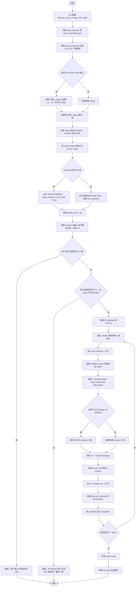
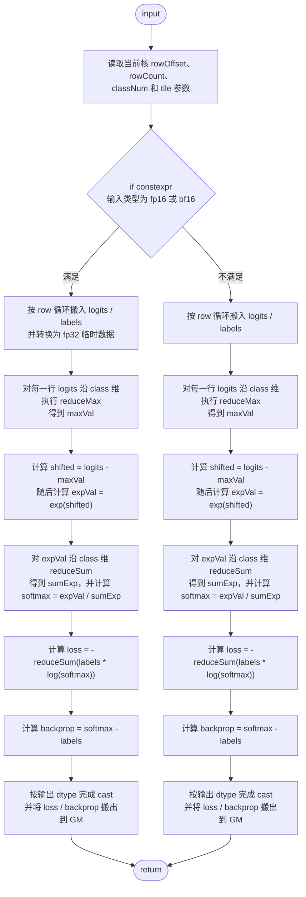

# SoftmaxCrossEntropyWithLogits 算子设计方案

适配硬件：Atlas A2 训练系列产品  
开发语言：Ascend C  
CANN 版本：算子开源仓指定版本

## 1 需求背景（required）

### 1.1 需求来源

本需求来源于昇腾算子开源仓 `experimental/activation` 目录下的社区算子开发任务。任务要求参考昇腾 CANN 内置 `SoftmaxCrossEntropyWithLogits` 算子的 TBE 实现，在昇腾 NPU 上使用 Ascend C 重新实现功能一致的算子，并完成设计、开发、测试、自验证与 PR 合入全流程。

任务交付需包含算子工程代码、README、多组 aclnn 调用测试代码、测试用例文档、自验证报告以及通过评审的算子设计文档。

### 1.2 背景介绍

#### 1.2.1 SoftmaxCrossEntropyWithLogits 算子实现优化

`SoftmaxCrossEntropyWithLogits` 是训练场景中常用的分类损失算子，通常用于将未归一化的 `logits` 与标签 `labels` 计算交叉熵损失，并同时给出对 `logits` 的反向梯度。

本次开发基于历史 TBE 版本功能，使用 Ascend C 进行实现优化，目标是在 Atlas A2 训练系列产品上实现与 TBE 算子核心功能、数据类型、数据格式和精度表现一致的算子能力。

`SoftmaxCrossEntropyWithLogits` 算子 TBE 参考路径如下：

- kernel 实现：`/usr/local/Ascend/ascend-toolkit/latest/opp/built-in/op_impl/ai_core/tbe/impl/dynamic/`
- 算子原型：`/usr/local/Ascend/ascend-toolkit/latest/opp/built-in/op_proto/inc/`
- 算子信息库：`/usr/local/Ascend/ascend-toolkit/latest/opp/built-in/op_impl/ai_core/tbe/config/ascend910b`

#### 1.2.2 SoftmaxCrossEntropyWithLogits 算子现状分析

通过对 `SoftmaxCrossEntropyWithLogits` 算子的功能分析，当前算子需要支持如下核心能力：

1. 输入 `logits` 表示未归一化分类得分，`labels` 表示与 `logits` 同形状的标签分布或 one-hot 标签；沿最后一维 class 维度计算 softmax 与交叉熵。
2. 输出 `loss` 的 shape 为 `logits` 去除最后一维后的形状；输出 `backprop` 与 `logits`、`labels` 保持相同 shape，用于训练反向传播。
3. 暂无需支持 `int64`、`double` 数据类型，暂无需支持广播操作；输入 `logits` 与 `labels` 需保持 shape 一致。需实现泛化能力，支持多维 ND 输入，在验收阶段可覆盖不同 batch 维度、不同 class 维度以及常规/边界 shape。
4. 数值计算需采用稳定 softmax 方式，即先做 `reduce_max`，再计算 `exp(logits - max)`，避免指数溢出。

核心数学表达如下，其中 `c` 表示最后一维类别下标：

$$
\text{softmax}_{i,c} = \frac{\exp\left(\text{logits}_{i,c} - \max_{c}\,\text{logits}_{i,c}\right)}{\sum_{c} \exp\left(\text{logits}_{i,c} - \max_{c}\,\text{logits}_{i,c}\right)}
$$

$$
\text{loss}_{i} = -\sum_{c} \text{labels}_{i,c} \cdot \log\left(\text{softmax}_{i,c}\right)
$$

$$
\text{backprop}_{i,c} = \text{softmax}_{i,c} - \text{labels}_{i,c}
$$

# SoftmaxCrossEntropyWithLogits TBE 整体入口流程图

## 2 需求分析

### 2.1 外部组件依赖

不涉及外部组件依赖。算子实现基于 Ascend C 基础 API、`TilingData`、acl/aclNN 调用框架及算子开源仓工程结构完成。

### 2.2 内部适配模块

适配 aclnn 接口和图模式调用。算子需在 host 侧完成 shape、dtype、format、tiling 参数与 workspace 推导，在 kernel 侧完成实际 AI Core 并行计算。

### 2.3 需求模块设计

#### 2.3.1 算子原型

##### 1）原型设计

| 名称 | 类别 | dtype | format | shape | 介绍 |
| --- | --- | --- | --- | --- | --- |
| logits | 输入 | fp16/fp32/bf16 | ND | all | 未归一化分类得分，最后一维为 class 维度 |
| labels | 输入 | fp16/fp32/bf16 | ND | 同 logits | 标签分布或 one-hot 标签，与 logits 同形状 |
| loss | 输出 | fp16/fp32/bf16 | ND | logits 去除最后一维 | 每条样本的交叉熵损失 |
| backprop | 输出 | fp16/fp32/bf16 | ND | 同 logits | 对 logits 的梯度，softmax - labels |

##### 2）相关约束

- 支持硬件：Atlas A2 训练系列产品。
- 支持数据类型：按任务要求对齐原 TBE 算子支持类型，暂不支持 `int64`、`double`。
- 不支持广播：`logits` 与 `labels` 的 shape 必须完全一致。
- 输入 shape 至少为 1 维；最后一维 `class_num` 应大于 0。
- 输出 `loss` 的元素个数为 `outer_num = total_length / class_num`；输出 `backprop` 的元素个数与输入一致。

## 3 需求详细设计

### 3.1 使能方式

| 上层框架 | 涉及的框架勾选 |
| --- | --- |
| TF 训练/推理 |  |
| Pytorch 训练/推理 |  |
| ATC 推理 |  |
| Aclnn 直调 | √ |
| OPAT 调优 |  |
| SGAT 子图切分 |  |

### 3.2 需求总体设计

#### 3.2.1 host 侧设计

host 侧负责完成输入合法性校验、shape 解析、tiling 参数生成、workspace 估算和 tilingkey 下发。`SoftmaxCrossEntropyWithLogits` 的计算依赖最后一维归约，因此 tiling 不能简单地只按一维连续向量切分，而需要保证同一条样本的 class 维度能够被完整归约。

**tiling 策略：**

- 读取 `logits` 与 `labels` 的 shape，校验两者维度数和各维大小完全一致。
- 获取 `class_num = shape[-1]`，`outer_num = total_length / class_num`，其中 `outer_num` 表示除最后一维外的样本数。
- 根据 dtype 长度、UB 空间、`BUFFER_NUM`、是否需要 fp32 中间缓存等因素，确定单次可处理的 class 数据长度与每核 row 数。
- 优先按 `outer_num` 维度进行分核，使不同 AI Core 处理不同样本行，减少跨核归约和同步开销。
- 当 `class_num` 可完整放入 UB 时，采用单行或多行融合处理；当 `class_num` 超过单次 UB 可容纳范围时，采用多轮 tile 的两阶段归约策略。

##### 1）分核策略

优先使用满核原则。根据 `outer_num` 和平台 AI Core 数量确定实际使用核数 `coreNum`。

- 若 `outer_num` 可被 `coreNum` 整除，则各核处理相同数量的样本行。
- 若 `outer_num` 不能被 `coreNum` 整除，则将余数样本分配给前若干个核，形成大核/小核两类任务量。
- 每个核只处理自己的样本行范围，`loss` 按 outer 维输出，`backprop` 按输入扁平地址输出。

##### 2）数据分块和内存优化策略

充分利用 UB 空间，同时预留 `logits`、`labels`、`exp`、`softmax`、临时 reduce 缓冲区。

- fp16/bf16 输入在计算关键路径中转换为 fp32，减少 softmax、log 与 reduce 造成的精度损失。
- 使用 double buffer 时，需要将单 tile 可处理元素数折半估算，避免 UB 溢出。
- 对尾行和尾块单独记录长度，保证非整除 shape 也可以正常参与计算。
- 对于 `class_num` 较小的场景，可在单核内合并多行处理，提高搬运连续性并降低 kernel 调度开销占比。

##### 3）tilingkey 规划策略

| tilingkey | 适用场景 | kernel 分支说明 |
| --- | --- | --- |
| 0 | fp32 且 class_num 可在 UB 内完成单次归约 | 直接使用 fp32 中间计算，单阶段完成 softmax、loss、backprop |
| 1 | fp16/bf16 且 class_num 可在 UB 内完成单次归约 | 输入转换为 fp32 计算，输出前按需要 cast 回目标 dtype |
| 2 | class_num 较大，单次 UB 无法容纳完整 class 维度 | 多 tile 两阶段归约：第一阶段求 max/sum，第二阶段计算 loss/backprop |

**数据检测：**

当输入 dtype、format、shape 不满足支持范围，或者 `logits` 与 `labels` shape 不一致时，host 侧返回参数错误；当 UB 空间不足以容纳最小计算切分时，返回 workspace/tiling 获取失败。

#### 3.2.2 kernel 侧设计

kernel 侧整体分为 Init 和 Process 两个阶段，其中 Process 包含 CopyIn、Compute、CopyOut 三个子阶段。

- **Init：** 根据 `tilingData` 获取当前核处理的 row 起止位置、`class_num`、tile 长度、dtype 分支、是否多阶段归约等信息，并初始化 GM/UB Tensor。
- **CopyIn：** 按当前核负责的样本行从 GM 搬入 `logits` 和 `labels`；对于 fp16/bf16 输入，搬入后在 UB 内 cast 到 fp32。
- **Compute：** 执行 `reduce_max`、`sub`、`exp`、`reduce_sum`、`div`、`log`、`mul`、`reduce_sum`、`sub` 等计算，得到 `loss` 和 `backprop`。
- **CopyOut：** 将 `loss` 写回 loss GM，将 `backprop` 写回 backprop GM；若输出 dtype 为 fp16/bf16，则在搬出前完成 cast。

Ascend C 实现流程设计如下：

多 tile 场景下，kernel 侧应避免把同一行 class 维切分到多个核上进行跨核规约；优先在单核内通过多轮 tile 完成 max 与 sumExp 两阶段计算。若后续需要进一步优化超大 class 场景，可评估 workspace 保存中间 reduce 结果或使用更细粒度的行内分块策略。

### 3.3 支持硬件

| 支持的芯片版本 | 涉及勾选 |
| --- | --- |
| 香橙派 OrangePi AIpro |  |
| Atlas 200I/500 A2 推理产品 |  |
| Atlas A2 训练系列产品 | √ |
| Atlas 800I/T A2 |  |

### 3.4 算子约束限制

1. 暂不支持广播操作，`logits` 与 `labels` 必须 shape 完全一致。
2. 暂不支持 `int64`、`double` 数据类型。
3. 输入 shape 最后一维作为 class 维度，`class_num` 必须大于 0。
4. `labels` 默认由上层框架保证为合法概率分布或 one-hot 标签；kernel 不额外校验 labels 和是否为 1。
5. 极小 shape 场景可能受 kernel 启动开销影响，若性能差异落在 10us 以下场景相差约 3us 的范围内，需要结合性能仿真图和分析结论说明。

## 4 特性交叉分析

本算子不涉及广播、稀疏、动态 shape 外部依赖、随机数、原子写等复杂特性交叉。主要交叉点为数据类型、shape 泛化、class 维度归约长度和多核切分策略。

| 交叉项 | 分析结论 | 处理策略 |
| --- | --- | --- |
| dtype × 计算精度 | fp16/bf16 直接计算 softmax 可能带来较大累计误差 | 关键中间结果采用 fp32 计算，输出前 cast |
| outer_num × coreNum | outer_num 小于核数时无法满核 | 动态调整 coreNum，避免空核无效计算 |
| class_num × UB 空间 | class_num 过大时单次 UB 无法容纳完整 class 维度 | 采用多 tile 两阶段归约策略 |
| 小 shape × 性能 | 小 shape 主要受 kernel 启动开销影响 | 保留轻量分支，减少不必要 workspace 和循环开销 |

## 5 可维可测分析

### 5.1 精度标准/性能标准

| 验收标准 | 描述（不涉及说明原因） | 标准来源 |
| --- | --- | --- |
| 精度标准 | 满足 AscendOpTest 工具默认阈值；计算结果与 TBE 版本对齐 | 任务书精度要求 |
| 性能标准 | 所有核参与计算场景下，性能不低于原 TBE 算子的 95%；整体性能与 TBE 持平 | 任务书性能要求 |
| 功能标准 | 支持指定 dtype/format/shape，泛化场景运行正常，aclnn 调用无语法和运行错误 | 任务书功能要求 |
| 测试标准 | 覆盖常规场景、边界场景、不同 dtype、不同 class 维度和泛化 shape | 任务书测试要求 |

### 5.2 自验证测试设计

自验证需参考内置 TBE 算子设计全场景用例，覆盖功能、精度、性能三个维度。建议测试用例如下：

| 类别 | 测试点 | 示例 shape | 期望结果 |
| --- | --- | --- | --- |
| 常规场景 | 二维 batch 分类 | `[32, 1000]` | loss/backprop 与标杆结果一致 |
| 多维泛化 | 高维输入，最后一维为 class | `[2, 4, 8, 128]` | 沿最后一维计算，输出 shape 正确 |
| 小 shape | 极小 batch 和 class | `[1, 2]`、`[4, 3]` | 功能正确，记录性能差异 |
| 大 class | class_num 较大 | `[8, 4096]`、`[2, 16384]` | 多 tile 归约正确 |
| dtype 覆盖 | fp16/fp32/bf16 | 同一组 shape 多 dtype | 精度满足默认阈值 |
| 异常场景 | logits/labels shape 不一致 | `[8, 10]` vs `[8, 9]` | host 侧返回参数错误 |

性能测试需与 TBE 版本在相同输入、相同硬件、相同调用方式下对比。对于所有核参与计算的场景，Ascend C 实现性能目标不低于 TBE 的 95%。对于小 shape 10us 以下场景，如果绝对差异约 3us，应补充性能仿真图、调度开销分析和流水一致性说明。

### 5.3 兼容性分析

新算子实现，不涉及历史版本兼容性分析。接口语义、输入输出数量、dtype/format 支持范围需与原 TBE 算子保持一致，以保证上层图模式和 aclnn 直调场景能够平滑替换。

## 6 交付物说明

- 昇腾开源算子仓 fork 的个人代码仓链接，包含算子工程代码、README 文档和多组 aclnn 调用测试代码。
- 测试用例文档，覆盖常规场景、边界场景、不同 dtype、不同 shape 和异常输入。
- 测试自验证报告，包含执行日志/截图、整体测试通过截图、性能数据截图。
- 通过评审的 `SoftmaxCrossEntropyWithLogits` 算子设计方案文档。
