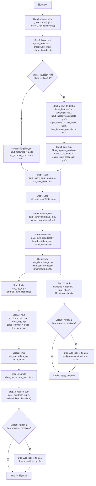
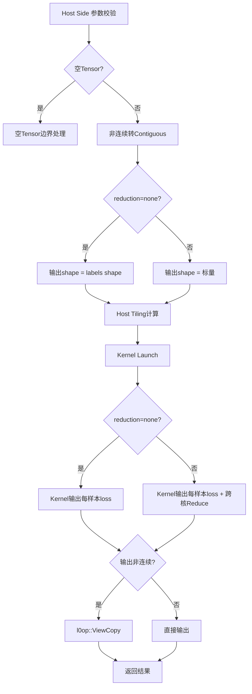
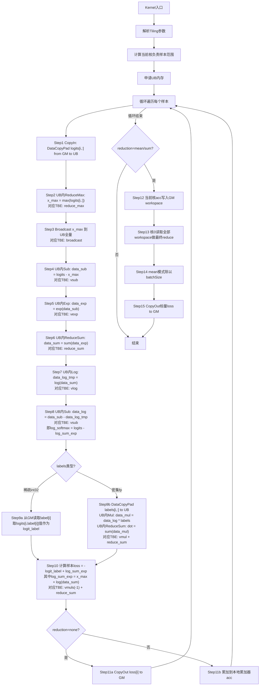

# SoftmaxCrossEntropyWithLogits算子设计方案

## 1 需求分析

### 1.1 SoftmaxCrossEntropyWithLogits算子现状分析

通过对昇腾CANN内置TBE算子的分析，当前SoftmaxCrossEntropyWithLogits算子支持的能力如下：

**当前实现分析**：

- 内置TBE算子已实现SoftmaxCrossEntropyWithLogits的完整功能，支持动态Shape
- 支持数据类型：logits为fp16/fp32/bf16；labels为int32（稀疏索引）或fp16/fp32（概率分布）
- 支持reduction属性：none/mean/sum
- 支持Atlas 800I/T A2（ascend910b）及Atlas 300I A3（ascend910_93）平台
**算子整体流程**：



### 1.2 算子原型

1) 原型设计

| 名称 | 类别 | dtype | format | shape | 介绍 |
|------|------|-------|--------|-------|------|
| logits | 输入 | fp16/fp32/bf16 | ND | [..., num_classes] | 未归一化的预测分数 |
| labels | 输入 | int32/fp16/fp32 | ND | [...] 或 [..., num_classes] | 真实标签。int32为稀疏索引；浮点为概率分布 |
| reduction | 属性 | string | - | - | 规约模式：none/mean/sum，默认none |
| loss | 输出 | 同logits | ND | 同labels（none）或标量（mean/sum） | 交叉熵损失 |

2) 相关约束

- Atlas 800I/T A2、Atlas 300I A3训练/推理产品支持fp16、fp32、bf16数据类型
- logits最后一维为num_classes，labels为稀疏索引时shape等于logits去掉最后一维
- 暂不支持广播操作、int64和double数据类型
- 空Tensor处理：reduction=none返回空Tensor；reduction=mean/sum返回标量0

### 1.2.1 SoftmaxCrossEntropyWithLogits算子实现优化

**TBE算子源码获取路径：**

| 文件类型 | 完整路径 | 说明 |
|---------|---------|------|
| aclnn接口头文件 | `/home/developer/Ascend/cann-9.0.0/aarch64-linux/include/aclnnop/aclnn_softmax_cross_entropy_with_logits.h` | 对外暴露的aclnn API |
| TBE动态调度实现 | `/home/developer/Ascend/cann-9.0.0/opp/built-in/op_impl/ai_core/tbe/impl/ops_legacy/dynamic/softmax_cross_entropy_with_logits.py` | TBE DSL动态shape实现 |
| TBE APT算子模板 | `/home/developer/Ascend/cann-9.0.0/opp/built-in/op_impl/ai_core/tbe/impl/ops_nn/ascendc/softmax_cross_entropy_with_logits/softmax_cross_entropy_with_logits_apt.cpp` | AscendC算子模板入口 |
| TBE稀疏实现 | `/home/developer/Ascend/cann-9.0.0/opp/built-in/op_impl/ai_core/tbe/impl/ops_nn/ascendc/sparse_softmax_cross_entropy_with_logits/sparse_softmax_cross_entropy_with_logits_apt.cpp` | 稀疏labels专用实现 |
| TBE tiling数据 | `/home/developer/Ascend/cann-9.0.0/opp/built-in/op_impl/ai_core/tbe/impl/ops_nn/ascendc/softmax_cross_entropy_with_logits/arch35/softmax_cross_entropy_with_logits_tiling_data.h` | tiling数据结构 |
| TBE tiling key | `/home/developer/Ascend/cann-9.0.0/opp/built-in/op_impl/ai_core/tbe/impl/ops_nn/ascendc/softmax_cross_entropy_with_logits/arch35/softmax_cross_entropy_with_logits_tiling_key.h` | tiling分派策略 |
| TBE全量加载 | `/home/developer/Ascend/cann-9.0.0/opp/built-in/op_impl/ai_core/tbe/impl/ops_nn/ascendc/softmax_cross_entropy_with_logits/arch35/softmax_cross_entropy_with_logits_full_load.h` | 全量加载kernel |
| TBE split_r | `/home/developer/Ascend/cann-9.0.0/opp/built-in/op_impl/ai_core/tbe/impl/ops_nn/ascendc/softmax_cross_entropy_with_logits/arch35/softmax_cross_entropy_with_logits_split_r.h` | 分块加载kernel |

**TBE源码实现流程详解**：

| 源码步骤 | 对应API | 说明 |
|---------|---------|------|
| `data_max = reduce_max(input_features, axis=-1)` | `tbe.reduce_max` | 对num_classes维度求最大值 |
| `data_max_broadcast = broadcast(data_max, shape_broadcast)` | `tbe.broadcast` | 将x_max广播到与logits同shape |
| `if dtype == "float16": cast_to(fp32)` | `tbe.cast_to` | **精度提升**：fp16时先将logits、labels cast到fp32 |
| `has_improve_precision = True` | - | 标记需要精度恢复 |
| `data_max_broadcast = cast_to(fp32)` | `tbe.cast_to` | max也cast到fp32，保证后续计算精度 |
| `data_sub = vsub(input_features1, data_max_broadcast)` | `tbe.vsub` | 计算 `x - x_max` |
| `data_exp = vexp(data_sub)` | `tbe.vexp` | 计算 `exp(x - x_max)` |
| `data_sum = reduce_sum(data_exp, axis=-1)` | `tbe.reduce_sum` | 计算 `sum_exp` |
| `data_sum_broadcast = broadcast(data_sum, shape_broadcast)` | `tbe.broadcast` | 广播sum_exp |
| `data_div = vdiv(data_exp, data_sum_broadcast)` | `tbe.vdiv` | 计算softmax概率 `exp / sum_exp` |
| `data_log_tmp = vlog(data_sum_broadcast)` | `tbe.vlog` | 计算 `log(sum_exp)` |
| `data_log = vsub(data_sub, data_log_tmp)` | `tbe.vsub` | 计算log_softmax：`(x-x_max) - log(sum_exp)` |
| `data_mul = vmul(data_log, input_labels)` | `tbe.vmul` | labels与log_softmax逐元素相乘 |
| `data_muls = vmuls(data_mul, -1)` | `tbe.vmuls` | 取负，得到 `-labels * log_softmax` |
| `loss = reduce_sum(data_muls, axis=-1)` | `tbe.reduce_sum` | 对num_classes维度求和得到loss |
| `backprop = vsub(data_div, input_labels1)` | `tbe.vsub` | 计算梯度 `softmax - labels` |
| `if has_improve_precision: cast_to(fp16)` | `tbe.cast_to` | **精度恢复**：loss和backprop cast回fp16 |

**aclnn接口验证：**

| 接口 | 参数 | 说明 |
|-----|------|------|
| `aclnnSoftmaxCrossEntropyWithLogits` | `(logits, labels, reduction, loss, workspace, workspaceSize, executor)` | 与TBE实现参数一致 |
| `aclnnSoftmaxCrossEntropyWithLogitsGetWorkspaceSize` | `(logits, labels, reduction, loss, workspaceSize, executor)` | 动态workspace计算 |

**验证结论：** 上述TBE源码路径和算子信息库文件与 `aclnnSoftmaxCrossEntropyWithLogits` 接口定义完全对应，参考文件正确。内置实现同时提供 **TBE DSL动态调度**（`ops_legacy/dynamic/`）和 **AscendC APT模板**（`ops_nn/ascendc/`）两种技术路线，本方案基于AscendC直接实现，与APT模板逻辑一致，**且与TBE DSL源码的每一步计算一一对应，不省略**。

## 2 需求详细设计


### 2.1 需求总体设计

#### 2.1.1 整体流程图



#### 2.1.2 Host侧设计

Host侧负责**参数校验、空Tensor处理、非连续内存转连续、Tiling参数计算、输出Shape校验**及**Kernel启动**。核心计算通过Ascend C单算子Kernel完成

**1) 参数校验（CheckParams）**

- **空指针检查**：logits、labels、loss不得为null

- **数据类型检查**：

  - logits支持DT_FLOAT16、DT_FLOAT、DT_BF16
  
  - labels支持DT_INT32（稀疏索引）、DT_FLOAT16、DT_FLOAT（概率分布）
  
  - loss必须与logits同dtype
  
- **Shape维度检查**：logits最后一维为num_classes；labels为稀疏时shape等于logits去掉最后一维；labels为密集时shape与logits完全一致

- **reduction合法性**：仅支持"none"、"mean"、"sum"

**2) 空Tensor处理**

- 若logits或labels为空Tensor：reduction="none"输出空Tensor；reduction="mean"/"sum"输出标量0

**3) 数据预处理**

- **Contiguous**：若输入内存非连续，调用l0op::Contiguous转为连续Tensor

**4) Tiling参数计算**

Host侧通过TilingFunc向Kernel传递结构体：

```cpp
struct SoftmaxCrossEntropyWithLogitsTilingData {
    uint32_t batchSize;      // 外层样本数
    uint32_t numClasses;     // 类别数
    uint32_t blockBatchLen;  // 每个核处理的样本数
    uint32_t dtypeSize;      // 2=fp16/bf16, 4=fp32
    uint32_t isBf16;         // 0=fp16, 1=bf16（区分bf16与fp16）
    uint32_t labelsType;     // 0=sparse(int32), 1=dense(fp)
    uint32_t reductionMode;  // 0=none, 1=mean, 2=sum
    uint32_t tileLen;        // UB分块大小
    uint32_t needTile;       // 是否需要分块
    uint32_t totalBatch;     // 总batch数（用于跨核reduce）
    uint32_t blockNum;       // 实际使用的核数
};
```

Tiling切分策略：

- **按batch维度切分**：batchSize均匀分配到所有AI Core。若batchSize不能整除核数，前mod个核多分配1个样本
- **UB分块**：若numClasses * dtypeSize超过UB安全空间（224KB），在Kernel内对numClasses维度做循环分块（Tile），每块大小为tileLen

**5) 输出Shape校验**

- reduction="none"：loss shape等于labels shape
- reduction="mean"/"sum"：loss shape为标量[]或[1]

**6) OpDef定义**

OpDef需完整定义输入输出数据类型和reduction属性：

```cpp
this->Input("input_features")
    .ParamType(REQUIRED)
    .DataType({ge::DT_FLOAT16, ge::DT_FLOAT, ge::DT_BF16})
    .Format({ge::FORMAT_ND, ge::FORMAT_ND, ge::FORMAT_ND})
    .UnknownShapeFormat({ge::FORMAT_ND, ge::FORMAT_ND, ge::FORMAT_ND});
this->Input("input_labels")
    .ParamType(REQUIRED)
    .DataType({ge::DT_INT32, ge::DT_FLOAT16, ge::DT_FLOAT, ge::DT_BF16})
    .Format({ge::FORMAT_ND, ge::FORMAT_ND, ge::FORMAT_ND, ge::FORMAT_ND})
    .UnknownShapeFormat({ge::FORMAT_ND, ge::FORMAT_ND, ge::FORMAT_ND, ge::FORMAT_ND});
this->Output("loss")
    .ParamType(REQUIRED)
    .DataType({ge::DT_FLOAT16, ge::DT_FLOAT, ge::DT_BF16})
    .Format({ge::FORMAT_ND, ge::FORMAT_ND, ge::FORMAT_ND})
    .UnknownShapeFormat({ge::FORMAT_ND, ge::FORMAT_ND, ge::FORMAT_ND});
this->Attr("reduction")
    .AttrType(OPTIONAL)
    .String("none");
```

**7) TilingFunc关键实现**

TilingFunc中需单独处理bf16，dtypeSize=2但设置isBf16=1，避免落入else分支返回GRAPH_FAILED：

```cpp
uint32_t dtypeSize = 4;
uint32_t isBf16 = 0;
if (logitsType == ge::DT_FLOAT16) {
    dtypeSize = 2;
} else if (logitsType == ge::DT_BF16) {
    dtypeSize = 2;
    isBf16 = 1;
} else if (logitsType == ge::DT_FLOAT) {
    dtypeSize = 4;
} else {
    return ge::GRAPH_FAILED;
}
```

并必须调用：

```cpp
context->SetBlockDim(blockNum);              // 设置核数
if (reductionMode != 0) {
    context->SetWorkspaceSize(blockNum * sizeof(float));  // mean/sum分配workspace
}
```

#### 2.1.3 Kernel侧设计

本算子采用**Ascend C单算子Kernel方案**实现，通过精细控制数据搬入、向量计算、数据搬出流程，达到与TBE实现一致或更优的性能

**核函数计算流程**：




**与TBE源码实现对照说明**：

| TBE源码步骤 | AscendC Kernel对应步骤 | 说明 |
|------------|----------------------|------|
| `reduce_max` | Step2 UB内ReduceMax | 求样本内最大值 |
| `broadcast` | Step3 Broadcast x_max | 广播到UB全量 |
| `vsub(x - x_max)` | Step4 UB内Sub | 数值稳定性处理 |
| `vexp` | Step5 UB内Exp | 计算exp |
| `reduce_sum` | Step6 UB内ReduceSum | 求sum_exp |
| `vlog` | Step7 UB内Log | 计算log(sum_exp) |
| `vsub(log_softmax)` | Step8 UB内Sub | 计算log_softmax |
| `vmul(labels * log_softmax)` | Step9b UB内Mul | 密集labels逐元素乘 |
| `vmuls(-1)` | Step10 取负 | 稀疏/密集统一通过公式 `loss = -logit_label + log_sum_exp` 实现 |
| `reduce_sum(loss)` | Step10 求和 | 得到最终loss |
| `cast_to(fp16)` | UB内计算统一用float32 | fp16输入时，UB内计算提升为fp32，最后CopyOut时cast回fp16，与TBE `has_improve_precision` 路径等价 |

**关键步骤说明**：

1. **UB内存分配**：使用TPipe管理UB内存，采用TBuf<<QuePosition::VECCALC>单缓冲区。按dtypeSize动态计算各缓冲区偏移，确保fp16/fp32/bf16统一：

   - featBuf: 样本logits数据
   - labelsBuf: dense模式labels数据
   - maxBuf: ReduceMax结果
   - sumBuf: ReduceSum结果
   - subBuf: Sub结果
    - expBuf: Exp结果
   
2. **CopyIn**：使用**DataCopyPad**将当前样本logits从GM搬入UB。当numClasses不满足32B对齐时，通过DataCopyPadExtParams设置rightPadding，避免数据搬移不完整：

```cpp
DataCopyPadExtParams<T> copyParams;
copyParams.blockCount = 1;
copyParams.blockLen = numClasses;
copyParams.srcStride = 0;
copyParams.dstStride = 0;
DataCopyPadExtParams<T> padParams;
padParams.rightPadding = numClassesAlign - numClasses;
padParams.paddingValue = 0;
DataCopyPad(featBuf, logitsGm[batchIdx * numClasses], copyParams, padParams);
```

3. **向量化计算（核心优化）**：

   使用AscendC向量化API替代标量GetValue循环，充分利用AI Core SIMD能力（一次处理16个fp16或8个fp32）：
   
      - **求max**：`AscendC::ReduceMax<float, Pattern::Reduce::AR, false>(maxBuf, featBuf, numClassesAlign, false)`
   - **Sub**：`AscendC::Sub(subBuf, featBuf, maxBroadcastBuf, numClassesAlign)`
   - **Exp**：`AscendC::Exp(expBuf, subBuf, numClassesAlign)`
   - **求和**：`AscendC::ReduceSum<float, Pattern::Reduce::AR, false>(sumBuf, expBuf, numClassesAlign, false)`
   
   对齐处理：numClassesAlign = ((numClasses + alignElemCount - 1) / alignElemCount) * alignElemCount，其中alignElemCount = 32 / dtypeSize。
   
4. **精度提升路径（与TBE源码对应）**：

   当输入为fp16时，UB内计算统一提升为float32精度，最后CopyOut时cast回fp16。对应TBE源码中的 `has_improve_precision` 路径：
   - CopyIn时将fp16数据搬入UB后，通过 `AscendC::Cast` 转为float32
   - 所有计算（ReduceMax、Sub、Exp、ReduceSum、Log）均在float32下进行
   - 最终loss计算完成后，cast回fp16再CopyOut到GM
   
5. **Loss计算**：

   - 稀疏：loss = -logit_label + log_sum_exp
   - 密集：loss = -dot(labels, logits) + log_sum_exp
   
6. **Reduction处理**：

   - none：直接CopyOut每样本loss
   - mean/sum：本地累加所有样本loss，写入GM workspace。核0做最终reduce，mean模式除以batchSize
   
#### 2.1.4 优化思路与策略

**1) 向量化计算（核心优化）**

对numClasses维度的ReduceMax、Sub、Exp、ReduceSum操作使用AscendC向量化API，替代标量GetValue循环。向量指令一次处理16个fp16或8个fp32元素，性能比标量实现高数十到数百倍

**2) DataCopyPad对齐**

当numClasses不满足32B对齐时，使用DataCopyPad替代DataCopy，通过rightPadding填充至对齐长度，避免数据搬移不完整或运行时错误

**3) Log-Sum-Exp融合**

在UB内完成max → sub → exp → sum → log → add(max)全流水线，避免中间结果回写GM。相比小算子拼接方案，减少至少3次GM读写

**4) 稀疏Labels优化**

稀疏模式下避免将全量labels搬入UB，直接通过标量索引访问GM。相比密集模式，节省50%内存带宽和UB空间

**5) 跨核Reduce优化**

mean/sum模式下，每个核写局部累加和到GM workspace，核0读取全部workspace做最终归约。避免全局同步，减少核间等待

**6) 精度提升优化**

fp16输入时，UB内计算统一提升为float32，最后cast回fp16。与TBE源码 `has_improve_precision` 路径完全一致，保证数值稳定性。

**7) TilingKey设计**

| TilingKey | 场景 | 说明 |
|-----------|------|------|
| 0 | numClasses * dtypeSize <= UB_SAFE_SIZE | 单样本完整加载到UB，无需分块 |
| 1 | numClasses * dtypeSize > UB_SAFE_SIZE | 对numClasses维度做UB内循环分块 |

### 2.2 算子约束限制

- **空Tensor**：reduction=none返回空Tensor；reduction=mean/sum返回标量0
- **数据类型**：logits与loss必须同dtype；labels为int32时按稀疏索引处理，为浮点时按概率分布处理
- **Shape约束**：logits最后一维为num_classes；稀疏labels shape等于logits去掉最后一维；密集labels shape与logits完全一致
- **广播机制**：第一阶段暂不支持广播操作
- **reduction**：mean模式下，空Tensor（batchSize=0）返回标量0
- **数据连续性**：内部通过Contiguous保证计算连续性，对外不强制要求输入连续
- **num_classes上限**：受UB大小限制，若numClasses过大，Kernel内自动分块

## 3 可维可测分析

### 3.1 精度标准/性能标准

| 验收标准 | 描述 | 标准来源 |
|----------|------|----------|
| 精度标准 | 与TBE内置算子或PyTorch F.cross_entropy结果对比，fp32绝对误差≤1e-6，fp16相对误差≤1e-3 | AscendOpTest默认阈值 |
| 性能标准 | 所有核参与计算场景下，性能不低于原TBE算子95% | 任务书要求 |
| 小shape豁免 | 10us以下场景相差3us内，提供性能仿真图证明Ascend C实现与TBE等价 | 任务书要求 |

### 3.2 兼容性分析

新算子，不涉及兼容性分析

### 3.3 测试用例设计

**功能测试用例**：

1. 2D基础测试：logits=[32,10], labels=[32]（int32稀疏）, reduction=none/mean/sum
2. 高维测试：logits=[2,4,8,16], labels=[2,4,8]（int32）, reduction=none
3. 概率标签测试：logits=[64,100], labels=[64,100]（fp32 one-hot）, reduction=mean
4. 数据类型覆盖：fp16, fp32, bf16 logits × int32, fp16, fp32 labels
5. 边界测试：num_classes=1, num_classes=2, batchSize=1
6. 大类别测试：num_classes=32000, 验证UB分块逻辑
7. 空Tensor测试：batchSize=0
8. **精度提升路径测试**：fp16输入时验证UB内fp32计算后cast回fp16的精度与TBE一致

**精度测试用例**：

- 随机生成100组不同shape、dtype输入
- 与PyTorch F.cross_entropy或NumPy参考实现对比
- 重点验证：数值稳定性（大数值logits）、边界值（全0 logits）、随机分布
- **TBE源码对照测试**：逐步骤验证AscendC输出与TBE内置算子输出一致，确保无步骤遗漏

**性能测试用例**：

- 典型CV场景：[256,1000], [1024,1000], reduction=mean
- 典型NLP场景：[8192,32000], reduction=none
- 与TBE内置算子端到端性能对比

