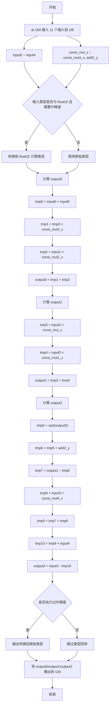

## 需求背景

### 需求来源

- 通过社区任务完成开源仓算子贡献的需求。

### 背景介绍

算子功能：实现带权重衰减并支持 Assign 融合的 Adam 优化器融合算子，用于训练场景中的参数更新。该算子将二阶矩更新、一阶矩更新、带 decay 的参数更新三段计算融合为一个算子，减少中间张量落盘与访存次数，提升训练性能。

计算公式：

- output0 = input1 × const_mul2_x + input0² × const_mul3_x
- output1 = input2 × const_mul_x + input0 × const_mul1_x
- output2 = input3 - (output1 ÷ (sqrt(output0) + add2_y) + input3 × const_mul4_x) × input4

其中：

- input0：梯度，源码中的 `data_grad`
- input1：二阶矩历史值，源码中的 `data_v`
- input2：一阶矩历史值，源码中的 `data_m`
- input3：待更新参数，源码中的 `data_var`
- input4：步长或学习率缩放项，源码中的 `data_input4`
- const_mul_x ~ const_mul4_x：各阶段乘法系数
- add2_y：分母中的稳定项
- output0：更新后的二阶矩估计
- output1：更新后的一阶矩估计
- output2：带 decay 的参数更新结果

1. `adam_apply_one_with_decay_assign` 算子实现信息
   - kernel实现：
      - /usr/local/Ascend/ascend-toolkit/latest/opp/built-in/op_impl/ai_core/tbe/impl/ops_legacy/dynamic/adam_apply_one_with_decay_assign.py
   - 算子原型：
      - /usr/local/Ascend/ascend-toolkit/latest/opp/built-in/op_proto/inc/elewise_calculation_ops.h
   - 算子信息库：
      - /usr/local/Ascend/ascend-toolkit/latest/opp/built-in/op_impl/ai_core/tbe/config/ascend910b/aic-ascend910b-ops-info.json

2. `adam_apply_one_with_decay_assign` 算子现状分析
   1. TBE 算子支持方式
      - 当前 Python 源码为动态 shape 实现。
      - 通过 `classify(dynamic_inputs, OpPatternMode.ELEWISE_WITH_BROADCAST)` 支持逐输入广播分类。
      - 当前源码未实现单独的 `op_select_format`，方案按通用 ND 广播场景设计。
      - `@register_operator_compute(..., support_fusion=True)` 表明该实现支持融合。
      - 当前源码未显式声明 `support_bfp16=True`，因此本文档按 `FLOAT16`、`FLOAT32` 两类实现方案展开。
   2. TBE 算子实现描述
      1. 参数校验与形状处理阶段
         - 通过 `@para_check.check_op_params` 检查 11 个输入、3 个输出以及 `kernel_name` 的合法性。
         - 调用 `_check_broadcast_shape` 对 11 个输入逐一执行 `para_check.check_shape`。
         - 将所有输入的 dtype 收集到 `data_dtype` 中，构造数据名到索引的映射 `data_dict`。
         - 预分配 `data_inputs = [None] * 11`，并定义 11 个输入名列表 `data_names`。
      2. kernel 名称处理阶段
         - 当 `kernel_name` 等于默认值 `adam_apply_one_with_decay_assign` 时，源码会拼接 4 组 `uuid.uuid4()`。
         - 再将 `-` 替换为 `Z`，生成唯一 kernel 名，避免融合场景下命名冲突。
      3. 动态 Shape 分类与处理阶段
         - 通过 `classify(dynamic_inputs, OpPatternMode.ELEWISE_WITH_BROADCAST)` 对 11 个输入进行分类。
         - 遍历分类后的输入组 `_dinputs`。
         - 调用 `shape_util.variable_shape(_dinputs)` 获取当前组的动态 shape。
         - 为每个动态 shape 创建 TVM placeholder。
      4. TVM 占位符创建阶段
         - 为 11 个输入创建占位符：
           - `data_grad` 对应 `input0`
           - `data_v` 对应 `input1`
           - `data_m` 对应 `input2`
           - `data_var` 对应 `input3`
           - `data_input4` 对应 `input4`
           - `const_input_mul` 对应 `const_mul_x`
           - `const_input_mul1` 对应 `const_mul1_x`
           - `const_input_mul2` 对应 `const_mul2_x`
           - `const_input_mul3` 对应 `const_mul3_x`
           - `const_input_mul4` 对应 `const_mul4_x`
           - `data_input_add2` 对应 `add2_y`
      5. 核心计算逻辑阶段

   3. TBE 算子实现流程图
      - `adam_apply_one_with_decay_assign` 算子 TBE 版本的整体流程如下图所示：

## 需求详细设计

### 使能方式

创建 `aclnnAdamApplyOneWithDecayAssign` 相关接口，调用此算子。

### 需求总体设计

#### host 侧设计

1. 分核策略
   1. 优先采用满核分配策略，尽可能提升并行度。
   2. 当总数据量可以被核数整除时，按均匀分块处理。
   3. 当存在尾块时，将余数分配给前若干个核或最后一核统一处理。
   4. 当输入规模较小时，可退化为单核执行，减少调度开销。

2. 数据分块与内存规划策略
   1. 以单核可容纳的 UB 数据量为基础，沿连续维切块。
   2. 算子中间结果较多，需要规划输入缓冲、中间结果缓冲与输出缓冲。
   3. 由于 `output2` 依赖 `output0` 与 `output1`，建议按依赖顺序在 UB 中复用临时缓冲：
      - 第一阶段生成 `output0`
      - 第二阶段生成 `output1`
      - 第三阶段基于 `output0/output1` 继续完成 `output2`
   4. 搬运数据时需要满足 32 Byte 对齐要求。
   5. 若硬件与切块条件允许，可开启 double buffer 提升流水效率。

3. tilingKey 规划策略
   1. 由于源码侧支持广播，AscendC 方案建议区分两类场景：
      - `tilingKey = 0`：所有输入 shape 一致，无广播，走高效逐块计算路径
      - `tilingKey = 1`：存在广播关系，走带广播展开的通用路径
   2. 若本次 AscendC 落地阶段仅覆盖同 shape 场景，可先实现 `tilingKey = 0`，后续再补齐广播路径。

#### kernel 侧设计

1. kernel 侧实现描述
   - kernel 侧建议拆分为 `Init`、`Process` 两大阶段。
   - `Process` 内部进一步拆分为 `CopyIn`、`Compute`、`CopyOut`。
   - 需要从 GM 搬入 11 个输入张量：
     - `input0`、`input1`、`input2`、`input3`、`input4`
     - `const_mul_x`、`const_mul1_x`、`const_mul2_x`、`const_mul3_x`、`const_mul4_x`
     - `add2_y`
   - 计算顺序建议与 TBE 保持一致：
     1. **计算 output0**
        - `tmp0 = input0 × input0`
        - `tmp1 = tmp0 × const_mul3_x`
        - `tmp2 = input1 × const_mul2_x`
        - `output0 = tmp1 + tmp2`
     2. **计算 output1**
        - `tmp3 = input2 × const_mul_x`
        - `tmp4 = input0 × const_mul1_x`
        - `output1 = tmp3 + tmp4`
     3. **计算 output2**
        - `tmp5 = sqrt(output0)`
        - `tmp6 = tmp5 + add2_y`
        - `tmp7 = output1 ÷ tmp6`
        - `tmp8 = input3 × const_mul4_x`
        - `tmp9 = tmp7 + tmp8`
        - `tmp10 = tmp9 × input4`
        - `output2 = input3 - tmp10`
   - 对 `float16` 输入，建议在开方和除法链路上按硬件能力选择是否升精度到 `float32` 计算，以对齐 TBE 行为。
   - 若后续需要支持广播场景，kernel 需补充：
     - 输入索引展开
     - 广播维步长计算
     - 标量/长度为 1 维度的重复读或向量广播
   - 输出 `output0/output1/output2` 可直接用于上层 Assign 融合写回。

2. AscendC 实现流程图
   - `adam_apply_one_with_decay_assign` 算子流程见下图。

#### AscendC 实现流程图与 TBE 流程图存在的差异点和原因

1. TBE 源码显式支持广播分类，而 AscendC 首版可优先实现同 shape 路径，后续再扩展广播逻辑。
2. TBE 依赖框架自动调度与表达式图构建；AscendC 需要显式设计分核、切块、流水和 UB 复用策略。
3. TBE 入口中包含动态 `kernel_name` 生成与 `dummy_placeholder=True` 配置，AscendC 实现通常不需要复刻这一构建层逻辑，只需保证接口侧命名与编译产物管理策略一致。
4. TBE 通过 `tensors.append(data_inputs + list(res))` 支持 Assign 融合，AscendC 侧需要在接口层或图编译侧对接相同的融合语义。

### 支持硬件

| 产品                                                                            | 是否支持 |
| :------------------------------------------------------------------------------ | :------: |
| <term>Atlas A2 训练系列产品/Atlas 800I A2 推理产品/A200I A2 Box 异构组件</term> |    √     |

### 算子原型

| 参数名        | 类别     | 描述                                   | 数据类型           | 数据格式 | shape |
| :------------ | :------- | :------------------------------------- | :----------------- | :------ | :---- |
| input0        | 输入张量 | 梯度输入，用于平方项和一阶矩更新。     | FLOAT16、FLOAT32   | ND      | all   |
| input1        | 输入张量 | 二阶矩历史值，用于计算 output0。       | FLOAT16、FLOAT32   | ND      | all   |
| input2        | 输入张量 | 一阶矩历史值，用于计算 output1。       | FLOAT16、FLOAT32   | ND      | all   |
| input3        | 输入张量 | 待更新参数，用于 decay 和最终减法。    | FLOAT16、FLOAT32   | ND      | all   |
| input4        | 输入张量 | 步长或学习率缩放项。                   | FLOAT16、FLOAT32   | ND      | all   |
| const_mul_x   | 输入张量 | `mul_0` 的乘数张量。                   | FLOAT16、FLOAT32   | ND      | all   |
| const_mul1_x  | 输入张量 | `mul_1` 的乘数张量。                   | FLOAT16、FLOAT32   | ND      | all   |
| const_mul2_x  | 输入张量 | `mul_2` 的乘数张量。                   | FLOAT16、FLOAT32   | ND      | all   |
| const_mul3_x  | 输入张量 | `mul_3` 的乘数张量。                   | FLOAT16、FLOAT32   | ND      | all   |
| const_mul4_x  | 输入张量 | decay 分支 `mul_4` 的乘数张量。        | FLOAT16、FLOAT32   | ND      | all   |
| add2_y        | 输入张量 | 分母稳定项加数张量。                   | FLOAT16、FLOAT32   | ND      | all   |
| output0       | 输出张量 | 更新后的二阶矩估计。                   | FLOAT16、FLOAT32   | ND      | all   |
| output1       | 输出张量 | 更新后的一阶矩估计。                   | FLOAT16、FLOAT32   | ND      | all   |
| output2       | 输出张量 | 带权重衰减的参数更新结果。             | FLOAT16、FLOAT32   | ND      | all   |

### 算子约束限制

1. 所有输入 dtype 需保持一致，输出 dtype 与输入 dtype 保持一致。
2. 要求所有输入 shape 一致

### 精度标准/性能标准

1. 精度不低于 TBE 实现。
2. 性能不低于 TBE 实现。
