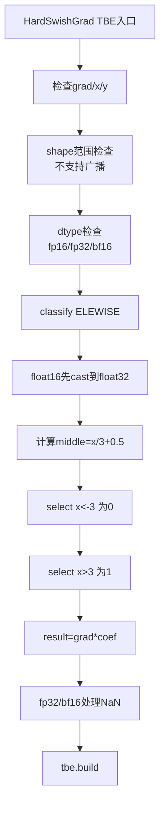
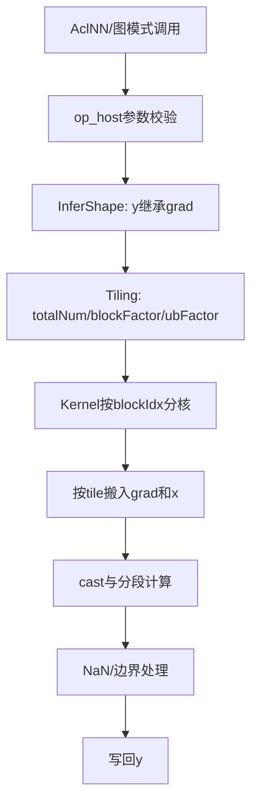

# HardSwishGrad算子设计方案

## 需求背景（required）

### 需求来源

基于现有 TBE `hard_swish_grad` 内核，整理算子语义、支持范围和执行流程，完成 AscendC 改造设计，保持与内置 `aclnnHardSwishBackward` / `HardSwishGrad` TBE 实现语义一致。任务书指定适配 Atlas A2 训练系列产品 / Atlas A3 系列产品，当前验证目标为 Ascend910B。

### 背景介绍

HardSwishGrad 用于 HardSwish 激活函数反向传播，输入上游梯度 `grad` 和前向输入 `x`，输出 `y`。该算子是逐元素分段计算，不涉及广播、归约或跨元素依赖。

```text
y = grad * x_grad

x_grad = 0             if x < -3
         x / 3 + 0.5   if -3 <= x <= 3
         1             if x > 3
```

TBE 使用严格比较 `lt` 和 `gt`，因此 `x == -3`、`x == 3` 均进入中间分支，这一点 AscendC 实现必须保持一致。

### 算子功能

从 TBE kernel 视角，HardSwishGrad 的输入输出为：

- 输入：`grad`、`x`
- 输出：`y`
- 规则：按 `x` 所在区间计算局部梯度系数，再与 `grad` 相乘
- 特殊语义：动态 TBE 中 `float32` / `bfloat16` 路径通过 `x == x` 识别 NaN；当 `x` 为 NaN 时输出常量 `1`

核心表达式：

```text
middle = x * 0.33333334 + 0.5
tmp    = select(x < -3.0, 0.0, middle)
coef   = select(x >  3.0, 1.0, tmp)
y      = grad * coef
```

### HardSwishGrad 算子实现位置

- 动态 TBE：`/usr/local/Ascend/ascend-toolkit/latest/opp/built-in/op_impl/ai_core/tbe/impl/ops_legacy/dynamic/hard_swish_grad.py`
- 静态 TBE：`/usr/local/Ascend/ascend-toolkit/latest/opp/built-in/op_impl/ai_core/tbe/impl/ops_legacy/hard_swish_grad.py`
- 算子原型：`/usr/local/Ascend/ascend-toolkit/latest/opp/built-in/op_proto/inc/nonlinear_fuc_ops.h`
- 910B 算子信息库：`/usr/local/Ascend/ascend-toolkit/latest/opp/built-in/op_impl/ai_core/tbe/kernel/config/ascend910b/ops_legacy/hard_swish_grad.json`

### HardSwishGrad 算子现状分析

基于 TBE 实现和 910B 算子信息库，可归纳如下：

- `grad` 和 `x` 的 shape、dtype、format 必须一致。
- 动态 TBE 使用 `support_broadcast=False`，不支持广播。
- 动态 TBE 支持 `float16`、`float32`、`bfloat16`；静态 TBE 只显式检查 `float16`、`float32`。
- 910B 信息库声明支持 `ND`、`NC1HWC0`、`FRACTAL_NZ`。
- `float16` 路径先 cast 到 `float32` 计算，再 cast 回 `float16`。
- `float32` / `bfloat16` 路径包含 NaN 输出常量 `1` 的逻辑。

#### TBE 输入输出与支持范围

| 名称 | 类别 | dtype | format | shape | 说明 |
| --- | --- | --- | --- | --- | --- |
| grad | 输入 | float16/float32/bfloat16 | ND/NC1HWC0/FRACTAL_NZ | all | 上游梯度 |
| x | 输入 | float16/float32/bfloat16 | ND/NC1HWC0/FRACTAL_NZ | 与 grad 相同 | 前向 HardSwish 输入 |
| y | 输出 | float16/float32/bfloat16 | ND/NC1HWC0/FRACTAL_NZ | 与 grad 相同 | 反向梯度结果 |

910B 信息库共声明 9 类组合：`float16/float32/bfloat16` 分别支持 `ND/NC1HWC0/FRACTAL_NZ`。

#### TBE 总体流程图



图 1 HardSwishGrad TBE 执行与计算流程

## 需求分析

### 外部组件依赖

无新增外部组件依赖。算子依赖 CANN Host 侧算子注册、shape 推导、tiling 框架和 AscendC Kernel API，用于完成 GM/UB 数据搬运、类型转换、比较、选择和乘法计算。

### 内部适配模块

- 适配 AclNN 调用链，保持与 `aclnnHardSwishBackward` 语义一致。
- 适配算子原型，输入顺序为 `grad`、`x`，输出为 `y`。
- 适配动态 shape，Host 侧按输入总元素数生成 tiling。
- 适配 TBE 支持的 dtype / format 矩阵。
- 适配严格边界比较和 NaN 特殊行为。

## 需求模块设计

### 算子原型

| 名称 | 类别 | dtype | format | shape | 说明 |
| --- | --- | --- | --- | --- | --- |
| grad | 输入 | float16/float32/bfloat16 | ND/NC1HWC0/FRACTAL_NZ | all | 上游梯度，必须与 x 一致 |
| x | 输入 | float16/float32/bfloat16 | ND/NC1HWC0/FRACTAL_NZ | all | 前向输入，决定分段梯度系数 |
| y | 输出 | float16/float32/bfloat16 | ND/NC1HWC0/FRACTAL_NZ | 与 grad 相同 | 反向梯度输出 |

### 相关约束

- `grad` 与 `x` 的 dtype、shape、format 必须一致。
- 不支持广播。
- 支持动态 shape，kernel 内按线性总元素数处理。
- format 不改变逐元素语义，`ND`、`NC1HWC0`、`FRACTAL_NZ` 均按物理连续存储线性遍历。
- `x == -3` 和 `x == 3` 必须进入中间分支。
- `float32/bfloat16` 路径需要保留 TBE 动态实现的 NaN 输出常量 `1` 行为。
- 空 tensor 场景应返回成功，不进行无效计算。

## 需求详细设计

### 使能方式

| 上层框架 | 涉及的框架勾选 |
| --- | --- |
| TF训练/推理 |  |
| Pytorch训练/推理 |  |
| ATC推理 |  |
| Aclnn直调 | √ |
| OPAT调优 |  |
| SGAT子图切分 |  |

### 需求总体设计

HardSwishGrad 是逐元素算子。Host 侧负责参数校验、shape 推导和 tiling；Kernel 侧按 tiling 数据完成多核切分、UB 分块和分段计算。总体链路为：算子注册 -> 参数校验 -> InferShape -> Tiling -> Kernel 分核 -> CopyIn -> Compute -> CopyOut。



图 2 HardSwishGrad AscendC 总体流程

### AscendC Host 侧设计

Host 侧将输入 tensor 信息压缩为 kernel 可直接消费的 tiling 参数。

| 文件 | 主要职责 |
| --- | --- |
| hard_swish_grad_def.cpp | 注册 `grad/x/y`、dtype、format、SoC 支持范围 |
| hard_swish_grad_infershape.cpp | 输出 `y` 继承 `grad` shape |
| hard_swish_grad_tiling.cpp | 校验一致性，计算总元素数、多核切分和 UB tile 大小 |
| hard_swish_grad_tiling_data.h | 保存 `totalNum`、`blockFactor`、`ubFactor` 等字段 |
| hard_swish_grad_tiling_key.h | 区分 `float16/float32/bfloat16` 计算路径 |

Host 核心流程：读取 `grad/x` 的 shape、dtype、format；校验一致性和支持范围；计算 `totalNum`；按平台核数和 UB 容量计算 `usedCoreNum`、`blockFactor`、`ubFactor`；设置 tilingKey；写入 tilingData 并设置 blockDim。

| 字段 | 用途 |
| --- | --- |
| totalNum | 输入总元素数 |
| usedCoreNum | 实际参与计算的 AI Core 数量 |
| blockFactor | 单核最多处理元素数 |
| ubFactor | 单次 tile 最多处理元素数 |
| dtypeKey | dtype 分支标识 |

| TilingKey | dtype | Kernel 策略 |
| --- | --- | --- |
| 1 | float16 | 输入 cast 到 float32，中间计算后 cast 回 float16 |
| 2 | float32 | float32 直接计算，并保留 NaN 选择逻辑 |
| 3 | bfloat16 | float32 中间计算，输出 cast 回 bfloat16，并保留 NaN 选择逻辑 |

### AscendC Kernel 侧设计

Kernel 侧延续 TBE 的逐元素分段语义。入口 `hard_swish_grad()` 读取 tiling 参数；`Init()` 绑定 `gradGm/xGm/yGm`；`Process()` 根据 `blockIdx` 计算当前 core 任务范围；每个 core 内按 tile 循环执行搬入、计算和搬出。

核心伪代码：

```text
coreStart = blockIdx * blockFactor
coreLen   = min(blockFactor, totalNum - coreStart)

for tileOffset in range(0, coreLen, ubFactor):
    tileLen = min(ubFactor, coreLen - tileOffset)
    CopyIn(grad, x)
    middle = x * 0.33333334 + 0.5
    coef = select(x < -3, 0, middle)
    coef = select(x > 3, 1, coef)
    y = grad * coef
    if dtype is float32 or bfloat16:
        y = select(x == x, y, 1)
    CopyOut(y)
```

dtype 分支：`float16` 与 `bfloat16` 使用 `float32` 中间计算后 cast 回原 dtype；`float32` 直接计算。比较和选择使用逻辑 mask 或 AscendC select API，不依赖原始二进制位比较。

### 支持硬件

| 支持的芯片版本 | 涉及勾选 |
| --- | --- |
| Atlas A2 训练系列产品（Ascend910B） | √ |
| Atlas A3 系列产品 | √ |

### 算子约束限制

- 不支持广播。
- 不支持 `grad` 与 `x` dtype、shape、format 不一致。
- 不支持 TBE 信息库以外的 dtype / format 组合。
- `x == -3` 与 `x == 3` 不能被归入外侧分支。
- `float32/bfloat16` 的 NaN 行为需要与动态 TBE 对齐。

### 特性交叉分析、可维可测分析

| 验收标准 | 描述（不涉及说明原因） | 标准来源 |
| --- | --- | --- |
| 精度标准 | 满足 CANN Judge 默认阈值，与 TBE 动态实现语义一致 | 任务书、TBE 实现 |
| 性能标准 | 所有核参与计算场景下性能不低于原 TBE 95% | 任务书、TBE 实现 |
| 泛化标准 | 覆盖原 TBE 支持的 dtype、format、动态 shape、边界值和特殊值 | 任务书、TBE 信息库 |

建议测试覆盖：`float16/float32/bfloat16`，`ND/NC1HWC0/FRACTAL_NZ`，标量到高维动态 shape，空 tensor，`x<-3`、`-3<x<3`、`x>3`，边界 `x=-3/3`，NaN、Inf，以及 shape/dtype/format 不一致的非法输入。

CPU 参考实现：

```python
coef = np.where(x < -3.0, 0.0, x / 3.0 + 0.5)
coef = np.where(x > 3.0, 1.0, coef)
y = grad * coef
# float32 / bfloat16 路径补充动态 TBE NaN 语义
y = np.where(np.isnan(x), 1.0, y)
```

### 兼容性分析

AscendC 版本保持与原 TBE `hard_swish_grad.py` 语义对齐；输入顺序为 `grad`、`x`，输出为 `y`；对外通过任务书要求的 AclNN 调用链承载 `aclnnHardSwishBackward` 语义；动态 shape 按逐元素线性处理，不依赖固定 rank。
