# 需求背景
## 需求来源
社区任务
## 背景介绍
### SildingTileAttention算子实现优化
基于SildingTileAttention算子GPU版本使用Ascend C编程语言进行优化。

SildingTileAttention算子（GPU）实现链接和相关API链接

SildingTileAttention算子实现链接为：https://github.com/hao-ai-lab/FastVideo/blob/4ddcdf541f32b63b5c684016c903658e2e2b6f67/fastvideo-kernel/python/fastvideo_kernel/triton_kernels/st_attn_triton.py

SildingTileAttention算子实现中的API链接：https://github.com/hao-ai-lab/FastVideo/blob/4ddcdf541f32b63b5c684016c903658e2e2b6f67/fastvideo-kernel/python/fastvideo_kernel/ops.py
### SildingTileAttention算子GPU实现现状分析
通过对SildingTileAttention算子TBE版本的功能分析，当前支持的能力如下：

| 参数          | 参数含义     | 数据类型      | 支持数据类型            | 约束 | 形状           |
|-------------|----------|-----------|-------------------|----|--------------|
| q           | 输入tensor | tensor    | bfloat16, float16 | 无  | (B, N, S, D) |
| k           | 输入tensor | tensor    | bfloat16, float16 | 无  | (B, N, S, D) |
| v           | 输入tensor | tensor    | bfloat16, float16 | 无  | (B, N, S, D) |
| window_size | 属性       | list[int] |                   | 无  |              |
| text_length | 属性       | int       |                   | 无  |              |
| has_text    | 属性       | bool      |                   | 无  |              |
| seq_shape   | 属性       | str       |                   | 无  |              |
| output      | 输出tensor | tensor    | bfloat16, float16 | 无  | (B, N, S, D) |
GPU版SildingTileAttention算子的整体流程图如下图所示：

```mermaid
graph TD
    A(input) --> B{if sta_fwd is None:};
    B -- 满足 --> C[调用Triton实现sliding_tile_attention_triton];
    C --> D{if has_text:};
    D -- 满足 --> E[assert 115200 <= S <= 115456];
    E --> F["target_size = math.ceil(seq_length / 384) * 384"];
    F --> G[pad_size = target_size - S];
    G --> H{if pad_size > 0:};
    H -- 满足 --> I["q = torch.cat([q, q[:, :, -pad_size:]], dim=2)"];
    I --> J["k = torch.cat([k, k[:, :, -pad_size:]], dim=2)"];
    J --> K["v = torch.cat([v, v[:, :, -pad_size:]], dim=2)"] --> Q;
    H -- 不满足 --> Q;
    D -- 不满足 --> L{if seq_shape == '36x48x48':};
    L -- 满足 --> M[assert S == 82944] --> Q;
    L -- 不满足 --> N{if seq_shape == '18x48x80':};
    N -- 满足 --> O[assert S == 69120];
    N -- 不满足 --> P(raise ERROR);
    O --> Q["assert N == len(window_size)"];
    Q --> R{if seq_shape == '30x48x80':};
    R -- 满足 --> S[canvas_t, canvas_h, canvas_w = 30, 48, 80] --> X;
    R -- 不满足 --> T{if seq_shape == '36x48x48':};
    T -- 满足 --> U[canvas_t, canvas_h, canvas_w = 36, 48, 48] --> X;
    T -- 不满足 --> V{if seq_shape == '18x48x80':};
    V -- 满足 --> W[canvas_t, canvas_h, canvas_w = 18, 48, 80];
    W --> X[tile_t, tile_h, tile_w = 6, 8, 8] --> Y;
    V -- 不满足 --> Y[img_seq_len = canvas_t * canvas_h * canvas_w];
    Y --> Z[num_tiles_t = canvas_t // tile_t];
    Z --> AA[num_tiles_h = canvas_h // tile_h];
    AA --> AB[num_tiles_w = canvas_w // tile_w];
    AB --> AC[num_tiles = num_tiles_t * num_tiles_h * num_tiles_w];
    AC --> AD[total_tile_size = tile_t * tile_h * tile_w];
    AD --> AE[BLOCK_DIM = head_dim];
    AE --> AF[创建输出output];
    AF --> AG{"for head_index, (kernel_t, kernel_h, kernel_w) in enumerate(window_size):"};
    AG -- 满足 --> AH{"for batch in range(batch_size):"};
    AH -- 满足 --> AI[对当前q_head, k_head, v_head, output_head调用triton_sta_kernel执行q_img];
    AI --> AJ(( )) -.-> AK;
    subgraph triton_sta_kernel 
        AK(input) --> AL[total_tile_size = tile_t * tile_h * tile_w];
        AL --> AM[读取3D grid中编号];
        AM --> AN[得到batch_idx, head_idx];
        AN --> AO{if text_q:};
        AO -- 满足 --> AP[得到q_block_idx] --> AR;
        AO -- 不满足 --> AQ[计算各维度切块编号q_tile_flat, q_block_idx];
        AQ --> AR[分配并初始化softmax局部最大值m, 指数和l, 最终结果累加器acc];
        AR --> AS[计算q_offset, q_idx, q_mask];
        AS --> AT[读取切块q];
        AT --> AU["sm_scale = scale * (1 / ln(2))"];
        AU --> AV{if text_q:};
        AV -- 满足 --> AW[计算kv_tile_start_t, kv_tile_end_t, kv_tile_start_h, kv_tile_end_h, kv_tile_start_w, kv_tile_end_w为整个num_tiles范围] --> AY;
        AV -- 不满足 --> AX[计算kv_tile_start_t, kv_tile_end_t, kv_tile_start_h, kv_tile_end_h, kv_tile_start_w, kv_tile_end_w为以q_tile_flat对应tile为中心的kernel大小范围（clamp到边界内）];
        AX --> AY{"for kv_tile_t in tl.range(kv_tile_start_t, kv_tile_end_t):"};
        AY -- 满足 --> AZ{"for kv_tile_h in tl.range(kv_tile_start_h, kv_tile_end_h):"};
        AZ -- 满足 --> BA{"for kv_tile_w in tl.range(kv_tile_start_w, kv_tile_end_w):"};
        BA -- 满足 --> BB["根据kv_tile_t, kv_tile_h, kv_tile_w计算kv_base_idx"];
        BB --> BC{"for kv_block_idx in tl.range(0, total_tile_size, BLOCK_KV):"};
        BC -- 满足 --> BD[计算kv_idx, kv_mask, kv_offset];
        BD --> BE[读取切块k, v];
        BE --> BF[调用_attn_fwd_loop执行FlashAttention累加，更新m, l, acc] --> BC -- 不满足 --> BA -- 不满足 --> AZ -- 不满足 --> AY;
        AY -- 不满足 --> BG{if has_text:};
        BG --> BH[kv_base_idx = img_seq_len];
        BH --> BI{"for kv_block_idx in tl.range(0, total_tile_size, BLOCK_KV):"};
        BI -- 满足 --> BJ[计算kv_idx, kv_mask, kv_offset];
        BJ --> BK[读取切块k, v];
        BK --> BL[调用_attn_fwd_loop执行FlashAttention累加，更新m, l, acc] --> BI -- 不满足 --> BM;
        BG -- 不满足 --> BM["output_acc = acc / l[:, None]"];
        BM --> BN[写入切块output_acc到output];
        BN --> BO(return);
    end
    AJ --> AH -- 不满足 --> AG -- 不满足 --> BP{if has_text:};
    BP -- 满足 --> BQ[对q, k, v, output调用triton_sta_kernel执行q_text];
    BQ --> BR(( )) -.-> AK;
    BR --> BS{if pad_size > 0:};
    BS -- 满足 --> BT["output = output[:, :, :seq_length]"] --> BU;
    BS -- 不满足 --> BU;
    BP -- 不满足 --> BU(return output);
    B -- 不满足 --> BV[调用CUDA实现sta_fwd];
    BV --> BW(（A100不支持CUDA实现）);
```

### SildingTileAttention算子功能分析
SildingTileAttention算子功能：视频局部滑动+文本全局可见的变体FlashAttention算子
- 3D局部滑动窗口注意力（针对视频/图像）：由于视频序列极长，算子放弃了全局注意力，将视频画面切分为3D图像块，每个块的Query仅与物理空间/时间上相邻的几个目标块的Key和Value进行交互，大幅削减了计算量。
- 非对称的全局交叉注意力（针对文本）：视频块在关注局部画面的同时，必须全局可见所有的文本提示词；文本不设局部窗口，它的Query会和所有的视频块以及所有文本块进行充分的全局Attention计算。

输入：q、k、v

属性：window_size、text_length、has_text、seq_shape

输出：output

支持数据类型：bfloat16、float16

支持数据格式：BNSD
# 需求分析
## 需求描述
使用Ascend C编程语言实现SildingTileAttention算子，支持bfloat16、float16数据类型，支持BNSD数据格式。
## 需求拆解
1. 支持bfloat16、float16数据类型
2. 支持BNSD数据格式
3. 性能不低于0.8倍GPU版本（A100）
# 详细设计
## 算子分析
### 数学公式
视频图像里的第X个块：
$$Output[X] = \text{Softmax}\left( Q_{\text{img}}[X] \times [K_{\text{img}}[\text{Neighbors}], \ K_{\text{text}}[\text{ALL}]]^T \right) \times [V_{\text{img}}[\text{Neighbors}], \ V_{\text{text}}[\text{ALL}]]$$
文本里的第Y个词：
$$Output[Y] = \text{Softmax}\left( Q_{\text{text}}[Y] \times [K_{\text{img}}[\text{ALL}], \ K_{\text{text}}[\text{ALL}]]^T \right) \times [V_{\text{img}}[\text{ALL}], \ V_{\text{text}}[\text{ALL}]]$$
### 支持数据类型
bfloat16、float16
### 支持形状
BNSD
## 算子实现
### 实现方案
#### host侧设计：
1. tiling策略：算子计算过程涉及数据的维度信息，host侧需要完整提取并保留BNSD四个维度的大小。
2. 分核策略：优先使用满核的原则，B、H维度可任意划分，S维度在q上以512B为单位划分，q_img和q_text阶段分别按三个维度上的总任务块个数均匀分给所有核。
3. 核内切分策略：开启double buffer，tile块最大大小在均分UB/L1空间且满足对齐约束的条件下设到最大；尾块可一并处理，无需额外参数。
4. tiling key规划策略：has_text为true和false时算子逻辑差异较大，需要设置tiling key分别为1和0对应两种情况。
#### kernel侧设计：
1. 根据DTYPE_Q自动选择对应类型的模板函数，bfloat16和float16均需提升为float32计算。
2. 循环执行数据搬入（CopyIn）、计算（Compute）、搬出（CopyOut）三个阶段，Compute阶段根据模板数据类型调用相应的AttnFwdLoop函数。
3. Ascend C的AttnFwdLoop流程见下图。

## 支持硬件
| 支持的芯片版本         | 涉及勾选 |
|-----------------|------|
| Atlas A2 训练系列产品 | √    |
## 算子约束限制
仅支持HunyuanVideo（30x48x80，text_length <= 256）、StepVideo（36x48x48，无文本）、Wan（18x48x80，无文本）三套配置，tile尺寸均固定为6x8x8
# 可维可测分析
## 精度标准/性能标准
| 验收标准 | 描述                             | 标准来源               |
|------|--------------------------------|--------------------|
| 精度标准 | bfloat16双千分之四，float16双千分之一     | AscendOpTest工具默认阈值 |
| 性能标准 | 2个测试用例平均算子用时分别≤655.97us，5771us | 0.8倍GPU（A100）性能    |
## 兼容性分析
新算子，不涉及兼容性分析
