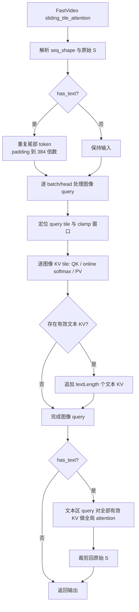
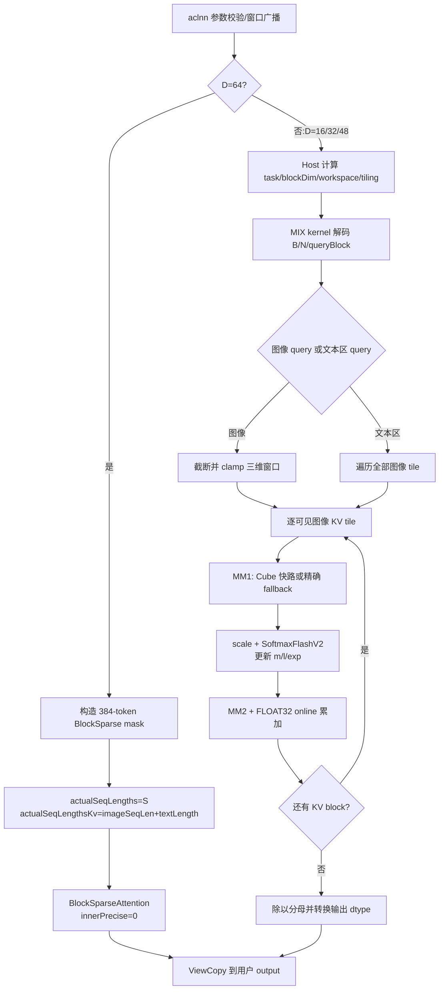
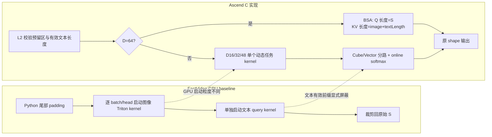

# SlidingTileAttention 算子设计文档

## 一、需求背景

### 1.1 需求来源

本需求来自 2026 年 8 月社区任务“SlidingTileAttention 算子开发（A2）”。任务要求
参考 FastVideo `sliding_tile_attention`，在 Atlas A2 上基于 Ascend C 实现功能一致
的 aclnn 算子，支持 FLOAT16、BFLOAT16 和 BNSD 布局，并使用任务随附 ATK 用例验收。

### 1.2 背景介绍

#### 1.2.1 SlidingTileAttention 实现优化

视频生成模型的序列可达到 6.9 万至 11.5 万 token。全量 self-attention 的计算量和
中间 score 存储均随序列长度平方增长。FastVideo 将图像 token 按 `(6,8,8)` 切成
384-token 三维 tile，使每个图像 query 只关注当前 head 窗口内的图像 KV；有文本时，
图像 query 额外关注有效文本 KV，文本区 query 关注所有图像 KV 和有效文本 KV。

本算子不生成完整 `S×S` score 矩阵，而以 query block 为任务粒度，逐 KV tile 执行
MM1、online softmax 和 MM2，并在 FLOAT32 中累计 softmax 状态与输出。

SlidingTileAttention 是新增 experimental 算子，CANN 内没有同名 TBE kernel。设计和
语义依据使用以下三条等价 baseline 参考路径：

1. FastVideo Python API：
   `fastvideo-kernel/python/fastvideo_kernel/ops.py`，固定 commit
   `4ddcdf541f32b63b5c684016c903658e2e2b6f67`；
2. FastVideo Triton kernel：
   `fastvideo-kernel/python/fastvideo_kernel/triton_kernels/st_attn_triton.py`，同一 commit；
3. 正式任务 ATK baseline 插件：
   `slidingTileAttention_testCase/exe.py`，其 GPU 分支直接调用上述 FastVideo API。

#### 1.2.2 现状分析

##### 1.2.2.1 Baseline 支持的数据类型和数据格式

| 项目 | 支持范围 |
| -- | -- |
| 输入/输出 dtype | FLOAT16、BFLOAT16 |
| 布局 | BNSD，shape 为 `[B,N,S,D]` |
| head dim | 任务用例覆盖 16、32、64；Ascend C 实现同时支持 48 |
| 图像画布 | `30x48x80`、`36x48x48`、`18x48x80` |
| tile | 固定 `(6,8,8)`，单 tile 384 token |
| 文本长度 | 0～256 |

##### 1.2.2.2 Baseline 实现描述

FastVideo Python 层先记录原始 S。有文本时，将序列尾部重复 padding 到 384 的倍数；
随后逐 head 启动图像 query Triton kernel。图像 query 遍历 clamp 后的局部三维窗口，
并追加 `[imageSeqLen, imageSeqLen+textLength)` 有效文本 KV。最后启动一次文本 query
全局 attention，并把输出裁剪回原始 S。

Triton kernel 对每个 KV block 执行 QK、scale、row max、指数和分母更新、PV 累加。
其核心状态为当前最大值 `m`、归一化分母 `l` 和输出累加 `acc`：

$$
m'=\max(m,\max(s)),\quad
l'=l e^{m-m'}+\sum e^{s-m'},\quad
acc'=acc e^{m-m'}+e^{s-m'}V.
$$

##### 1.2.2.3 Baseline 实现流程图



## 二、需求分析

### 2.1 外部组件依赖

- CANN 9.0.0 及以上版本提供的 Ascend C 编译器、运行时和 aclnn 基础设施；
- ops-transformer 的 experimental operator 构建、注册和自定义 OPP 打包框架；
- Atlas A2（Ascend 910B）硬件；
- 最终自测使用任务包指定的 ATK 26.8.25。

### 2.2 内部适配模块

- L2 aclnn：参数校验、非连续 Tensor 连续化、窗口广播、两段式 executor；
- L0 op：输入/属性组织、输出 shape 推导、launcher 注册；
- host tiling：任务数、分核、MM tiling、SoftmaxFlashV2 tiling 和 workspace；
- Ascend C MIX kernel：局部窗口索引、MM1、online softmax、MM2、跨 KV 块累计；
- D=64：统一复用同仓 BlockSparseAttention 高精度后端；384-token block mask 描述块级可见性，
  `actualSeqLengths` 保留完整 query 槽位，`actualSeqLengthsKv=imageSeqLen+textLength`
  精确截断无效的文本 padding KV。

### 2.3 需求模块设计

#### 2.3.1 Ascend C 算子原型

```cpp
aclnnStatus aclnnSlidingTileAttentionGetWorkspaceSize(
    const aclTensor          *query,
    const aclTensor          *key,
    const aclTensor          *value,
    aclTensor                *output,
    const aclIntArray *const *windowSize,
    uint64_t                  windowSizeLen,
    int64_t                   textLength,
    bool                      hasText,
    const char               *seqShape,
    uint64_t                 *workspaceSize,
    aclOpExecutor           **executor);

aclnnStatus aclnnSlidingTileAttention(
    void          *workspace,
    uint64_t       workspaceSize,
    aclOpExecutor *executor,
    aclrtStream    stream);
```

数学模型为：

$$
s_{i,j}=Q_iK_j^T/\sqrt D,\qquad
O_i=\sum_{j\in\mathcal V(i)}\operatorname{Softmax}(s_i)_jV_j.
$$

对图像 query，`V(i)` 为当前 head 三维窗口内图像 KV 与有效文本 KV 的并集；对文本
预留区 query，`V(i)` 为全部图像 KV 与前 `textLength` 个有效文本 KV。

#### 2.3.2 相关约束

- q/k/v/output 均为四维 BNSD，shape、dtype 相同，维度均大于 0；
- dtype 为 FLOAT16 或 BFLOAT16；`D∈{16,32,48,64}`；
- `windowSizeLen` 为 1 或 N，每项是 3 个正奇数；超出 tile grid 的窗口按 grid 截断；
- `hasText=false` 时 `S=imageSeqLen`；
- `hasText=true` 时
  `imageSeqLen+textLength <= S <= imageSeqLen+256`，只有文本区前 `textLength`
  个位置参与 KV attention，其余位置仍需要生成 text-query 输出；
- 当前真机验收范围为 Atlas A2。

## 三、需求详细设计

### 3.1 使用方式

接口采用 aclnn 两段式调用。第一段完成参数校验、L0 图构造和 workspace 计算；第二段
在用户指定 `aclrtStream` 上异步执行。q/k/v 非连续时，第一段插入 Contiguous 节点；
结果通过 ViewCopy 写入用户 output。

### 3.2 需求总体设计

#### 3.2.1 Host 侧设计

##### 3.2.1.1 分核策略

固定 `tileSize=6×8×8=384`。D=16/32/48 走自研 MIX kernel，其 query block 为：

$$
qBlock=32,\quad qBlocksPerTile=\lceil384/32\rceil=12.
$$

图像任务与文本区 query 任务数为：

$$
imageTasks=B\times N\times numTiles\times12,
$$

$$
textTasks=B\times N\times\left\lceil\frac{S-imageSeqLen}{32}\right\rceil.
$$

每个任务绑定一个 `(batch, head, queryBlock)`，任务之间无写冲突。使用 AIV 数为
`min(platformAivNum, imageTasks+textTasks)`，blockDim 由平台
`CalcTschBlockDim` 计算，kernel 内按 `taskId += usedAivNum` 循环取任务。D=64 由 L2
直接构造 BlockSparseAttention 图，不进入这套自研 tiling/分核路径。

##### 3.2.1.2 数据分块和内存优化策略

对 D=16/32/48 自研路径，单个图像 KV tile 为 384 token；文本 KV block 为
`textLength`，最大 256。设
`kvAlign=align16(max(384,textLength))`、`dAlign=align8(D)`，每核 GM workspace 为：

$$
W_{mm1}=32\times\max(kvAlign,dAlign)\times4,
$$

$$
W_{prob}=32\times kvAlign\times2,\qquad
W_{acc}=32\times dAlign\times4.
$$

总用户 workspace 为 `usedAivNum×(Wmm1+Wprob+Wacc)`，另加平台 LibApi
workspace。AIV 侧只申请一个 180 KiB TBuf，以固定 offset 复用 score、概率、softmax
临时区、MM2 和累加区，静态断言保证不超过 A2 的 192 KiB UB。

##### 3.2.1.3 tilingKey 规划策略

自研 L0 当前使用 `tilingKey=0`，dtype 由 kernel 模板实例化分发；shape、是否文本、
窗口大小和尾块通过 tiling data 动态处理。L2 对所有 D=64 输入构造 384-token
BlockSparse mask 并走 BlockSparseAttention 高精度路径。块级 mask 可以选中包含有效文本
与 padding 的末块，但 `actualSeqLengthsKv=imageSeqLen+textLength` 会在算子内部精确截断
无效 KV；`actualSeqLengths=S` 则保留完整 query 预留区并为其中每个位置生成输出。

#### 3.2.2 Kernel 侧设计

##### 3.2.2.1 Kernel 实现描述

以下步骤仅描述 D=16/32/48 自研 MIX 路径；D=64 由 BlockSparseAttention 后端完成。

1. 根据 taskId 解码 batch、head、query tile 和 query block；
2. 将 query tile 映射为 `(t,h,w)`，先把 window 三维尺寸截断到 tile grid，再计算
   `start=clamp(coord-window/2,0,grid-window)`；
3. 逐可见图像 KV tile 执行 MM1。常规对齐图像块使用 Matmul/Cube；D=48、BF16
   D=16、文本 KV 或非 16 对齐尾块使用精确 scalar/vector fallback；
4. 对 MM1 score 乘 `1/sqrt(D)`，调用 SoftmaxFlashV2 更新当前最大值、分母和指数
   缩放因子；概率转换为输入 dtype 供 MM2 使用；
5. MM2 对常规图像块使用向量化转置、Cast、Mul 和 ReduceSum；文本/非对齐尾块走
   scalar fallback，输出始终在 FLOAT32 中累计；
6. 非首 KV 块用 softmax 指数因子缩放历史累加值后再相加；最后一个 KV 块除以
   softmax 分母，转换回输入 dtype 并写 output；
7. 文本区 query 遍历所有图像 tile 和有效文本 KV，但 task 数覆盖完整预留文本区，
   因而与 FastVideo 的“有效 KV 前缀 + 预留 query 输出”一致。

##### 3.2.2.2 Ascend C 实现流程图



##### 3.2.2.3 与 Baseline 的差异点和原因



| 差异 | 原因 | 正确性措施 |
| -- | -- | -- |
| GPU 逐 batch/head 多次 launch；NPU kernel 按全局 task 表分核 | 降低长序列小 launch 的 host 调度开销 | taskId 显式包含 batch/head/queryBlock |
| GPU 先扩展到 384 对齐；NPU 直接读取原始 S | 避免额外 Q/K/V padding 拷贝 | KV 上界使用 textLength，query 上界使用 S-imageSeqLen |
| D=64 全部复用 BSA；D=16/32/48 使用自研 kernel | 384-token tile 与 BSA block 天然一致，并提供成熟高性能路径 | `actualSeqLengths=S` 保留 padding query，`actualSeqLengthsKv=imageSeqLen+textLength` 屏蔽 padding KV |
| A2 对 D=48、BF16 D=16 和非对齐文本尾块使用 fallback | 避免 A2 Matmul/Fixpipe 尾块地址异常和 BF16 scalar cast 限制 | 位转换 BF16、逐元素边界判断、专项回归 |

### 3.3 支持硬件

| 支持的芯片版本 | 是否支持 |
| -- | :--: |
| Atlas A2（Ascend 910B） | √ |
| Atlas A3 | 代码包含同架构配置，但本任务未做真机验收，不作交付承诺 |

### 3.4 算子约束限制

1. 仅支持 BNSD、FLOAT16/BFLOAT16；
2. D 为 16、32、48 或 64；
3. `seqShape` 仅支持 `30x48x80`、`36x48x48`、`18x48x80`；
4. tile 固定为 `(6,8,8)`；
5. 文本有效长度最大 256，文本预留区最大 256；
6. window 必须是正奇数三元组，数量为 1 或 N；
7. 正式支持平台为 Atlas A2、CANN 9.0.0 及以上。

## 四、特性交叉分析

| 维度 | 覆盖组合 |
| -- | -- |
| dtype | FP16、BF16 |
| D | 16、32、48、64；覆盖 Cube 与 fallback |
| 画布 | 30×48×80、36×48×48、18×48×80 |
| 文本 | 无文本；textLength 0/1/41/118/127/128/216/239/256；预留 64/128/256 |
| window | 单窗口广播、per-head 窗口、1/3/5/7/9、超过 grid 的截断 |
| B/N | 自研回归覆盖 B=1/2、N=1/2/8；正式 ATK 覆盖 B/N=1～16 |
| 边界 | 首尾 tile、非 16 对齐文本 KV、D=48、BF16 D=16、文本预留尾部 |

## 五、可维护可测分析

### 5.1 精度标准和性能标准

任务书精度阈值如下：

| dtype | rtol | atol | required matched ratio | max abs error limit |
| -- | --: | --: | --: | --: |
| FLOAT16 | 2^-9 | 2^-9 | 0.99 | 1e-1 或 32 ULP |
| BFLOAT16 | 2^-6 | 2^-6 | 0.99 | 1e0 或 32 ULP |

性能要求为 Atlas 910B3 上达到 A100 FastVideo API 的 0.8 倍，即统一完整接口口径下
`T_A100/T_NPU >= 0.8`。任务书给出的 GPU 累计时间为 case1 `6.565 s`、case2
`10.177 s`；表中的 `524.79 us / 4618 us` 是接口内部数千次 attention launch 的平均值，
不能与已经融合为一次执行的 NPU aclnn 调用直接比较。对应 NPU 耗时门槛为
`8206.25 ms / 12721.25 ms`。

910B4 实测 FP16/BF16 四个组合的完整 aclnn 设备中位数为 `189.502/196.231 ms` 和
`27.8635/27.9571 ms`；包含 GetWorkspaceSize 和同步的墙钟中位数为
`192.096/198.088 ms` 和 `28.6546/28.7819 ms`。最低墙钟吞吐比为 `33.1419×`，
高于 `0.8×` 门槛；四个组合的完整输出逐 bit 确定性检查也全部通过。详见
`performance_acceptance_910b4.md`。

### 5.2 测试设计

- CPU golden：小画布随机 Q/K/V，覆盖 FP16/BF16、预留文本尾部和超大窗口截断；
- aclnn 回归：每个 case 独立进程串行执行，覆盖 50 个 dtype/shape/D/text/window 组合；
- 正式 ATK：使用任务包 `all_sta.json`、`gen.py`、`exe.py`，GPU FastVideo 作为
  baseline，pyaclnn 作为 NPU 待测节点；
- 性能：固定任务书两组 B=1、N=8、D=64 场景，预热后取多次中位数，并采集 profile；
- 确定性：同一输入重复执行，验证输出一致；
- 构建：原工作树构建、codecheck 和 clean-clone 构建均需通过。

### 5.3 兼容性和可维护性

- OpType、L0/L2 API、opFile 和 kernel 文件统一使用 SlidingTileAttention 命名链；
- host 与 kernel 共享显式 tiling struct，字段均初始化；
- 窗口 clamp、有效文本长度和预留 query 长度分开建模，避免再次混淆 padding 语义；
- D=64 BSA 分派及 Q/KV 双实际长度设置集中在 L2；D=16/32/48 的尾块 fallback
  条件集中在 `RunSingleKv`，便于扩展和回归；
- README、API 文档、示例和任务测试均使用相同的参数顺序与约束。

## 六、参考资料

1. 8 月社区任务 `SlidingTileAttention算子开发任务书.md`；
2. FastVideo commit `4ddcdf541f32b63b5c684016c903658e2e2b6f67`；
3. CANN Ascend C 算子开发文档；
4. ops-transformer `experimental/attention` 工程结构；
5. ATK 26.8.25 使用指南与任务随附 50-case 数据。
