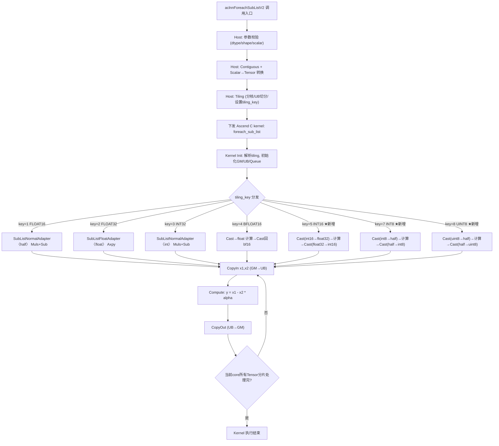
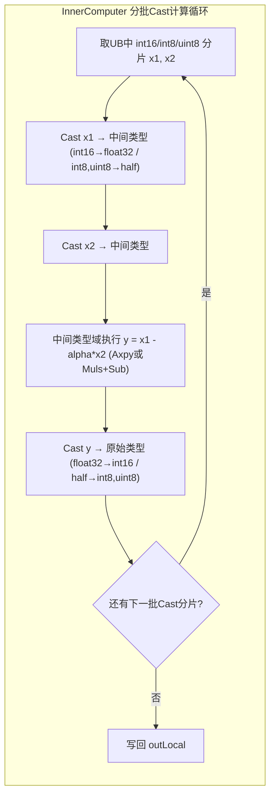

# 需求背景

## 需求来源

昇腾社区任务：[ForeachSubListV2算子开发任务书](https://gitcode.com/cann/cann-competitions/blob/master/04_tasks/01_community-task-2026/docs/202604/ForeachSubListV2_task_doc.md)

## 背景介绍

### ForeachSubListV2算子现状分析

ForeachSubListV2算子对两个张量列表中的元素执行逐个相减，并可以通过alpha参数调整相减系数。该算子已在ops-nn仓库中基于Ascend C编程语言实现，位于 `foreach/foreach_sub_list` 目录。

当前算子支持的数据类型如下：

| 参数 | 参数含义 | 数据类型 | 已支持数据类型 | 约束 | 形状 |
| --- | --- | --- | --- | --- | --- |
| x1 | 被减数张量列表 | aclTensorList | FLOAT16, FLOAT32, INT32, BFLOAT16 | 列表内dtype一致 | 0-8维, ND |
| x2 | 减数张量列表 | aclTensorList | FLOAT16, FLOAT32, INT32, BFLOAT16 | 与x1一致 | 0-8维, ND |
| alpha | 减数系数 | aclScalar | FLOAT32, FLOAT16, INT32, DOUBLE, INT64 | 标量 | - |
| out | 输出张量列表 | aclTensorList | FLOAT16, FLOAT32, INT32, BFLOAT16 | 与x1一致 | 0-8维, ND |

计算公式：$$y_i = x1_i - x2_i \times alpha \quad (i=0,1,...,n-1)$$

### ForeachSubListV2算子功能分析

当前算子不支持DT_INT16、DT_INT8、DT_UINT8三种数据类型，需要在原有代码基础上进行扩展开发，使其支持这三种新数据类型。

# 需求分析

## 需求描述

在ForeachSubListV2算子原有实现基础上，新增DT_INT16、DT_INT8、DT_UINT8数据类型支持。要求：

1. 完成算子设计、开发及测试任务
2. 实现算子泛化功能，满足各类合法输入场景的计算需求
3. 精度满足AscendOpTest工具默认阈值

## 需求拆解

1. 新增DT_INT16数据类型支持（kernel/host/API/binary config）
2. 新增DT_INT8数据类型支持
3. 新增DT_UINT8数据类型支持
4. 提供多组aclnn调用测试代码并通过精度验证
5. 更新相关文档（README、API文档）
6. 原有数据类型（FLOAT16/FLOAT32/INT32/BFLOAT16）功能不回退

# 详细设计

## 算子分析

### 数学公式

$$y_i = x1_i - x2_i \times alpha \quad (i=0,1,...,n-1)$$

其中x1、x2、y均为张量列表，alpha为标量系数。

### 新增支持数据类型

在原有FLOAT16、FLOAT32、INT32、BFLOAT16基础上，新增：

| 新增类型 | 字节宽度 | 计算中间类型 | alpha转换类型 | tiling_key |
| --- | --- | --- | --- | --- |
| INT16 | 2 | FLOAT32 | FLOAT32 | 5 |
| INT8 | 1 | FLOAT16 | FLOAT16 | 7 |
| UINT8 | 1 | FLOAT16 | FLOAT16 | 8 |

### 类型提升策略

由于Ascend C硬件的向量计算单元（Muls/Sub/Axpy等）不直接支持INT16/INT8/UINT8类型的算术运算，需要进行类型提升（Cast）后在高精度域计算，再Cast回原类型：

- **INT16**：Cast至FLOAT32 → 在FLOAT32域执行Sub运算 → Cast回INT16
- **INT8**：Cast至FLOAT16 → 在FLOAT16域执行Sub运算 → Cast回INT8
- **UINT8**：Cast至FLOAT16 → 在FLOAT16域执行Sub运算 → Cast回UINT8

选择上述中间类型的原因：
- INT16范围为[-32768, 32767]，FLOAT32能精确表示该范围内所有整数
- INT8范围为[-128, 127]，UINT8范围为[0, 255]，FLOAT16能精确表示该范围内所有整数
- 硬件Cast指令链：`int16↔float32`、`int8↔half`、`uint8↔half`均为硬件原生支持

## 算子实现

### 实现方案

#### host侧设计

##### 1. OpDef注册（foreach_sub_list_def.cpp）

在ForeachSubList的OpDef中，将tensor_dtype_list扩展为包含7种数据类型：

```cpp
std::vector<ge::DataType> tensor_dtype_list = {
    ge::DT_FLOAT16, ge::DT_FLOAT, ge::DT_INT32, ge::DT_BF16,
    ge::DT_INT16, ge::DT_INT8, ge::DT_UINT8
};
```

对应的alpha（scalar_tensor）类型映射通过 `DtypeScalarToTensor2` 函数实现：

| 输入tensor类型 | alpha tensor类型 |
| --- | --- |
| FLOAT16 | FLOAT16 |
| FLOAT32 | FLOAT32 |
| BFLOAT16 | FLOAT32 |
| INT32 | INT32 |
| INT16 | FLOAT32 |
| INT8 | FLOAT16 |
| UINT8 | FLOAT16 |

##### 2. aclnn API参数校验（aclnn_foreach_sub_list_v2.cpp）

扩展 `ASCEND910BC_TENSOR_DTYPE_DTYPE_SUPPORT_LIST` 加入新类型，并在scalar类型校验中将INT16/INT8/UINT8归入整型scalar支持列表。scalar到tensor的转换逻辑为：

- INT16输入 → alpha转为FLOAT32 tensor
- INT8/UINT8输入 → alpha转为FLOAT16 tensor

##### 3. tiling策略（foreach_tiling_func.cpp）

ForeachSubList使用 `BINARY_LIST_OP_CODE`，tiling通过 `GetTilingKeyByDtypeOnly` 自动映射dtype到tiling_key。

UB内存分配策略：对于需要Cast的类型（INT16/INT8/UINT8），采用与BFLOAT16相同的策略——除以 `UB_DIVIDER_FOR_TEMP_CASTING`（=10）以预留Cast中间buffer空间，并按 `BYTE_BLOCK_FOR_BF16`（=64）对齐。

##### 4. tilingkey规划

| tiling_key | 数据类型 | 计算类型 | 计算适配器 |
| --- | --- | --- | --- |
| 1 | FLOAT16 | FLOAT16 | SubListNormalAdapter |
| 2 | FLOAT32 | FLOAT32 | SubListFloatAdapter |
| 3 | INT32 | INT32 | SubListNormalAdapter |
| 4 | BFLOAT16 | FLOAT32 | SubListFloatAdapter |
| 5 | INT16 | FLOAT32 | SubListFloatAdapter |
| 7 | INT8 | FLOAT16 | SubListNormalAdapter |
| 8 | UINT8 | FLOAT16 | SubListNormalAdapter |

#### kernel侧设计

##### 1. 整体流程

kernel入口函数 `foreach_sub_list` 根据tiling_key分发到对应的模板实例：

```
foreach_sub_list(inputs_1, inputs_2, alpha, outputs, workspace, tiling)
  ├── TILING_KEY_IS(1): ForeachOneScalarTernary<half, half, SubListNormalAdapter>
  ├── TILING_KEY_IS(2): ForeachOneScalarTernary<float, float, SubListFloatAdapter>
  ├── TILING_KEY_IS(3): ForeachOneScalarTernary<int, int, SubListNormalAdapter>
  ├── TILING_KEY_IS(4): ForeachOneScalarTernary<bfloat16_t, float, SubListFloatAdapter>
  ├── TILING_KEY_IS(5): ForeachOneScalarTernary<int16_t, float, SubListFloatAdapter>  [新增]
  ├── TILING_KEY_IS(7): ForeachOneScalarTernary<int8_t, half, SubListNormalAdapter>   [新增]
  └── TILING_KEY_IS(8): ForeachOneScalarTernary<uint8_t, half, SubListNormalAdapter>  [新增]
```

##### 2. Cast计算流程（InnerComputer特化）

对于新增的三种类型，在 `foreach_one_scalar_ternary.h` 中新增 `InnerComputer` 模板特化类。以INT16为例，计算流程如下：

```
CopyIn(int16 data) → Cast(int16→float32) → Muls+Sub(float32域) → Cast(float32→int16) → CopyOut(int16 data)
```

具体步骤：
1. 将int16输入分批加载到UB（每批 `maxCastDataCount` 个元素）
2. `Cast(float32Tensor, inLocal_1[offset], CAST_NONE, count)` —— int16→float32
3. `Cast(float32Tensor[offset], inLocal_2[offset], CAST_NONE, count)` —— int16→float32
4. 在float32域执行 `Axpy`（y = x1 + (-alpha)*x2）或 `Muls+Sub`
5. `Cast(outLocal[offset], float32Tensor, CAST_ROUND, count)` —— float32→int16
6. CopyOut结果

INT8/UINT8同理，Cast链为 `int8/uint8 ↔ half`。

##### Ascend C 的 ForeachSubListV2 算子流程图



**新增小整数类型 (INT16/INT8/UINT8) 的 InnerComputer 计算详细流程：**



> 说明：由于 Ascend C 向量单元不直接支持 INT16/INT8/UINT8 的算术运算（Muls/Sub），需要先 Cast 提权到 FLOAT32（INT16）或 FLOAT16（INT8/UINT8）域执行计算，再 Cast 回原类型。每次 Cast 处理 `maxCastDataCount` 个元素，通过分批循环覆盖完整数据。

##### 3. UB内存布局

对于需要Cast的类型，base类（kernel_foreach_base.h）中的Init逻辑：

```cpp
// INT16: 中间类型float32，宽度是int16的2倍
totalTensorUbSize = inputsTensorUbSize * COPY_SPACE_MULTIPLE;
maxDataCount = totalTensorUbSize / sizeof(int16_t);
maxCastDataCount = inputsTensorUbSize / sizeof(float);

// INT8/UINT8: 中间类型half，宽度是int8的2倍
totalTensorUbSize = inputsTensorUbSize * COPY_SPACE_MULTIPLE;
maxDataCount = totalTensorUbSize / sizeof(int8_t);
maxCastDataCount = inputsTensorUbSize / sizeof(half);
```

double buffer配置（kernel_foreach_unary.h）：
- dataQueue: bufferNum=2, size=totalTensorUbSize（存放原始类型数据）
- outQueue: bufferNum=2, size=totalTensorUbSize
- float32Queue: bufferNum=1, size=inputsTensorUbSize*paramsCount（存放Cast后的计算中间结果）

##### 4. 分核策略

沿用原有foreach算子的多核分配策略：将所有tensor展平为总数据量，按32字节对齐后均匀分配到各核心。余量块优先分配到前几个核（大核/小核策略）。

## 支持硬件

| 支持的芯片版本 | 涉及勾选 |
| --- | --- |
| Atlas A2 训练系列产品/Atlas A2 推理系列产品 | √ |
| Atlas A3 训练系列产品/Atlas A3 推理系列产品 | √ |

## 算子约束限制

- 输入x1、x2、out中所有Tensor的数据类型必须保持一致
- 输入x1、x2的shape必须相同，out的shape size大于等于x1的shape size
- Tensor维度不超过8维
- 确定性计算：aclnnForeachSubListV2默认确定性实现

# 修改文件清单

| 文件路径 | 修改说明 |
| --- | --- |
| `foreach_utils/op_kernel/kernel_foreach_base.h` | 为int16/int8/uint8设置maxCastDataCount和totalTensorUbSize |
| `foreach_utils/op_kernel/kernel_foreach_unary.h` | 新增NeedsCastBuffer判断函数，扩展UB初始化逻辑 |
| `foreach_utils/op_kernel/foreach_one_scalar_ternary.h` | 新增int16→float/int8→half/uint8→half的InnerComputer特化 |
| `foreach_utils/op_host/foreach_proto_utils.h` | DtypeScalarToTensor2/DtypeTensor2Scalar映射新类型 |
| `foreach_utils/op_host/foreach_tiling_func.cpp` | UB内存分配支持新类型的Cast空间预留 |
| `foreach_sub_list/op_kernel/foreach_sub_list.cpp` | 新增tiling_key 5/7/8的kernel分发 |
| `foreach_sub_list/op_host/foreach_sub_list_def.cpp` | OpDef注册新数据类型 |
| `foreach_sub_list/op_host/op_api/aclnn_foreach_sub_list_v2.cpp` | aclnn API参数校验和scalar→tensor转换 |
| `foreach_sub_list/op_host/config/ascend910_93/*.json` | kernel binary配置新增int16/int8/uint8条目 |
| `foreach_sub_list/op_host/config/ascend910b/*.json` | kernel binary配置新增int16/int8/uint8条目 |
| `foreach_sub_list/examples/test_aclnn_foreach_sub_list_v2_int16.cpp` | INT16测试代码 |
| `foreach_sub_list/examples/test_aclnn_foreach_sub_list_v2_int8.cpp` | INT8测试代码 |
| `foreach_sub_list/examples/test_aclnn_foreach_sub_list_v2_uint8.cpp` | UINT8测试代码 |
| `foreach_sub_list/docs/aclnnForeachSubListV2.md` | API文档补充新类型 |
| `foreach_sub_list/README.md` | README补充新类型和测试链接 |

# 可维可测分析

## 精度标准/性能标准

| 验收标准 | 描述 | 标准来源 |
| --- | --- | --- |
| 精度标准 | 整数类型（INT16/INT8/UINT8）要求结果严格一致 | 整数运算无精度损失 |
| 精度标准 | 浮点类型（FLOAT16/FLOAT32/BFLOAT16）满足AscendOpTest默认阈值 | 任务书要求 |
| 性能标准 | 无特殊性能要求 | 任务书要求 |

## 测试用例设计

### 常规场景

| 用例编号 | 数据类型 | shape | alpha | 描述 |
| --- | --- | --- | --- | --- |
| TC01 | INT16 | {2,3},{1,3} | alpha=2 (INT32) | 常规正负数、大值(32000)、边界值 |
| TC02 | INT8 | {2,3},{1,3} | alpha=1 (INT32) | 常规正负数(-128~127范围) |
| TC03 | UINT8 | {2,3},{1,3} | alpha=1 (INT32) | 无符号数(0~255范围) |
| TC04 | FLOAT32 | {2,3},{1,3} | alpha=1.2 (FLOAT) | 原有类型回归测试 |
| TC05 | FLOAT32 (V1) | {2,3},{1,3} | alpha=1.2 (Tensor) | V1接口回归测试 |

### 边界场景

| 场景 | 描述 |
| --- | --- |
| 空TensorList | x1、x2为空列表，应正常返回 |
| INT16极值 | x1={32767,-32768}, x2={0,0}, alpha=1 |
| INT8极值 | x1={127,-128}, x2={0,0}, alpha=1 |
| UINT8极值 | x1={255,0}, x2={0,0}, alpha=1 |

## 测试结果

全部5个测试用例在Ascend910_93设备上执行通过，精度完全匹配：

```
Run test_aclnn_foreach_sub_list success.
Run test_aclnn_foreach_sub_list_v2 success.
[INT16] Precision test: PASS
Run test_aclnn_foreach_sub_list_v2_int16 success.
[INT8] Precision test: PASS
Run test_aclnn_foreach_sub_list_v2_int8 success.
[UINT8] Precision test: PASS
Run test_aclnn_foreach_sub_list_v2_uint8 success.
```

## 兼容性分析

本次修改为已有算子的数据类型扩展，不改变原有接口签名和行为：
- 原有FLOAT16/FLOAT32/INT32/BFLOAT16类型功能不受影响（回归测试通过）
- 新类型通过独立的tiling_key分发，不影响原有计算路径
- binary config采用追加方式，不修改原有条目
