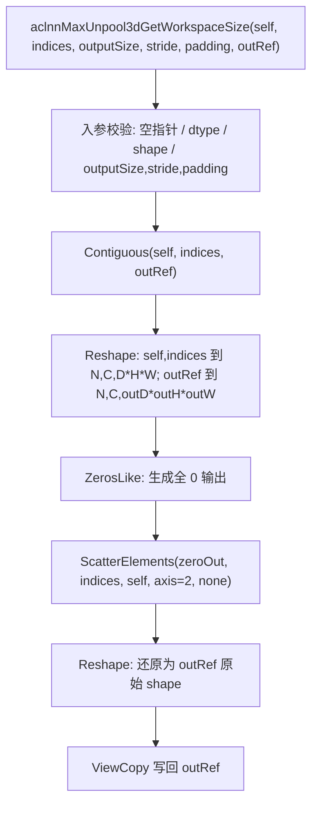
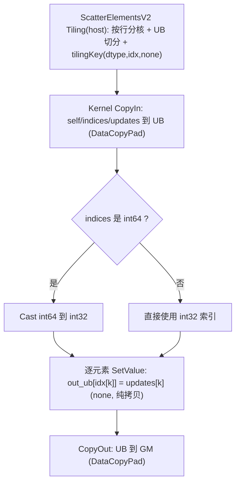

# aclnnMaxUnpool3d 算子设计文档

## 一、需求背景

### 1.1 需求来源

通过社区任务完成开源仓算子贡献的需求。为现有的 `aclnnMaxUnpool3d` 算子，使 `self` 输入新增对 **bfloat16** 数据类型的支持，并使 `indices` 支持 **int32 / int64**；同步修改算子文档补充支持情况。要求完成算子设计、开发与测试，验收后提交至算子开源仓 [ops-nn](https://gitcode.com/cann/ops-nn)。

### 1.2 背景介绍

#### 1.2.1 aclnnMaxUnpool3d 实现优化

`aclnnMaxUnpool3d` 是 `aclnnMaxPool` 在 3D 上的逆运算：由 `outputSize` 决定输出 D、H、W 轴大小，根据 `indices` 把 `self` 的元素散射回 `outRef` 的对应位置，其余位置置 0（`stride`/`padding` 为预留参数，不参与计算）。

`aclnnMaxUnpool3d` **没有独立的 TBE/AscendC kernel**，是由小算子拼接而成的 aclnn 流水（reshape → 置零 → 散射 → reshape → 拷贝），真正的计算落在底层 **ScatterElementsV2** 算子上。参考实现路径取「baseline 拼接管线 + 底层算子源码」（开源仓 ops-nn 内）：

1. **aclnn L2 拼接实现**：`index/scatter_elements/op_api/aclnn_max_unpool3d.cpp`（本算子入口，拼接管线）；
2. **底层算子 kernel 实现**：`index/scatter_elements_v2/op_kernel/scatter_elements_v2.cpp`、`scatter_elements_v2.h`；
3. **底层算子 原型/信息库/Tiling/L0 分发**：`index/scatter_elements_v2/op_host/scatter_elements_v2_def.cpp`、`scatter_elements_v2_tiling.cpp`、`op_host/config/{ascend910b,ascend910_93}/scatter_elements_v2_binary.json`、`index/scatter_elements_v2/op_api/scatter_elements.cpp`。

- **计算公式**（outRef、indices、self 末两轴合一后，i ∈ [0, D·H·W)）：
  - 4 维 (N,D,H,W)：$$ outRef[N][indices[N][i]] = self[N][i] $$
  - 5 维 (N,C,D,H,W)：$$ outRef[N][C][indices[N][C][i]] = self[N][C][i] $$

#### 1.2.2 现状分析

##### 1.2.2.1 底层支持的数据类型和数据格式

底层 `ScatterElementsV2`（`scatter_elements_v2_def.cpp`，`ascend910b` / `ascend910_93` 配置）`var`/`updates`/输出支持
`FLOAT、FLOAT16、INT32、UINT8、INT8、BF16`，`indices` 支持 `INT64、INT32`，数据格式 ND；二进制（`*_binary.json`）已打包 bf16 内核。
上层 `aclnnMaxUnpool3d` 的 L2 校验列表 `DTYPE_SUPPORT_LIST` 原为 `FLOAT、FLOAT16、INT8、UINT8、INT16、INT32、INT64、DOUBLE`，**未放开 bf16**；`INDEX_DTYPE_SUPPORT_LIST` 已含 `INT32、INT64`。

##### 1.2.2.2 baseline（拼接）实现描述

`aclnnMaxUnpool3dGetWorkspaceSize(self, indices, outputSize, stride, padding, outRef)` 内部流程（与源码 `aclnn_max_unpool3d.cpp` 一致）：

1. 入参校验：空指针、outRef 连续、`self`/`outRef` dtype 一致、`indices` dtype、self 为 4 维(NDHW)或 5 维(NCDHW)、self 与 indices shape 一致、self 各空间维 > 0、`outputSize`/`stride`/`padding` 长度均为 3 且 stride 值 > 0、`outputSize` 乘积 ≥ self 的 D·H·W、outRef 的 N/C 与 self 相同且 D/H/W 等于 outputSize；
2. `Contiguous(self, indices, outRef)`；
3. `Reshape`：`self`、`indices` → `[N, C, D·H·W]`，`outRef` → `[N, C, outD·outH·outW]`；
4. `ZerosLike` 生成全 0 输出；
5. `ScatterElements(zeroOut, indices, self, axis=2, reduction="none")` —— 真正的散射计算（落到 ScatterElementsV2 aicore）；
6. `Reshape` 还原为 outRef 原始 shape；
7. `ViewCopy` 写回 `outRef`。

##### 1.2.2.3 baseline 实现流程图

## 二、需求分析

### 2.1 外部组件依赖

不涉及外部组件依赖。

### 2.2 内部适配模块

适配 aclnn 接口（L2/L0），复用内部 `ScatterElementsV2` 算子。

### 2.3 需求模块设计

#### 2.3.1 AscendC 算子原型

| 参数名 | 输入/输出 | 描述 | 使用说明 | 数据类型 | 数据格式 | 维度 | 非连续 |
| --- | --- | --- | --- | --- | --- | --- | --- |
| self (aclTensor*) | 输入 | 待散射的目标张量 | dtype 与 outRef 一致；shape 与 indices 一致；4 维 NDHW / 5 维 NCDHW | FLOAT、FLOAT16、**BFLOAT16**、INT16、INT32、INT64、INT8、UINT8、DOUBLE | ND | 4-5 | √ |
| indices (aclTensor*) | 输入 | self 元素在输出中的索引位置 | shape 与 self 一致 | **INT32、INT64** | ND | 4-5 | √ |
| outputSize (aclIntArray*) | 输入 | 输出 D、H、W 维度大小 | size=3，乘积 ≥ self 的 D·H·W | - | - | - | - |
| stride (aclIntArray*) | 输入 | 预留参数，不参与计算 | size=3，值 > 0 | - | - | - | - |
| padding (aclIntArray*) | 输入 | 预留参数，不参与计算 | size=3 | - | - | - | - |
| outRef (aclTensor*) | 输出 | 散射结果 | dtype 与 self 一致 | FLOAT、FLOAT16、**BFLOAT16**、INT16、INT32、INT64、INT8、UINT8、DOUBLE | ND | 4-5 | √ |

> 加粗为本次新增/重点支持项。bf16 为新增；indices int32/int64 本就支持，本次补充测试与文档。

#### 2.3.2 AscendC 算子相关约束

- `outRef` 的 N、C 维与 self 相同，D、H、W 维由 outputSize 决定；
- 各 dtype 为原值拷贝（reduction="none"），无算术运算，含 bf16 在内 bit 精确；
- 仅在 `ascend910b` / `ascend910_93`（A2/A3）走 aicore；DOUBLE 不在底层 aicore 支持列表内（沿用既有行为）。

## 三、需求详细设计

### 3.1 使能方式

| 上层框架 | 勾选 |
| --- | --- |
| TF 训练/推理 | |
| PyTorch 训练/推理 | |
| ATC 推理 | |
| **Aclnn 直调** | ✅ |

走 aclnn 两段式（`aclnnMaxUnpool3dGetWorkspaceSize` + `aclnnMaxUnpool3d`）。

### 3.2 需求总体设计

本次为「在现有代码上扩展 dtype」，**算法/分核/Tiling/kernel 均不改动**，仅放开 L2 dtype 校验，复用底层 ScatterElementsV2。下面描述底层真正承担计算的 host/kernel 设计。

#### 3.2.1 host 侧设计

##### 3.2.1.1 分核策略

底层 ScatterElementsV2 host（`scatter_elements_v2_tiling.cpp`）将输入按末轴归约为 `[行数 times, 末轴 inputOneTime]`：`times = indicesCount / indicesOneTime`（3D 情形末轴即 D·H·W）。`times < coreNum` 时单任务可拆多核（每核至少 32 数对齐），否则一核一任务、余数摊到前若干核。行间独立，按行数充分用核。

##### 3.2.1.2 数据分块和内存优化策略

按 UB 上限切分：`totalSize = inputSize·inputOneTime + indicesSize·(updatesOneTime + indicesOneTime)`，`≤ max_ub` 走 small 分支，否则多次循环搬运。int64 索引额外预留 int32 转换缓冲；`reduction="none"` 不追加 float 缓冲。UB 占用 = Σ各 buffer ≤ 192KB。

##### 3.2.1.3 tilingKey 规划策略

`tilingKey = INPUT_TYPE·dtype + INDIC_TYPE·idxType + OPERATOR_TYPE·reduction`：dtype ∈ {FP32=1, FP16=2, INT32=3, UINT8=4, INT8=5, **BF16=6**}；idxType ∈ {int32=1, int64=2}；reduction 恒为 none=1。bf16 命中 dtype=6 分支（host/tiling/kernel/binary.json 均已具备）。

#### 3.2.2 kernel 侧设计

##### 3.2.2.1 kernel 侧实现描述

底层 `KernelScatterElementsV2<T, U, MODE>`（`scatter_elements_v2.h`）三段式：CopyIn（`DataCopyPad`）→ Compute → CopyOut。
- `IS_CAST_INT = is_same<U,int64_t>`：int64 索引在 UB 内 `Cast<int,int64_t>` 转 int32 后寻址；int32 直接使用。
- `reduction="none"`（MODE==1）：`ScatterSetValue` 执行 `inputLocal.SetValue(idx[k], updates[k])` —— **纯值拷贝**，bf16 与 fp16 同为 2 字节、走完全相同路径，无 float 中转（`IS_CAST_FLOAT` 仅 MODE==2/"add" 才触发）。
- 写回 `DataCopyPad` 到 GM。

##### 3.2.2.2 AscendC 实现流程图

##### 3.2.2.3 baseline 与 AscendC 流程图的差异点和原因

| 对比 | baseline 流程图(1.2.2.3) | AscendC 流程图(3.2.2.2) | 说明 |
| --- | --- | --- | --- |
| 关系 | L2 拼接管线（含 reshape/置零/viewcopy） | 拼接管线中 `ScatterElements` 那一步的真正 aicore 实现 | 两图是「调用方 vs 被调用 kernel」关系，非两套算法 |
| 算法 | 不变 | 不变 | 本次需求不改动算法 |
| dtype | L2 原不放行 bf16 | kernel/binary 早已支持 bf16 | **唯一改动**：放开 L2 `DTYPE_SUPPORT_LIST` 加入 `DT_BF16` |
| bf16 性能 | — | none 模式纯 SetValue 拷贝，bf16/fp16 同路径 | bf16 与 fp16 持平 |
| 索引 | int32/int64 均放行 | int64 内部 Cast 为 int32 | 一次轻量 Cast，int32/int64 持平 |

### 3.3 支持硬件

Atlas A2 训练系列产品 / Atlas A3 系列产品（对应 `ascend910b` / `ascend910_93`）。

### 3.4 算子约束限制

- self 仅支持 4 维(NDHW) / 5 维(NCDHW)；outRef 与 self 同维、N/C 相同；
- `outputSize`/`stride`/`padding` 长度均为 3，stride 值 > 0，`outputSize` 乘积 ≥ self 的 D·H·W；stride/padding 为预留参数不参与计算；
- DOUBLE 不走 aicore（沿用既有行为）；本次仅新增 bf16。

## 四、特性交叉分析

| dtype \ 场景 | 4 维(NDHW) | 5 维(NCDHW) | indices int32 | indices int64 | 小 shape | 大 shape | 边界(单元素) |
| --- | --- | --- | --- | --- | --- | --- | --- |
| bfloat16(新增) | ✅ | ✅ | ✅ | ✅ | ✅ | ✅ | ✅ |
| float16/float32 | ✅ | ✅ | ✅ | ✅ | ✅ | ✅ | ✅ |
| int8/uint8/int16/int32 | ✅ | ✅ | ✅ | ✅ | ✅ | ✅ | ✅ |

实测覆盖见自验证报告（AscendOpTest 10/10 PASS）。

## 五、可维可测分析

### 5.1 精度标准 / 性能标准

- **精度**：满足 AscendOpTest 默认阈值（bf16 相对 0.004 等）。本算子为纯值拷贝，理论 bit 精确，实测 **10/10 PASS**（7 dtype × 4d/5d × int32/int64 × 小/大/单元素边界）。
- **性能**：bf16 与 fp16 **持平**、int32 与 int64 **持平**。实测（shape [4,8,8,16,16]→[16,32,32]，µs/call）：bf16+int64 71.16、bf16+int32 71.89、fp16+int64 71.35、fp16+int32 72.16，差异 ≤ ~1.1%。

### 5.2 兼容性分析

- 仅新增 dtype，不改变既有接口签名与行为，向后兼容；
- 仅依赖底层 ScatterElementsV2 既有 bf16/int32/int64 能力，无新增外部依赖；
- 适配 A2/A3，与底层二进制一致。

## 六、变更文件清单

| 文件路径 | 变更类型 | 说明 |
| --- | --- | --- |
| `index/scatter_elements/op_api/aclnn_max_unpool3d.cpp` | 修改 | `DTYPE_SUPPORT_LIST` 新增 `DT_BF16` |
| `index/scatter_elements/docs/aclnnMaxUnpool3d.md` | 修改 | self/out 数据类型补充 BFLOAT16 |
| `index/scatter_elements/tests/ut/op_host/test_aclnn_max_unpool3d.cpp` | 修改 | bf16 用例改为期望成功 + 新增 int32 索引正向用例 |
| `index/scatter_elements/tests/st/aclnnMaxUnpool3d/atk_aclnnMaxUnpool3d.json` | 修改 | 新增 12 个 bf16 用例（int32/int64） |
| `index/scatter_elements/examples/test_aclnn_max_unpool3d.cpp` | 新增 | 多组 aclnn 调用样例（bf16/int32/int64） |
| `index/scatter_elements/docs/MaxUnpool3d_self_test_report.md` 等 | 新增 | 自验证报告与可复现资产 |
